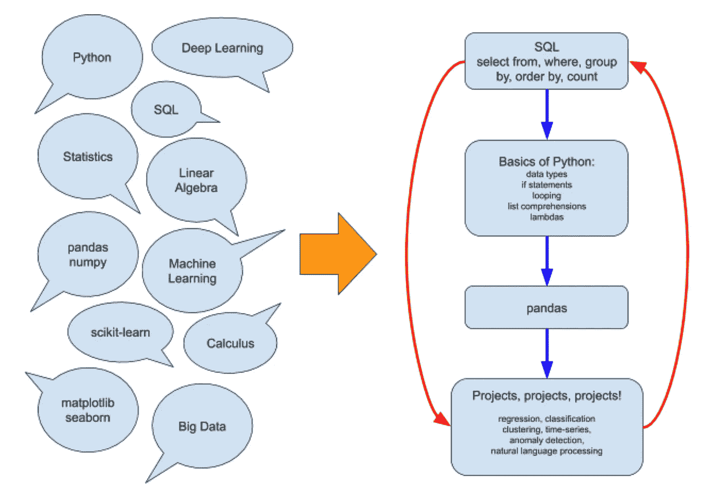

# 懒鬼将自己重塑为数据科学家指南

> 原文：<https://towardsdatascience.com/the-slackers-guide-to-rebranding-yourself-as-a-data-scientist-b34424d45540?source=collection_archive---------32----------------------->

## 数据科学/职业

## 给我们其他人的固执己见的建议。热爱数学，选修。

Andrew Itaga 在 Unsplash 上拍摄的照片

*自从我写了一篇关于* [*我的数据科学之旅*](/from-slacker-to-data-scientist-b4f34aa10ea1) *的文章后，很多人向我咨询关于他们成为数据科学家之旅的建议。一个共同的主题开始出现:有抱负的数据科学家对如何开始感到困惑，一些人因为大量的信息而溺水。那么，另一个是什么，对吗？*

*嗯，让我们看看。*

*我敦促有抱负的数据科学家放慢脚步，后退一步。在我们开始学习之前，让我们先处理一些事情:重塑自我的艺术。重塑自我需要时间，所以我们最好在游戏中尽早开始。*

*在本帖中，我将分享一种非常固执己见的方法，让自己重塑数据科学家的形象。我会假设关于你的三件事:*

1.  你破产了，但你有勇气。
2.  你愿意牺牲和学习。
3.  *你已经做出了* ***有意识的决定*** *成为一名数据科学家。*

让我们开始吧！

# 重要的事情先来

我非常相信尤达的智慧:“做或不做，没有尝试。”对我来说，要么你做点什么，要么你不做。对我来说，失败不是一个选项，我知道除非我完全放弃，否则我不会真正失败，这让我感到安慰。所以第一点建议:不要放弃。永远不会。

> 做或不做，没有尝试。—尤达

# 从心中的目标开始

让我们把网上的事情安排好，开始考虑 SEO。SEO 代表搜索引擎优化。最简单的思考方式是一种非常好的艺术，尽可能多地在互联网上放上你的真实职业名称，这样当有人搜索你时，他们只会找到你希望他们找到的东西。

在我们的例子中，只要您的名字出现在搜索结果中，我们就希望出现“数据科学”或“数据科学家”这两个词。

所以让我们开始在网络上乱扔垃圾吧！

1.  如果你还没有一个专业的 Gmail 帐户，就创建一个。不要让你的用户名成为 sexxydatascientist007@gmail.com。谨慎行事，越无聊越好。以*first.last@gmail.com、*开头，或者如果你的名字很普通，就加上“数据”，比如*first.name.data@gmail.com*。不惜一切代价避免数字。如果你已经有了一个，但是它没有遵循前面提到的指导方针，那就再创建一个！
2.  创建一个 **LinkedIn 账户**并使用你的职业邮箱地址。将“培训中的数据科学家”放在标题中。“数据科学爱好者”太弱了。我们已经做了一个有意识的决定，并致力于这项任务，记得吗？当我们在做的时候，让我们把应用程序也放在我们的手机上。
3.  如果你还没有一个**脸书账户**，那就创建一个，这样你就可以宣称你的名字了。如果你已经有了一个，把它放到 private pronto 上！多做一点，删除手机上的应用程序，这样你就不会分心。对 Twitter、Instagram 和 Pinterest 等其他社交网络也是如此。暂时将它们设置为私有，稍后我们会考虑清理它们。
4.  如果你还没有推特账户，创建一个**账户。我们可以在用户名上留一点余地。让它简短、令人难忘，但又不失专业，这样你就不会伤害任何人的感情。如果你已经有了一个，决定是要保留它还是重新开始。你要问自己的主要问题是:你的历史中有没有什么内容可以被解释为不专业或有轻微争议的？谨慎为上。**
5.  开始在 LinkedIn 和 Twitter 上关注数据科学领域的顶级声音。这里有几个建议:[凯西·科济尔科夫](https://www.linkedin.com/in/cassie-kozyrkov-9531919/)，[安吉拉·巴尔蒂斯](https://www.linkedin.com/in/angelabaltes/)，[莎拉·n .](https://www.linkedin.com/in/snooravi/)，[凯特·斯特拉赫尼](https://www.linkedin.com/in/kate-strachnyi-data/)，[克里斯汀·凯莱](https://www.linkedin.com/in/kristen-kehrer-datamovesme/)，[法维奥·瓦兹奎](https://www.linkedin.com/in/faviovazquez/)，当然，还有我一直以来最喜欢的:[埃里克·韦伯](https://www.linkedin.com/in/eric-weber-060397b7/)。
6.  创建一个 **Hootsuite 账户**并连接你的 LinkedIn 和 Twitter 账户。开始安排数据科学相关的岗位。您可以分享其他人关于数据科学的有趣文章，或者发布您自己的数据科学冒险经历！如果你确实分享了其他人的帖子，请确保你给出了适当的署名。简单地添加一个网址是懒惰和没有好处的。*感谢* [*埃里克·韦伯*](https://www.linkedin.com/in/eric-weber-060397b7/) *为此亲提示！*
7.  拍摄一张**专业照片**，并将其作为你所有社交媒体账户的个人资料照片。如果可能的话，以中性背景为目标。确保照片中只有你，除非你是埃里克(他已经赢得了他的印章，所以不要质疑他！LOL。)
8.  创建一个 **Github 账户**，如果你还没有的话。当你开始做数据科学项目时，你会需要这个。
9.  **奖励**:如果你能抽出几美元，去[wordpress.org](https://wordpress.org/hosting/)给自己弄一个有你职业名称的域名。我很幸运有一个不常见的名字，所以我有[ednalyn.com](https://ednalyn.com/)，但是如果你的名字很常见，发挥创意，编造一个你能识别的名字。也许类似于 janesmithdoesdatascience.com 的作品。然后你可以开始计划在网上发布你的简历，或者甚至写一两篇关于数据科学的博文。我呢，刚开始学数据科学的时候是从写经验开始的。
10.  清理:如果时间允许，**开始审核**你在社交媒体上发布的攻击性、诽谤性或不讨好的内容。如果你想节省时间，试试像 brandyourself.com 这样的服务。警告！它会变得很贵，所以注意你点击的地方。

# 做你的家务

不开玩笑！当你做家务、散步或者甚至开车时，**听播客**谈论数据科学话题，如[线性离题](http://lineardigressions.com/)和 [TwiML](https://twimlai.com/) 。不要太执着于记住他们所说的话。顺其自然，迟早他们讨论的术语和概念会听起来很熟悉。请记住，不要太沉迷于你开始燃烧你正在做的任何东西的讨论，或者像我过去多次发生的那样错过退场。

# 最基本的部分

既然我们已经处理了生活和呼吸数据科学的预备知识，现在是时候处理实质性问题了:实际上是**学习数据科学**。

作者截图

关于如何学习数据科学，从来不缺少观点。他们太多了，让你不知所措，尤其是当他们开始谈论先学习基础数学和统计学的时候。

废话！

> 告诉我我忘记，
> 教我我记住，
> 让我参与我学习。—中国古训

虽然重要，但我不认为首先学习理论有什么意义，因为我可能很快就会睡着，或者更糟的是，被数学公式的冲击吓倒，以至于我非常恼火，最终放弃了！

相反，我谦卑地提议，采用 [Ken Jee](https://medium.com/u/6ee1f7466557?source=post_page-----b34424d45540--------------------------------) 在他的文章 [*中描述的“最小可行知识”或 MVK 的概念:我将如何学习数据科学(如果我不得不重新开始)*](/how-i-would-learn-data-science-if-i-had-to-start-over-f3bf0d27ca87) *。*

在他的文章中， [Ken Jee](https://medium.com/u/6ee1f7466557?source=post_page-----b34424d45540--------------------------------) 将最低限度的可行知识描述为学习“刚刚能够通过实践学习”我建议检查一下:

 [## 我将如何学习数据科学(如果我必须重新开始的话)

### 从我的数据科学之旅中学到的经验

towardsdatascience.com](/how-i-would-learn-data-science-if-i-had-to-start-over-f3bf0d27ca87) 

我对 MVK 的方法非常直接:学习足够的 SQL 以便能够从数据库中获得数据，学习足够的 Python 以便能够控制程序并能够使用 pandas 库，然后做端到端的项目，从简单的到越来越有挑战性的项目。在这个过程中，您将学习数据争论、探索性数据分析和建模。交叉验证和网格搜索等其他技术肯定也是您旅程的一部分。诀窍是永远不要太舒服，总是慢慢地逼自己。

以列表为导向，下面是我的流程:

1.  学习足够的 SQL 和 Python，以便能够完成越来越复杂的端到端项目。
2.  对于每个项目，经历数据科学管道的步骤:规划、获取、准备、探索、建模、交付(讲故事/演示)。一定要在你的 Github 账户上记录你的努力。
3.  冲洗并重复(迭代)。

要更深入地讨论数据科学管道，我推荐以下文章:

 [## PAPEM-DM:迈向数据科学胜利的 7 个步骤

### 数据科学项目生命周期

towardsdatascience.com](/papem-dm-7-steps-towards-a-data-science-win-f8cac4f8e02f) 

对于每个迭代，我建议做一个端到端的项目，实践以下每一种数据科学方法:

*   回归
*   分类
*   使聚集
*   时间序列分析
*   异常检测
*   自然语言处理
*   分布式 ML
*   深度学习

对于每种方法，实践它不同的算法、模型或技术。例如，对于自然语言处理，您可能希望练习以下技术:

*   n 元语法排序
*   命名实体识别
*   情感分析
*   主题建模
*   文本分类

# 按一下就行了

当你做端到端项目时，在 Github 上公开你的工作是一个很好的实践。它不仅会跟踪你的进度，还会备份你的工作以防你的本地机器坏了。更不用说，这是一个展示你进步的好方法。注意，我说的是进步，不是完美。一般来说，如果我们的 Github 库有点乱，人们会理解的。事实上，大多数人都希望如此。至少，只要确保每个回购都有一个很好的 README.md 文件。

Github Repo README.md 上的内容:

*   项目名
*   项目的目标或目的是什么
*   项目背景
*   如何使用项目(如果有人想自己尝试)
*   提及你的关键词:“数据科学”、“数据科学家”、“机器学习”等等。

不要忽视这一点:不要犯大错，不要在公共代码中硬编码您的凭证或任何密码。把它们放在一个。env 文件和。别理他们。作为参考，请查看 Github 的[文档](https://help.github.com/en/github/using-git/ignoring-files)。

关于如何使用 Git 和 Github 的深入教程，请查看[安妮·邦纳](https://medium.com/u/a71060a2ef24?source=post_page-----b34424d45540--------------------------------)的指南:

 [## Git 和 GitHub 入门:完全初学者指南

### Git 和 GitHub 基础知识，供好奇和完全困惑的人使用(加上最简单的方法来为您的第一次公开…

towardsdatascience.com](/getting-started-with-git-and-github-6fcd0f2d4ac6) 

# 出于对数学的热爱

最后，随着你越来越好地运用不同的技术，你开始做超参数调整，我相信在这一点上，你已经准备好面对必要的邪恶，那就是数学。很有可能，你越理解和发展直觉，你就越不会讨厌它。也许，只是也许，你甚至会爱上它。

当谈到学习数据科学背后的数学时，我有一个一般性的建议:慢慢来。对自己温柔一点，不要设期限。再说一次，如果最终会让你发疯，那么雄心勃勃和解决一些重大问题是没有意义的。这一点都不好玩。

学习数学通常有两种方法。

一种是采用结构化的方法，首先从学习基础开始，然后逐步学习更具挑战性的部分。为此我推荐 [KhanAcademy](https://www.khanacademy.org/math/ap-statistics) 。个性化你对微积分、线性代数和统计学的学习。迈出小步伐，庆祝小胜利。

 [## 美联社︎统计|数学|可汗学院

### 如果您看到此消息，这意味着我们在网站上加载外部资源时遇到了问题。如果你是…

www.khanacademy.org](https://www.khanacademy.org/math/ap-statistics) 

另一种方法稍微适合更多的实际操作，需要一点逆向工程。我称之为逆向学习。你首先要找出一个项目中涉及到的数学概念，然后把这个概念分解成更多的基本概念，并以此为起点。这种方法更适合那些喜欢边做边学的人。

在 [Analytics Vidhya](https://www.analyticsvidhya.com/) 上的一篇帖子展示了一个边做边学的好例子:

 [## 用 Python 和 R 语言学习朴素贝叶斯算法的 6 个简单步骤

### 注意:本文最初发布于 2015 年 9 月 13 日，更新于 2017 年 9 月 11 日概述了解其中一个…

www.analyticsvidhya.com](https://www.analyticsvidhya.com/blog/2017/09/naive-bayes-explained/) 

由本文补充:

 [## 为数据科学专业人员介绍强大的贝叶斯定理

### 概述贝叶斯定理是统计学中最强大的概念之一，是数据科学专业人员的必备知识…

www.analyticsvidhya.com](https://www.analyticsvidhya.com/blog/2019/06/introduction-powerful-bayes-theorem-data-science/) 

# 休息一会儿

嗯，学数学真的很难！它如此强大和强烈，你最好经常休息一下，否则会有大脑过热的风险。另一方面，休息并不一定意味着休息一天。毕竟，疲倦的人是没有休息的！

每隔一段时间，我强烈建议你在学习技术的同时，了解一些商业方面的知识。对于这一点，我推荐马克斯·史隆的经典著作:《T2:用数据思考》。你也可以在 Medium 上找到很多文章。

例如，看看[的 Eric Kleppen](https://medium.com/u/1e2ea32699c9?source=post_page-----b34424d45540--------------------------------) 的文章:

 [## 数据科学的商业方面:向利益相关者展示的 5 个技巧

### 数据科学不仅仅是算法和建模

towardsdatascience.com](/the-business-side-of-data-science-5-tips-for-presenting-to-stakeholders-fb624a9a6e54) 

# 与人交谈

休息一下有时会很孤独，独自一人思考会让人筋疲力尽。所以你可能最终决定与你的家人交谈，问题是，你对数据科学如此积极和狂热，以至于你只能谈论它。迟早，你会惹恼你爱的人。

它发生在我身上。

这就是为什么我决定和其他有相似兴趣的人交流。我参加聚会，并开始与已经在从事数据科学的人或像你一样渴望成为数据科学家的人建立联系。在我们所处的后 COVID(希望如此)时代，群组视频通话更加普遍。这实际上更有利，因为现在，地理不再是一个问题。

LinkedIn 是一个很好的资源。你可以使用社交网络找到其他有相似兴趣的人，甚至找到当地的数据科学家，他们每个月还能抽出一两个小时来指导有积极性的学习者。从你当地的公司开始。找出他们是否有在那里工作的数据科学家，如果你找到了，请给他们发一条个性化消息，请求联系。给他们选择优雅地拒绝的机会，让他们把你推荐给另一个有时间指导你的人。

最坏的情况是他们拒绝了。别难过，好吗？

# 结论

感谢阅读！这就是我关于将自己重塑为数据科学家的非常固执己见的建议。我希望你从中有所收获。我欢迎任何反馈。如果你有什么想补充的，请在评论或回复中发表。

我们继续这个讨论吧！

如果你想和我联系，你可以通过 [*Twitter*](https://twitter.com/ecdedios) *或*[*LinkedIn*](https://www.linkedin.com/in/ednalyn-de-dios/)*联系我。我喜欢与人交流，我会尽最大努力回复他们的询问。*

*敬请期待，下期帖子再见！*

*如果你想了解更多关于我从懒鬼到数据科学家的旅程，请查看下面的文章:*

 [## 从懒鬼到数据科学家

### 我的无学位数据科学之旅。

towardsdatascience.com](/from-slacker-to-data-scientist-b4f34aa10ea1) 

[1]引用调查者。(2020 年 6 月 10 日)。*告诉我，我忘了；教我，我可能会记得；牵扯到我和我学*。[https://quoteinvestigator.com/2019/02/27/tell/](https://quoteinvestigator.com/2019/02/27/tell/)

[2]走向数据科学。(2020 年 6 月 11 日)。*我将如何学习数据科学(如果我必须重新开始)*。[https://towards data science . com/how-I-would-learn-data-science-if-I-had-to-start-over-F3 BF 0d 27 ca 87](/how-i-would-learn-data-science-if-i-had-to-start-over-f3bf0d27ca87)