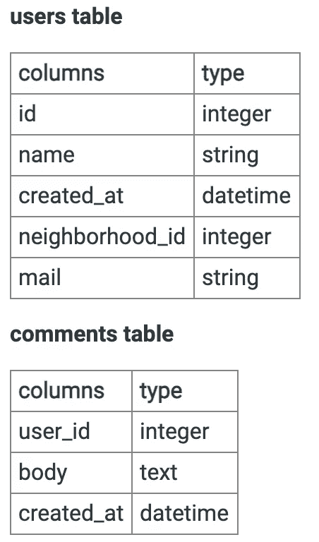

# Snapchat 数据科学家访谈

> 原文：<https://towardsdatascience.com/the-snapchat-data-scientist-interview-fa8bc017c813?source=collection_archive---------37----------------------->

## Snapchat 数据科学面试问题

图片来自 [Unsplash](https://unsplash.com/photos/xVRdDDe6M1A)

# 目录

1.  [简介](#2623)
2.  [Snapchat 的数据科学职位](#1c79)
3.  [Snapchat 有哪些数据科学团队？](#2bcb)
4.  [面试流程](#8848)

# 介绍

Snap Inc .，俗称“相机公司”，是一家社交媒体公司，成立于 2011 年，总部位于美国加州圣莫尼卡。Snapchat 用户发送和接收视频、图片、文本和图画。该公司还开发了 Spectacles，这是一种可佩戴的太阳镜，能够以普通视频格式拍照和录制视频。Spectacles 还可以连接到用户的 Snapchat 档案。

2019 年第一季度，Snapchat 的日均用户数超过 2.03 亿，而每天发送的快照达到 35 亿条。2019 年，Snapchat 互动镜头的播放量也超过了 150 亿次。

Snapchat 有一个数据宝库，数据科学家和分析师可以在此基础上分析数据，以更好地了解用户行为，改善他们的体验，并推动广告目标。简单地说，**Snapchat 生成的数据量使其成为数据科学家茁壮成长和发展职业生涯的完美环境。**

*阅读更多关于* [***Snapchat 的*** *数据科学面试题*](https://www.interviewquery.com/blog-snapchat-data-science-interview-questions-and-tips/) *。*

# Snapchat 的数据科学角色

在 Snapchat，每个数据科学家都被安插在不同的团队中，如工程、营销、产品管理等。，解决基于业务和产品的问题。Snapchat 的数据科学家的角色各不相同，从专注于产品的分析到更具技术性的计算机视觉研究，每个角色都有。

# 所需技能

Snapchat 聘用在数据科学或其他相关定量领域拥有 3 年以上行业经验(高级职位 5 年以上)的合格申请人。招聘要求对团队中的工作角色来说非常具体。在申请时，强调符合这些职能角色的行业经验至关重要。

其他相关资格包括:

*   丰富的因果推理技术、实验设计和/或 A/B 测试经验
*   扎实的 SQL 或其他大数据查询语言背景(3 年以上)
*   使用 Python 或 R 等编程语言的经验
*   有使用 SciPy 或 Panda 等分析软件包的经验
*   具有在商业智能(BI)工具(例如 Looker、Tableau、Power BI、Google Data Studio)中创建视觉效果和仪表盘的经验
*   能够清晰有效地向高管传达分析结果

# Snapchat 有哪些数据科学团队？

根据分配的团队，Snapchat 数据科学家的职能包括:

*   **广告运营**:创建和测试假设，建立模型和机器学习管道，以了解 Snapchat 用户如何与 Snapchat 上的广告互动，并与产品和工程团队合作，以创建和扩展见解。
*   **Snap Games:** 利用数据分析和模型提供对玩家、游戏和产品性能的洞察。
*   **产品设计:**创建和测试假设、实验设计和 A/B 测试。创建视觉效果和仪表盘来推动和影响公司数据文化。
*   **感知:**利用先进的数据分析工具，包括针对不同用户创建和测试假设。
*   **增长:**设计和构建数据管道和关键数据集，以支持仪表盘和探索性分析。跨团队协作，应用定量分析、数据挖掘和统计建模。这些信息用于推动业务决策，并了解用户如何与产品和功能交互。

# 面试过程

图片来自 [Unsplash](https://unsplash.com/photos/Ts3yX7wDthw)

Snapchat 数据科学家面试流程从与招聘人员或招聘经理的初次面试开始，随后是与数据科学家的技术筛选。通过技术筛选后，将进行现场面试，包括与团队经理、数据科学家和产品经理的五次一对一面试。

## 初始屏幕

这是一个试探性的电话和与招聘经理或招聘人员的聊天。在这次面试中，他们试图了解你的技术背景和过去的相关项目和经验。还讨论了 Snapchat 的团队、适用的工作角色和工作文化。

## 技术屏幕

技术筛选(45 至 60 分钟)由数据科学家通过 Skype 完成，主要侧重于分析和统计。问题(通常是开放式的)是标准化的，围绕 SQL、A/B 测试、实验设计和一些 Python 脚本。一般来说，标准并不是很高，他们希望你理解基本原理。

*对于在技术屏幕期间会遇到什么样的面试问题，请查看一份清单* [***Snapchat 的技术数据科学面试问题***](https://www.interviewquery.com/blog-snapchat-data-science-interview-questions-and-tips/) *。*

## 现场面试

现场面试是流程的最后一个阶段。它包括五次一对一的会议，每次大约 45 分钟，由团队经理、数据科学家和产品经理参加。除非是视频聊天，否则还会提供午休时间来讨论文化。

请记住，面试的目的是**评估候选人如何利用数据科学概念、算法和模型来提供业务影响洞察**。Snapchat 数据科学家访谈结合了大多数数据科学概念，如产品分析、统计和概率、A/B 测试和实验设计、SQL 和数据操作以及预测建模。

温习这些概念以及回归和分类建模和其他相关领域的知识。在白板上练习编码也很有帮助。

在我们的 SQL 编辑器中，在面试查询上尝试[下面的 SQL 问题:](https://www.interviewquery.com/questions/comments-histogram)

> 编写一个 SQL 查询来创建 2020 年 1 月每个用户评论数量的直方图。假设容器桶分类间隔为 1。

# 感谢阅读！

如果你喜欢这篇文章，并想了解更多关于 Snapchat 的数据科学采访…

*   查看 [**Snapchat 的数据科学面试问题**](https://www.interviewquery.com/blog-snapchat-data-science-interview-questions-and-tips/) 。
*   对更多数据科学指南感兴趣？查看 [**谷歌**](https://www.interviewquery.com/blog-google-data-science-interview-questions-and-solutions/) 和[**脸书**](https://www.interviewquery.com/blog-facebook-data-science-interview-questions-and-solutions/) 数据科学面试题。
*   报名 [**面试查询**](https://www.interviewquery.com/) 每天在你的收件箱里获取几个数据科学面试问题。
*   订阅我的 [**Youtube 频道**](https://www.youtube.com/channel/UCcQx1UnmorvmSEZef4X7-6g) 了解更多数据科学访谈。