# 病毒式增长中的社会图表

> 原文：<https://towardsdatascience.com/the-social-graphs-in-viral-growth-29eed172ba74?source=collection_archive---------33----------------------->

## 从人际互动中推理集体结果的方法:数学模型的计算机模拟

在撰写本文时，由病毒*新型冠状病毒*引起的冠状病毒疾病*新冠肺炎*正在全球蔓延。病毒从一个有传染性的人传播给另一个人，经过一段时间的潜伏期后，病毒可能会继续传播给另一个人。

一种观点认为，病毒在世界的*社交图谱*中传播。社交图是社区中人们的相关社交互动的数学表示，在这种情况下，真实世界的互动具有非零的传播病毒的概率。

在接下来的内容中，我阐述了传播如何依赖于社交图的特征。

我使用建立在抽象基础上的数学模型的计算机模拟。因此，模拟处理事物或信仰如何在网络中复制的一般现象，以及所述网络的性质如何反过来影响传播的性质。经济学家、营销人员、反恐怖分子和流行病学家等在他们的实践中应用网络和图表理论。

我进行的模拟将病毒在社区中传播的宏观陈述与相互作用和复制机制的细节联系起来。换句话说，关于人际互动的直觉可以与病毒传播的宏观或集体属性联系起来。自下而上的计算机模拟是根据对基本属性的信念来设计解释的。这是这种方法的优点之一。

然而，我并不要求对特定的新冠肺炎病给出定量的预测或个人或集体行动的建议。地方卫生当局是寻找这些信息的更好的地方。更确切地说，我相信，如果世界的模型及其逻辑是明确的，那么作为一个群体，可以获得一种对复杂事件进行推理的更明确的方式。我们对一种行为的偏好，或者对过去的判断，都建立在对世界如何运转的信念之上。我们的选择只是，我们是否以及如何让这些信念——这就是模型——变得明显。

为了超越我阐述的定性陈述，需要针对具体数据和验证进行更大的努力。但是病毒传播现在比以往任何时候都更加合理。这就是我展示这些工具的原因。

在接下来的部分中，我将展示并讨论计算机模拟的结果。最后，我提供了一些技术方法细节以及我创建和使用的 Python 代码的链接。

## 建立的关键数量:完全混合社会图中的病毒传播

想象一个社区，其中每个人都与每个人互动，对彼此没有偏好。像这样一个理想化的社区是一个合适的基线，用来比较随后的模拟和添加到社交图上的额外异质性。

一个混合良好的社区映射到一个*完整图*上。节点代表社区中的个体。这些边连接成对的个体，这些个体可以相遇，此时病毒传播发生的概率通常很低，但不是零。

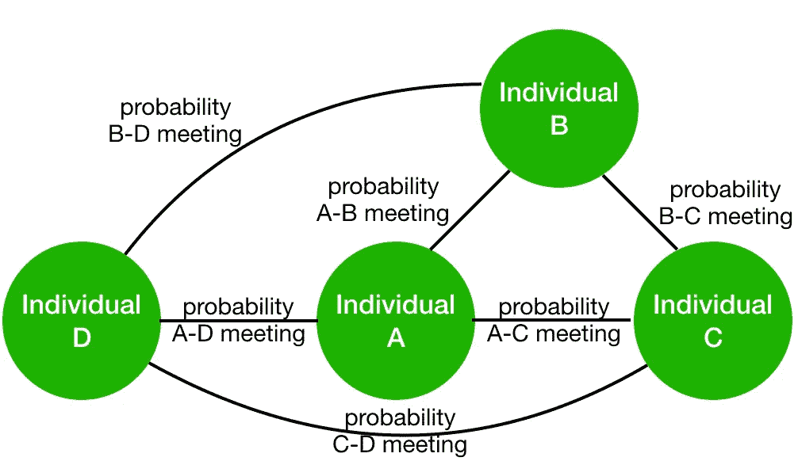

完整社交图中四个节点(个人)的小插图

在接下来的内容中，我使用了一个通用的*时间单位(TU)* ，而不是小时、天或周，以避免产生一种错误的特定感。如果需要，读者可以替换术语。

对于*基线场景*，进一步描绘如下:除了一个人，所有人都健康地开始。当一个传染性个体在社会图中遇到一个未受感染和未免疫的个体时，病毒在一个 TU 中的传播以概率 *P* 发生。一旦被感染，基线情景中的个体进展如下:

*   在感染事件的大约 1-3 个月之后，个体变得具有传染性，并且可以开始感染他们遇到的其他个体。
*   在大约 6-10 TUs 后，疾病被发现，此时个体自我隔离，并停止与社会图中的其他个体接触(并因此感染)。
*   大约 10-15 TUs 后，个体恢复，此后对进一步感染免疫，并返回到它们在社会图中的先前位置。

我省略了死亡事件的建模。在现实世界中，它们当然是最重要的。我目前的重点是短期的病毒传播，所以这个省略是有道理的。

进一步设想基线场景的两个小变化:

*   *更有可能的传输者*:作为基线情景，除了会议发生时的传输概率是基线的两倍。
*   *延迟恢复*:作为基线情景，除了恢复发生在感染事件后约 13-18 tu。

这三个场景是用完整社交图中的一千个人模拟的。

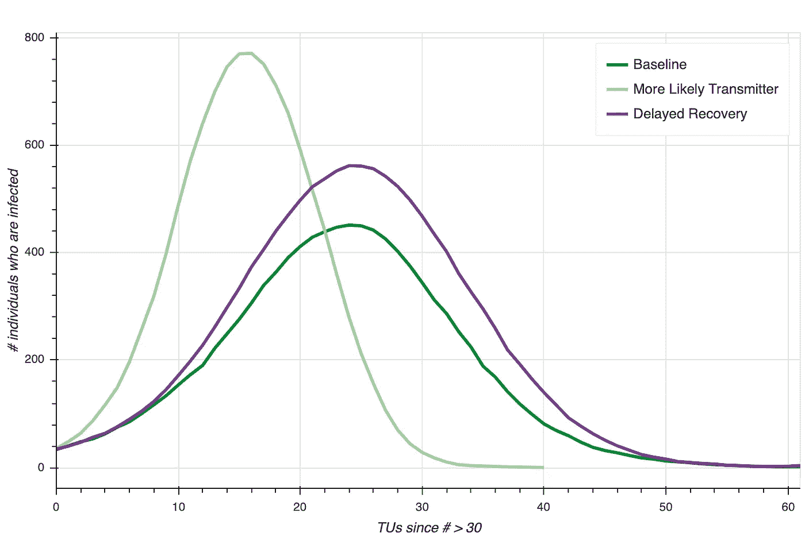

这三种情况的共同点是，在疾病发展的早期，受感染的人数呈指数增长。那是因为受感染的个体在当时是相对罕见的，所以绝大多数受感染的个体是有可能将病毒传染给健康个体的会议的一部分。

一段时间后，增长趋于平稳，并达到峰值。当许多会议涉及成对的已经感染的个体或免疫个体时，社交图中较少的会议可以有助于病毒在社区中的传播，并且恢复率很快超过感染率。

这些情景之间的集体结果的差异源于以下关系:

*   如果病毒更容易在个体之间传播，受感染个体的数量在开始时增长更快，下降也更快。
*   如果一种疾病需要更多的时间来恢复，那么在任何一个时间点上被感染的个体数量都会更大，因为恢复的个体流回到社会图需要更多的时间来开始。

这些是相当直观的关系，是进一步分析的良好基础。

表征集体结果的另一种方式是确定在健康个体自我隔离并随后康复之前，传染性个体将病毒颗粒传播给健康个体的数量。

从最初 100 名受感染个体的疾病进展中，获得了以下直方图。

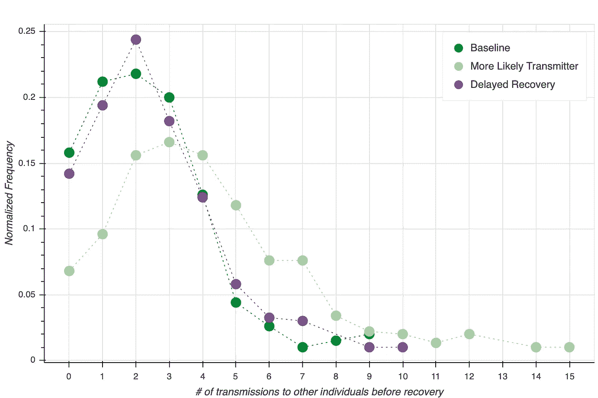

在更有可能的传播情况下，受感染的个体更有可能在自我隔离之前感染更多的个体。这是量化这种情况下感染增长更大的一种不同方式。在这个量上，延迟恢复与基线没有什么不同，这是因为它们的不同之处不在于传播的性质，而在于恢复。

在流行病学文献中，每个受感染个体的传播平均值有时被称为 *R0* 。在一些病毒传播模型中，这些直方图是模型的输入，而不是结果，在合理的理论假设下，它们可以被建模为*负二项分布*。

到目前为止所描述的结果和关系可以从使用常微分方程或简单类型的随机抽样的标准增长模型中获得。因此，它们在数学上非常高效。这种模型做出各种同质性假设，包括关于社交图的假设。

由于我明确地模拟了个体对个体的动态，我可以引入异质性，并看看它如何在集体结果中表现出来。这就是我想要探索的直觉和宏观观察之间的联系。

## 社交距离对所有人都有利，即使不是所有人都参与其中——这可能是一个正在形成的协调困境

我从两个维度对社交距离建模:一个给定的个体进行了多少社交距离，以及有多少个体参与了这种社交距离。因此，对社区中个人之间的非统一程度的社会距离进行了建模。

我继续使用完整的社交图，并使用如上所述的相同基线场景。此外，还模拟了以下种类的变化: *X%比 Y%更谨慎*。这意味着模拟社区中的 X%的人在与社交图中的另一个人互动时，传播或接收病毒的可能性降低了 Y%。其余百分比的个人，100-X%，与基线场景中的个人没有什么不同。

同样，一千个人被模拟。

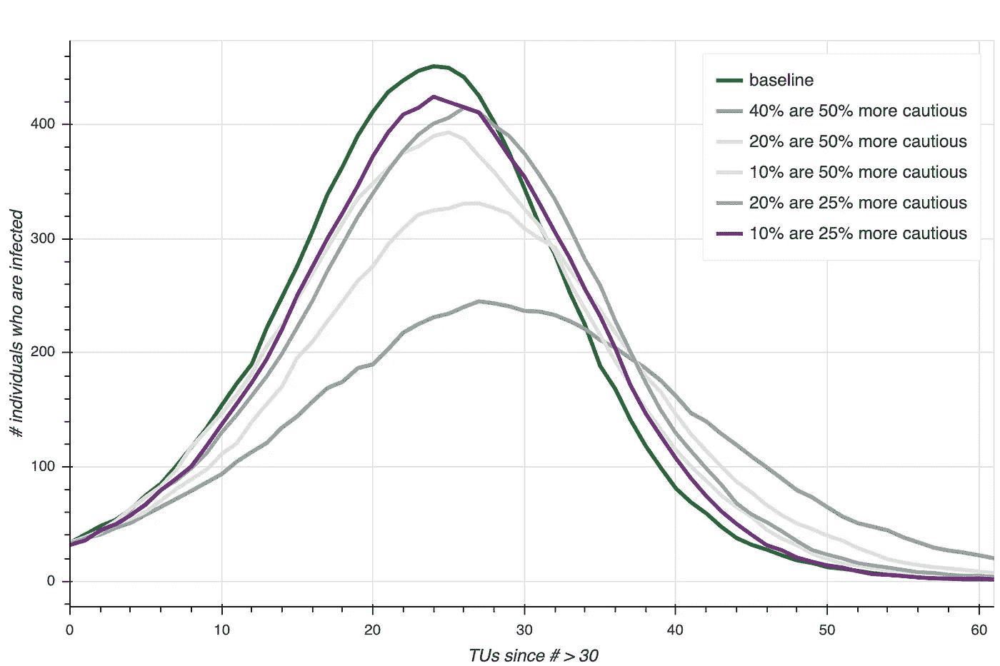

图中的曲线展示了被称为*平坦曲线*的特性。社区中在社会交往中持谨慎态度的个人比例越大，增长就越慢，因此感染高峰就越低。

下图显示了前 100 名感染者依次将病毒传播给了多少其他人。不出所料，相互作用越谨慎，每个感染者的传播就越少。

在这些模拟中，社区的人口由两种类型的个体组成:实行社会距离的个体和不实行社会距离的个体。换句话说，后一部分与构成基线情景人口的个人类型相同。

单独分析模拟群体的那一部分，即非距离个体。

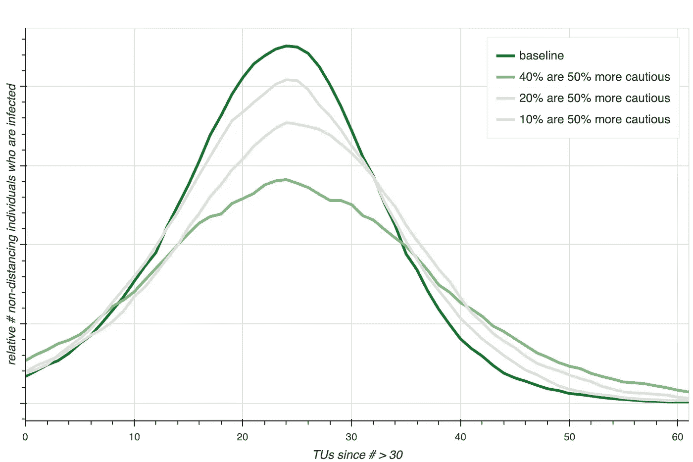

该图显示了在不同模拟社区中被感染的非远距离个体的相对数量。请注意，这些曲线已经过缩放，因此可以进行比较，而不仅仅是反映社区中非距离个体的不同数量。

关键的结论是，随着社区中实行社会距离的其他个体数量的增加，那些没有改变他们个人行为的个体仍然会以较低的比率被感染。

实践社交距离的人也从他们的实践中受益，尽管如果更少的其他人参与同样的实践，受益会更少。换句话说，集体成果是合作的，而不仅仅是各部分的总和。

因此，在某些条件下，这可以起到类似于经典*协调困境*的作用，类似于著名的*囚徒困境*。举例来说，如果实行社交距离是有成本的，那么个人的最佳选择就是成为唯一一个不实行社交距离的人，而其他人都这样做。一旦一些人“背叛”了保持距离的做法，个人保持社会距离的好处就会减少，背叛的动机就会增加。因此，集体最优是不稳定的。

然而，必须指出的是，仅仅因为一个困境可能存在，它可能不会在现实世界中被激活。正如奥斯特罗姆和西格蒙德等人所指出的，对现实世界中的人类、制度和文化的研究表明，额外的规范和禁忌往往演变成间接短路协调困境。一旦我们可以回顾新冠肺炎疫情，这将是有益的经验调查世界各地的不同社区如何度过这些潜在的协调困境。

下图对比了社交距离对更可能的发送者情景(见上一节)的影响和基线。

在更有可能的传播情景中，相当大的社会距离仍然会导致比基线情景更快的感染增长。

这表明，尽管社会距离在质量上总是使曲线变平，但病毒传播的其他特性对通过这种缓解努力可以实现的精确的 T2 数量减少非常重要。如果需要将峰值拉平到给定阈值以下，则必须从病毒传播相关特性的定量考虑中推断出需要多少社交距离。

我只是在模拟社区的个体中模拟了适度的异质性。社会距离的程度和范围可能会随着社区对疾病严重性的认识而变化，这种认识会随着病毒传播的过程而变化。为了解释这一点，需要更复杂的个人意图和行为模型。所谓的基于主体的模型提供了在某些利己假设下根据信念和意图对行为进行建模的手段。当面对极端事件时，根据定义，几乎没有可用于模型训练的追溯数据，因此需要人类和社会力学的基本原理模型。

## 穴居人图和小世界中的病毒随机游走:社会图拓扑可能是人际动力学中不确定性的放大器

在图论中，大量的原型图被定义和研究。上一节中使用的完整图形是一个。这是连通性的一个极端例子:每个节点离所有其他节点只有一步之遥。

一个更少连通的图是所谓的*穴居人图*。我将使用相关的*放松穴居人图*作为社交图，并探索它如何改变传播的本质。

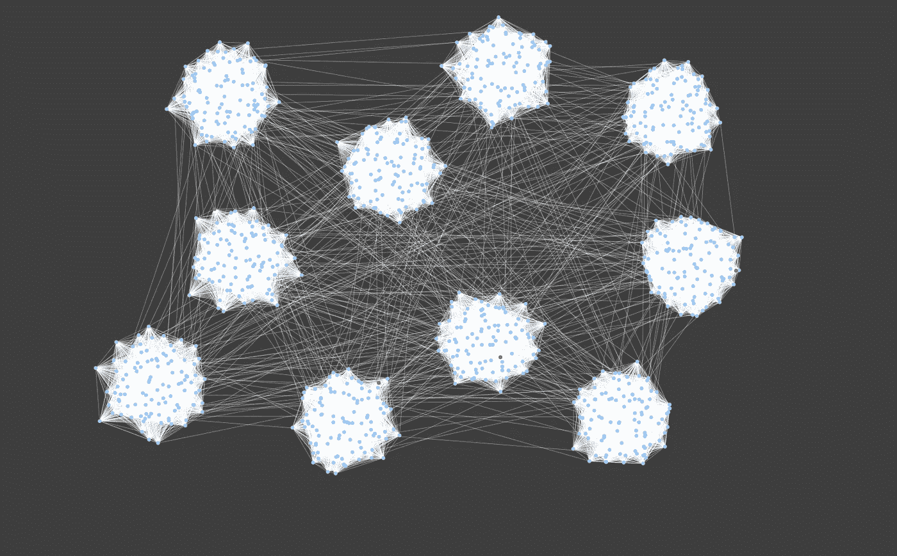

图像中的蓝点代表图中对应于健康个体的节点；四个红点是被感染的个体；白色的重叠和交叉线是连接节点对的边。节点被放置成使得彼此之间具有许多连接的节点是靠近的。十个白色束中的每个包含 100 个节点，每个节点形成几乎完全连接的组或集团。图中只有 1%的边在组之间。

一束几乎完全连接的节点的特写。

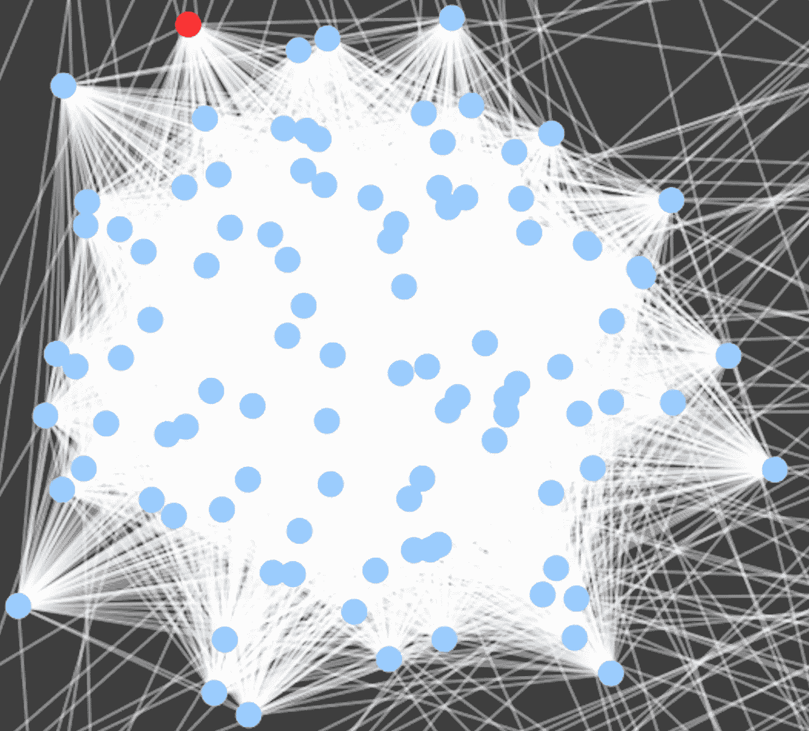

放松的穴居人图形代表了一个原型社区，其中每个人都与一个小的子社区紧密相连。一些个体直接连接到两个或更多的子社区，尽管对于任何个体来说，大量的社会联系都在群体内部。然而，在社区中的所有个体之间总是存在一条通过中介的路径。每个人至少都是其他人的朋友的朋友的朋友。

下面的动画图像显示了一个模拟的疾病轨迹，以五个 tu 为一步。除了蓝色和红色的节点，紫色的代表反应性自我隔离的个体，绿色的代表康复和免疫的个体。

这种蔓延似乎是以两次爆发的形式进行的。首先，五组开始从蓝色过渡到红色，紫色，然后绿色。第二，当第一组大部分是绿色时，其余五组开始从蓝色明显转移。

这种传播突然增加的现象是群体间病毒传播很少的结果。实际上，有一个看不见的过渡障碍。

然而，在病毒传播或社交图中，没有任何东西要求传播像上述那样以两次爆发的方式进行。特定的结果取决于一些关键的低概率事件的结果。下图显示了在放松的穴居人社会图(社会和传播事件的不同随机化)的九个独立模拟中，随着时间推移的感染人数，以及其他基线病毒特性。

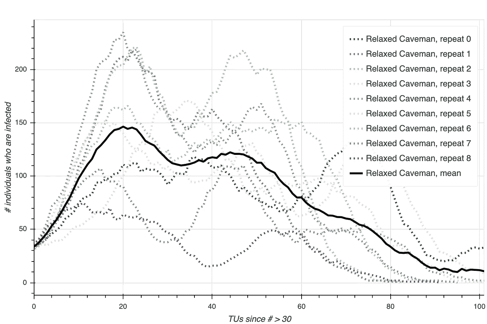

在放松的穴居人社会图中，围绕感染的平均(或预期)进展，病毒传播有很大的差异。重复数 2，清晰的双峰曲线，是动画图像中显示的曲线。

关键是输入信息的不确定性转化为结果的大量不确定性。模型中的随机变量量化了我们对过程中各个组成部分的知识的不确定性。例如，在某一天，A 个体*可能*与 B 个体*相遇，如果*发生，*可能*导致病毒传播。如果个人 A 和 B 属于不同的节点群，这种相遇和转变可能会被证明——事后证明——是使病毒传播到大多数健康个体群的关键事件。

对于完整的社交图，同样存在*输入*知识的不确定性。然而，在这种类型的社交图中，病毒传播在集体*输出*中的可能结果的范围要窄得多。因此，随着社交网络拓扑结构的改变，相同的人际传播特性会转化为不同的集体结果。

另一个结果是，在放松的穴居人社会图中，两个相同的群体可以在某个时间点经历完全不同的结果，原因仅仅是一个罕见的事件发生了不同的转变。回顾性观察到的一些差异没有需要解释并转化为前瞻性陈述的重大结构性原因。

另一类图是*小世界图*。许多现实世界的网络是高度聚集的(一个人的朋友也可能是彼此的朋友)，并且具有适度的最短路径长度(如果可以找到的话，网络中几乎任何两个个体之间都有相对较短的路径)。用 Strogatz-Newman 图算法构造了一个原型小世界社会图，再次模拟了基线情景病毒的传播。

结果的可变性没有放松的穴居人大，尽管比完整的社交图大。

另一个原型图形是*环格*。个体以与小世界图中相同的方式聚集。不过，任何两个节点之间的最短路径长度都可能很长。然而，没有像放松的穴居人图中那样明显的节点组。

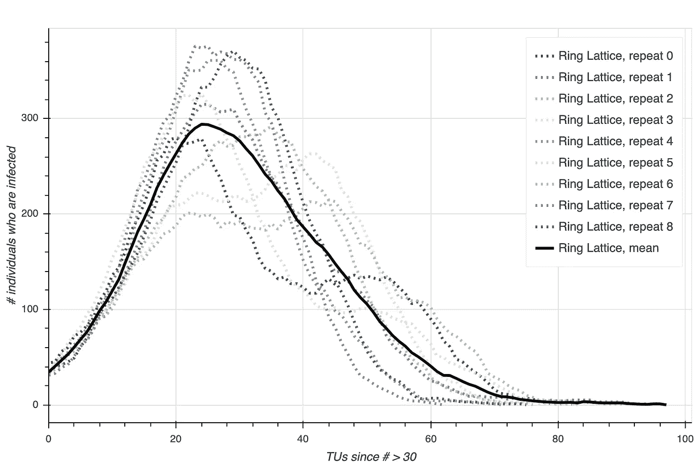

作为参考，设置不同社交图的模拟，使得 TU 中的会议总数无论如何都是相同的。因此，图表类型之间的差异不*也不*反映每个 TU 的会议总数的任何变化。

为了便于比较，将增长的平均值放在一起。小世界(10%)图类似于上面的小世界社交图，但是在非聚集节点之间有额外的路径。

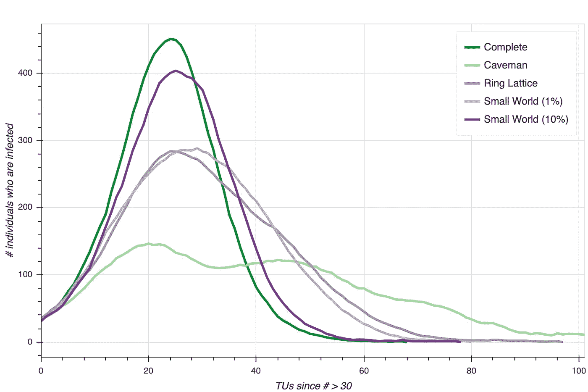

对于更聚类的社交图，病毒传播更持久，受感染个体的峰值因此降低，尽管这些社交图的任何单个特定结果都可能偏离平均值更多。

如果我们把病毒想象成一个在社会图中随机移动的物体，那么它发现通向某个人的路径的能力将取决于图的拓扑结构。瓶颈、群集之间的捷径数量等是社交图的特征，除了病毒在人与人之间传播的容易程度之外，这些特征还决定了集体结果，包括可能结果的*范围*。毕竟，我们只观察一个现实，所以距离关系到对未来可能发生的事情的陈述(这个话题我已经在[详细讨论过了](/toronto-on-fire-in-data-part-2-33e150b8e45d)，关于多伦多的城市火灾)。

上面的社交图是说明性的原型。它们只是为了说明在其他条件相同的情况下，社会特征的差异如何影响集体的结果。与任何特定案例相关的实际社交图是什么，比如*新型冠状病毒*在一个城市的传播，社交媒体上的猫迷因，或者文艺复兴时期佛罗伦萨的政治影响，是一个不明显的实证问题。

## 如果恢复没有带来免疫力和其他试探性问题呢？

到目前为止，所有的模拟都假设对进一步感染的免疫力来自于康复。对于病毒感染来说，情况往往如此，因为免疫系统可以适应特定的病原体。然而，这并不能保证，因为人可以通过药物治疗(不是疫苗)通过免疫系统的非适应性部分康复，或者也可能发生在流行期间，病毒发生变异，使得以前感染的免疫记忆占据应用。

这种动态可能很复杂，取决于第一轮感染中死亡的人群以及特定病毒的适应能力。我目前对可能性的范围了解得太少了。因此，我不会进一步探讨这个问题，只需注意这对于病毒传播的长期发展非常重要。

另一个与社交图谱中的传播有关的特征是主动隔离，即人们被隔离，而不管他们已知的感染状态。在其最简单的形式中，它可以被建模为穴居人图中的一组节点，与其他组完全隔离。然而，大规模的隔离通常会引起摩擦，比如个人的反抗，或者是持续时间，而不是疫情状况，决定了隔离是否适用。这些动力学需要更多的思考来包含，我把它推迟到另一个时间。

## 模型细节

接下来，我将简要介绍这个模型。底部的代码链接。

一个人被建模为具有*疾病状态*。该状态可以经历一个*状态转换*。下图中的绿框代表数学模型中的疾病状态，箭头上方的黑色文本代表状态转换。

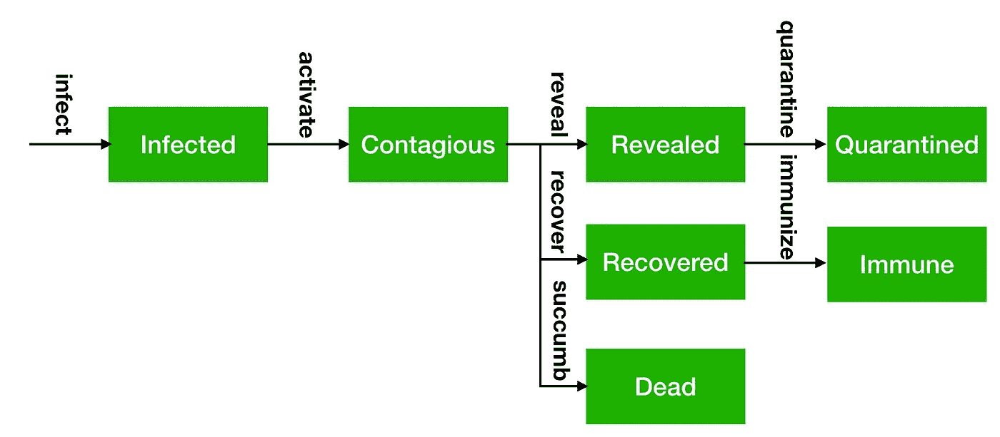

箭头代表条件关系(不是流程图)。激活和下游状态转换被建模为随机事件。动力学知识中的不确定性通过累积概率密度分布来量化。例如，*激活*转换需要感染存在。在给定的条件下，伯努利试验的结果决定了某一天是否发生了状态转换。伯努利试验的概率参数取决于从*感染*转变以来已经过去了多少天，使得状态转变变得更有可能是久而久之。

*infect* 状态转换依赖于社交图中个体和邻居之间的交互。可能导致感染的步骤有:

1.  在社交图的所有边上循环。
2.  对于一条边，让伯努利试验的结果决定该边所代表的会议是否发生。概率参数是与边相关联的权重。
3.  如果会面发生，那么只有当一个人具有传染性，而另一个人既没有被隔离也没有免疫也没有被感染时，尝试以某种概率进行病毒传播。如果成功，则执行*感染* *状态*转换。

在上述模拟中，边上的权重被设置为使得一个 TU 内会议的总预期数量与节点数量成比例。不管社交图拓扑如何，这都是真的，这意味着图拓扑之间的差异*而不是*来自尝试的病毒传播数量的任何差异。

Python 代码可以在这个 [Github 库](https://github.com/anderzzz/viral_spread_network)中免费获得，没有任何质量保证或支持。代码特别建立在 [Pandas](https://pandas.pydata.org) 和 [networkx](https://networkx.github.io) 库的基础上，图形是用 [Bokeh](https://docs.bokeh.org/en/latest/) 库创建的，除了网络图像是用 [Cytoscape](https://cytoscape.org) 创建的。