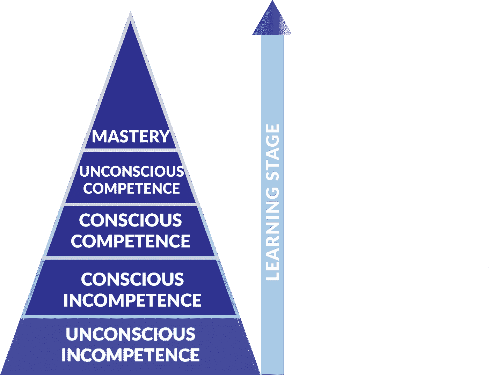

# 学习数据科学的阶段

> 原文：<https://towardsdatascience.com/the-stages-of-learning-data-science-3cc8be181f54?source=collection_archive---------8----------------------->

## 如何在关键学习点“摆脱困境”

许多人认为学习数据科学是一个线性过程。事实上，这是一个混乱的进程，更接近于一系列的平稳期。

感知与现实的数据科学学习曲线

幸运的是，已经有一个很好的通用学习模型来解释这些平台是如何工作的。这种模式是诺埃尔·伯奇在 20 世纪 70 年代创造的，罗伯特·格林在他的书《掌握》中对其进行了扩展。根据这个框架，我们经历了 5 个学习阶段:无意识无能、有意识无能、有意识胜任、无意识胜任和精通。学习数据科学也遵循这个过程。

诺埃尔·伯奇和罗伯特·格林的学习阶段

在本文中，我将解释在数据科学的框架中，每个阶段是什么样子的。我谈论我在每个阶段的经历，也包括一些我发现的从一个阶段到下一个阶段的最快方法。

## 阶段 1:无意识的无能(完全新手)

在这个水平上，你才刚刚开始进入数据科学领域。你几乎没有编码或统计经验。阶段 1 一般以过度自信为特征。很多人认为学一两门课就能学会该领域。

这是我大学毕业时的普遍感受。有了几门经济学课程，我觉得我已经准备好进入体育分析的世界了。学习数据科学似乎是下一个实际步骤。从高层次来看，这个领域似乎很简单，你只需要在数据中找到趋势，并提出见解。简单吧？

不用说，我完全错了。开始学编程后，我已经无可救药的迷茫了。我开始把我需要学习的所有不同的概念放在一起，这个任务从简单变得极其艰巨。

为了从阶段 1 进入阶段 2，您需要了解什么是数据科学，以及它需要哪些编程和数学概念。我建议观看 YouTube 视频，并涉猎一些 python 编程来达到这种理解。

## 阶段 2:有意识的无能(恐惧)

一旦你开始对编程和数学的世界之大感到不知所措，你就进入了第二阶段。这是一个很多人卡住甚至退出的阶段。在这里，您将了解数据科学有多深入。要学的东西太多了，不清楚从哪里开始。

度过这一阶段的关键是将数据科学分成小步骤。你也只需要从某个地方开始。最基础的，对于数据科学来说，你需要了解一些编程(Python 或者 R)和简单的统计学。在网上找一些地方来了解这些领域。我推荐参加免费的编程或数据科学课程(【kaggle.com】微课程是我的最爱)。

在这个阶段减少我不知所措的感觉的是思考我为什么要学习这个领域。我心中有一个具体的项目。我想建立一个模型，改善我每天玩的幻想运动的结果。如果我只专注于必要的技能来构建它，我可以让数据科学看起来小得多，也更容易管理。

为了进入下一阶段，我建议专注于一个特定的问题，使你的学习标准更小。与学习整个数据科学领域相比，更容易理解完成单个项目需要什么。做一个小项目也没有“学习 python”或“学习统计学”那么令人生畏，因为这些概念是如此宽泛和模糊。在早期阶段，你真的只需要知道这两个领域的基础知识，就能够实践数据科学。如果你完成了这些小项目中的几个，你就会进展顺利。

我也建议在 kaggle 上复习一下别人的代码。你可能根本不会理解，所以不要惊慌。随着时间的推移，它将开始变得有意义，而只是大量地看代码是这个过程的一个好的开始。列出你看到但不理解的术语、包和算法。每天，研究一些这些概念，并试着理解它们。你会对自己在几周内取得的进步感到震惊。

## 第三阶段:意识能力(轻微危险)

至此，您已经完成了几个不同的项目，学习了如何实现特定的算法。您现在有一些代码可以参考了！

当我处于这个阶段时，我收集了所有我经常使用的代码片段，并把它们放入一个主文档中。我可以只参考这个科学怪人的文档，而不是试图记住如何做每件事。这使得以更快的速度完成更多的项目成为可能。这可能感觉像是欺骗，但我认为在这一点上，关注实现比关注语法更有意义。你应该做尽可能多的项目，应用你在研究中发现的所有不同的算法。

在应用这些概念之后，你应该开始理解它们是如何工作的。在这个阶段，我开始读研。在我的课程中，我们被要求从头开始编写这些算法。我认为这对所有数据科学家来说都是一个很好的实践。虽然我有一些在 matlab 中编写神经网络的 PTSD，但这绝对是值得的。从编写算法开始，您开始理解各种技术的输入、约束和限制。

从阶段 3 到阶段 4 没有秘密可言。让你跨过门槛的是重复，不断的练习。

## 阶段 4:无意识能力(艺术和科学)

当你到达第四阶段时，你知道面对问题时该做什么。您不必再参考庞大的代码片段库，您可以开始专注于优化您的问题解决方法。在这里，您将专业领域的专业知识和商业直觉与您的工作相结合，为您的挑战创造最佳的解决方案。

我相信这是真正的数据科学艺术开始发生的地方。你不再关注如何解决问题，而是寻找一个优雅且可持续的解决方案。您将更多的时间花在特性工程、模型调整和将项目投入生产上。你还与商业利益相关者更紧密地合作，以确保你提供的服务产生最大的影响。

我相信我仍然经常在阶段 3 和阶段 4 之间波动。希望今后我能在我的角色中更多地感受到这种“流动”状态。

## 阶段 5:掌握(贡献)

在这个水平上，你已经接近在这个领域的某个领域达到精通。在数据科学中，我真的不认为有人能掌握整个学科。你能够通过发现新的算法或解决问题的新方法来突破界限。

这个阶段是虚幻的，我认为很少有人达到这个顶峰。我认为，属于这一类别的大多数人都倾向于学术界，并且更专注于研究而不是业务实施。

## 最后的想法

我希望这个框架能够帮助您以新的视角评估自己的数据科学学习之旅。我还希望它能给你一个坚实的路线图来提升你的数据科学知识。从我的经验来看，学习数据科学是一个漫长但愉快的过程。

[https://www.youtube.com/watch?v=hpMc6TgT34I](https://www.youtube.com/watch?v=hpMc6TgT34I)