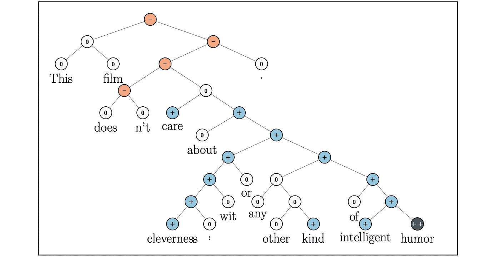
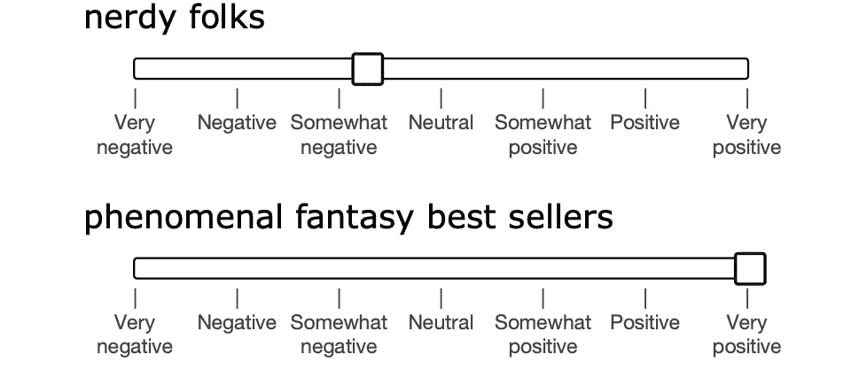
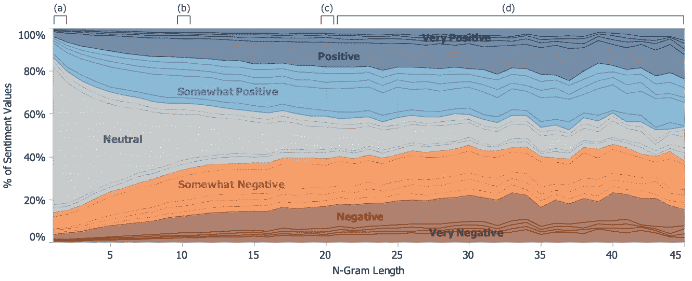

# 斯坦福情感树库(SST):使用 NLP 研究情感分析

> 原文：<https://towardsdatascience.com/the-stanford-sentiment-treebank-sst-studying-sentiment-analysis-using-nlp-e1a4cad03065?source=collection_archive---------12----------------------->

## 斯坦福情感树库(SST)快速指南，它是最著名的情感分析数据集之一。

发表于 2013 年的“情感树库语义组成的递归深度模型”介绍了斯坦福情感树库(SST)。SST 被认为是一个重要的数据集，因为它能够测试 NLP 模型的情感分析能力。让我们来看看这个有趣的数据集。

在斯坦福情感树库上预测从非常消极到非常积极的情感水平(-，0，+，++)。图片来源于论文的原作者 Socher 等人。

**任务。** SST 处理情感分析的关键任务，其中模型必须分析文本的情感。例如，这可以以确定餐馆评论是正面还是负面的形式出现。以下是一些虚构的例子，展示了他们情绪中的一系列积极和消极方面:

> 这是我不幸吃过的最差的餐馆。
> 
> 这家餐厅送食物有点慢，而且他们似乎没有使用最好的食材。
> 
> 这家餐馆相当不错——考虑到价格低廉，它的食物还可以接受。
> 
> 这是西半球最好的餐厅，我一定会回来再吃一顿！

基于这些例子，情感分析似乎是一项简单的任务。然而，有许多具有挑战性的细微差别使得准确分析一个短语的情感变得困难。对于 NLP 模型来说，诸如否定、讽刺和以肯定的方式使用否定术语等语言异常尤其难以处理。举以下例子:

> 我不讨厌这家餐馆。(否定)
> 
> 我就是喜欢吃冷食！(讽刺)
> 
> 这种食物独特得令人不安。(否定词表示肯定)

从这些例子中可以看出，这并不像仅仅寻找“恨”和“爱”这样的词那么容易。相反，模型必须考虑上下文，以便识别这些具有细微差别的语言使用的边缘情况。由于模型良好运行所需的所有复杂性，情感分析在 NLP 中是一项困难的(因此也是适当的)任务。

**编译数据集。**对于 SST，作者决定关注烂番茄的电影评论。通过搜集电影评论，他们最终得到了总共 10662 句话，其中一半是负面的，另一半是正面的。在将所有文本转换成小写并删除非英语句子后，他们使用[斯坦福解析器](https://nlp.stanford.edu/software/lex-parser.shtml)将句子拆分成短语，最终得到总共 215，154 个短语。

用于标注 SST 的标注界面—标注者使用滑块来选择短语的肯定或否定程度。图片来源于论文的原作者 Socher 等人。

SST 是如何被注释的？作者拿出经典的亚马逊机械土耳其工人，以随机顺序呈现这些短语，并要求注释者使用滑块指出每个短语的情绪和情绪程度。滑块允许多达 25 种不同的情绪水平(有关这方面的详细信息，请参见下图)，作者使用注释来定义任务的细粒度和二进制版本。在 SST 的细粒度版本中，有 5 个不同的类别(非常负面、负面、中性、正面、非常正面),并且所呈现的基线模型达到 45.7%的准确度。在 SST 的二进制版本中，只有 2 个类别(正对负),并且所呈现的基线模型达到 85.4%的准确度。

特定长度(n-gram 长度)的短语的情感注释直方图。较短的短语更可能是中性的，而较长的短语分布更均匀。图片来源于论文的原作者 Socher 等人。

**海温的影响。**作为情感分析的领先数据集，SST 经常被用作测试 BERT 和 ELMo 等新语言模型的许多主要基准数据集之一，主要用于展示各种语言任务的高性能。

SST 将继续成为未来许多年情感分析的首选数据集，并且它肯定是即将发布的最有影响力的 NLP 数据集之一。

**延伸阅读:**

*   [Socher 等人的原始论文](https://nlp.stanford.edu/~socherr/EMNLP2013_RNTN.pdf)
*   斯坦福情感树库的主页——包括数据集的下载链接。