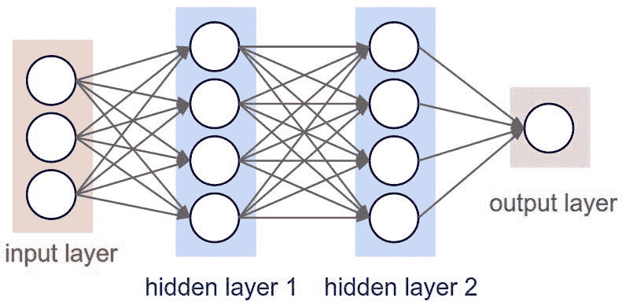
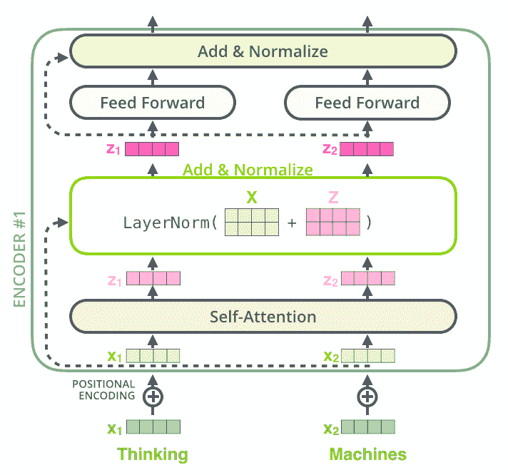
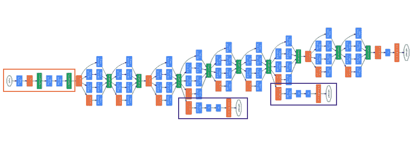
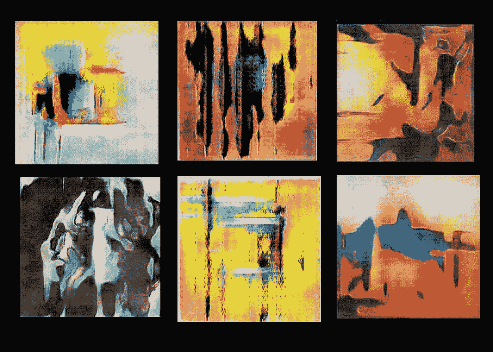

# 2020 年人工智能的状态

> 原文：<https://towardsdatascience.com/the-state-of-ai-in-2020-1f95df336eb0?source=collection_archive---------6----------------------->

## 通过了解人工智能的过去来了解我们的未来走向。这篇文章对人工智能的过去、现在和未来进行了深入的概述。

毫无疑问，在过去十年中，人工智能、机器学习和数据科学已经成为技术领域最强大和最具前瞻性的力量。这些技术带来了突破性的见解和应用，可能会真正让世界变得更好。当然，这要归功于数据收集、硬件创新和被驱动的研究人员在 2010 年代的共生现象。这导致我们在从视觉到自然语言处理到音频理解到复杂信号处理的所有方面赋予计算机令人难以置信的能力。要了解我们的发展方向，重要的是要了解这些突破是如何形成的，以及我们目前所处的位置。这篇文章旨在做到这一点，并帮助揭示人工智能在当前状态下的局限性，以形成对未来的愿景。

**本文中的**

1.  **我们从哪里来**
2.  **我们现在在哪里**
3.  **我们要去哪里**

# 我们从哪里来

自 20 世纪中期以来，人工智能已经采取了许多不同的形式。这包括从自动机到线性回归和感知器到决策树以及最终神经网络和深度学习的一切。随着进步和公众开始意识到这个“人工智能”到底是什么，这些方法通常会不可避免地从智能转向统计技术。2010 年代已经将大多数这些形式抛在身后，并允许从简单的神经网络转向深度学习的突破性方法。

**神经网络到深度学习**

虽然神经网络自 20 世纪中期以来就已经形成了理论，但计算和数据限制使得它们直到 21 世纪初才得以成功实施。这导致了这种数学方法的研究和能力的指数扩展，允许机器学习线性和非线性数据形式的模式。神经网络背后的概念或多或少是一组具有激活函数的堆叠和连接的线性回归。随着这些“神经元”的增加，网络有更多的变量需要训练，因此可以模拟更复杂的模式。数学和结构已在此进一步详细说明[。](https://www.youtube.com/watch?v=rEDzUT3ymw4)

前馈神经网络([来源](https://brilliant.org/wiki/feedforward-neural-networks/)【9】)

大约在 2010 年及以后，计算和数据能力真正开始赶上这些理论。出于这个原因，研究人员和工程师意识到，随着他们增加更多的层和每层的神经元，这种统计技术可以以接近人类的方式为回归或分类模式建模。这些系统很快就获得了在更简单的数据集上产生与基于规则的系统相同或更好的结果的能力。随着 GPU 技术允许更深的网络，深度学习接管了机器学习空间，实际上开始了一场比以往任何时候都更广泛的机器学习革命。

**卷积和递归神经网络**

随着深度学习的形成，人们很快意识到，语言和图像领域的计算机科学问题可以通过这种新形式的人工智能更有效地解决。因为研究变得如此广泛，而不仅仅是建立越来越深的网络，现有框架内的新老方法都得到了开发和利用。语言模型开始利用和适应递归神经网络的概念，计算机视觉实现了卷积神经网络。到 20 世纪 90 年代末，这两种形式不可避免地在许多方面混合在一起，但它们的独立道路对它们的突出至关重要。

递归神经网络基于当前输出依赖于先前时间步长的先前输出的思想。这当然是语言和大多数其他基于时间序列的数据类型的本质。当人类说话时，下一个单词不是从基本上下文中随机决定的，而是依赖于前一个单词和上下文。RNNs，更具体地说是 LSTM(长短期记忆)正是为此而实现的。这种网络结构循环反馈过去的输出作为输入，以产生下一个输出。这些输入既可以馈入典型神经网络的前端，也可以处理更复杂的内部矩阵运算，如 LSTMs 所示。这种方法允许在 NLP 和许多其他时间序列数据集中实现最强大的飞跃。语言生成和预测第一次变得更加可行。要更详细地了解 LSTMs，请点击[这里。](https://arxiv.org/pdf/1909.09586.pdf)

通用卷积神经网络([来源](https://missinglink.ai/guides/convolutional-neural-networks/convolutional-neural-network-architecture-forging-pathways-future/) [10])

卷积神经网络现在已经接管了大部分人工智能空间，它们的创造者 Yann LeCun 预测，它们可以处理几乎任何我们可能想到的人工智能任务。不管这是真是假，CNN 已经在复杂的计算机视觉任务中实现了近乎完美的准确性。这个概念源于图像的三维特性。经典的深度学习网络通常使用一维输入，因此图像像素值将被展平为单个向量。这种活动导致每个像素的大部分空间关系的信息丢失。卷积的概念允许 3D 输入(即 RGB 图像),并使用一组过滤器值对输入执行滑动点积运算。这允许学习多个特征图，在训练期间，这些特征图通常剖析图像的不同特征。总的来说，这允许较低数量的权重，因为滤波器覆盖了所有 3 个维度和网络，以提取图像的更深层次的特征。在过去的 10 年里，操纵 CNN 的许多努力已经导致了计算机视觉的巨大突破。这些成就中的许多都详细记录在胜利中，如 [ImageNet](https://papers.nips.cc/paper/4824-imagenet-classification-with-deep-convolutional-neural-networks.pdf) 结果。

**培训和图书馆**

当然，如果没有训练这些数学模型的能力并通过可访问的代码来这样做，这些进步都是不可能的。反向传播是用于训练任何神经网络的典型方法。这个概念利用基于输出权重的每一层的导数梯度来调整网络内部的每个权重。这需要复杂的编程和硬件来实现，尤其是对于更复杂形式的架构。

幸运的是 GPU 技术得到了发展，以及更多的数学方法使这种训练方法变得高效。NVIDIA CUDA 等技术允许在大规模并行 GPU 上执行数学运算，将训练时间从几天缩短到几分钟。这允许更快的迭代，从而更快地得到结果。与此同时，诸如批量标准化、丢弃和 ADAM 等强大的优化器等方法更进一步，允许可预测和有效的训练会话。

([来源](https://www.google.com/url?sa=i&rct=j&q=&esrc=s&source=images&cd=&cad=rja&uact=8&ved=2ahUKEwiuyLDg36HnAhWGUs0KHQTkBMQQjhx6BAgBEAI&url=https%3A%2F%2Fwww.learninglisted.com%2Fmachine-learning%2Ftop-5-most-popular-machine-learning-libraries-python%2F&psig=AOvVaw0npygqd3yQh02aHNMp753Y&ust=1580144664470355) [12])

最后，如果没有随着 Python 和诸如 Tensorflow、Keras 或 PyTorch 等库的兴起而出现的语言和库支持爆炸，这些进步都是不可能的。由于其易用性和库支持，Python 已经成为最突出的编程语言。同样，它也是数学编程最理想的语言之一。这使得更多的人能够试验和构建新概念，同时消除了更复杂语言的麻烦。最重要的是，像上面列出的那些库的创建，允许更广泛的人接触这项技术。这反过来又创造了一个更加民主化的技术生态系统。总的来说，过去的十年让更多的人拥有了更多的能力，这才是技术发生真正指数级转变的原因。

# 我们今天在哪里

**自然语言处理**

语言处理的当前技术水平已经有效地融合了递归和卷积神经网络，同时在内部创建了新的方法。所有这些都围绕着变形金刚、自我关注和单词嵌入。这些概念都有助于对大规模并行 CNN 或 fcn 中的单词关系进行建模，从而有效地理解完整的语料库。

转换器完全按照它的名字来做——将一组单词嵌入转换成另一组单词嵌入或类似的结构。这对于机器翻译、单词生成或用于分类的向量创建特别有效。[这](http://jalammar.github.io/illustrated-transformer/)是对变形金刚的深入研究，但简而言之，它们基本上是一对编码器和解码器网络，经过训练可以完成上述任务。一个强有力的概念是自我关注，它是变形金刚的核心。[自我关注](https://arxiv.org/pdf/1706.03762.pdf)是谷歌最近开发的一种方法，用于在单次网络传递中模拟语言的重现性和空间性。为此，使用查询、键和值矩阵对每个输入序列执行复杂的数学方法。这些值被调整以模拟序列中所有单词的空间关系。

变压器编码器([源](http://jalammar.github.io/illustrated-transformer/) [2])

这些概念已经通过[伯特](https://arxiv.org/pdf/1810.04805.pdf)和 [GPT-2](https://cdn.openai.com/better-language-models/language_models_are_unsupervised_multitask_learners.pdf) 架构成功实现。虽然每个网络都有自己不同的方式，但它们都实施了超深度变压器模型，以成功完成序列到序列和多任务目标。GPT-2 的创造者 OpenAI 目前有可供下载的模型(经过一些争议)，允许研究人员提示网络并接收创造性的“AI”书面文本。在内容创建、聊天机器人和文本生成中有许多这样的用例。这种强大网络的可用性应该允许技术继续其指数增长。

引用我创造的受过哲学训练的 GPT-2:

> “生活的意义在于为那些缺乏这种能力的人创造可能性的幻觉……”

**计算机视觉**

随着卷积对于图像处理任务和其他任务变得更加有效，社区已经决定在他们的网络架构中进行更深入和更广泛的研究。这带来了残余网络的强大趋势。残余神经网络，例如在最先进的 Google Inception 网络的情况下，拼凑残余块来构建最强大的 CNN。残差块通常是两个或更多并行的 CNN，它们被连接或添加在末尾。这反过来利用强大的并行计算架构来实现比以往更好的结果。

谷歌盗梦空间([来源](https://missinglink.ai/guides/convolutional-neural-networks/convolutional-neural-network-architecture-forging-pathways-future/) [10])

与此同时，新的卷积方法被开发出来，使事情更进一步。比 Google Inception 网络高一级的是 Xception 网络。[这个](https://arxiv.org/pdf/1610.02357.pdf)网络与其前身几乎相同，但使用了一种新型卷积，称为深度方向可分离卷积。该概念允许更少的参数计数和更高的精度。这在上面的论文中有更好的描述，但简而言之，它将卷积运算分成两部分。分别滑过每个通道的深度方向卷积，以及逐个像素地滑过所有通道的点方向卷积。这是我们熟知的方法中创新力量的又一个例子。

最后一个趋势是迁移学习，不仅在计算机视觉中，在所有用例中都是如此。迁移学习的概念是突出的，因为训练有素的网络不需要为每个用例重复。迁移学习通常采用预训练的特征提取网络减去其分类层，并冻结权重。然后将它们作为输入附加到用户自己的分类器上。训练过程现在只是训练新的分类器来利用来自大量训练的网络的输出。这使得计算机视觉网络，如 Xception，经过几个月的训练，可以适应任何领域的用例。

**生成性对抗网络**

由我的 GAN 实现生成的艺术

尽管它们还没有在商业用例中得到广泛应用，但生成对抗网络是当今人工智能最有趣的形式之一。其概念是建立一个生成器网络，将向量映射到图像矩阵或类似的矩阵。该输出被馈送到鉴别器网络，该网络学习解密生成内容和真实内容之间的差异。由于两个网络是串联训练的，生成器在欺骗鉴别器方面变得更好，因为它也变得更好。这个博弈均衡的最终结果是一个能够创造接近真实内容的生成器。这导致了一些相当惊人的艺术，写作，当然还有深刻的赝品。

**训练和部署**

人工智能已经达到了对一些生产软件系统有用和几乎至关重要的程度。详细描述的方法允许可接受的精确度水平，以允许这项技术进入野外。这在很大程度上要归功于强大的云技术，它允许可扩展的部署和理想的培训场景。

为了向公众部署强大的模型，需要理想的培训和架构。这正是神经结构搜索和超参数调整发挥作用的地方。使用巨大级别的计算资源，神经架构搜索在潜在架构(层、神经元、方法等)的组合级别集上运行训练。).然后可以使用结果来部署理想的模型进行训练和部署。在这个过程中，进一步调整超参数，以获得更理想的模型。

2020 年，库和云功能使部署人工智能驱动的应用变得简单。云可以容纳常见形式的人工智能，并提供 it 资源来扩展和管理应用程序的生命周期。同时，库允许数据科学和软件开发角色分离。这是因为通用模型文件类型只需要开发人员理解几乎任何编程语言中的给定库就可以部署数据科学家的模型。

# 我们要去哪里

在不久的将来，更复杂的架构和搜索算法的趋势将会继续增长。但是很快，人们就会质疑这些暴力手段的效率和聪明程度。已经证明了这些方法是如何产生碳足迹的。随着越来越多的社会开始看到人工智能的真实面目，并考虑这些分支，社区将需要新的方法。最近出现的一种方法是修改训练方法，开始从资源密集型反向传播方法转移。这方面的一个例子是[贪婪 InfoMax 优化(GIM)](https://arxiv.org/pdf/1905.11786.pdf) 。这种方法允许分层训练，特别是在迁移学习的情况下，可以大大减少以较小梯度的形式训练所需的变量数量。

炒作周期([来源](https://en.wikipedia.org/wiki/Hype_cycle) [11])

技术进步是一个**发现**导致**研究和发明**方法并最终导致**实施**的过程。当我们通过这个周期时，它比任何东西都更强调当前的阶段。目前，我们正处于我们所知的人工智能的实施阶段，深度学习的发现和创新正在迅速应用于几乎每个商业问题。当然，这扼杀了对全新机器学习方法的整体发现努力。随着我们在未来几年在这个狭窄的空间中循环创新，随着深度学习被视为真实情况，可能会出现广泛的幻灭。随着世界认识到“人工智能”不是魔法，并开始看到实际上只是大量数学的局限性，他们可能会要求研究更加努力地接近真正的人工通用智能(AGI)。这是人工智能炒作周期将摆脱幻灭阶段，让位于稳定的新创新的时候。

这将意味着深度学习之外的全新方法将开始形成。强化学习将继续创新，但要真正达到人类或更高水平的智能，可能需要发生不可预测的范式转变。这些方法可能会开始以量子力学和计算系统为中心，因为量子计算的概念允许人工智能和决策的概率性质以前所未有的方式建模。量子也允许极高维度的系统，一次可以考虑比单一输入多得多的因素。作为人类，我们做决定并与周围的物理世界互动。我们每个行为的总体决定因素或智力是宇宙的总体物理系统。利用量子力学的概念而不是大脑作为人工智能系统的最终决定因素可能更有意义。总而言之，如果我们打算在人工智能上投入这么多时间，我们的目标不应该是比我们自己的大脑更好的东西吗？它是一种完全由我们控制的工具。这可能是定义我们大部分人生的不可预测的技术未来的走向。

机会是无穷的，因为任何独特的想法都可以带来方法的巨大变化，关于人工智能和数据伦理的辩论将继续，企业将越来越依赖这些方法作为他们最有价值的资源。花时间了解我们从哪里来，我们将去哪里，可以让每个人发展自己对未来的愿景。这些独特的人类愿景的全球矩阵将引领我们进入一个有人工智能在我们身边的光明未来。

> “衡量智力的标准是改变的能力。”——阿尔伯特·爱因斯坦

*在* [*LinkedIn*](https://www.linkedin.com/in/ian-rowan/) *或*[*Twitter*](https://twitter.com/ianrowan29)*上与我联系，继续对话。*

*在*[*https://www.mindbuilderai.com*](https://www.mindbuilderai.com)看看我目前在做什么

**参考文献**

[1] Krizhevsky，a .，Sutskever，I .和 Hinton，G. (2017)。基于深度卷积神经网络的图像网分类。*美国计算机学会的通讯*，60(6)，第 84-90 页。

[2]插图中的变压器，[http://jalammar.github.io/illustrated-transformer/](http://jalammar.github.io/illustrated-transformer/)

[3]瓦斯瓦尼，a .，沙泽尔，n .，帕尔马，n .，乌兹科雷特，j .，琼斯，l .，戈麦斯，A. N .，凯泽，，还有 Polosukhin，I .你需要的只是关注。在*神经信息处理系统进展*中，第 5998–6008 页，2017。

[4]Devlin，j .，Chang，m-w .，Lee，k .和 Toutanova，K. Bert:语言理解的深度双向转换器的预训练。 *arXiv 预印本 arXiv:1810.04805* ，2018

[5]亚历克·拉德福德、杰弗里·吴、雷文·蔡尔德、戴维·栾、达里奥·阿莫代伊和伊利亚·苏茨基弗。2019.语言模型是无人监督的多任务学习者。 *OpenAI 博客*，1(8)。

[6]弗朗索瓦·乔莱。"例外:具有深度可分卷积的深度学习."2017 年 IEEE 计算机视觉与模式识别大会(CVPR) (2017): n. pag。交叉引用。网络。

[7][https://www . technology review . com/s/613630/training-a-single-ai-model-can-emitting-as much-five-cars-in-lifetime/？UTM _ medium = Social&UTM _ campaign = site _ visitor . unpayed . engagement&UTM _ source = LinkedIn # echo box = 1564764717](https://www.technologyreview.com/s/613630/training-a-single-ai-model-can-emit-as-much-carbon-as-five-cars-in-their-lifetimes/?utm_medium=Social&utm_campaign=site_visitor.unpaid.engagement&utm_source=LinkedIn#Echobox=1564764717)

[8]S·洛伊，P·奥康纳，B·韦林。2019.结束端到端:表征的梯度隔离学习。一份 *rXiv 预印本*

[9][https://brilliant.org/wiki/feedforward-neural-networks/](https://brilliant.org/wiki/feedforward-neural-networks/)

[10][https://missing link . ai/guides/卷积神经网络/卷积神经网络架构锻造路径未来/](https://missinglink.ai/guides/convolutional-neural-networks/convolutional-neural-network-architecture-forging-pathways-future/)

[11][https://en.wikipedia.org/wiki/Hype_cycle](https://en.wikipedia.org/wiki/Hype_cycle)

[12] [前 5 名:最流行的机器学习库[Python …](https://www.google.com/url?sa=i&rct=j&q=&esrc=s&source=images&cd=&cad=rja&uact=8&ved=2ahUKEwiuyLDg36HnAhWGUs0KHQTkBMQQjhx6BAgBEAI&url=https%3A%2F%2Fwww.learninglisted.com%2Fmachine-learning%2Ftop-5-most-popular-machine-learning-libraries-python%2F&psig=AOvVaw0npygqd3yQh02aHNMp753Y&ust=1580144664470355)