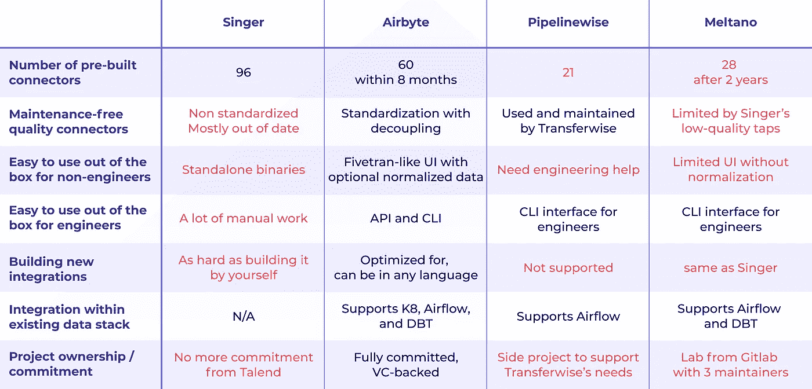
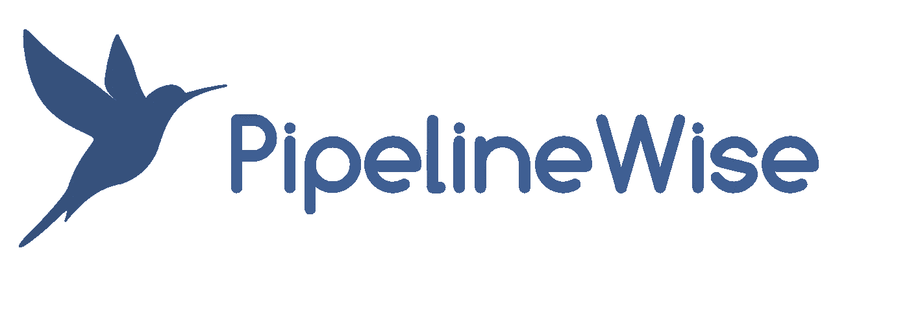

# 开源数据集成和 ETL 的现状

> 原文：<https://towardsdatascience.com/the-state-of-open-source-data-integration-and-etl-d2f2e8733e2a?source=collection_archive---------15----------------------->

图片来自[像素](https://www.pexels.com/photo/person-on-a-bridge-near-a-lake-747964/)上的[西蒙·米加杰](https://www.pexels.com/@simonmigaj)

开源数据集成并不新鲜。它始于 16 年前的塔伦德。但从那以后，整个行业都变了。Snowflake、Bigquery、Redshift 等已经改变了数据的托管、管理和访问方式，同时使之变得更容易、更便宜。但是数据集成行业也在发展。

一方面，新的开源项目出现，如 2017 年的 [Singer.io](http://singer.io) 。这使得更多的团队可以访问更多的数据集成连接器，尽管这仍然需要大量的手工工作。

另一方面，更多的团队(分析师、科学家、商业智能团队)可以访问数据集成。事实上，像 Fivetran 这样的公司受益于雪花的崛起，让非工程团队能够自己建立和管理他们的数据集成连接器，因此他们可以以自主的方式使用和处理数据。

但是即使有了这样的进步，大多数团队仍然在内部构建他们自己的连接器。构建与购买强烈依赖于构建。这就是为什么我们认为是时候重新审视围绕数据集成的开源技术了。

然而，这篇文章的想法来自上周关于 DBT 懈怠的一场精彩辩论。讨论围绕着两件事:

*   Fivetran 的开源替代方案的状态，以及
*   在解决数据集成问题时，开放源码(OSS)方法是否比商业软件方法更为相关。

甚至 Fivetran 的首席执行官也参与了这场辩论。

作者捕获的图像

我们已经在之前的文章中综合了第二点[。在本文中，我们想分析第一点:开源数据集成技术的前景。](https://airbyte.io/articles/data-engineering-thoughts/open-source-vs-commercial-software-how-to-better-solve-data-integration/)

# TL；速度三角形定位法(dead reckoning)

这里有一个总结我们分析的表格。

橙色的是未来几周我们正在 [Airbyte](http://airbyte.io) 建造的东西。

为了更好地理解这个表格，我们邀请您阅读下面我们对景观分析的细节。

# 数据集成开源项目

## 歌手

来自 [Singer.io](https://github.com/singer-io) 的标志，可在 [Apache License 2.0](https://github.com/singer-io/singer-tools/blob/master/LICENSE) 中获得

[歌手](https://singer.io/)于 2017 年推出，是迄今为止最受欢迎的开源项目。它是由 StitchData 发起的，成立于 2016 年。多年来，Singer 支持 96 个点击和目标。

*   **越来越过时的连接器:**Talend(stitch data 的收购方)似乎已经停止了对维护 Singer 的社区和连接器的投资。由于大多数连接器每年都会发生几次模式变化，越来越多的歌手点击和目标没有得到积极维护，正在变得过时。
*   **缺乏标准化**:每个连接器都是自己的开源项目。所以你永远不知道一个水龙头或目标的质量，直到你实际使用它。没有任何保证你会得到什么。
*   **Singer 的连接器是独立的二进制文件**:你仍然需要构建一切来使它们工作。
*   **没有完全承诺开源所有连接器**，因为一些连接器仅由 StitchData 根据付费计划提供。

最后，很多团队会将 StitchData 用于工作良好的连接器，如果不能开箱即用，他们会构建自己的集成连接器。编辑 Singer 连接器并不比自己构建和维护连接器容易。这违背了开源的目的。

## 空气字节

来自 [Airbyte.io](http://github.com/airbytehq/airbyte) 的徽标，在 [MIT](https://github.com/airbytehq/airbyte/blob/master/docs/license.md) 中提供

[Airbyte](http://airbyte.io/) 出生于 2020 年 7 月，所以还是新的。它诞生于对 Singer 和其他开源项目的失望。它是由来自 Liveramp 的数据集成经验丰富的团队构建的，他们单独构建和维护了 1000 多个集成，是 Singer 的 8 倍。到 2020 年底，他们将支持 50 多个连接器，所以仅仅 5 个月的时间。他们的目标是到 2021 年底支持 200 多个连接器。

Airbyte 的使命是将数据集成商品化，为此我们已经做出了几项重大选择:

*   [**Airbyte**](http://airbyte.io) **的连接器可以通过 UI、API 和 CLI 开箱即用，具有监控、调度和编排**。Airbyte 建立的前提是，无论用户的背景如何，都应该能够在 2 分钟内移动数据。数据工程师可能想要使用原始数据和他们自己的转换过程，或者使用 [Airbyte](http://airbyte.io) 的 API 在他们的工作流程中包含数据集成。另一方面，分析师和数据科学家可能希望在他们的数据库或数据仓库中使用规范化的统一数据。 [Airbyte](http://airbyte.io) 支持所有这些用例。
*   **一个平台，一个标准项目**:这将有助于巩固一个单一项目背后的开发，一些标准化和特定的数据协议，可以使所有团队和特定案例受益。
*   **连接器可以用您选择的语言构建**，因为 Airbyte 将它们作为 Docker 容器运行。
*   **将整个平台**解耦，让团队根据他们的需求和他们现有的堆栈(orchestration with Airflow、Kubernetes 或 [Airbyte](http://airbyte.io) 、transformation with [DBT](http://getdbt.com) 或再次 [Airbyte](http://airbyte.io) 等)使用 [Airbyte](http://airbyte.io) 的任何部分。).团队可以使用 [Airbyte](http://airbyte.io) 的 orchestrator，也可以不使用，他们的规范与否；一切都变得可能。
*   对麻省理工学院开源项目的全面承诺，承诺不把一些连接器藏在付费墙后面。

由 [Airbyte](http://airbyte.io) 及其社区支持的连接器数量正在快速增长。他们的团队预计，到 2021 年初，它将超过辛格。注意 [Airbyte](http://airbyte.io) 的数据协议与 Singer 的兼容。因此，将 Singer tap 迁移到 [Airbyte](http://airbyte.io) 上也很容易。

Airbyte 最近还与 Accel 进行了一轮[种子融资。](https://techcrunch.com/2021/03/02/airbyte-raises-5-2m-for-its-open-source-data-integration-platform/)

## 管道式

来自 [PipelineWise 的标志，](https://github.com/transferwise/pipelinewise) [Apache License 2.0](https://github.com/transferwise/pipelinewise/blob/master/LICENSE) 中的

PipelineWise 是 Transferwise 的一个开源项目，主要目标是满足他们自己的需求。他们支持 21 个连接器，并根据母公司的需求添加新的连接器。这个项目没有商业模式，公司对发展社区也没有明显的兴趣。

*   **尽可能接近原始格式:** PipelineWise 旨在以尽可能接近原始格式的方式将数据从源数据复制到分析数据存储中。支持一些小的加载时间转换，但是必须在分析数据存储中进行复杂的映射和连接来提取含义。
*   **托管模式更改:**当源数据更改时，PipelineWise 会检测到该更改，并自动更改您的分析数据存储中的模式。
*   **基于 YAML 的配置:**数据管道被定义为 YAML 文件，确保整个配置处于版本控制之下。
*   **轻量级:**不需要守护进程或数据库设置。
*   **与 Singer 的数据协议兼容:** PipelineWise 使用 Singer.io 兼容接头和目标连接器。新的连接器可以相对容易地添加到管线中。

## 梅尔塔诺

[梅尔塔诺](https://gitlab.com/meltano/meltano)的标志在[麻省理工](https://gitlab.com/meltano/meltano/-/blob/master/LICENSE)有售

[Meltano](http://meltano.com) 是一个致力于数据集成的管弦乐器，由 Gitlab 在 Singer 的 taps 和 targets 之上构建。自 2019 年以来，他们一直在迭代几种方法。他们现在有一个 CLI 优先的项目维护者。两年后，他们现在支持 28 个连接器。

*   **建立在 Singer 的 taps 和 targets 之上:** Meltano 在数据协议方面与 Singer 有相同的限制。
*   CLI 优先方法: Meltano 最初是考虑到命令行界面而构建的。从这个意义上来说，他们的目标似乎是偏爱这种界面的工程师。
*   新的用户界面: Meltano 最近建立了一个新的用户界面，试图吸引更多的观众。
*   **与 DBT 的转换集成:** Meltano 提供了与 [DBT](http://getdbt.com) 的一些深度集成，因此让数据工程团队以他们想要的任何方式处理转换。
*   **与气流** **集成进行编排**:既可以单独使用 Meltano 进行编排，也可以与气流集成；梅尔塔诺双向工作。

# 值得注意的相关开源项目

这里有一些你可能听说过的其他开源项目，因为它们经常被数据工程团队使用。我们认为他们值得一提。

## 阿帕奇气流

我们看到许多团队使用[气流](https://airflow.apache.org/)构建他们自己的数据集成连接器，用于编排和调度。Airflow 并没有考虑到数据集成。但是很多团队用它来构建工作流。Airbyte 是唯一一个提供 API 的开源项目，因此团队可以在他们的工作流中包含数据集成工作。

## DBT

[DBT](http://getdbt.com) 是应用最广泛的数据转换开源项目。您需要精通 SQL 才能正确使用它，但是许多数据工程/集成团队使用它来规范化进入仓库或数据库的原始数据。

Airbyte 和 Meltano 都与 DBT 兼容。Airbyte 将为团队提供在原始数据或标准化数据之间进行选择的能力，以满足数据工程和数据分析师团队的需求。Meltano 不提供规范化模式，完全依赖于 DBT。

## 阿帕奇骆驼

[Apache Camel](https://camel.apache.org/) 是一个开源的基于规则的路由和中介引擎。这意味着您可以在 IDE 中智能地完成路由规则，无论是在 Java、Scala 还是 XML 编辑器中。它使用 URIs 来实现与所有类型的传输和消息模型的集成，包括 HTTP、ActiveMQ、JMS、JBI、SCA、MINA 和 CXF，并使用可插入的数据格式选项。

## 流集

[Streamsets](http://streamsets.com) 是一个数据操作平台，包括一个名为 DataCollector 的低级开源数据收集引擎。这个开源项目没有得到任何社区的支持，主要是由公司用来向他们的企业客户保证，无论发生什么情况，他们仍然可以访问代码。

如果我们错过了任何开源项目或列出的任何有价值的信息，请告诉我们。我们将努力保持这个列表的更新和精确。

*原载于 2020 年 10 月 18 日*[*https://airbyte . io*](https://airbyte.io/articles/data-engineering-thoughts/the-state-of-open-source-data-integration-and-etl/)*。*