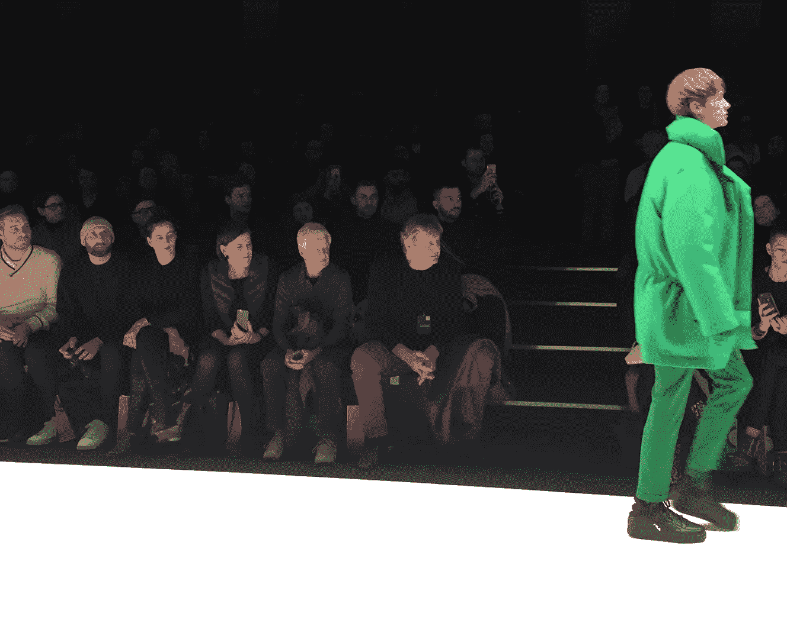
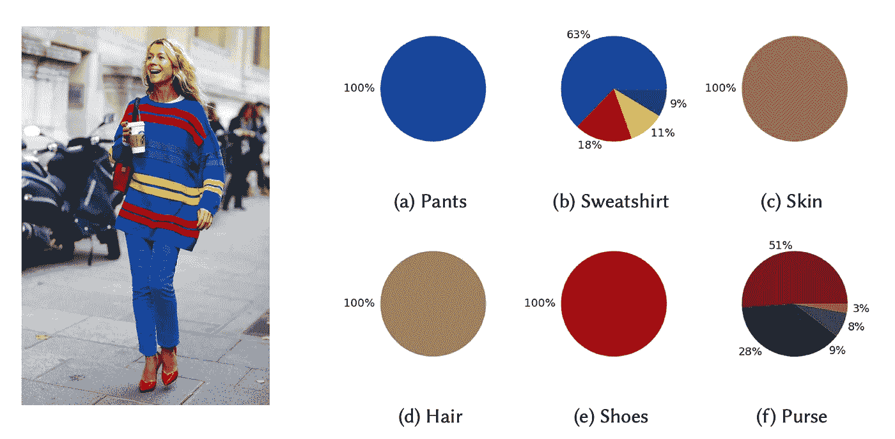
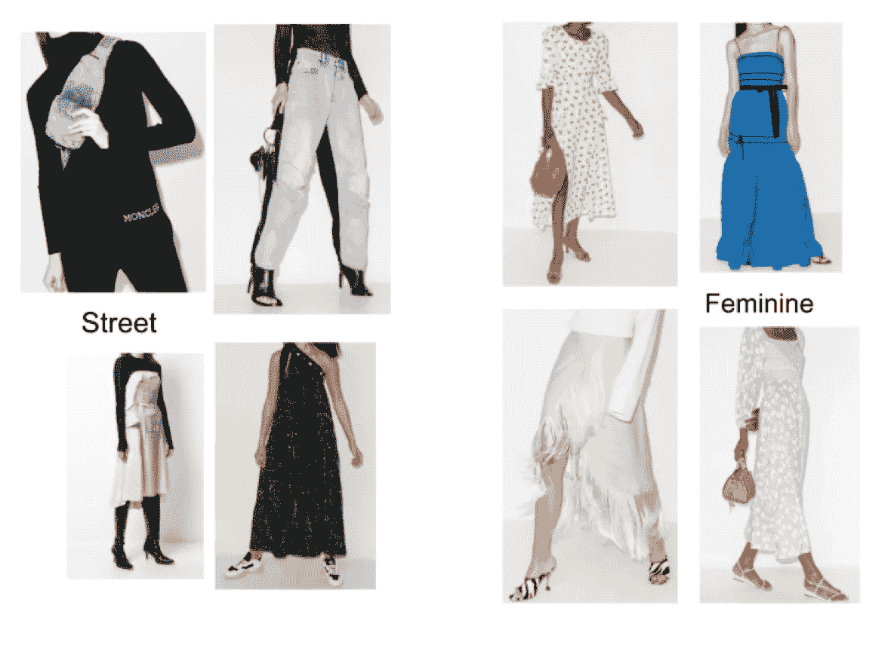
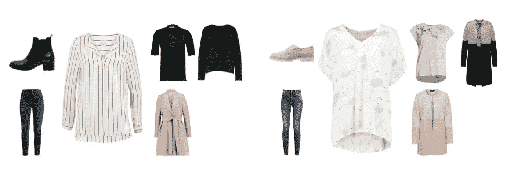

# 2020 年时尚推荐系统的现状

> 原文：<https://towardsdatascience.com/the-state-of-recommender-systems-for-fashion-in-2020-180b3ddb392f?source=collection_archive---------19----------------------->

与第 14 届 ACM 推荐系统会议同期举办的第二届时尚推荐系统研讨会摘要。

2020 年的时尚推荐系统值得期待。(图片由我提供)

## 了解服装可以为推荐服装打下坚实的基础。

颜色是时尚服装最可识别的特征之一，用户经常用它来寻找他们想要穿的衣服——例如，*小黑裙*。在“*服装项目的概率颜色建模”(* [*论文*](https://fashionxrecsys.github.io/fashionxrecsys-2020/workshop-files/papers/fashionxrecsys2020_paper_2.pdf) *)中，作者*提出了一种给定一个人的图像来分割和提取颜色的方法。这种方法有可能增加或替代将时尚产品上传到电子商务目录所需的数据输入过程。

Mohammed Al-Rawi 和 Joeran Beel 从*服装项目的概率颜色建模中提取颜色的示例*

品牌是另一个在购买时尚时引导用户决策的关键因素；由于品牌的亲和力或熟悉度，所有品牌都旨在向消费者展示某种东西。在*“奢侈时尚推荐中品牌亲和力的重要性”* ( [论文](https://fashionxrecsys.github.io/fashionxrecsys-2020/workshop-files/papers/fashionxrecsys2020_paper_15.pdf))中，全球在线时尚零售平台 Fartech 探索了使用最先进的 NLP 算法(Word2Vec、GloVe 和 FastText)从文本和目录中提取数据以产生嵌入。这些被用作推荐系统的提升方法，在在线测试中显示高达 10%的提升。

FarFetch 展示的另一篇有趣的论文是*“用于时尚推荐的用户审美识别”* ( [论文](https://fashionxrecsys.github.io/fashionxrecsys-2020/workshop-files/papers/fashionxrecsys2020_paper_14.pdf))。在这里，作者建议将用户聚类到预先定义的美学组中，这是特别有趣的，因为它通过使用用户-产品交互数据成功地将 FarFetch 编辑行与几个客户组联系起来。这项工作有可能实现更有针对性的广告，在算法的帮助下细化审美群体，甚至为平台上销售哪些服装的策略提供信息。

该图展示了属于街头和女性审美的外观——摘自刘力伟、伊沃·席尔瓦、佩德罗·诺盖拉、安娜·马加良斯和埃德尔·马丁斯的《时尚推荐的用户审美识别》。

## 看到 NLP 领域的进展如何被成功地用于解决尺寸建议的问题是令人耳目一新的。

在“*注意力让你获得正确的尺寸和合身的时装”* ( [论文](https://fashionxrecsys.github.io/fashionxrecsys-2020/workshop-files/papers/fashionxrecsys2020_paper_3.pdf))中，作者解释了如何使用基于注意力的深度学习模型预测尺寸和合身性，将尺寸推荐问题表示为语言翻译问题(在这种情况下，从文章到尺寸)。结果表明，该方法适用于多账户买家的尺码推荐，这是所有时尚电子商务零售平台的一个巨大问题。此外，该方法还能够生成对尺寸预测的解释，这在用户的决策过程中具有说服效果，并且当推荐了错误的尺寸时，可以防止负面的体验或感觉。

在*“服装生成和推荐——一项实验研究”* ( [论文](https://fashionxrecsys.github.io/fashionxrecsys-2020/workshop-files/papers/fashionxrecsys2020_paper_7.pdf)，[演示](https://fashionxrecsys.github.io/fashionxrecsys-2020/workshop-files/presentations/))中，Zalando 提供了几种个性化和非个性化算法的广泛评估，包括最近非常流行的 NLP 架构 Transformer、GPT、伯特、LSTM 的改编。对这些算法进行了离线装备推荐的几个子任务的评估，表明 GPT 模型在装备生成方面优于 BERT，个性化方法优于非个性化方法，以及变压器模型优于被认为是最先进的暹罗网络方法。

由 GPT 模特制作的两套个性化服装，出自 Marjan Celikik、Matthias Kirmse、Timo Denk、Pierre Gagliardi、Duy Pham、萨哈尔·姆巴雷克和 Ana Peleteiro Ramallo 的《服装制作和推荐——实验研究》。

## 在这个复杂的领域，隐含的信号不足以满足顾客的期望

今年在 RecSys，我们看到了一些非常有趣的用户研究，我很高兴看到用户的声音在研讨会上被仔细研究和放大。在*“服装推荐的套装构建挑战:家庭实践调查和服装组合评估”* ( [论文](https://fashionxrecsys.github.io/fashionxrecsys-2020/workshop-files/papers/fashionxrecsys2020_paper_12.pdf)，[演示](https://fashionxrecsys.github.io/fashionxrecsys-2020/workshop-files/presentations/))中，来自[明尼苏达大学可穿戴技术实验室](https://wtl.design.umn.edu/people/) (WTL)的作者研究了哪些因素会影响每天穿衣的决策(即用户如何构建套装)，强调了几个特性——这项工作强调了一个非常有趣的问题。 也就是说，用户似乎永远没有足够的衣服穿，不是因为他们没有足够的衣服穿，而是因为他们不知道如何穿。

“了解专业时装设计师的服装推荐流程”([论文](https://fashionxrecsys.github.io/fashionxrecsys-2020/workshop-files/papers/fashionxrecsys2020_paper_10.pdf)、[演示](https://fashionxrecsys.github.io/fashionxrecsys-2020/workshop-files/presentations/))研究了专业人士(造型师、品牌顾问等)的观点，重点是利用不足的服装对环境造成的影响。作者解释了一个推荐系统，它可以使用服装和用户特征，模仿造型师为客户做出的服装和服装决策，从而增加客户对衣柜的使用。

冷启动问题是推荐系统领域中众所周知的问题。对于时尚界来说尤其有趣，因为每天都有新产品和用户加入。在*“面向认知负荷低的用户在线时尚尺码推荐”*中，作者探索了使用不同类型的明确顾客数据(体重、身高、最大尺寸、肚子形状等)来解决这个问题。作者不仅评估准确性，还评估用户的认知负荷以及对生产环境的适用性。

在关于时尚推荐系统的[研讨会上发表的论文](https://fashionxrecsys.github.io/fashionxrecsys-2020/)回答了该领域中非常重要的问题，如如何利用对时尚的理解(品牌亲和力、颜色或美学)来改善推荐？我们还展示了有趣的工作，展示了推荐系统的最新趋势，如基于注意力的模型，或 NLP 模型可以成功地应用于解决尺寸问题&适合推荐或服装，以及如何从零售商的角度利用或区别专家和用户的经验。毫无疑问，这个领域的规模和成熟度都在增长，我对即将到来的一切感到非常兴奋！