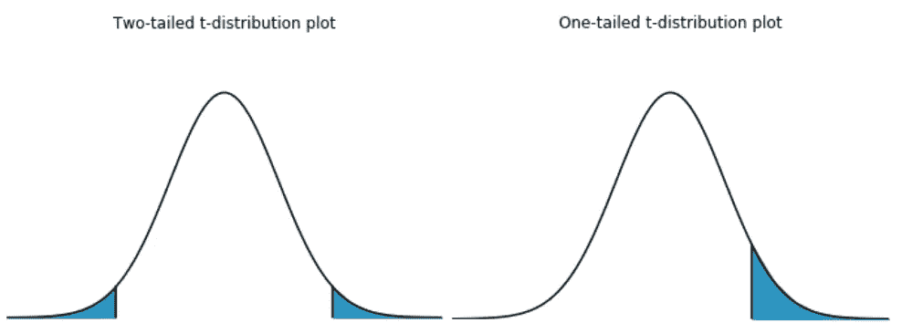
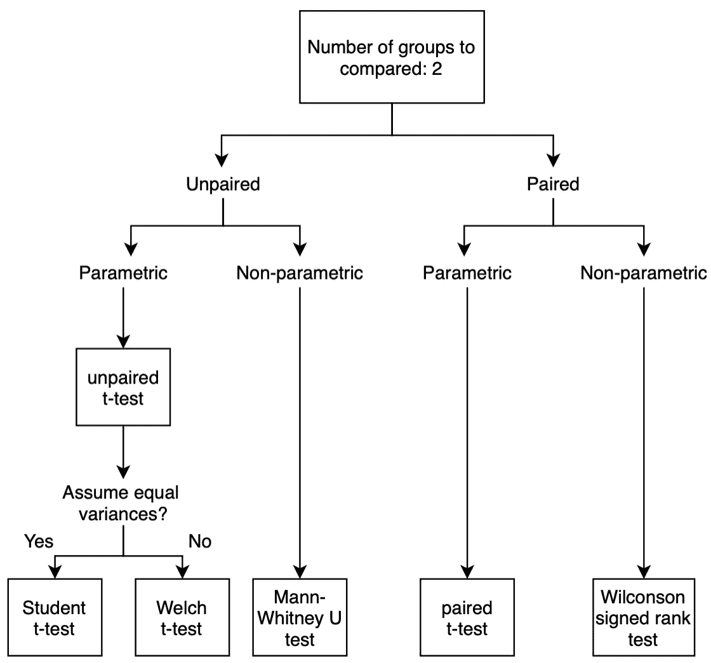
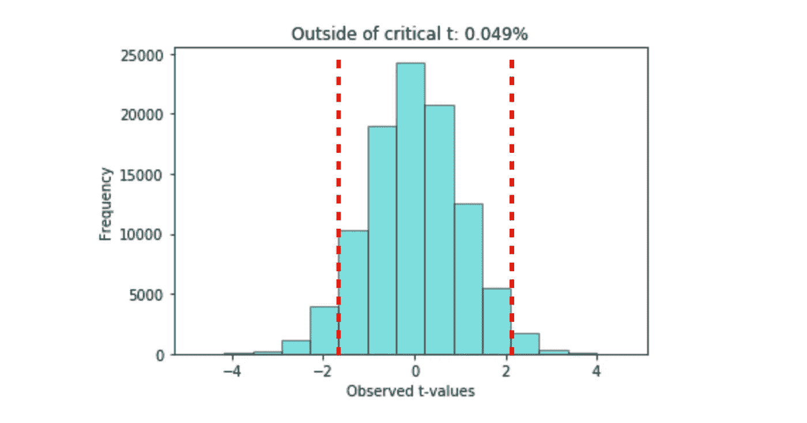
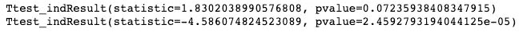
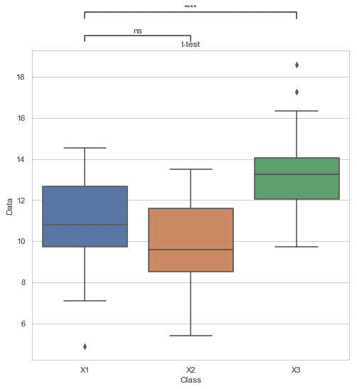

# 为初学者和专家讲解的统计分析 t 检验

> 原文：<https://towardsdatascience.com/the-statistical-analysis-t-test-explained-for-beginners-and-experts-fd0e358bbb62?source=collection_archive---------0----------------------->

照片由[卢卡斯](https://www.pexels.com/@goumbik)在[像素](https://www.pexels.com/photo/chart-close-up-data-desk-590022/)上拍摄

在过去的几个月里，我可能已经运行了几十次 t 检验，但最近我意识到我没有完全理解一些概念，例如为什么不可能接受零假设，或者 t 表中的数字来自哪里。在做了一些研究后，我发现一些文章提供了这些答案，但没有多少文章将所有的信息收集在一起。

因此，我决定写这篇文章来一步一步地解释 t-test，这样任何人在运行测试或回顾概念时都可以使用它作为参考。

根据您的水平，我建议:

## 对于初学者:

> 仔细阅读整篇文章。

## 对于专家:

> 阅读第三部分(T 型测验的类型)，第四部分(什么是 T 型分数？)和第 6 节(多重比较问题)。

# **1。什么是 t 检验？**

假设你正在进行一项实验，你想比较两组人，并量化他们之间的差异。例如:

*   比较一个国家的人是否比另一个国家的人高。
*   比较一个人的大脑在看快乐电影时是否比看悲伤电影时更活跃。

这种比较可以通过进行不同的统计分析来进行分析，比如本文中描述的 t 检验。

那么，什么是 t 检验呢？这是一种推断统计[类型，用于研究两组之间是否存在统计差异。在数学上，它通过假设两个分布的平均值相等来建立问题(H₀: ₁= ₂).)如果 t 检验拒绝了零假设(H₀: ₁= ₂)，则表明这些组很可能是不同的。](https://www.investopedia.com/terms/s/statistics.asp)

当小组有 20-30 个样本时，应实施该测试。如果我们想要检查更多的组或更大的样本量，还有其他比 t 检验更准确的检验，如 z 检验、卡方检验或 f 检验。

> **重要**:t 检验拒绝或未能拒绝零假设，从不接受。

# 2.什么是 p 值和临界值？

[p 值](https://en.wikipedia.org/wiki/P-value)和[临界值](https://en.wikipedia.org/wiki/Critical_value)在维基百科中定义为:

> ***【p】*-值**或**概率值**是在假设零假设为真的情况下，获得至少与测试期间实际观察到的结果一样极端的测试结果的概率。此外，还有测试的力量，定义为当 nll 假设为假时拒绝该假设的概率。
> 
> 统计测试的**临界值**是测试接受区域的边界。

p 值是允许我们拒绝零假设(H₀: ₁= ₂)的变量，或者换句话说，允许我们确定两组是不同的[ [1](https://www.statsdirect.com/help/basics/p_values.htm) ]。然而，由于 p 值只是一个值，我们需要将它与临界值进行比较(⍺):

*   **p_value >** ⍺ **(临界值)**:未能拒绝统计检验的零假设。
*   **p_value ≤** ⍺ **(临界值)**:拒绝统计检验的零假设。

大多数统计学家选择的临界值是⍺ = 0.05。这个 0.05 意味着，如果我们运行这个实验 100 次，5%的时候我们能够拒绝零假设，95%的时候我们不能。

此外，在某些情况下，统计学家选择⍺ = 0.01。将临界值从 0.05 降低到 0.01 会降低假阳性(称为 I 型错误)的几率，但也会使拒绝零假设变得更加困难。因此，临界值为 0.01 时，结果更可信，但也更难获得。

*   p_value > 0.1:无证据
*   p_value 在 **0.05** 和 0.1 之间:弱证据
*   **0.01** 和 **0.05** 之间的 p _ 值:证据
*   p_value 在 0.001 和 **0.01** 之间:强证据
*   p_value < 0.001: Very strong evidence

> **重要**:始终需要上报 p 值和临界值。

统计检验可以是[单尾或者双尾](https://en.wikipedia.org/wiki/One-_and_two-tailed_tests)。不同的是另一个假设，如下所示。

双尾和单尾检验

**一个** - **尾检验**适用于特定方向上的组间差异 [2](https://stats.idre.ucla.edu/other/mult-pkg/faq/general/faq-what-are-the-differences-between-one-tailed-and-two-tailed-tests/) 。它比**双尾检验**更不常见，所以本文的其余部分集中在这一个上。

# 3.t 检验的类型

根据对分布的假设，有不同类型的统计检验。

在决定您必须实现的测试类型时，您必须分析的假设是:

*   **配对或非配对**:两组数据是否来自同一参与者。
*   **参数或非参数**:数据是否按某种分布分布。

统计检验类型流程图

有三种类型的 t 检验:

*   **一个样本 t 检验**(图中未显示)
*   **不成对双样本 t 检验**(如图所示)
*   **配对样本 t 检验**(如图所示)

如上所述，使这些 t 检验不同于其他检验的差异是我们实验的假设:

1.  数据必须遵循连续或有序的尺度。
2.  数据必须随机选择。
3.  数据应该是[正态分布](https://www.analyticsvidhya.com/blog/2017/09/6-probability-distributions-data-science/)。

如果您不确定要实施哪种测试，我建议您查看网页 [Laerd Statistics](https://statistics.laerd.com/) 。然后，如果您感兴趣，Ref [ [3](https://lizthielen3.weebly.com/two-sampled-t-test-means.html) ]包含要比较的组的数量高于三个时的流程图。最后，ref [ [4](http://www.statstutor.ac.uk/resources/uploaded/tutorsquickguidetostatistics.pdf) ]是一个很好的导师指南，可以帮助你了解更多常用的统计测试。

# 4.t 分是什么？

t 分数是标准化测试统计数据的一种形式。t-score 公式使我们能够将分布转换成标准化形式，我们用它来比较分数。

韦尔奇 t 检验的 t 分数公式为:

在这个公式中，t 是 t 值，x₁和 x₂是被比较的两组的平均值，s₁和 s₂是两组的标准误差，n₁和 n₂是每组的观察次数。

一旦我们有了 t 值，我们必须查看 [t 表](https://www.gradecalculator.tech/t-table/)。如果我们的 t 值的绝对值高于表中的值，我们可以拒绝零假设。

在[表](https://www.gradecalculator.tech/t-table/)中查看的参数有:

*   **累积概率**或随机变量的值落在指定范围内的概率。
*   单尾或双尾，取决于您正在运行的统计分析。
*   **自由度数量**指的是**T5 数据样本中逻辑独立值的最大数量。[用于查找 *t‐* 值的自由度参数是*n₁*–1 和*n₂*–1](https://www.cliffsnotes.com/study-guides/statistics/univariate-inferential-tests/two-sample-t-test-for-comparing-two-means)中的较小者。**

但是，这些数字意味着什么呢？数字表示当零假设为真时观察到的 t 值的分布。

为了更详细地解释这一点，我找到了一个有趣的[博客](https://jimgrange.wordpress.com/2015/12/05/statistics-tables-where-do-the-numbers-come-from/)，我试图用 Python 代码复制它的解释。这是通过运行 100000 次迭代计算的 t 值直方图，两个随机正态分布各有 30 个样本，具有相同的平均值和相同的标准差。

有 30 个数据的两个正态分布的 t 检验分布

对于 30 个样本、双尾和⍺为 0.05 的两个分布， [t 表](http://www.ttable.org/)中的 t 值是 2.043。上下的数据数，既然我们做的是双尾，就是≅5%.该数字与选定的临界值相匹配。

# 5.实验

最后，所有解释的理论都可以用 Python 中的几行代码运行。以下是三种正态分布的统计分析结果。

正态分布 X1 ( =10，σ=2)、X2 ( =10，σ=2)和 X3 ( =14，σ=2)的声明

*   **X1 和 X2** : p_value = 0.15
*   **X1 和 X3** : p_value < 1.00e-04

三个正态分布 X1、X2 和 X3 的统计结果图

# 6.多重比较问题

读完这篇文章后，你可能想知道当我们在同一个实验中运行几个测试时会发生什么，因为最终，我们将能够拒绝零假设，即使两组是相似的。这就是众所周知的多重比较问题，它也被很好地研究过。如果你感兴趣，我在另一篇文章中写了这个问题。

 [## 多重比较问题概述

### 本文提出了多重比较问题，介绍了问题，描述了可能的更正和…

towardsdatascience.com](/an-overview-of-the-multiple-comparison-problem-166aa5fcaac5) 

***如果你喜欢这个帖子，请考虑*** [***订阅***](https://javiferfer.medium.com/membership) ***。你将获得我所有的内容+所有其他来自牛逼创作者的文章！***

# 7.参考

[1]直接统计， [p_value](https://www.statsdirect.com/help/basics/p_values.htm) 。

【2】数字研究与教育研究所，[单尾和双尾测试有什么区别？](https://stats.idre.ucla.edu/other/mult-pkg/faq/general/faq-what-are-the-differences-between-one-tailed-and-two-tailed-tests/)。

[3] Liz Thiele，[双样本 t 检验为手段](https://lizthielen3.weebly.com/two-sampled-t-test-means.html)。

[4] Statstutor，[统计导师常用统计测试快速指南](http://www.statstutor.ac.uk/resources/uploaded/tutorsquickguidetostatistics.pdf)。

【5】栈交换，[为什么归一化的 z 值要引入平方根？](https://math.stackexchange.com/questions/845769/why-does-the-normalized-z-score-introduce-a-square-root-and-some-more-confusio)

[6]波兹曼科学，[学生的 t 检验](https://www.youtube.com/watch?v=pTmLQvMM-1M)，Youtube。

[7]威尔·科尔森，[统计显著性解释](/statistical-significance-hypothesis-testing-the-normal-curve-and-p-values-93274fa32687)，中等