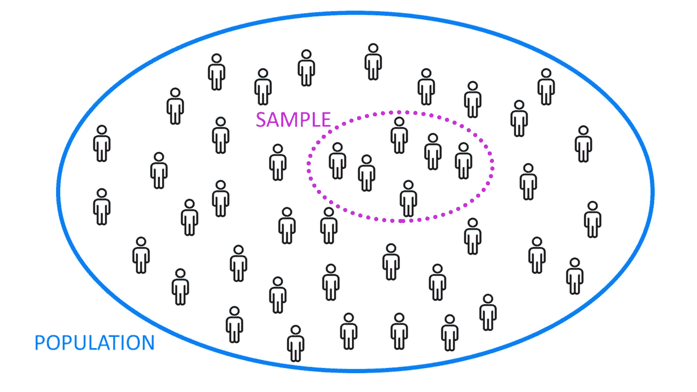
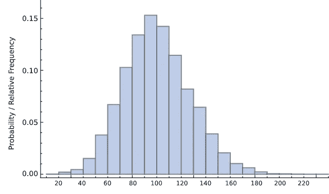
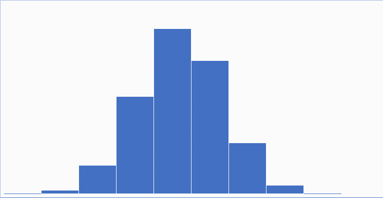
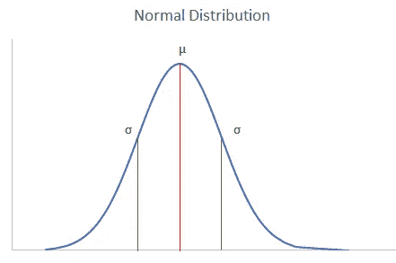
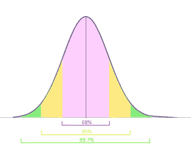
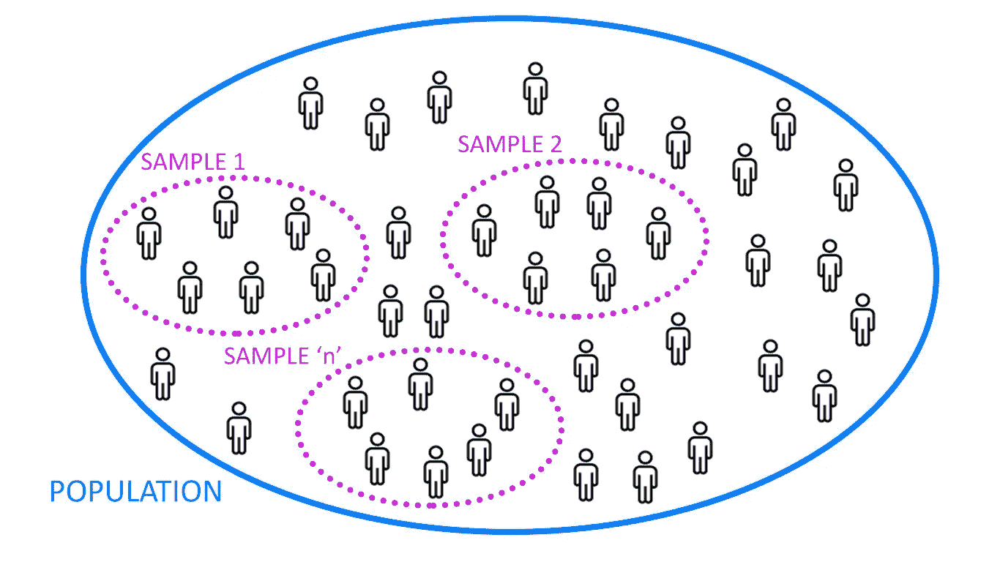
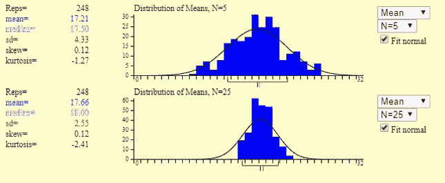
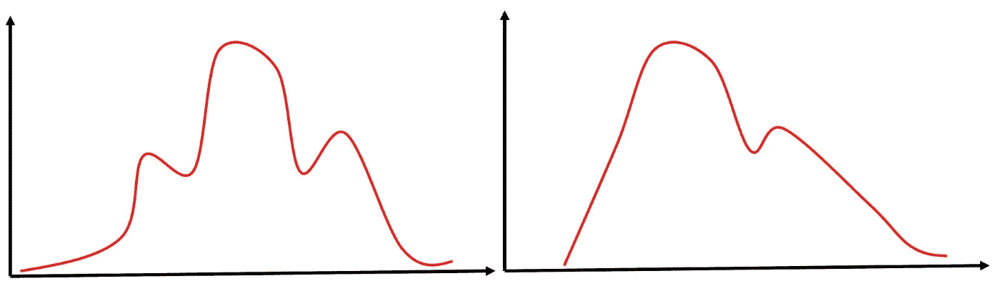

# 改变世界的统计发现

> 原文：<https://towardsdatascience.com/the-statistical-discovery-that-turned-around-the-world-4f709bc5e0c2?source=collection_archive---------53----------------------->

## 以中心极限定理为特征

照片由[帕万普里特](https://www.linkedin.com/in/pawanpreet/)拍摄

> 随着人类步入**先进超智能科技**时代，几个领域正以前所未有的速度蓬勃发展。一个这样的领域是数据科学，它经常使用非常基本和深刻的概念**中心极限定理** (CLT)。

当我开始探索数据科学时，我想知道对 CLT 的大肆宣传是不是真的？这真的是一个令人难以置信的发现吗？随着我越来越深入这个领域，我找到了这个问题的答案，你们中的许多人肯定也遇到过这个问题。但是，要找到答案，重要的是要理解什么是 CLT 以及它传达了什么。你不需要任何深入的统计学知识来理解这篇文章。如果你知道什么是均值、方差和标准差，你就可以开始了。如果没有，我会说只要谷歌一下这些术语，你就会理解这篇文章的主旨。

在我们理解 CLT 之前，熟悉一些构成其基础的基本概念是很重要的。那么让我们从**总体**和**样本**开始。

# **什么是人口？**

这些术语没有什么奇特之处。假设我们想知道一个成年印度人的平均工资是多少。你去询问每个印度成年人，即大约 7.7 亿人，并计算他们的平均工资。在这种情况下，我们观察了整个“**群体”**，没有一个人被遗漏。因此，我们可以说**总体包括了构成一组数据的所有可能元素**。

群体的可测量特征，如平均值或标准差，被称为**参数**。

我们用𝝁表示总体均值，用𝞼表示总体标准差

作者图片

# **样品呢？**

好了，既然我们已经定义了什么是群体，我想我就不必解释为什么在实际情况下不可能观察整个群体。因此，我们了解人口的最好方法是从人口中随机抽取一群人。这个**随机**组被称为样本。我把注意力集中在单词**【随机】**上，因为这是至关重要的，样本中的所有 **n** 对象都有同等的可能性被选中。想象一下，如果我的样本由一群在谷歌、微软、脸书等公司工作的软件工程师组成。这不会是全部人口的精确代表。在这种情况下，我们将得到一个有偏差的样本。这种情况是不可取的。

样本的可测量特征，如平均值或标准偏差，称为**统计量**。
我们用 **X̄** 表示样本均值，用 **S** 表示样本标准差。

太好了！
现在到了形成 CLT 基础的最重要概念的时候了:

# 正态分布:

在现实生活中，数据科学家正在处理海量数据。在图表上绘制数据使理解和定义测量其属性(如平均值、方差等)的技术变得容易。
要理解正态分布，重要的是我们要理解图形是如何绘制出它们的相对频率的。下面的直方图是针对美国 200 名软件工程师的随机样本绘制的。x 轴显示以千美元为单位的工资区间，y 轴显示每个区间的相对频率(或概率)。

作者照片

0 这里需要注意的是，这只适用于小数据集。当我们处理具有数百万条目的较大数据时，间隔变得越来越小。有一段时间，间隔变得相对很小，以至于可以看作是一条曲线。看看下面的动画:

作者制作的动画

您在动画结尾看到的曲线是分布的可视化，其中数据点可以采用任何连续值。这条曲线称为密度曲线，分布称为**正态分布(**或**高斯分布**或**钟形曲线)**。它有许多独特而有用的特性。宇宙中很多现象都遵循这个分布。要凭直觉理解为什么分布形状是这样的，可以这样看:一个班里很少有学生得分很低，很少有人得分很高。学生成绩呈正态分布。类似地，在许多其他情况下，异常高或异常低的值(称为异常值)是罕见的，而大多数数据是对称分布的钟形。

让我们来看看正态分布的一些重要性质:

*   正态分布关于其平均值()是对称的，表明靠近**平均值**的数据比远离**平均值**的数据出现得更频繁。这就是为什么在图表形式中，**正态分布**会呈现为钟形**曲线**的原因。

**=均值**和 **𝞼** **=标准差(**照片由 [Pawanpreet](https://www.linkedin.com/in/pawanpreet/) **)**

*   对于正态分布的数据集，均值、中位数模式是相等的(与位于相同的值上)
*   大约 68%的数据位于平均值的 1 个标准偏差内
*   大约 95%的数据位于平均值的 2 个标准偏差内

照片由[帕万普里特](https://www.linkedin.com/in/pawanpreet/)拍摄

> 这些性质使得正态分布非常有用。在我看来，正态分布是一个神奇的工具。这种魔力主要是因为魔术师:

# **中心极限定理:**

正如我们到目前为止所做的那样，我们应该用一个例子来理解这个主题。考虑一个大型数据集:印度人口。假设我们想计算印度人的平均身高。嗯，正如我们已经讨论了总体的概念，我们不能观察每个数据点并计算其平均值。但是，我能问你的是从人群中收集样本大小= 5 的随机样本(即，从人群中随机选择 5 个人并测量他们的身高)。那很容易，不是吗？假设现在有 250 人正在阅读这篇文章，所有的读者收集了一个样本大小= 5 的随机样本。所以，现在我们有 250 个样本，样本量= 5。

作者图片

太好了！现在，计算每个样本的平均值将得到 250 个样本平均值。现在，如果我们在频率分布上绘制这 250 个平均值，这就是我们得到的结果:

通过[在线状态手册](http://onlinestatbook.com/stat_sim/sampling_dist/)进行模拟

希望你能看到逼近的正态分布。
另一个有趣的结果是，上述样本均值分布的均值( **X̄** )接近总体 mean(𝝁).这意味着不需要分析整个人口，我们就可以估计人口的平均值。

如果我们将每个随机样本的大小从 5 个增加到 25 个，看看模拟结果是什么样的:

通过[在线状态手册](http://onlinestatbook.com/stat_sim/sampling_dist/)进行模拟

是的，更正态的分布(即数据点与平均值的偏差更小)！！！随着个体样本量的增加，这种分布变得越来越正常。(注意，我们没有增加随机样本的数量，即文章的读者数量是相同的，但现在每个读者收集的是大小为 25 的**样本，而不是 5 个**)。每次我们对任何数据集按照上述步骤，样本均值的分布总是正态分布！
多么美妙的结果！

上图所示样本的均值分布称为样本均值的抽样分布( **X̄** )。

在结束之前，我应该向您展示当图接近完美的正态分布时的最终模拟:

当样本数量增加到 10248 时，观察左侧的“Reps”

从上述结果可以清楚地看出，当样本量= 25 时，样本均值的抽样分布比= 5 时更正态。

CLT 的美妙之处在于，它甚至适用于非正态分布的人口。人口可能看起来像这样:

作者图片

或者实际上，任何你能想象的东西。关键是，我们不需要知道人口发生了什么，但我们仍然有能力研究它。

最后，是时候用正式语言来精心制作**中心极限定理了。**

> 根据 Investopedia 的说法，中心极限定理(CLT)指出，随着样本大小变大，样本均值的分布接近正态分布(也称为“钟形曲线”)，假设所有样本的大小都相同，无论人口分布的形状如何。

当我第一次看到这个结果时，我有一些复杂的感觉，因为这是一个美丽的结果，但是，这是否每次都有效呢？所以我在下面给了一个我用过的模拟的链接。你应该去模拟不同的人口分布，不同的样本大小，我相信你会喜欢它！

> 模拟源:[http://onlinestatbook.com/stat_sim/sampling_dist/](http://onlinestatbook.com/stat_sim/sampling_dist/)

前进到采样分布的属性:

*   分布的总体形状是对称的，近似正态分布。
*   总体模式中没有异常值或其他重要偏差。
*   分布的中心非常接近真实的人口平均数:

> 人口平均数𝝁 =样本平均数( **X̄** )

*   统计数据的抽样分布的标准偏差被称为该数量的标准误差。对于样本随机的情况，标准误差为:

> SE = S/ √n

# 中心极限定理的应用；

最后，是时候看看这个发现是如何以及为什么让我们的生活变得如此轻松了:

1.  如果总体分布未知或不正态(这在大多数情况下是真实的)，根据 CLT，我们认为样本分布是正态的。这种方法假设抽样分布是正态分布的，这有助于通过构建置信区间(我们可以有多确信地假设某个结果是真实的)等方法来分析数据。
2.  CLT 最常见的应用之一是在选举后民意调查中。计算在新闻中被视为置信区间的支持候选人的人的百分比。
3.  为了更准确地估计总体均值，我们可以增加从总体中抽取的样本，这将最终降低样本均值偏差。

列出每一个用例就像数天上的星星一样。所以我会停止我的案子！

恭喜你坚持到最后！你做得很好。不断学习，为媒体社区和数据科学领域做出贡献。干杯！！！