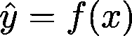
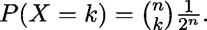
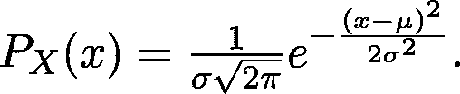
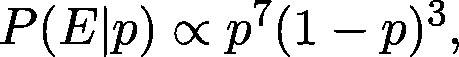
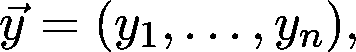
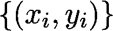

# 机器学习的统计基础

> 原文：<https://towardsdatascience.com/the-statistical-foundations-of-machine-learning-973c356a95f?source=collection_archive---------4----------------------->

## 超越函数拟合的视角

开发机器学习算法比以往任何时候都容易。有几个高级库，如 TensorFlow、PyTorch 或 scikit——学习构建，由于许多有才华的开发人员的惊人努力，这些真的很容易使用，只需要对底层算法略知一二。然而，这是以深刻理解为代价的。没有适当的理论基础，人们很快就会被复杂的技术细节弄得不知所措。

我的目的是展示当我们有适当的视角时，机器学习中看似晦涩和特别的方法如何能够用真正简单和自然的想法来解释。我们的数学工具是概率论和统计学，它们是预测模型的基础。使用概率理论不仅仅是一个学术练习，它实际上可以提供对机器学习如何工作的非常深刻的见解，给你提供改善艺术状态的工具。

在我们开始机器学习的理论基础之旅之前，让我们看一个玩具问题！

# 拟合模型

假设我们有两个数值，比如说 *x* 和 *y* ，它们是相互关联的。例如， *x* 是一处房产的面积， *y* 是该房产在特定城市的市场价格。我们的目标是从 *x* 预测 *y* 。在数学术语中，我们可以说我们正在寻找一个函数 *f(x)* 使得

尽可能地接近事实。最简单的假设是函数是线性的，即对于某些 *a* 和 *b* 常数， *f(x) = ax + b* 。令人惊讶的是，这个模型非常适合许多现实生活中的问题，此外，它还是更复杂的模型(如神经网络)的基本构件。

我们的示例数据集如下所示。

假设我们的数据集由数据点和观察值组成

因为数据是有噪声的，所以不可能用线性模型来拟合我们的数据

保持。相反，我们测量特定模型与数据的拟合程度，并根据测量结果尝试找到最佳拟合。

通常，这是通过计算每个点的预测误差，然后平均逐点误差来实现的。误差越低，我们的模型越好。衡量这一点的最简单的方法是取预测和现实之间的差值的平方。这称为均方误差，定义如下

最佳拟合是均方误差最小的拟合，或者用数学术语来说，

对于我们的具体数据集，如下所示。

拟合回归模型

对于我们的目的来说，如何最小化这一点并不特别重要。对我们来说，重要的是如何解释这个模型，以及它传达了什么样的信息。光看一眼，就能看出少了很多东西。当然，数据明显遵循线性趋势，但这能用我们的模型描述吗？一个函数是确定性的:你代入 *x* ，你得到预测 *f(x)* 。然而，数据似乎显示了一些噪声，这些噪声显然没有被我们的线性模型恰当地捕捉到。

我们还可以去哪里看看？一个显而易见的答案是寻找一个更复杂的函数，比如一个更高次的多项式。用数学术语来说，我们在寻找一个由下式定义的函数

这有望更精确地描述数据。不幸的是，事实并非如此。

用 30 次多项式拟合我们的训练数据

当我们试图强行使用它并过度增加我们模型的表达能力时，我们会看到在某种意义上，事情变得更糟:我们所关心的问题没有得到解决，并且引入了其他问题，比如模型在我们领域之外的疯狂行为。我们必须从其他方面寻找解决办法。我们不应该寻找一个单一的值作为预测，我们应该致力于一个模型来解释某些结果的概率！这样，我们可以做出更明智的决策，例如计算风险。

# 概率论的语言

假设我有一枚硬币，在抛硬币时，有 1/2 的概率正面朝上，有 1/2 的概率反面朝上。如果我掷硬币 100 次，我会得到多少个头？快速回答 50 可能很有诱惑力，但现实并非如此简单。看，你可以得到从 0 到 100 的任何数量的头像，但是这些头像的概率并不相等。在一个实验中，你可能得到 34，在下一个实验中，52，等等。正面为 1/2 的概率意味着，如果你继续无限地投掷硬币，正面与所有投掷的比例将越来越接近 1/2。

让我们坚持抛硬币的例子 *n* 次！假设 *X* 表示人头数。X 是一个随机变量，我们不知道它的确切值，只知道它取给定值的概率。 *X* 为 *k* 的概率用 *P(X = k)* 表示，它总是一个介于 0 和 1 之间的数。此外，因为我们知道我们可以得到 0、1、2 等等，直到第 *n* 个头，这些概率总和为 1，也就是说，

每个实验都可以用一个*n*-长序列的 *H* -s 和 *T* -s 来描述。为了计算给定的 *k* 的确切概率，我们需要计算在 *n* 次投掷中有多少种方法可以让 *k* 正面朝上。这在数学上等同于从一组 *n* 元素中选择一个 *k* 元素的子集，这可以在

方法。而且，每个配置都有 *(1/2)^n* 的概率。(比如考虑 *n = 3。配置 *HTH* 具有 1/8 的概率，因为每个特定的投掷本身具有 1/2 的概率，并且投掷是独立的。)所以把这些放在一起，我们有*

这些数字统称为实验的概率分布。(这是投掷 n 枚硬币并观察其中人头的数量。)

总而言之，概率分布包含了实验结果的所有信息。我们在上一节中的模型只给出了一个数字，但是，我们应该寻找一个概率分布，而不是做出一个完全知情的决定。

## 一般伯努利分布和二项式分布

我们上面两个例子可以推广。首先，假设我们抛一个不公平的硬币，即正面和反面概率不相等的硬币。比如说，人头的概率是 *p* ，和以前一样用 *X* 表示人头的数量。(可以是零也可以是一。)

称为带参数 *p* 的伯努利分布，简称*伯努利(p)* 。按照这种思路，如果我们把这个不公平的硬币抛了 n 次，我们就有了

这就是所谓的参数为 *n* 和 *p* 的二项分布，简称为 *b(n，p)* 。注意，伯努利分布就是 *n = 1* 的二项式分布。

## 连续概率分布

在前面掷硬币的例子中，对于所有可行的 *k* ，概率分布完全由数字 *P(X = k)* 来描述。这个特殊的随机变量只能取整数作为它的值，它的值有无数个。这样的随机变量叫做*离散的*。但是前一个例子呢，我们估计了房地产价格？一般来说，随机变量也可以假设所有的实数作为它的值。在这种情况下，它们被称为*连续*。比如说 *X* 可以是 0 到 1 之间任意一个概率相等的随机数。它的概率分布是怎样的？直觉上，我们可以看到

对于*【0，1】*中任意固定的 *x* 。那么，我们该如何描述这种分布呢？我们用所谓的概率密度函数(简称 PDF)，描述的是 *X* 落入某个区间的概率，比如说 *a ≤ x ≤ b* 。概率本身可以通过测量 *a* 和 *b* 之间的 PDF 曲线下的面积来计算。在从 0 到 1 之间选择一个随机数的情况下，我们有

对于密度函数。注意，密度函数图下的总面积始终是 *1* ，因为它表达了所有结果的概率。

## 正态分布

一个非常重要的连续分布就是所谓的正态分布。(或者另一个名字叫高斯。)你肯定在某个时候遇到过这种情况，即使你可能不知道这是一个正态分布。我们说 *X* 正态分布，均值μ，方差σ方差，或者说 *N(μ，σ )* 简而言之，如果它的密度函数为

这在现实生活中经常出现，比如人的身高往往呈现这种分布。我们将在以后的旅程中多次遇到这种情况。平均值描述了钟形曲线的中心。

在符号方面， *N(μ，σ )* 的概率密度函数通常表示为 *N(x | μ，σ )* 。我们稍后会用到它。

## 条件概率

现在让我们考虑一个不同的例子。我们不再扔硬币，而是用一个六面骰子来扔。如果我们用 *X* 表示投掷的结果，有理由假设

假设你想打个赌。你的朋友掷骰子，如果结果小于或等于 3，你就赢了。否则，你会损失相同的金额。很容易看出，默认情况下，你的中奖概率是 1/2。然而，你的朋友在掷骰子后告诉你结果是偶数。你现在赢的机会有多大？直觉上感觉你现在胜算更低了，因为只有 2 才能赢，4 或者 6 就输了。因此，实验的附加信息改变了潜在的概率分布。

这个概念在数学上可以形式化为*条件概率*。假设你有两个事件， *A* 和 *B* 。在我们的具体例子中， *A* 是投掷的结果小于或等于 3，而 *B* 是投掷的结果是偶数。已知 *B* 已经发生的 *A* 的概率称为已知 *B* 的 *A* 的条件概率。用 *P(A | B)* 表示，可计算如下

在我们这里， *P(A 和 B) = 1/6* ，而 *P(B) = 1/2* ，所以我们的胜算是 *P(A | B) = 1/3* 。

## 机器学习的统计基础

为了了解条件概率如何符合我们的机器学习观点，我们需要进行另一次概念上的跳跃。让我们再来看一遍掷硬币的例子！然而这一次，硬币是不公平的，所以正面的概率不是 1/2。让我们假设

对于*【0，1】*中的某些 *p* 。问题是，我们不知道它的确切值，我们只能从数据中猜测。换句话说，我们要估计它的概率分布。 *p* 是我们抛硬币实验中的一个参数。(为了清楚起见，我们这里有两个分布:一个描述了掷硬币的结果，而第二个描述了我们对给定硬币正面概率的信念。)

假设我们手中有一枚特定的硬币，我们把它抛向空中十次，得到结果

也就是三尾七头。用概率的语言，让 *E* 来描述“十个中有七个人头”的事件。所以，我们真正想要的是

这被称为*后验*，因为它描述了我们在观察一些数据后对硬币的看法。注意，这是一个连续的概率分布，因为 *p* 可以取 0 到 1 之间的任何值。我们该如何计算呢？条件概率的一个基本性质在这里派上了用场。如果 *A* 和 *B* 是一般事件，那么

换句话说，以 *B* 为条件的 *A* 的概率，可以用以 *A* 为条件的 *B* 的概率来表示。这被称为贝叶斯定理，它同样适用于概率密度函数。这对我们有什么帮助？现在我们有了

这对我们来说太好了！这里有三个组成部分。

i) *P(E | p)* ，称为*可能性*。这很容易计算，我们在上一节中已经计算过了。在我们当前有七个头的例子中，我们有

这意味着它们彼此成比例，也就是说，在乘法常数之前相等。这个常数对我们来说并不重要，原因将在后面解释。

ii) *P(p)* ，称之为*先于*，是因为表达了我们在观测到任何数据之前对硬币的认识。合理的假设是每个参数都是同等可能的，所以

我们已经很熟悉了。

iii) *P(E)* ，不需要计算，因为函数 *P(p | E)* 下的面积始终为 1。(在大多数情况下计算 *P(E)* ，这甚至是计算上难以处理的。)因为这个确切的原因，我们并不真正关心似然函数中的乘法常数。

从这些，我们可以很容易地对 *p* 的概率分布给出一个很好的估计，它描述了一次抛硬币导致正面的概率。

抛硬币十次后，p 的后验分布，得到七个正面和三个反面。

## 最大似然估计

即使我们有一个概率分布，提供一个具体的数字作为我们的估计通常是有用的。在这种情况下，我们希望对硬币正面朝上的概率进行参数估计。虽然贝叶斯路线很容易抛硬币，但它不可能进行分析计算。有人可能会问:根据我们观察到的结果，哪个参数最有可能？如果你仔细想想，这是由似然函数描述的

其中 *E* 描述了事件*hhthththht*。我们通过将我们一起观察到的事件的概率相乘来计算。

总的来说，如果我们有观察

有结果

为便于记记，似然函数以向量形式书写，定义如下

它是变量θ的函数。θ表示概率分布的所有参数，因此它甚至可以是标量或向量变量。在我们重复掷硬币的例子中， *Y* -s 表示第 *i* 次掷硬币实验，而 *y* 表示结果。这里， *y* 是 1 代表正面，0 代表反面。还要记住，一般来说， *Y* 可以是离散的，但也可以是连续的。

直觉上(这是我们经常使用的一个短语:)，似然函数假设其最大值的特定θ值将是我们参数估计的合理选择。这种方法被称为*最大似然估计*或简称 MLE。用数学术语来说，

在上面七头三尾的具体例子中，这是 0.7。虽然最大似然法不如完全贝叶斯法可取，但它通常是合理的。注意，当先验分布均匀时，MLE 等价于通过最大化后验分布来估计参数

后者被称为*最大后验估计*或简称 MAP。

有了所有这些数学工具，我们就可以重温最初的回归例子了！

## 回归再探

概括地说，我们有观察

我们想从 *x* -es 预测 *y* -s。之前，我们在寻找一个函数 *f(x) = ax + b* 这样

相当接近真实情况。

这一次，我们从概率的角度来看！现在我们有了数据点

来自发行版

对于每个数据点，我们都有基本事实观察

来自发行版

假设所有的 *Y* -s 都可以建模为正态分布 *N(μ(x)，σ(x) )* 是合理的。为了简单起见，我们可以假设方差是常数，并且 *μ(x) = ax + b* 是线性函数。也就是说，我们正在寻找一个合适的模型

给定我们所有的观察值，似然函数可以写成

我们想最大化这个功能。这似乎很难，但有一个标准的数学技巧:最大化一个函数等于最大化它的对数。(只要对数定义得当，比如这里。)所以，我们有

我们看到了隧道尽头的光明。第一项可以省略(因为它是常数)，而最小化一个函数等于最大化它的负值。因此，

这不是偶然的，如果它看起来很熟悉:右手边是均方差！这表示拟合模型的最大似然估计

是我们之前做的线性回归的一般情况。然而，有一个主要的区别:概率模型解释的不仅仅是一个简单的线性函数。这只是冰山一角，有许多方法可以推广这个简单的概率模型，以获得更普遍的适合我们的数据。一个显而易见的方法是将σ作为一个参数，放弃常数假设。

## 分类

在我们结束之前，我们将详细了解分类，机器学习中的另一个主要问题类别。这里，我们有一个稍微不同的问题。我们的训练数据再次

这一次， *y* -s 是标签而不是实数。因此， *Y* 是一个离散的概率分布。我们以前的线性回归模型无法恰当地捕捉这个问题。此外，虽然当标签用整数编码时可以使用均方误差，但它实际上没有意义。

为了便于说明，让我们考虑一个简单的一维二进制分类问题，它有两个类，用 0 和 1 编码。

如果你熟悉这类问题，你可能知道通常的解决方法是拟合一个函数的形式

在哪里

就是众所周知的 sigmoid 函数。这个模型叫做*逻辑回归*。试探性地，线性函数被拟合为假设属于第一类的 *x* -es 为正值，相反类为负值。然后，sigmoid 将这些实数转换成概率。 *ax + b* 越高，其 sigmoid 值越接近 1，同样， *ax + b* 越低，其 sigmoid 值越接近 0。因此， *f(x)* 有效地模拟了 *x* 属于类别 1 的概率。

为了适合该模型，所谓的交叉熵损失被最小化，其定义为

这个损失函数是什么意思？在最开始的回归示例中，均方差直观地很清楚。交叉熵就不是这样了。你有没有想过为什么交叉熵损失是这样定义的？只看这个公式，几乎不可能算出来。

如果我们从前面几节中获得的角度来看分类问题，这个二元分类问题可以通过对每个 *x* 拟合一个伯努利分布来解决，也就是说，我们用

对于似然函数，我们有

像前面一样取对数后，我们得到

也就是交叉熵损失的负值！突然间，这个充满对数的神秘公式有了清晰的解释。最小化交叉熵损失就是用伯努利分布对我们的数据建模，并进行最大似然估计。

# 摘要

当使用机器学习算法来解决分类和回归等问题时，我们通常会用口语来表达问题，如“这只股票明天的价格是多少？”、“这是负面还是正面的评论？”诸如此类。在这里，我的目的是展示这些算法实际上做得更多:它们提供了对潜在问题的深入统计理解。他们能够提供比简单预测更多的信息，而不是简单地估计明天的股票价格。我们已经看到，机器学习的基本对象，如线性回归、使用逻辑回归的二元分类、均方误差和交叉熵损失，都是从统计设置中非常自然的想法中产生的。

这只是冰山一角。虽然我们只看到了最基本的模型，但即使是最先进的深度神经网络也是建立在这些基础上的。如果你已经理解了这些基本原理，你现在离掌握机器学习又近了一大步。

[***如果你喜欢把机器学习概念拆开，理解是什么让它们运转，我们有很多共同点。看看我的博客，我经常在那里发表这样的技术文章！***](https://www.tivadardanka.com/blog)