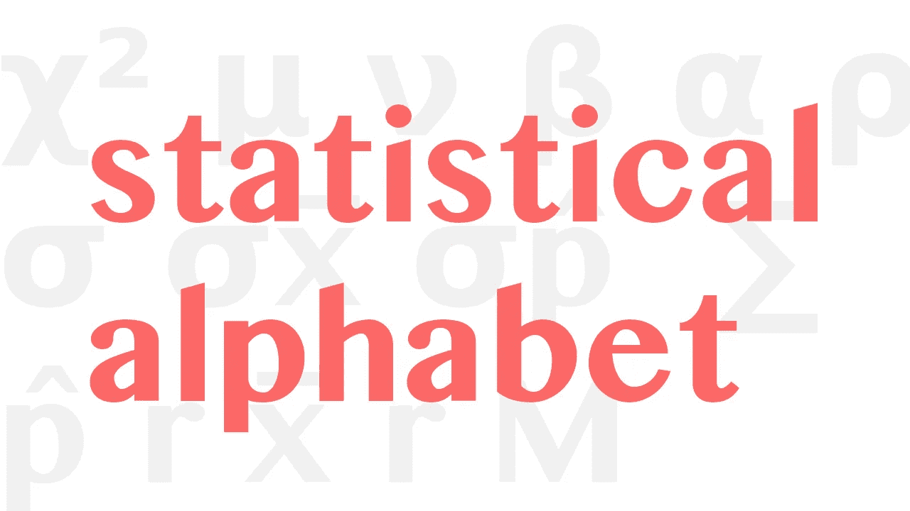
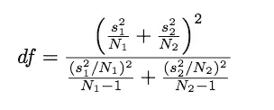

# Python 中的统计希腊字母

> 原文：<https://towardsdatascience.com/the-statistical-greek-alphabet-in-python-65295526146?source=collection_archive---------38----------------------->

## 熟悉统计学中每个希腊字母代表什么。



希腊字母是现代数学中极其重要的一部分，统计学当然也不例外。作为一个统计人员，破译统计公式的能力是相当重要的，不能做到这一点是相当的阻碍。问题是，刚开始接触统计学的学生可能会看到这些符号并认为

> “在我看来像是希腊语！”

虽然它们在技术上是正确的，因为这些公式通常包含非常字面意义上的希腊语，但对于初学者来说，学会这些符号并熟悉它们的含义仍然很重要。即使是那些在不涉及统计分析的类似定量领域有经验的人也可能会遇到麻烦，因为字母可能意味着贸易与贸易之间完全不同的东西。此外，将这些符号放入 Python 可能很难推断。所以没有任何进一步的拖延，这里是*统计希腊字母！*

# 总体与样本

为了理解称为“总体参数”的一系列希腊符号，我们需要熟悉总体和样本之间的区别。顾名思义，总体是一组完整的观察值，而样本是这些观察值的一小部分。在 Python 中，我们可以使用 random.sample()获得一个样本。

```
import random as rand
our_data = [5, 10, 15, 20]length_of_sample = 2 # <- Also known as n
samp = random.sample(our_data, length_of_sample)
```

尽管我们可以使用 random.sample()从我们的总体中获得一个随机样本，但样本并不一定是随机的。这很重要，因为它是如何进行 T 检验的基础。

既然我们知道了总体和样本之间的区别，我们就可以讨论总体参数了。总体参数是总体或样本的简单特征，能洞察数据。

## 观察次数

正如我在上面的示例中所评论的，样本的长度可以用字母 n 来表示。另一方面，总体的长度将是大写的 n。在 Python 中，我们可以使用 len()方法来计算列表的长度。

```
import random as rand
our_data = [5, 10, 15, 20]n = 2 # <- Also known as n
samp = random.sample(our_data, length_of_sample)
n = len(samp)
N = len(our_data)
```

## 平均

至于平均值，人口的平均值用希腊字母μ或“mu”表示。样本的平均值用 x̅或“x-bar”表示我们可以在 Python 中使用 NumPy 来计算这些值，或者用列表的总和除以列表中的观察值。

```
import numpy as np
x̅ = np.mean(samp)
∑B = sum(our_data)
μ = ∑B / N
```

## 中位数

数据的中位数是一个大杂烩。它可以用 x̃或“x 代字号”来表示也可以用大写的 M 或 Med 来表示。中位数的符号通常不是特定于人口或样本的。在 Python 中，我们将再次使用 Numpy 来计算中位数:

```
x̃ = np.median(sample)
```

## 标准偏差

总体的标准差可以用σ或“sigma”来表示请注意，这是小写的 sigma，而不是大写的 sigma——这很重要，因为它们表示不同的意思。

## 相关系数

样本的相关系数用小写的 r 表示。另一方面，总体的相关系数用ρ或“rho”表示。有许多不同的方法来计算相关系数，但其中最流行的是皮尔逊相关。这次我们将使用 Scipy.stats 来查找皮尔逊相关系数:

```
import scipy.stats as scs
r = scs.pearsonr(our_data)
ρ = scs.pearsonr(sample)
```

如果您想了解如何使用皮尔逊相关从头开始计算相关系数，我写了一篇文章，在这篇文章中，我用 r 精确地计算了相关系数。除此之外，我还计算了 r，并用它来计算线性回归模型。同样幸运的是，R 和 R 的组合产生了一个非常有趣的名字:

[](/finding-r-in-r-455fb7de5d80) [## 在 R 中寻找 R

### 相关系数(R)、回归的相关系数(R)和编程语言 R 都是…

towardsdatascience.com](/finding-r-in-r-455fb7de5d80) 

## 比例

样本的比例由 p̂或“P-Hat”表示人口用一个简单的 p 表示。确保不要像在 rho 中那样把 p 和ρ混淆！要在 Python 中计算这一点，实际上不需要导入任何东西，因为它是通过简单地将总体长度除以样本长度来计算的，反之亦然:

```
p̂ *= N / n
p = n / N*
```

通常，每当提到比例时，我们都在谈论样本比例。

# 信件陈述

## α(阿尔法)

α用于表示假设检验的显著性。换句话说，它代表第一类错误的可能性。因此，你可以通过做以下事情来计算置信度

```
1 - α = confidence
```

Alpha 是一个数字，它可以根据您想要获得的置信度而变化。α值通常可以假定为 0.05。这是为什么呢？因为通常在统计学中，我们追求 0.95 的置信度，或者 95%的置信度。1 减 0.05 等于 0.95。这个数字通常不计算，而是作为一个参数给出。

## β(β)

β用于表示假设检验中第二类错误的显著性。像 alpha 一样，beta 通常作为一个参数提供，并且是一个可以用来优化他们的统计推断的基础值。一减β就是我们所说的测试的功效。如果你想了解更多关于功率的知识，我写了一篇文章，从头开始创建了一个功率日志算法:

[](/power-analysis-the-coolest-thing-that-youve-never-heard-of-476d35c18161) [## 电源分析——你从未听说过的最酷的东西。

### 将权力投入到您的物流决策中。

towardsdatascience.com](/power-analysis-the-coolest-thing-that-youve-never-heard-of-476d35c18161) 

## ν (nu)

Nu 在统计学中用来表示自由度。我们可以通过首先获得 X 和 Y 的标准偏差，然后将它们代入以下公式来计算 Python 中的自由度:



```
def degreesOfFreedom(X, Y):
    s1 = (stdev(X)**2)
    s2 = (stdev(Y)**2)
    df = (s1 / len(X) + s2 / len(Y))**2 / ((s1 / len(X))**2 / (len(X) - 1) + (s2 /  len(Y))**2 / len(Y) - 1)
    return(df)
```

## σx̅(西格玛-x-棒)

适马 X-棒线用于表示平均值的标准误差。我们可以在 Python 中通过再次使用 Scipy.stats 来计算:

```
scs.sem(samp)
```

## σp̂

既然适马-X-Bar 是均值的标准误差，那么适马-P-Hat 就是比例的标准误差。我们可以在 Python 中通过简单地对标准误差公式进行一处修改来计算:

```
# Sigma X Bar
SEx = s / sqrt(n)SEp = sqrt(p(1 - p) / n)
```

在上面的例子中，s 当然代表样本标准差的估计值，类似于 sigma。

## ∑(适马(大写))

大写∑用于界定给定组的总和。这是用 Python 的标准 sum()函数简单计算出来的。

```
∑x = sum(x)
```

> 是的，真的就这么简单。

## χ(卡方检验)

给定数组 x 的卡方分布。卡方分布是多项式实验和列联表的分布。我们可以再次使用来自 Scipy.stats 的统计数据:

```
χ² = scs.chi2(our_data)
```

# 结论

这些都是统计学中常用的希腊字母。尽管有一些明显的例外，比如频率(fi)和更重要的θ。我把它们排除在外是因为虽然它们很重要，但它们也很少被使用，而且相对先进，显然这篇文章是针对相对较新的统计学家的。

您还应该注意的是，本文中稍微混合了一些罗马符号。我认为没有一个很好的理由把他们排除在外，以防你在某个地方碰到他们。特别是因为其中一些符号与希腊符号形成了直接的对比，我觉得把它们留在里面很重要。总的来说，我记得有一天这是令人望而生畏的。事实是，这些公式比它们看起来要简单得多，很多只是理解每个变量代表什么。感谢你的阅读，希望你学到了有价值的东西！