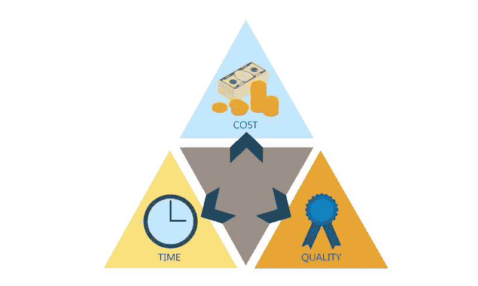

# 数据科学资历的步骤:沟通

> 原文：<https://towardsdatascience.com/the-steps-to-data-science-seniority-communication-809ee217cebf?source=collection_archive---------53----------------------->

## 所有老年人之间的共同点

[活动发起人](https://unsplash.com/@campaign_creators?utm_source=medium&utm_medium=referral)在 [Unsplash](https://unsplash.com?utm_source=medium&utm_medium=referral) 上的照片

在之前的一个故事中，我根据网络上相关文章的一个小样本，写了一个高级数据科学家应该具备的素质。总而言之，我提出了一名数据科学家为了晋升应该提高的三大支柱:

*   **你对自己了解多少** : *经验、工具箱、部署、好奇心*。
    你独立完成工作的能力，以及为成功实现目标而积极主动的能力。
*   **你对你的公司了解多少** : *产品发现、初始、管理、测量*。
    您看到全局、最大化您的影响、最小化复杂性、提出新想法并衡量其价值的能力。
*   **你对你的同事了解多少** : *沟通、领导、教学、微观管理*。向你的队友和经理推销你的想法、了解每个团队成员的优势和劣势、向他们传播你的个人知识以及有效领导他们的能力。

在这个故事中，我们将谈论第三个支柱:**人际软技能**。

# 卡桑德拉和教学

来源:*卡桑德拉*作者[伊芙琳·德·摩根](https://en.wikipedia.org/wiki/Evelyn_De_Morgan) (1898 年，伦敦)

在希腊神话中，卡珊德拉是一个被预言诅咒的女祭司，这些预言总是成为现实，但从来没有人相信。你有过项目提案被否决的经历吗？你有过宠物项目变成心碎的经历吗？最终会发生的。也许不是这个项目有缺陷…也许是你的推销有缺陷。

对一个数据科学家来说,**推销** **你的观点**的能力是必不可少的。这对每个结构开发人员来说都是正确的，但由于统计分析固有的复杂性，这尤其与数据相关的工作相关。与营销、管理或其他开发人员中的外行打交道需要说教式的沟通。一个高级数据科学家首先是一个伟大的**老师**。

这些技能在专业人员和经理之间的职业 T 形分裂的双方都有用:作为一名**专业人员**，你要处理不断增加的复杂性，必须能够将你的知识传达给你的发展团队和上级；作为一名**经理**，你必须能够与产品所有者分享你关于数据内部运作的知识，并教育利益相关者你工作的可能性和局限性。

展示您的数据项目通常被称为**数据故事**，Medium 中有许多故事详细解释了这一概念。以下是我个人的一些选择:

 [## 用数据讲故事:数据科学中的交流

### 在数据科学的世界里，一个人必须擅长数据创造、怀疑和交流。有趣的见解…

towardsdatascience.com](/tell-stories-with-data-communication-in-data-science-5266f7671d7)  [## 在数据科学写作方面做得更好，机会就会增加

### 作为一名数据科学家，一项至关重要的技能是能够将发现传达给具有不同技术…

towardsdatascience.com](/get-better-in-data-science-writing-and-the-opportunities-will-grow-9d37fdada262)  [## 数据叙事复兴的教训

### 1854 年，伦敦爆发了致命的霍乱。普遍的看法是……

mediadecoded.com](https://mediadecoded.com/lessons-from-the-renaissance-of-data-storytelling-3cec8bf9bd7e)  [## 30 种最新最棒的数据叙事工具

### NICAR 2017“60 分钟 30 种工具”研讨会上展示的新技术综合报道。

medium.com](https://medium.com/@ToTheVictor/nicar30tools-da83db0f3dc6) 

增强这项技能首先需要**经验**。对着镜子练习解释你的项目，向你周围不熟悉你正在阐述的概念的人解释，在你的周围寻找聚会，安排谈话来训练你的公众声音。

你也可以锻炼你的学术肌肉，练习**写论文**。用适当的结构和同行评论将想法合成文字可以提高你的教学能力。写中型文章是展示你的想法和收集志同道合者反馈的好方法。

不要让你的项目成为卡珊德拉的预言:被遗忘在书架上的有用信息对你或你的公司没有任何好处。

# **进入数据管理**

首先，请继续阅读这个故事。这是对数据科学经理角色的很好介绍。

 [## 你现在是一名数据科学经理…现在呢？

### 随着数据科学的兴起，也出现了数据科学经理。所以，如果…你需要记住什么

towardsdatascience.com](/so-you-are-now-a-data-science-manager-now-what-6efe42f2093) 

项目经理参与项目的启动和监督，监控日常进展，以及涉众的期望管理。他们努力将质量最大化，将花费在开发上的成本和时间最小化。

来源:[https://trail head . sales force . com/pt-BR/content/learn/modules/project-risk-management-for-partners/monitor-communicate-risk？trail_id=consulting_partner](https://trailhead.salesforce.com/pt-BR/content/learn/modules/project-risk-management-for-partners/monitor-communicate-risk?trail_id=consulting_partner)

为了正确评估数据项目，您至少需要一些该领域的知识。你不能为一个模型设定 7 天的最后期限，而这个模型至少需要花这么多时间进行训练，你不能将标记工作交给一个科学家，并期望它很容易，也不能承诺在未经探索的数据集上训练的模型的准确性。

作为高级数据人员，你的首要工作是**补充** **你的项目经理，如果他需要的话**。做蟋蟀吉米尼，军师，墨菲斯。和他一起工作，保护你的团队不被误导。有了他对公司的系统观点和你的技术建议，这个过渡期对双方来说都是一次学习的经历。

在这样做的同时，继续训练你的**个人**项目组织技能**。随着资历的增长，责任和更大的个人项目也随之而来。开始划分以衡量努力和时间消耗。记下完成困难任务所需的时间、简单的速赢、常见的障碍及其解决方案。**

在你涉足管理领域之后，开始思考你在专家/经理职业道路上的下一步。不要因为外力而被迫做出选择:这实际上是一次职业转变。

以下是关于数据科学经理角色的其他资源:

 [## 为什么管理数据科学家与众不同

### 大思路:与数据和分析竞争成功管理数据科学团队需要技能和理念…

sloanreview.mit.edu](https://sloanreview.mit.edu/article/why-managing-data-scientists-is-different/)  [## 管理数据科学团队

### 伟大的数据科学家有职业选择，不会长期忍受糟糕的经理。如果你想…

hbr.org](https://hbr.org/2018/10/managing-a-data-science-team)  [## 数据科学经理:资格和技能-建立数据科学团队| Coursera

### 约翰·霍普金斯大学为课程“建立数据科学团队”制作的视频。欢迎建立一个数据…

www.coursera.org](https://www.coursera.org/lecture/build-data-science-team/data-science-manager-qualifications-skills-tw4DY)  [## 数据科学经理的角色

### 数据团队经理需要在一个新生和快速发展的领域建立强大、稳定的团队，实现高质量…

medium.com](https://medium.com/sequoia-capital/role-of-a-data-science-manager-2c69264511d3) 

# 了解你的团队

高级开发人员通常通过指导和监督其他开发人员来负责项目开发。为了充分认识到他在团队中的实力，他需要了解每个队友的技能，以便正确分配任务，并使每个人都保持最大的生产力。

这在数据科学领域没有什么不同。除了前端/后端工程师，你还需要**跟踪特定的数据技能**:每个团队成员知道什么样的模态(多媒体、文本数据、数字数据)，他们是否更好地开发概念证明、做管道工程、仪表板……就像在一部抢劫电影中一样，一个项目的成功完全取决于团队的组成。

**你还不是独角兽。**你可能对所有开发步骤都有广泛的了解，但你并不是每一个步骤的专家。这是学习过程的一部分，来区分你能做什么和不能做什么，以及谁能补充你的技能。

要提高这项技能，你需要倾听。听听你同事的反馈。每天倾听抱怨。一般听听关于职场的赞美。关注队友的宠物项目:这些是他们平时工作之外积极追求的领域。

有两本书会改善你对职场关系和一般沟通技巧的看法:丹尼尔·戈尔曼的《T4》、《情商》和《社交智商》。如果你渴望一杯知识，而不是一整条河，我可以推荐这些关于它们的深思熟虑的文章:

 [## 情商完全指南

### 如何提高你在人际关系中最重要的品质

medium.com](https://medium.com/better-marketing/the-complete-guide-to-emotional-intelligence-d3b2333b8615)  [## 社会智力和领导生物学

### 1998 年，我们中的一位，丹尼尔·戈尔曼，在这几页发表了他的第一篇关于情商和…

hbr.org](https://hbr.org/2008/09/social-intelligence-and-the-biology-of-leadership) 

我倾向于认为数据科学家是好的学习者，而不一定是知识者。不要不顾一切地钻研每一个领域，成为其中的大师。慢慢地，但肯定地，我们会积累日常处理数据的知识和经验。我们都在数据的台阶上一起向上走！

感谢您的阅读，并在这个充满数据的宇宙中享受乐趣！