# 气象学中伴随灵敏度方法的故事

> 原文：<https://towardsdatascience.com/the-story-of-adjoint-sensitivity-method-from-meteorology-906ab2796c73?source=collection_archive---------27----------------------->

弗洛伦西亚·维亚达纳在 [Unsplash](https://unsplash.com/) 上拍摄的照片

NIPS 2018 年发表的广受欢迎的论文:[神经常微分方程](https://arxiv.org/abs/1806.07366) (Neural ODE) [1]，引入了一个新的神经网络家族。与基于先前轨迹来预测过程的未来轨迹的良好的旧 RNNs 和 LSTMs 相反，神经 ODE 表示该过程的导数，从中可以通过数值积分获得未来轨迹，因此它声称具有连续的潜在空间。为了优化神经微分方程，采用了伴随灵敏度方法(ASM，不是正式的缩写，只是为了方便起见),其推导过程附在附录中。它们纯粹是数学上的，并没有提供太多的上下文或直觉来解释为什么要这样优化。

数学是一门可以从内部自然产生新问题的学科，但每当科学或工程的发展需要一个数学问题或概念时，我都试图遵循这种发展的步骤，因为最初的思路几乎总能帮助我更好地理解数学。

所以我查找了有关 ASM 的文献，发现它主要用于气象学、大气研究和天气预报。我找到的一篇论文的题目是，“[什么是伴随模型？](https://journals.ametsoc.org/doi/10.1175/1520-0477%281997%29078%3C2577%3AWIAAM%3E2.0.CO%3B2?mobileUi=0)【2】，这也正是我当时问自己的问题。本文对离散时间系统的 ASM 给出了清晰的解释，这一思想可以很好地推广到连续时间。这个故事将借用气象学的动机，讨论如何用拉格朗日乘数法推导 ASM。希望我们可以建立一些直觉，让数学变得更容易。

这个故事中所有的向量都是列向量，[分子布局](https://en.wikipedia.org/wiki/Matrix_calculus#Layout_conventions)作为所有矩阵演算的约定。

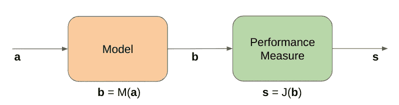

模型和性能管道(图片由作者提供)

天气预报依赖于模型，模型将向量 **a** 作为输入，将向量 **b** 作为输出。输入可以被认为是当前的天气，包含诸如风速、湿度、温度等信息，而输出将是一些时间步骤后的天气预报。输出不必与输入具有相同的格式，但是为了简单起见，我们假设它们包含相同的信息，因此具有相同的维度。然后，用一个或多个性能测量，例如均方误差，来评估输出。通常衡量性能的函数是标量值的。

该模型通常通过数值积分从 **a** 计算 **b** ，但是在这里将它视为一系列操作就足够了，其中每个操作都可以被视为在某个时间步长内演变当前天气:

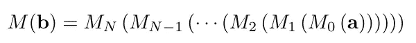

事实上，任何可用的数值积分方案，如欧拉法或龙格-库塔法，都可以被认为是具有给定步长的一系列操作。

气象学与模型的“灵敏度”有关:给定一个控制输入**一个** 𝒸，输入中的一个小扰动如何影响 s𝒸的性能？这一点很重要，因为一个微小的输入扰动引起的天气预报的剧烈变化不是很有用。想象一下，如果电视主持人说明天将是华氏 90 度，阳光明媚，但结果是下雪，因为预测中的一些噪音，有多少人会在海滩上冻死？！

虽然从流水线上的链式法则开始很容易，但我想按照论文[2]中的逻辑流程来得出答案。设轻微扰动的输入为**ₚ，这将给出扰动为**

很容易看出扰动δ**a**引起的一系列事件:首先模型输出 **b** 改变，然后测量性能 s 改变，它们相应的扰动为

我们感兴趣的是δs 如何随δ**a**变化。给定事件链，如何计算这一点并不直观，但我们可以从一些简单的东西开始:我们可以将δs 作为δ**b**的结果来计算，因为我们完全了解性能测量函数 J(。).对于δs 的一阶泰勒级数近似，我们有:

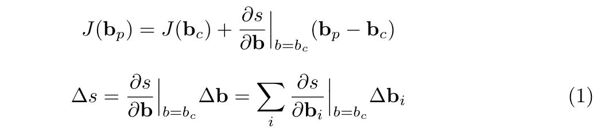

注意，这里δs**作为近似的结果已经变成了扰动的线性估计。等式 1 直观地表示，δs 与δ**b**的比值就是在 **b = b** 𝒸.时，s 与 **b** 的变化率**

> **下面是一个具体的例子:假设 J(。)是均方误差:**

****

> **其中上标(f)和(v)分别代表预测和地面实况。如果我们遵循等式 1，我们可以估计δs**为:****

****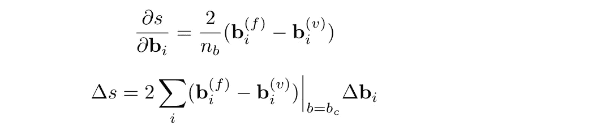****

> ****既然我们知道了预报的 **b** 和地面实况，我们就可以很容易地计算出δs**中的扰动。******

****按照推导等式 1 的相同逻辑，我们可以查看流水线的前半部分( **b** = M( **a** ))并写出以下内容:****

****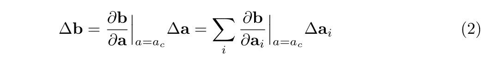****

****∂ **b** /∂ **a** 是雅可比矩阵。结合等式 1 和等式 2，我们将得到(基本上是链式法则…):****

****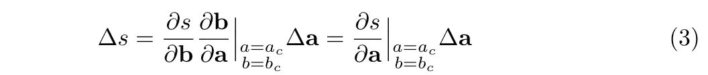****

****这正是我们所追求的。我们在例子中已经表明，∂s/∂ **b** 可以很容易地计算出来，所以我们只剩下∂ **b** /∂ **a** 来处理。我们只知道 **a** 𝒸， **b** 𝒸，以及 **b** 通过 n 次运算从 **a** 计算出来的函数。因此，让我们通过以下顺序再次应用等式 1 的推导:****

****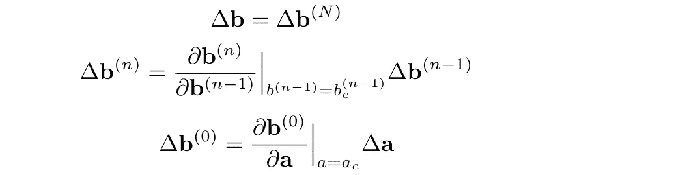****

****其中上标(I)表示 iᵗʰ运算后的相应输出。上面的第三个等式意味着 0ᵗʰ操作直接应用于 **a** 上。在一些菊花链(或链规则)之后:****

****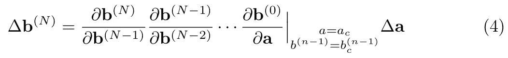****

****方程(4)中偏导数的乘积链是∂ **b** /∂ **a** ，正是我们求解方程(3)所需要的。更明确地说，我们有以下内容:****

****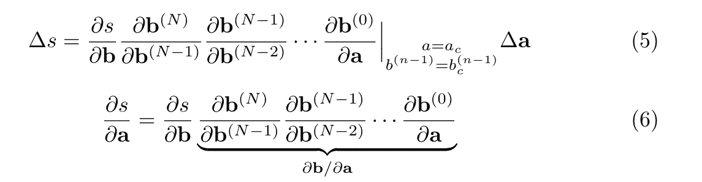****

****万岁！我们已经找到了答案。与论文不同的是，我特意保留了用于计算偏导数的 **a** 和 **b** 的值，因为我想展示计算 s 中的扰动所需的一切，同时将它们写出来有助于该算法的实现(如果需要)。****

****关于公式 6，有两点需要注意。(1)我们需要模型中整个操作序列的所有输出(𝒸的所有输出)。这可以通过在从 **a** 𝒸.计算 **b** 𝒸时保存所有中间输出来实现(2)为了计算∂ **b** /∂ **a** ，我们需要计算沿着模型操作的所有偏导数，并用保存的输出对它们进行评估。由于操作通常是相同的(例如，牛顿法在每一步都被使用)，雅可比矩阵是相同的，因此计算起来并不昂贵。****

****到目前为止，这种方法似乎没有什么“伴随”之处，但诀窍就在这里。由于 s 是标量，通过分子布局，∂s/∂ **a** 是行向量。如果我们通过转置∂s/∂ **a** 来迫使它成为列向量，则等式 6 变成:****

****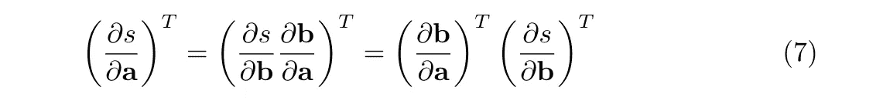****

****这里原雅可比矩阵的转置，即(∂ **b** /∂ **a** )ᵀ称为*伴随*，方程 7 称为方程 2 的*伴随模型*。有了等式 7，我们将总是能够知道我们的天气预报模型是否对输入过于敏感，并且没有人将不得不再次在海滩上冻结。****

****到目前为止，我们已经用一个气象学例子重新演示了 ASM。现在我们将推广 ASM 并用拉格朗日乘数法推导灵敏度。[这里是对拉格朗日乘数](https://medium.com/@andrew.chamberlain/a-simple-explanation-of-why-lagrange-multipliers-works-253e2cdcbf74)的一个温和的介绍。****

****拉格朗日乘子通常用于约束优化问题，气象学示例也可以用公式表示。****

****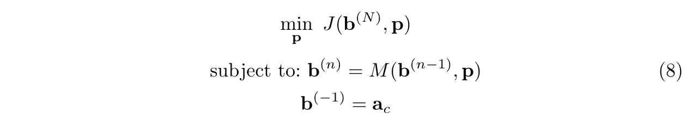****

****用约束优化问题表述的气象学例子****

****我们讨论的关于气象学例子的一切都可以应用于这个优化问题。假设模型有一些参数 **p** ，我们可以调整这些参数来改变性能，我们的目标是通过调整 **p** 来最大化最终输出 **b** ⁽ᴺ⁾的性能，约束由序列中的单个操作**b**⁽ⁿ⁾= mₙ(**b**⁽ⁿ⁻⁾】定义。如果序列中的所有运算都一样，我们可以简单地写成**b**⁽ⁿ⁾= m(**b**⁽ⁿ⁻⁾).我们将需要 ds/d **p** 来迭代更新优化 s 的参数，这个想法和我们如何计算 ds/d **a** 是一样的。我们将不讨论这个具体的问题，而是考虑一个连续时间的问题，这个问题可以很好地推广到气象学的例子中，并指出它们的相似之处。****

****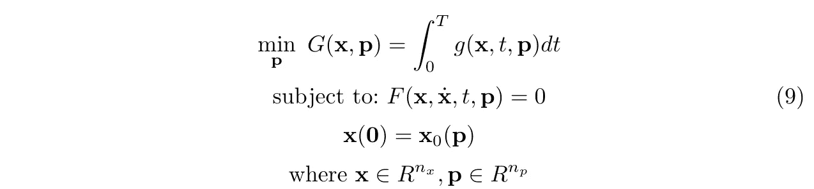****

****DAE 作为其约束的一部分的优化问题****

****考虑最优化问题 9，其中 F( **x** ， **x** '，t， **p** )称为微分代数方程(DAE)。像这样的方程组也被称为隐式系统、广义系统或广义系统。请注意，对于时间导数，我们将 x '与\dot{x}互换使用，因为很难在 x 上键入点。人们可能更熟悉半显式 DAE，或**常微分方程(ODE)** :****

********

****事实上，DAE 是 ODEs 的一般化形式，因为并非所有 DAE 都可以用半显式形式编写。但是我们将假设 F( **x** ， **x** '，t， **p** ) = 0 确实可以写成一首颂歌，以便于理解。所以为了优化 G(。)关于问题 9 中的参数 **p** ，我们将需要计算 dG/d **p** 。让我们首先将这个问题与气象学的例子进行比较。****

****第一个约束 **x** ' = f( **x** ，t， **p** )可以认为是气象学例子中**b**⁽ⁿ⁾= m(**b**⁽ⁿ⁻⁾)的连续时间版本。前者计算 **x** 的导数，然后对其进行数值积分以获得下一个状态，后者直接将当前输出 **b** 映射到其下一个状态。同样，初始条件 **x** (0)平行于控制输入 **a** 𝒸.****

****问题 8 中的目标函数是用函数 J(.)，而问题 9 中的目标函数是通过对函数 g(.或者，我们可以认为灵敏度 dG/d **p** 是仅在时间 T 定义的函数 g( **x** ，T，p)的灵敏度 dg/d **p******

****现在，让我们最终进入计算 dG/d **p** 的数学过程。首先，我们引入一个拉格朗日乘数λ，并形成一个增广的目标函数(从这里我将使用文件[3]中的方程截图)。像 x 和 p 这样的变量是向量，但不是用粗体书写的):****

********

****λ本身是时间的函数，而*表示共轭转置，或者如果我们只关心实值，则简称为转置。接下来我们对 **p** 求导来表示灵敏度 dG/d **p** ，****

****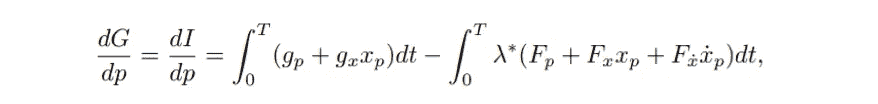****

****下标用来表示偏导数。例如 F **ₚ** = ∂F/∂ **p** 。接下来我们通过分部积分去掉第二个积分中的 x**ₚ**’:****

************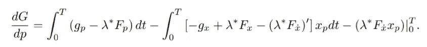****

****由于 **xₚ** 一般很难计算，我们想通过将 **xₚ** 之前的系数块设置为 0 来去掉第二个积分。这将给出条件，以及伴随方程:****

********

****最后，我们可以将灵敏度写成:****

********

****很容易找到 t=0 时的灵敏度 **xₚ** ，但是很难在 t=T 时计算它。因此，为了避免在 t=T 时计算 **xₚ** ，我们可以简单地设置λ(T) = 0。只要我们的 [DAE 系统是索引 0 或索引 1](http://www.scholarpedia.org/article/Differential-algebraic_equations) ，我们就可以这样做。因此我们的敏感度变得****

********

****现在，这种形式似乎已经远离了气象学的例子，但让我们仔细看看。为了计算灵敏度 dG/d **p** ，我们首先要对 F( **x** ， **x** '，t， **p** )进行数值前向积分，得到 **x** 从 t = 0 到 t 的完整轨迹，初始条件为 **x** (0) = x₀( **p** 。然后我们需要计算λ从 t=T 到 0 的全轨迹，手动设置初始条件λ(T) = 0。这是通过在时间上向后对伴随方程进行数值积分来实现的。然后，λ的轨迹用于计算灵敏度。这非常类似于气象学的例子，我们首先向前计算 n 次运算以得到所有的 **b** ⁽ⁿ⁾，然后向后计算每个输出相对于前一个输出的所有偏导数。这些偏导数然后用于计算灵敏度。****

****此外，如果我们考虑拉格朗日乘子，则在每个时间步长的局部最优处的乘子是目标函数的梯度与约束函数相对于参数的梯度之比。如果我们回头参考等式 7，我们可以看到拉格朗日乘数简单地等于λ = ∂s/∂ **b** ，这关系到∂s/∂ **a** 和∂ **b** /∂ **a** 。****

********

****对于连续时间的情况来说有点复杂，但是如果我们忽略下面的*伴随方程*中的第一项，我们可以看到λ与∂F/∂ **x** 和∂g/∂ **x** 相关，目标函数的梯度和约束相对于 **x** 的梯度。那么一阶导数是干什么用的呢？肯定有很多解释，但这里有一个我想到的简单解释。在动力系统的研究中，一个变量及其导数被视为两个独立的量，因此这个优化问题的约束基本上是以两个独立的变量作为输入。因此，在计算梯度时，必须考虑两者的贡献。事实上，λ*的时间导数可以被认为是增加了另一个独立于λ的乘数，以处理作为 x’的结果的约束的梯度变化。我们需要这两个分量来匹配 F 和 g 的梯度。****

****另一个观察结果是*伴随方程*是关于 **x** 而不是 **p** 的导数。这是因为我们通过写下这个*伴随方程*消除了计算∂ **x** /∂ **p** 的需要。最终的灵敏度表达式将自然地增强相对于 **p** 的梯度。****

****我已经描绘了一幅简化得多的 ASM 图。实际上，它有很多限制和应用，我在这里没有讨论。比如我们如何保证 ASM 的数值稳定性？如果 DAE 系统是 Hessenberg index-2 而不是 index-0 或 index-1 会怎样？此外，我只讨论了 ASM 在优化动力学模型参数中的应用，但它也广泛应用于翼型设计的形状优化、计算半离散偏微分方程(PDE)的灵敏度等。为了充分理解 ASM，需要挖掘更多的论文。****

******参考文献******

****[1]田、尤利娅·鲁巴诺瓦、杰西·贝当古和戴维·k·杜文瑙。“神经常微分方程。”NeurIPS，2018。****

****[2]罗纳德·m . n . d .埃尔里科，“什么是伴随模型？”[http://bio . CG rer . ui OWA . edu/people/tchai/HTM/Reference/conjugate _ errico . pdf](http://bio.cgrer.uiowa.edu/people/tchai/HTM/Reference/adjoint_errico.pdf.)。****

****[3]曹、杨、李胜太、琳达·佩佐德和拉杜·塞尔班。2003."微分代数方程的伴随灵敏度分析:伴随 DAE 系统及其数值解."暹罗科学计算杂志 24(3):1076–89。****

****[4] A. M. Bradley，《PDE 约束优化与伴随方法》2019 年 10 月 15 日(原文 2010 年 11 月 16 日)。[https://cs.stanford.edu/~ambrad/adjoint_tutorial.pdf](https://cs.stanford.edu/~ambrad/adjoint_tutorial.pdf)****

****[5]曹、杨、李胜太和琳达·佩佐德。2002."微分代数方程的伴随灵敏度分析:算法和软件."*计算与应用数学杂志*149:171–91。****