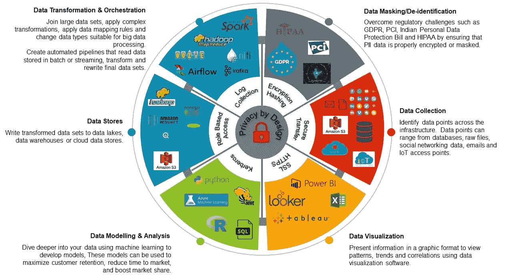

# 数据的故事——设计的隐私

> 原文：<https://towardsdatascience.com/the-story-of-data-privacy-by-design-530f4bfdfd8f?source=collection_archive---------51----------------------->

讨论在数据管理生命周期的早期采用隐私设计等框架的必要性

作者图片

每一个**字节**的数据都有一个故事要讲。问题是这个故事的叙述是否准确可靠。通常，我们非常关注数据的趋势，目标是提高收入，但通常会忘记由于糟糕的数据管理而导致的漏洞。

数据拥有巨大的力量，但是巨大的力量伴随着更多的责任。在当今世界，收集、分析和建立预测模型是远远不够的。我不断提醒我的学生，在我们这个时代，对数据安全性的要求可能已经超过了对数据正确性的需求。因此，通过设计来保护**隐私的需求比以往任何时候都大。**

在我们讨论设计隐私之前，让我们先了解一些关于数据安全和隐私的问题。

## 安全性——数据处理器和数据控制器的作用

几年前，对于许多组织来说，仅仅构建一个数据湖就是一个巨大的飞跃。对于有安全意识的组织来说，数据湖的安全性仅仅局限于启用 Kerberos 进行身份管理。我们很少谈论静态数据或动态数据的安全性。不再是了…

在当今世界，数据处理器和数据控制器的角色已经被重新定义。无论是静态数据还是传输中的数据，都不能安全地处理。最重要的是，组织在法律上有义务在检测到任何数据泄露时立即通知相关方。

## 数据速度

直到最近，企业还在关注长时间的数据，大数据使这成为可能。随着物联网(IoT)的出现，分析实时数据变得非常重要。如今，在我们的家中拥有收集个人数据并将其传输到外部位置以进行监控或分析的设备非常常见。在许多情况下，贫穷的消费者发现很难权衡放弃个人数据的好处和提供这些数据的风险。*需要达到一种恰当的平衡。*

## 设计隐私

我们处在一个每天都在创造历史的时代。当脸书、谷歌和其他巨头正在寻找收集、处理、使用和共享数据的创新方法时，立法者正在起草和执行关于数据隐私和所有权的新法规。像欧洲 GDPR 这样的法规试图定义数据控制器和数据处理器的法律责任。该法规更加关注围绕个人数据可移植性、保留和销毁的数据治理政策。

什么是设计隐私？

***从一开始就将隐私问题融入整个开发周期。***

同样的方法应该适用于所提供的服务以及内部流程。这种方法背后的理论是，隐私不能仅仅通过立法来实施。

[隐私设计](https://en.wikipedia.org/wiki/Privacy_by_design)基于 [7 项基本原则](https://www.ipc.on.ca/wp-content/uploads/resources/7foundationalprinciples.pdf)，由[安·卡沃金](https://en.wikipedia.org/wiki/Ann_Cavoukian)开发，并在与安大略省信息与隐私专员[的联合报告中正式确定。](https://en.wikipedia.org/wiki/Information_and_Privacy_Commissioner_of_Ontario)

在一个注重安全的世界里，IT 公司比以往任何时候都更努力地帮助客户实现数据创新和数据治理的正确结合。随着机器学习和人工智能的使用越来越多，我们需要帮助我们的客户采用像 **Privacy by Design** 这样的框架，以使他们未来的数据路线图更加简单、安全和经济高效。

我希望这篇文章有助于传播关于设计采用隐私的消息。像这样的主题是由 [Datafence Cloud Academy](http://www.datafence.com) 提供的大数据 Hadoop、Spark 和 Kafka 课程的一部分。课程是周末自己在网上教的。