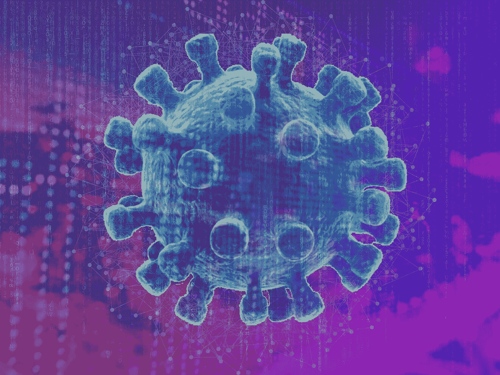

# 新发现的友谊的故事:艾、曼梯·里和新常态

> 原文：<https://towardsdatascience.com/the-story-of-newly-found-friendship-ai-ml-and-the-pandemic-6ceb02376ebd?source=collection_archive---------52----------------------->

这篇文章讲述了这个疫情如何给了 AI-ML 阿朵急需的推动力，以及这种新发现的友谊是如何产生良好效果的！

图片由 [btaskinkaya](https://pixabay.com/users/btaskinkaya-5685686/?utm_source=link-attribution&utm_medium=referral&utm_campaign=image&utm_content=5115053) 和[combreak](https://pixabay.com/users/comfreak-51581/?utm_source=link-attribution&utm_medium=referral&utm_campaign=image&utm_content=356024)来自 [Pixabay](https://pixabay.com/?utm_source=link-attribution&utm_medium=referral&utm_campaign=image&utm_content=5115053)

技术进化背后的一个持续动力是——我们人类喜欢保持控制。我相信这是我们对 AI & ML 着迷的最常见的原因。

*   “我打算开始一项新业务。哪个行业将在未来 5-10 年内变得最赚钱？”
*   “我是学生。就我的专业而言，我希望选择一门与未来相关的学科。”
*   “未来 15 年，哪只股票能给我带来最大回报？”

新冠肺炎疫情让所有人都措手不及，没有人真正知道如何控制这种新形势。企业遭受损失，如果不关闭，人们死亡，医疗设施过度使用等等！

人工智能和机器学习在这个疫情中拯救了我们。它们已经存在了足够长的时间，但疫情让人工智能和人工智能变得比以往任何时候都更加重要。

在这篇文章中，我将谈论这个疫情如何给 AI-ML 阿朵急需的推动，以及这种新发现的友谊如何产生良好的效果！

# 预测未来:人类 vs AI (& ML)？

让人类独自做未来预测的事情是，他们不太可能倾向于预测，如果预测结果是真的，那么预测背后的人会被认为是“非凡的”。而且，在大多数情况下，他们是！

即使我们在过去目睹了大流行，医疗机构和政府也开始怀疑他们怎么会没有预见到新冠肺炎的爆发。问题依然存在— *我们是否能够使用人工智能& ML 来预测下一次病毒爆发，比如冠状病毒？*

人工智能，加上最大似然法，对未来的预测更可靠，因为它们处理的是数据，而不是偏差或任何其他异常。但是，一次又一次，我们看到 [**人类预测失败**](https://qz.com/1752106/why-are-humans-so-bad-at-predicting-the-future/) 人工智能预测也是如此。

## 埃尔文·费雪预言

埃尔文·费雪是 20 世纪著名的经济学家。他被另一位美国经济学家米尔顿·弗里德曼称为“美国有史以来最伟大的经济学家”。鉴于他的地位，人们会认为他的预测永远不会出错，但事实并非如此。

就在 1929 年华尔街崩盘的前几天，埃尔文·费雪说——“股票似乎已经到达了一个永久的高原”，这显然是不正确的！

## 人工智能预测出错了

回到 2018 年，一名 [**女子在亚利桑那州**](https://www.nytimes.com/2018/03/19/technology/uber-driverless-fatality.html) 被一辆自动驾驶优步撞死。有很多这样的场景，即使经过多次测试，人工智能驱动的解决方案也失败了。

所以，现在的问题是，当组合的解决方案可以更有效时，人工智能(& ML)预测与人类预测在这场疫情中是正确的战斗吗？

## 人工智能、机器学习和人类智能——疫情的更好组合

一个可以被引为完美例子的完美例子，在这种情况下，就是——[**【地缘政治事件协同预期(SAGE)**](https://www.ijcai.org/Proceedings/2019/0955.pdf) 。由信息科学研究所(ISI)的 Aram Galstyan 领导的 SAGE 完全是利用人工智能&非专家来预测地缘政治事件。

专家预测，在未来 10-20 年，人工智能和人工智能将帮助人类更有效地工作。可以肯定地说，这些工作中的一项将是预测未来像新冠肺炎这样的大流行。

好消息是，尽管人工智能和人工智能工具无法预测冠状病毒的爆发，但它们肯定可以在遏制疫情的传播方面发挥重要作用。

# 疫情是如何改变我们对人工智能和人工智能的偏好的？

暂且不谈技术细节，在这个疫情，AI & ML 可以帮助企业和医疗机构实现许多领域。以下是其中的几个。

## **远程工作成为新常态**

在疫情之前，远程工作和在家工作被认为是一种奢侈。现在，远程工作已经成为新常态。

IT 部门和其他部门的公司正在寻找方法来定义流程，以使远程工作像在办公室工作一样有益和高效。AI & ML 正在帮助远程团队在疫情期间高效运作。

微软甚至在其最新发布的产品中使用了人工智能引擎——Surface Pro X 到 [**让视频聊天“不那么怪异**](https://www.techrepublic.com/article/microsofts-new-feature-uses-ai-to-make-video-chat-less-weird/) **”**

1.  人工智能售票系统正在帮助远程团队在疫情期间有效处理内部问题和客户投诉。
2.  人工智能简化了远程对话的增加。LivePerson 报道称，由于疫情，其对话式 [**人工智能聊天机器人**](https://shanebarker.com/blog/best-ai-chatbot/) &消息工具的数量正在“显著”增加。
3.  在这次疫情期间，机器学习正在促进对数据的稳健访问和公司的远程计算需求。

## 一些企业可以在**大幅削减预算**的情况下生存

由于疫情导致严重的预算削减，一些企业遭受了巨大的损失。

根据国家经济研究局 的一项 [**研究，与整个大衰退相比，疫情 3 个月内(2 月至 4 月)倒闭的企业更多！**](https://www.nber.org/papers/w27309.pdf)

在这种情况下，AI & ML 可以帮助企业在这个疫情生存。

正确的是，公司现在正在积极学习采用人工智能和人工智能驱动的自动化工具，并在预算大幅削减的情况下保持功能。

在 Algorithmia 的一项 [**调查中，43%的 IT 领导者受访者认为，由于疫情，人工智能&比他们最初认为的重要得多。**](https://info.algorithmia.com/hubfs/Enterprise_trends_new_normal_chart_book.pdf)

## **医疗保健领域的精确预测分析比我们预期的更加重要**

从多方面来看，新冠肺炎疫情是对全球医疗机构的一次“压力测试”。

为了应对新冠肺炎病毒的爆发，来自不同领域的研究人员挺身而出，值得注意的是，其中就有 ML 研究人员。

在过去的二十年里，人工智能和人工智能都在医学领域取得了令人鼓舞的成果。甚至在某种程度上，它们已经被应用于解决一些顶级的社会挑战——其中之一是预测疾病的传播。

与传统分析和当前疫情的临床决策技术相比，将人工智能和人工智能能力用于对抗新冠肺炎无疑会让医疗机构占据上风。

机器学习可用于有效地从复杂的数据集中识别数据模式，以提供关于疾病传播、患者结果、药物发现等前所未有的见解！

# 疫情的人工智能和人工智能——面向企业

鉴于正在进行的疫情，企业正在加倍他们的人工智能/人工智能支出，这是有充分理由的！

人工智能和人工智能已经存在很长时间了，但它们的潜力没有被公司充分认识到。疫情为实施这些技术带来了迫切需要的紧迫感。

机器学习技术使现代计算机能够在海量数据集中模仿人类智能，识别模式，并预测疫情的传播。

另一方面，人工智能正在学习执行任务，这些任务以前是使用传统方法执行的，在这个疫情中更有效，更符合它们的紧迫性。

[**人工智能开发人员**](https://www.resourcifi.com/hire-ai-developer/) 以及 [**ML 开发人员**](https://www.resourcifi.com/hire-machine-learning-developer/) 正在帮助组织无缝转移到新常态，而不会影响客户体验、商业智能和扩展机会。

无论是小型企业还是大型企业，企业都在寻找新的方式来高效运营，同时满足社交距离的规范。当然，这些技术可以在哪些领域帮助您的运营，这将取决于您的业务。

以下是人工智能和人工智能如何在疫情帮助企业的几个例子。

*   利用(AWS 的)机器学习能力来预测每日订单， [**达美乐比萨以创纪录的时间**](https://aws.amazon.com/solutions/case-studies/dominos-case-study/) 。
*   拉丁美洲食品配送公司 iFood 能够使用人工智能 将覆盖的净配送距离减少 12%，将人员停机时间减少 50%，并将 SLA 从 80%提高到 95% [**。**](https://aws.amazon.com/pt/solutions/case-studies/ifoodai/)
*   Certipass 是一家提供数字技能认证的认证机构，在正在进行的疫情测试中，它正在使用亚马逊 Rekognition 对其候选人进行自动身份验证。

在疫情期间，AI 和 ML 在企业中实施的其他案例包括客户支持聊天机器人、预测现金流、文档/身份验证等等。

# 疫情的人工智能和人工智能—面向医疗保健机构

流行病是对人工智能和机器学习的真正考验。就在 2000 年之后，全球各地的医疗保健机构一直在尝试使用这些技术来预测疾病传播、预测病毒爆发、防止虚假信息传播、药物发现、自我分析等。

*   AI & ML 可以让人们了解官方规则和交流。例如，法国初创公司 Clevy.io 推出了一款聊天机器人，让人们可以轻松获取关于新冠肺炎疫情的官方政府信息。
    它由来自法国政府和世界卫生组织的实时信息驱动，迄今已发送超过 300 万条信息！奥尔良、斯特拉斯堡、楠泰尔和其他法国城市正在使用 Clevy.io 将经过验证的信息直接分散到居民手中。
*   机器学习也被用于分析大量关于病毒传播的数据，并预测早期预警信号。Chan Zuckerberg Biohub 和 [**AWS 诊断开发计划(DDI)**](https://aws.amazon.com/government-education/nonprofits/disaster-response/diagnostic-dev-initiative/) 的合作就是一个典型的例子。
    利用机器学习，Biohub 开发了一个系统，用于 [**检测和量化未被发现的新冠肺炎**](https://blog.aboutamazon.com/innovation/quantifying-the-silent-spread-of-covid-19) 传播。
*   信息的早期访问可以真正帮助医疗机构和企业为像正在进行的新冠肺炎这样强大的疫情做好准备。
    [**BlueDot**](https://bluedot.global/)**—**一种 AI 驱动的算法，梳理了整个互联网，65 种不同算法中的新报告，植物&动物疾病网络，以及官方文告提前发送警告的方式。

Kamran Khan 博士(BlueDot 创始人兼首席执行官)说— *“我们所做的是使用自然语言处理和机器学习来训练这个引擎，以识别这是不是蒙古的炭疽爆发，还是重金属乐队炭疽的重聚。”*

[**蓝点甚至成功预测了**](https://www.thelancet.com/journals/lancet/article/PIIS0140-6736(16)00080-5/fulltext) 南佛罗里达州寨卡病毒爆发的位置。随着谷歌 BigBird 等 NLP ML 改进的发布，BlueDot 等工具将变得更加强大。

 [## 理解大鸟——它是 NLP 的另一个重要里程碑吗？

### 谷歌研究人员最近在 arXiv 上发表了一篇题为《大鸟:更长序列的变形金刚》的论文。

towardsdatascience.com](/understanding-bigbird-is-it-another-big-milestone-in-nlp-e7546b2c9643) 

疾病预防控制中心、世卫组织和类似的组织收到了大量关于新冠肺炎病毒传播和相关事件的数据。值得注意的是，许多其他研究人员也指出，全球范围内医疗保健组织之间的协作和合作对于实现机器学习和人工智能的真正潜力至关重要！

除了收集和分析庞大的数据集，ML 和 AI 还可以在疫情期间以多种其他方式帮助医疗机构。例如，ML 技术可以大大减轻医学成像的任务，像 [**胸部 CT 扫描**](https://pubs.rsna.org/doi/10.1148/radiol.2020200642) **，**结合专家输入来检测新冠肺炎病毒。

# AI & ML——二人组将继续存在

疫情已经签署了 AI & ML 的协议，我们都对这一新建立的友谊寄予厚望。

然而，这些技术在像新冠肺炎疫情这样的前所未有的情况下面临的最大问题之一是缺乏可靠的数据集(来自过去)。目前，各组织在疫情爆发之初就开始提供尽可能多的相关数据集。希望研究人员也能找到更明确的解决方案。

***你对此有什么想法？请在评论中告诉我！***

**参考文献:**

**【1】Swami Sivasubramanian(亚马逊机器学习副总裁，AWS)，AI 和机器学习如何帮助对抗新冠肺炎，** [**世界经济论坛**](https://www.weforum.org/agenda/2020/05/how-ai-and-machine-learning-are-helping-to-fight-covid-19/)

**【2】萨蒂安·达南贾扬和杰拉德·马歇尔·拉杰，疫情时期的人工智能:以 COVID‐19 为例，** [**威利在线图书馆**](https://onlinelibrary.wiley.com/doi/10.1002/hpm.2987)

**【3】Nathan Pei ffer-Smadja 及其团队，机器学习对于新冠肺炎来说需要全球协作和数据共享，** [**自然机器智能**](https://www.nature.com/articles/s42256-020-0181-6)

**【4】在《疫情》中为 AI 找角色，** [**自然机器智能**](https://www.nature.com/articles/s42256-020-0196-z)