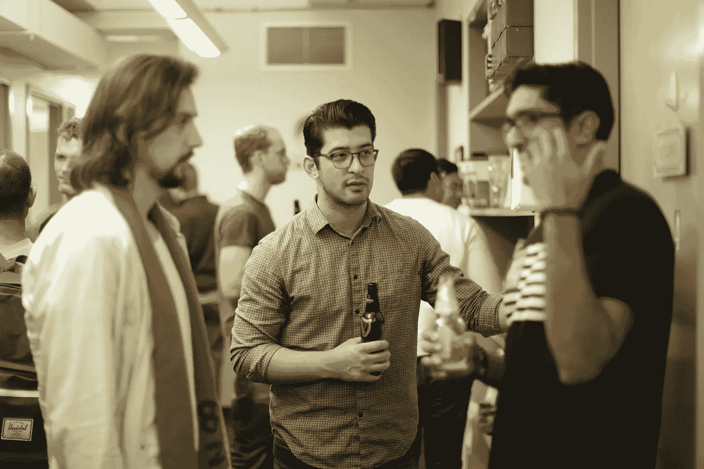
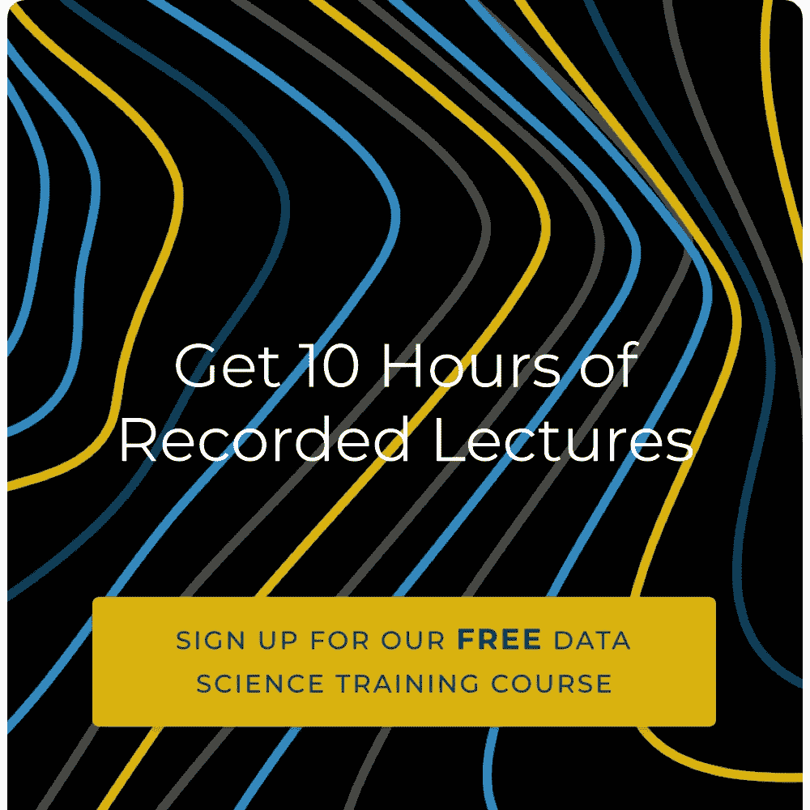

# 寻找我作为数据科学家的第一份工作的努力

> 原文：<https://towardsdatascience.com/the-struggle-to-find-my-first-job-as-a-data-scientist-64594c88b67e?source=collection_archive---------17----------------------->

## KY=MX+B

在我选择撰写的这个奇怪的[个人专栏](/my-first-steps-from-0-technical-skills-to-machine-learning-engineer-c261ab6013e3)的最新部分中，我分享了我对数据科学的兴趣以及我参加编码训练营的决定。虽然这篇文章本身很有趣，但它也是以自我为中心的，只关注我的经历，仅此而已。

更重要的是，对于那些寻找建立数据科学职业生涯中最重要一步的信息的人来说，它提供的信息很少——**找到你的第一份数据科学工作** *。*

我在 2017 年试着找一份像这样的工作

这个疫情无疑是一个找工作的可怕时期，尤其是如果你即将毕业并寻求你在机器学习领域的第一份工作。作为一个目前采访入门级数据科学家的人，我想就新数据科学家可以更好地集中精力的地方提供我的故事和观点。

所以，这一次，我想谈谈我找到第一份数据科学工作的经历——失败、缺点等等。

无论你已经参加或正在参加编码训练营，即将获得该领域的学位，或者只是想利用这段时间改变职业生涯，我希望我可以从我自己的错误和我目睹的其他人所犯的错误中提供一些见解。

写过去的天真有点尴尬，但我希望我能提供一些建议，我希望我在寻找我的第一份全职工作时就有这些建议。

## 背景

如果你没有阅读本专栏的上一篇帖子，我在 2016 年完成 MS 后参加了一个数据科学训练营(在一个不相关的领域)。我还在一家生物技术公司做了一年的数据分析师，做非常基础的研究。在培养了对数据的实际兴趣之后，我找到了数据科学训练营，接受更正规的技术教育。

从那时起，我开始了从一个没有什么技术技能的新手到一个有竞争力的数据科学申请者的旅程。

## 第一个月:手机屏幕和被误导的自信

我在数据科学训练营的经历让我成为了一名全面发展的候选人。训练营本身是全面的。我几乎一无所知(*我不相信你，我不得不问一个同学什么是机器学习甚至是第二周*)，然后出来了一个数据科学通才——在 R、Python、SQL 和各种 ML 知识方面都有实践。

数据科学欢乐时光

当我获得认证并开始申请和联网时，我练习 Python、SQL 和通用机器学习，为技术面试做准备。在不过分谨慎或挑剔的情况下，我向我能找到的每一份相关数据科学的工作发出了一长串不费力的申请。我的这种懒惰行为得到了 4-5 个电话屏幕的奖励——鉴于我的生物学背景，两家生物技术公司和几家初创公司。

对于那些不熟悉的人，数据科学职位的面试通常遵循以下两个或更多步骤:

1.  招聘人员或团队成员的初始电话筛选
2.  技术电话屏幕或带回家的编码挑战
3.  与团队成员的面对面访谈(通常也是技术性的)

手机屏幕本身非常简单。许多招聘人员可能会更多地谈论职位和公司本身，而不是问你任何技术性的问题。在这个阶段，我对这些公司做了很少的研究。比起我可能为之工作的公司，我对有工作的前景更加兴奋。我阐述了我的经历中似乎特别相关的部分。手机屏幕似乎总是运行良好。很快，我进行了两个阶段的面试。

我满怀信心地拿起电话参加了我的第一次技术面试，我之前参加大学考试和技术性较低的工作时也有同样的心态和准备:记住一堆相关信息，并即兴回答所有问题。

我相信你能想象这是怎么回事。

面试官问了一个相对简单的 Python 问题，可能类似于“*给我写一个函数，判断列表中任意两个数字的总和是否为 0”。*我彻底搞砸了。在这次采访之前，我已经浏览了 Python 的信息，但是我还没有足够的*练习*编码。我很难找到解决方案，对自己的语法和逻辑也不自信。我可耻地离开了电话，意识到我将从那家公司得到的回应(或缺乏回应)。

## 第二个月:一长串技术面试

被这种不熟悉的经历弄得底气不足，我开始练习各种 Python 题。列表中哪些数字的总和为 0？两个列表之间有哪些值相交？我自问自答，直到我为下一次面试做好准备。

我再次拿起电话，对自己的技能充满了自信和自豪，渴望被问到任何我练习过的 Python 问题。

只是这次我没有被问到任何关于 Python 的问题。相反，我被问了一个 SQL 问题——和我第一次面试中的 Python 问题一样复杂。从数据库中检索一些统计数据，同时替换一些字符串，基本上是一个带有`GROUP BY`和`HAVING`的`CASE`语句。

这不是我，但我经常有这种感觉。

愤怒之余，我听从了自己的意见，再次跌跌撞撞地走上了第一次面试的老路。我确信两周前就知道的可笑的简单事情从我的大脑中消失了。面试的焦虑加上我对 SQL 的缺乏，表现在对我的回答明显缺乏信心。再说一次，我离开电话时知道公司的反应会是什么。

这种循环持续的时间比我愿意承认的要长，所以我在这里总结一下:在每次技术面试中，我都被问到一些我似乎没有实践过的事情，尽管每次面试后我都有显著的进步，但我仍然无法对这种模式做出积极的反应。

这并不是说我是一个糟糕的程序员。我只是依赖于手边的文本编辑器和学习材料。从更难的问题(在纸上进行逻辑回归)到最简单的问题(列表和元组之间有什么区别)，我开始意识到我的方法的问题。

我很高兴地说，我所有的失败不一定是因为技术挑战。由于这是我的第一份工作，也有少数几份工作我表现不错，但没有达到最低经验要求。我不太确定与技术和经验相关的失败的比例，但是令人尴尬和尴尬的技术缺陷肯定是最困扰我的——也是后来迫使我更加努力的原因。

带回家的技术挑战肯定要好得多(显然)。我从训练营获得的大量材料有助于支持我解决问题的方法。我甚至收到了一些邀请！然而，他们更侧重于分析(这是我不感兴趣的),或者没有提供我觉得能够在纽约生活的薪水。

总的来说，我肯定有过 15 次左右的技术面试，涵盖了令人沮丧的广泛内容——没有一次有结果。我有一个选择:我可以通过失败的经历继续磨练我的技能，或者我可以努力变得积极主动，而不是被动的 T2。

是时候重新评估我的方法了。

## 第三个月:找到我的节奏

虽然我在这里专注于我的失败，但我确实取得了一些成功:我最终为我毕业的 bootcamp 做了兼职工作，并接受了一家小型应用初创公司的另一份兼职数据科学家职位。

现在我忙于两份兼职工作，我放慢了疯狂的全方位求职过程，并重新考虑了我的方法。我申请了大量的工作，并获得了大量的面试机会。

然而，我在面试中应用的理念和我发送申请时一样:数量重于质量。起初，批量申请并尝试学习天底下的每一项数据科学技能是没问题的。然而，当涉及到具体的采访时，我严重缺乏准备和研究。

所以，我改变了我的流程。我不再浏览公司的使命和工作要求，而是更深入地了解公司在寻找什么。我开始小心翼翼地为每个空缺职位准备我的简历。甚至在最初的电话筛选之前，我就重读了工作描述的更多细节。可能我意识到的最重要的事情是**不是所有的数据科学工作都是平等的**。也许这个角色侧重于商业智能，也许它更面向数据工程，或者也许它需要 Python 中的机器学习。

我把我的申请集中在我最擅长的领域:编程。我开始放弃那些我可能表现不佳或者对追求长期职业不感兴趣的角色。

看看她做的所有研究。我打赌她会通过面试的。

结果，我面试的技术部分有了显著的提高。**工作描述基本上是我为测试**准备的学习单——我的复习。我一直试图掌握整个学科，但什么也没记住，而每份工作都公开发布他们认为重要的技能列表，甚至为你订购这些技能。

同时，我从我的两个兼职数据科学角色中获得了实践经验。用 Python 处理真实的客户数据，并试图解决真实的业务问题，让我在与招聘人员交谈时更加流利和舒适。在技术面试中，我明显更冷静。我发现自己可以从容不迫地给出深思熟虑且充满自信的答案。

不要花几个月的时间自己学这个。从我的错误中吸取教训。通过阅读职位描述和*在电话面试中提出的好问题，尽可能多地了解技术面试。*

## 第四个月:寻找我的实习和职业

找到我已经转化为职业生涯的实习，是我的一般经验、特定角色准备和纯粹运气的完美结合。

有一天，我正在训练营工作，突然被另一个不知道从哪里冒出来的员工打断了。他说辉瑞在隔壁面试人，想知道我有没有兴趣。我低头看着我的装备:一个图形 t 恤，紧身牛仔裤和面包车。怎么回事，对吧？不妨。

这次面试和其他许多面试一样:混合了 Python、SQL 和理论问题。只是这次我终于觉得舒服了。我事先没有时间做心理准备，而且(与之前的许多面试不同)我现在有了可以依靠的真实经验。面试感觉很顺利。

我的女朋友对拍这张照片百分百不满意

我晋级了下一轮。通过带回家挑战后，我被邀请参加最后一轮现场面试——3 个小时的现场面试。在无偿地研究了职位描述之后，我满怀信心地走进了辉瑞大楼，并为最后的挑战做好了准备。

虽然我肯定没有搞定，但我的准备和经验得到了回报。这可能是我迄今为止面临的最大的技术挑战:Python、ML、SQL、Spark、通信、逻辑……这绝对是艰难的。我差一点就通过了初级流程，并接受了实习，这让我成为了现在的机器学习工程师。

## 小费和…嗯，是的，小费。

这就是了。虽然这是个故事，但我确信将实际的要点浓缩成零碎的功能单元会更有帮助。所以，给你:

每天练习。决定你技术面试成败的是经验和舒适度，这不是你一天就能学会(或一周就能记住)的。每天分配时间来解决问题，而不需要谷歌或堆栈溢出的支持。

*用数据科学解决现实商业问题*。通过将您的技能应用到您认为可以从数据科学中受益的真实场景中来实践。你不会从你的角色中复制/粘贴教程——你可能正在解决尚未解决的问题。让自己陷入困境会迅速提升你的技能。

*集中你的技能。*数据科学是一个定义不清的宽泛领域。你是程序员、数学家、讲故事的人，还是别的？入门水平不可能什么都精通。专注于发展你的优势和兴趣，申请适合这些技能的工作。

阅读职位描述。在技术面试之前，这一点怎么强调都不为过。虽然有时会有很多招聘人员，但是各种技能的优先顺序和措辞可以让你通过专注于你的学习来通过技术部分。使用这个和电话屏幕作为您的技术学习表。

面试时要放松，慢慢来。自信在面试中大有帮助。就我个人而言，当我紧张、变得难以理解时，我会说得很快。在面试过程中放慢速度来组织你的思维没有什么不对，这样你就可以给出一个简洁明了的答案，而不是一个不知所云的意识流。

*不要气馁！*熟能生巧，技术面试也不例外。您必须同时应对压力和不熟悉的技术环境(白板编码比 MS Paint 中的编码更糟糕)。你肯定会失败，但这只会让你为下一次做好准备。

我会补充更多我想到的建议，通常你可以在 LinkedIn 上联系我，或者在 Twitter 上成为我黯淡追随者的一部分。

点击[此链接](https://cta-redirect.hubspot.com/cta/redirect/2450960/3a3c614b-df15-406e-b42e-fd0ef4fb0ef0)或下图，选修更全面的数据科学课程！

