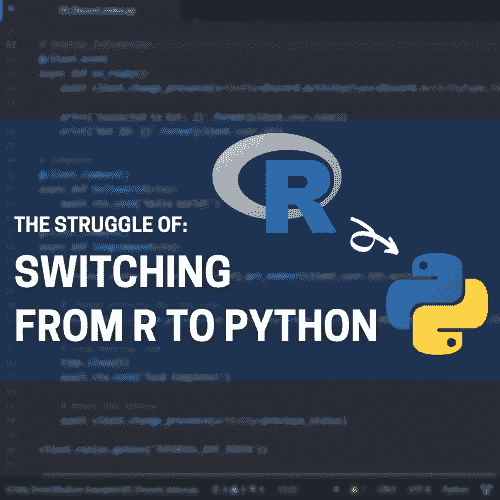

# 当我从 R 转换到 Python 时的挣扎

> 原文：<https://towardsdatascience.com/the-struggles-i-had-when-switching-from-r-to-python-baca0139b01b?source=collection_archive---------7----------------------->

## 观点| Python |常规

## 学会识别你最常见的错误会让你的效率提高十倍



当我开始学习数据科学时，我是从 R 开始学习的，我是统计学专业的，在学术界，R 比 Python 有更重的偏好。学习这两种语言本身并没有什么错，但是在我参加工作之前，我已经花了几年的时间来掌握 R，Python 也成为了一项要求。

我开始我的第一份工作时，期望能够使用我在 r 中拥有的工具建立模型并自动化一切。当我发现我的工作中没有人了解 r 的任何事情时，我预测和消除所有工作的梦想很快破灭了。这意味着如果我继续前进，我创建的任何东西都不会得到 IT 部门或任何同事的支持。我可以让自己的工作自动化，但如果我开始在公司里往上爬，没有人能像我这样做。

随着时间的推移，我开始更多地与数据科学团队和他们的 IT 支持团队合作。他们向我介绍了一种叫做 Python 的奇妙语言。和任何新的语言或工具一样，都有一段学习曲线。我挣扎了很久。下面是 Python 的一些不同之处，它们确实让我犯了一个错误。

# 哦，我没有保存


由[Damir spanick](https://unsplash.com/@spanic?utm_source=medium&utm_medium=referral)在 [Unsplash](https://unsplash.com?utm_source=medium&utm_medium=referral) 上拍摄的照片

是的，首先是我无法保存修改后的数据框。在 R 中，可能是这样的(当使用`dplyr`时):

```
dataframe <- dataframe %>%
    select(-col1)
```

如果您不太了解`dplyr`，这段代码只是删除了名为`col1`的列。由于数据帧`dataframe`和函数`select`在物理上是相互分离的，我并不期望输出被保存，所以我不假思索地将它分配给`dataframe`来覆盖它，而不使用`col1`列。

为了用 Python 做同样的事情，我曾经做过这样的事情:

```
# The wrong way!
>>> dataframe.drop('col1')
```

头几次我这样做的时候，我会在接下来的一两个小时里小声嘟囔脏话，想知道为什么`col1`仍然是我数据框的一部分。你可能会问，为什么我不把输出赋给原始变量呢？在 python 中，我们得到了这些叫做方法的好东西，比如`.drop()`。它们在物理上依附于它们所作用的物体。对于 Python 新手来说，我们希望相信他们只是改变对象，而我们不需要保存任何东西。唉，Python 的奇妙世界并不是那样运作的。

```
# This actually SAVES the modification
>>> dataframe = dataframe.drop('col1')
```

这就是我从 R 转换到 Python 的第一次挣扎:

> 我从来不记得在修改 Python 数据框后保存它们

## 但是等等，你能做到的！

这本身并不是世界上最令人困惑的事情，只是与 R 处理事情的方式不同。但是熟悉 Python 数据框方法的人可能知道一个小技巧，它不要求您在删除列后保存数据框…

在你们所有的 python 专家都竭力反对如何修改数据框之前，是的，我现在知道了。如果我真的不想重新分配变量，我可以把`inplace=True`参数添加到`.drop()`方法中。很好很灵活，问题解决了，对吧？

```
# We don't need to save changes here
>>> dataframe.drop('col1', inplace=True)
```

这当然可以，但是如果一个方法没有`inplace`参数，或者我使用了一个函数而不是一个方法，会发生什么呢？对这门语言来说，有选择并不能使东西更容易记忆或使用。

在具备完成操作到位的能力方面，我是完全赞成的。见鬼，它甚至实现得很好，因为就地修改数据框并不是默认行为。但那是针对数据帧的。

列表呢？如果我创建一个字符串列表，许多字符串方法，如`.append`、`.insert`、`.pop`和`.remove`会修改列表，而不需要保存结果。以这个例子为例，我们从列表中删除了 9(显然，因为 7 吃了 9😏).

```
>>> x = [7, 8, 9]
>>> x.remove(9)
>>> print(x)
[1] [7, 8]
```

更糟糕的是，在学习 Python 的典型方式中，在学习任何关于数据框的知识之前，您将学习列表及其工作方式。这种混乱是因为在 Python 中，列表不同于数据框列，就像 R 向量不同于数据框列一样。

这是我学习 Python 的第二个大问题:

> 一些对象(列表)通过它们的方法被就地修改，而另一些对象(数据帧)需要保存以便通过它们的对象方法修改它们

这是需要学习的事情之一，在某种程度上只是记住每个不同的对象是如何工作的。我想从 R 到 Python，有些东西看起来不一样。这让我开始了下一场斗争…

# 函数住在哪里？


马库斯·温克勒在 [Unsplash](https://unsplash.com?utm_source=medium&utm_medium=referral) 上拍摄的照片

在 R 中，我们经常不经意地将所有包加载到工作区中。r 将尝试通过名字在加载的库中找到一个函数，如果它存在就执行。

有时你加载一个包，它会从另一个包中“屏蔽”一个函数。如果您不熟悉，这仅仅意味着它将使用最新加载的包含该函数的包中的函数版本。如果你想指定一个不同的库版本的函数，你可以这样做。只需将包名放在函数之前，用双冒号(`::`)隔开。以下是一些例子:

```
# Uses the "base" library version of filter
filter(x)# Uses the "dplyr" library version of filter
library(dplyr)
filter(x)# Uses the "base" version, even if it's masked
base::filer(x)
```

这就是 r 中函数的全部内容。它使用最新加载的版本，除非你另外告诉它。

在 Python 中，事情有点不同。有三种主要的方法可以调用函数。我在这里不太严格地使用函数这个术语，因为对于 R 用户来说，方法看起来很像函数。

*   一个函数名，类似于`len()`
*   一个模块的功能，就像`pd.DataFrame()`
*   来自对象类的方法，比如`df.drop()`

您可能会在如下代码中看到它们。

```
# A function
len(df)# A function from a module
pd.DataFrame(myDict)# An object class method
df.drop('col1')
```

## 我是否完全需要一个函数、方法或其他东西？

这怎么搞混了？在 Python 中，你需要知道如何调用 R 中的函数。在 R 中，如果你想知道一个数据帧有多少列，你只需使用`ncol()`函数。在 Python 中，没有内置的函数来做这件事。相反，您可以在 DataFrame 的`.columns`属性上使用`len()`函数。

```
# R
ncol(df)# Python
len(df.columns)
```

Python 函数让 R 用户感到困惑的另一个例子是寻找数据帧中的行数。在 R 中，我们再次使用一个函数，`nrow()`。在 Python 中，我们对整个数据框调用`len()`，而不是它的`columns`属性。

```
# R
nrow(df)# Python
len(df)
```

所以在这里，我们使用完全相同的`len()`函数来获取关于 Python 中数据框的不同信息。缺点是必须记住将什么作为参数传递给`len()`。r 保持简单。如果我们想要列的数量，使用`ncol()`。行数？没错，`nrow()`。

让我们再举一个例子来说明知道函数在 Python 中的位置有多困难。假设我们想知道行数和列数。在 R 中，`dim()`函数将很好地为我们服务。它将返回一个带有行数和列数的向量。为了在 Python 的一次调用中做到这一点，我们需要使用`.shape`属性。`.shape`将返回一个具有行数和列数的元组。

```
# R
dim(df)# Python
df.shape
```

因此，如果您仍然同意我的观点，我们甚至没有使用 Python 中的方法或函数，我们只是在查找数据框的属性。现在你知道了:

> r 使用函数来完成任务，而在 Python 中，您可能必须使用函数、对象方法、对象属性或某种组合来完成相同的任务

这并没有错，但是对于习惯于只使用一个函数的人来说，要记住如何获取信息就变得困难多了。

## 我怎么能调用正确的函数呢？

让我们试试别的东西。假设我们想要创建一个数据框架，这在两种语言中都是很常见的任务。在 R 中，我们只使用 dataframe 函数。在 python 中，我们必须指定 python 应该在哪里寻找 dataframe 函数，特别是在`pandas`库中。

```
# R
x <- data.frame(X = c(1, 2, 3, 4, 5))# Python
x = pd.DataFrame({X: [1, 2, 3, 4, 5]})
```

这是不同的，因为我们必须在 Python 中指定函数来自哪个包。r 将只使用包含该函数的最新加载的包。python 实现的好处是你总是知道函数来自哪个包。这是不同的，如果您不习惯于需要指定您的函数来自哪个包，这会引起一些混乱。

> 有时候在 Python 中，你需要指定你的函数来自哪个模块，其中 R 会猜测使用哪个包

## 为什么我的函数会附加到我的对象上？

最后一个让我对 Python 函数着迷的是对象方法。它们本质上并不坏，但它们可能会让我们这些 R 用户感到困惑。正如我们前面提到的，它们有时就地作用于对象，而其他时候它们需要被保存在原始对象上来修改它。这一节是关于如何使用函数的，这在 python 中很难记住。

在 R 中，我们通过名字调用函数，添加对象和选项作为参数。使用管道操作符`%>%`，您可以定义一个对象作为函数的第一个参数。每个动作都在告诉 R“这样做”，每个管道操作员都在说“然后”当我们把它们串在一起时，我们可以以一种高度可读的格式同时完成多个动作。

```
df %>%
 select(-col1) %>%
 summarize(avg_col1 = mean(col1))
```

使用管道是我在 R 中能想到的与 Python 中对象方法工作方式最接近的类比。它们可以串在一起，每一步都充当一组“那么做吧”的指令。它们的书写方式只是有一点不同。

```
df.drop('col2', 1).mean()
```

上面的语句取`df`，然后去掉`col2`，然后得到其余值的平均值。类似的行为，但是不同的实现。

> Python 方法可以串在一起，就像我们在 R 中使用管道操作符一样，只是不太容易阅读

# 阅读你的错误


照片由[瓦尔瓦拉格拉博瓦](https://unsplash.com/@santabarbara77?utm_source=medium&utm_medium=referral)在 [Unsplash](https://unsplash.com?utm_source=medium&utm_medium=referral) 拍摄

不，真的，这听起来可能很奇怪，但是去 Python 的时候，我从来不想看错误是怎么说的，或者花力气去找出它们。我已经掌握了 R，当事情不运行时，我通常不用读错误就已经知道要查找什么。

在获得一些这方面的经验后，帮助其他 R 到 Python 的转换者变得容易多了。这些错误会告诉我他们在处理哪些问题。

> 仔细阅读你的错误，理解它所指的代码和它所说的是错误的

在 Python 中，我得到的错误比在 R 中多得多，这令人沮丧。但是错误对学习和掌握一门语言非常有帮助。让我们以这个为例:

```
>>> '2' + 2
Traceback (most recent call last):
  File "<stdin>", line 1, in <module>
TypeError: Can't convert 'int' object to str implicitly
```

python 中的错误被很好地标注出来。错误的第一部分会说**回溯**，通常带有一些带有**文件**和**行号**的文本。对于初学者来说，对于更复杂的错误，这并不总是最有帮助的，但是请记住它就在那里。

错误文本的下一部分是**类型错误**。这是一种错误。Python 中有许多类型的错误(参见官方 Python 文档中的一大堆错误)。这个说明了代码中使用的对象类型导致了错误。

错误的下一部分给出了遇到的错误的更多细节。这里我们可以看到 python 不知道如何将一个`int`对象添加到一个`str`对象中。从这里，我们可以很容易地修复我们的代码。如果目标是将两个字符串连接在一起，我们可以给第二个 2 加上单引号。

```
>>> '2' + '2'
[1] '22'
```

如果目标是将两个数字相加，我们需要去掉第一个数字上的单引号，这样它就有了正确的类型。

```
>>> 2 + 2
[1] 4
```

无论哪种方式，阅读错误都有助于我们了解对象需要是相同的类型，我们的代码才能工作。

不确定错误意味着什么？在网上搜索一下。有些错误比其他的更复杂，有些可能是由于代码的其他部分造成的。尽可能简单地分解它，一点一点地解决它。

# 结论

您将很快掌握 python，就像您掌握 R 一样快。在你们之前有许多人有从一种语言到另一种语言的经历。

让我们回顾一下我作为 R 用户学习 Python 时学到的经验:

*   在 Python 中，一些方法就地修改对象(如列表方法)，而另一些方法需要保存原始变量的输出来修改它(如数据框方法)
*   r 几乎对所有事情都使用函数，而 Python 混合使用函数、对象方法和对象属性来做同样的事情
*   r 一般会猜测你的函数来自哪个库。Python 通常需要被告知去哪里找
*   r 可以使用钻杆操作器`%>%`将作业串在一起。Python 对象方法有时可以串在一起实现相同的结果
*   当代码失败时，r 和 Python 都会提供错误。这些包含有价值的信息，学习阅读和纠正它们是真正掌握语言的唯一途径

如果其他方法都失败了，问问你的团队或班上更有经验的人你哪里做错了。如果那不起作用，就去问互联网。有大量的免费和付费资源。看看下面的一些:

*   [w3schools.com](https://www.w3schools.com/python/)—Python、R、SQL 和其他编程和脚本语言的综合知识库。它对每个人都是免费的，并且有更多语言和概念的交互式例子。
*   [Datacamp.com](https://www.datacamp.com/join-me/ODczNDQ5)(付费链接)——互动编程教程，主要围绕 R 和 Python 进行数据分析。他们免费提供每门课程的第一章，所以继续尝试他们的 Python for R 用户课程吧！
*   [Python for R Users](https://amzn.to/33sh2yE) (付费链接)——专为让你快速掌握 Python 而写，这本书主要关注可操作代码和执行你已经知道的 Python 分析！

[](https://realdrewdata.medium.com/membership) [## 通过我的推荐链接加入 Medium-Drew Seewald

### 作为一个媒体会员，你的会员费的一部分会给你阅读的作家，你可以完全接触到每一个故事…

realdrewdata.medium.com](https://realdrewdata.medium.com/membership)