# 斯皮尔曼等级相关系数的微妙性

> 原文：<https://towardsdatascience.com/the-subtlety-of-spearmans-rank-correlation-coefficient-29478653bbb9?source=collection_archive---------16----------------------->

## 统计数字

## 单调关系的未知部分


照片由 [Linus Mimietz](https://unsplash.com/@linusmimietz?utm_source=unsplash&utm_medium=referral&utm_content=creditCopyText) 在 [Unsplash](https://unsplash.com/s/photos/physics?utm_source=unsplash&utm_medium=referral&utm_content=creditCopyText) 上拍摄

```
**Table of Contents**[**Introduction**](#1edb)1\. [Spearman’s Rank Correlation with identical values](#b785)
2\. [Finding mathematically Spearman’s Rank Correlation](#8058)
3\. [With Numpy](#bfdd)
4\. [With Pandas](#22d4)
5\. [Investigation the subtlety of Spearman correlation coefficient](#0a22)[**Conclusion**](#ed46)
```

# 介绍

在本文中，我想使用包含相同值的数据来探究 Spearman 的等级相关系数。我还揭示了斯皮尔曼值如何根据函数的性质而变化。

在`[scipy.stats.spearmanr](https://docs.scipy.org/doc/scipy/reference/generated/scipy.stats.spearmanr.html)`文档中，没有明确说明使用序数数据。我也想深入研究一下。

如果你有兴趣阅读关于 Spearman 使用有序数据的等级相关系数。请参考以下文章。它解释了使用四种不同的方法找到 Spearman 的值，简化公式、通用公式、Pandas `corr`和手动计算。

在本文中，我想使用包含相同值的数据来探究 Spearman 的等级相关系数。我还比较了斯皮尔曼和皮尔逊价值观之间的差异。

在`[scipy.stats.spearmanr](https://docs.scipy.org/doc/scipy/reference/generated/scipy.stats.spearmanr.html)`文献中，没有明确说明使用序数数据。我也想深入研究一下。

# 具有相同值的 Spearman 秩相关

斯皮尔曼等级相关系数， *𝜌𝑟𝑥* ， *𝑟𝑦* 显示了两个有序数据之间的相关性。一个序数数据如何随着另一个序数的变化而变化。

斯皮尔曼秩相关的一般公式如下。当你有相同等级的数据时，你必须使用这个公式而不是简化的公式。

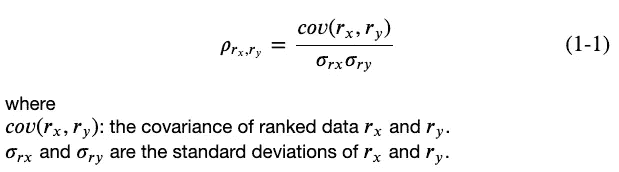

让我们导入必要的库。

请注意，我们下面的数据有相同的排名。我们使用`scipy.stats.spearmanr`找到斯皮尔曼系数。返回的系数值是 0.710560。

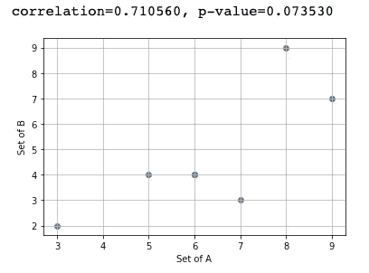

## 熊猫角

[Pandas corr](https://pandas.pydata.org/pandas-docs/stable/reference/api/pandas.DataFrame.corr.html) 需要设置方法。我们用`spearman`。它返回相关矩阵，所以我们需要选择`[0,1]`这是 Spearman 的相关系数。

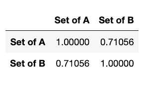

# 用数学方法寻找 Spearman 秩相关

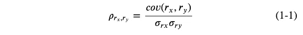

公式需要 *𝑟𝑥* 和 *𝑟𝑦* 的协方差， *𝜎𝑟𝑥* ， *𝜎𝑟𝑦* 的标准差。

## 排名数据

我们需要使用`scipy.stats.rankdata`对数据进行排序。

它返回以下内容。

```
[5\.  3.5 2\.  1\.  3.5 6\.  7\. ]
[2\. 4\. 4\. 1\. 4\. 7\. 6.]
```

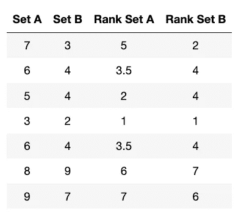

在 A 组中，有两个 6，他们的排名是第三和第四。

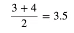

在集合 B 中，有三个 4，它们的排名是第 3、第 4 和第 5。因此，他们的级别是:

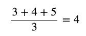

# 使用 Numpy

Pandas 和 Numpy 对标准差、方差和协方差等使用不同的 ddof 值。

# 和熊猫一起

在 Pandas 文档中，没有说明`pandas.cov`使用默认值`ddof=1`。我们需要用`ddof=1`来表示标准差。

# 斯皮尔曼相关系数的微妙性研究

现在让我们研究一下 Spearman 和 Pearson 相关系数之间的差异。

正如我在引言中所写的，斯皮尔曼的等级相关系数、 *𝜌𝑟𝑥的*、 *𝑟𝑦的*显示了两个序数数据之间的相关性。一个序数数据如何随着另一个序数的变化而变化。不为人知的是，即使 rx 和 ry 和谐地变化，当 *𝑟𝑦* 减少而 *𝑟𝑥* 增加时，斯皮尔曼值下降。

让我告诉你这是什么意思。首先，我们用线性关系比较皮尔逊和斯皮尔曼相关系数。

## 研究线性关系

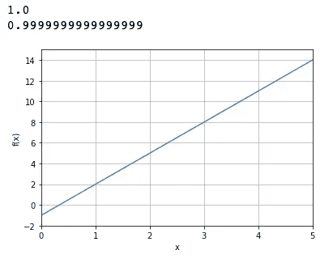

对于线性函数，Spearman 和 Pearson 是相同的值。

## 调查二次关系

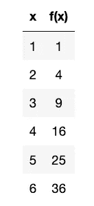

```
# Spearman
1.0
# Pearson
0.9833690525971426
```

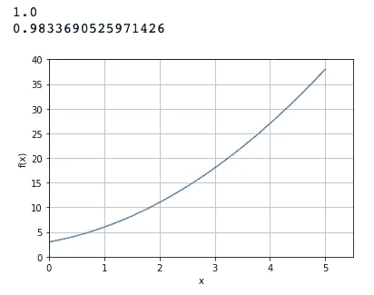

斯皮尔曼值为 1。然而，即使我们使用相同的函数，使用不同的域会产生不同的 Spearman 值。这是因为当 x 值增加时，f(x)的值减少。一旦函数上下波动，Spearman 值就会降低。

```
# spearman
0.48511548511548513
# pearson
0.6104541477467882
```

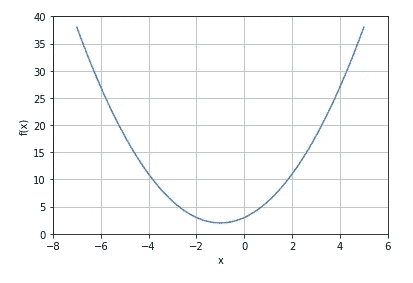

## 研究三次函数

```
# spearman
0.9144132575042309
# pearson
0.8176029571135436
```

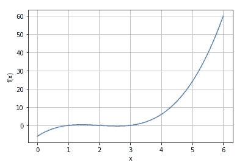

由于上面的三次函数在给定的域内减少了值，因此 Spearman 值不是 1。如果把定义域限制在函数增加的值，Spearman 就是 1。

```
# spearman
1.0
# pearson
0.9849816814186138
```

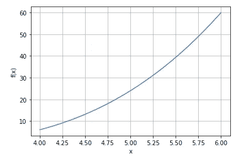

# 结论

*   `spearmanr`需要排序数据，因此您的数据需要是有序的。一般来说，你的数据不是有序的，所以当你寻找矛兵时，使用`scipy.stats.rankdata`是一个好习惯。
*   以上观察来自于协方差的定义。如果一个变量的较大值对应于另一个变量的较大值，则协方差为正。当一个变量的较大值主要对应于另一个变量的较小值时，变量往往表现出相反的行为，协方差为负。这影响了斯皮尔曼的价值。
*   也建议绘制一个图表来查看任何值正在减少，因为它会影响你的 Spearman 值。

**通过** [**成为**](https://blog.codewithshin.com/membership) **会员，可以完全访问媒体上的每一个故事。**


[https://blog.codewithshin.com/subscribe](https://blog.codewithshin.com/subscribe)

# 相关故事

[](/discover-the-strength-of-monotonic-relation-850d11f72046) [## 使用有序数据的 Spearman 等级相关系数

### 发现单调关系的力量

towardsdatascience.com](/discover-the-strength-of-monotonic-relation-850d11f72046) [](/exploring-normal-distribution-with-jupyter-notebook-3645ec2d83f8) [## 用 Jupyter 笔记本探索正态分布

### 使用 scipy 和 matplotlib 的正态分布初学者指南

towardsdatascience.com](/exploring-normal-distribution-with-jupyter-notebook-3645ec2d83f8)