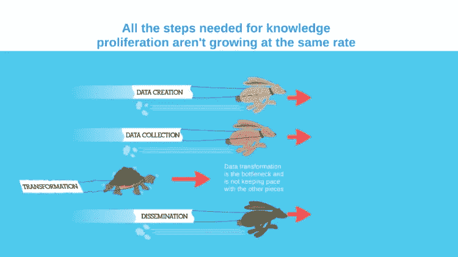

# “大数据”的成功与彻底失败

> 原文：<https://towardsdatascience.com/the-success-resounding-failure-of-big-data-50b3f17756f1?source=collection_archive---------34----------------------->

## **炒作周期顶部的回顾**

图片由 Samuele Porta 提供

前几天在做一些研究时，我偶然发现了一份我在一次餐厅营销高管会议上做的[演示文稿的修改版，当时“大数据”正处于 Gartner 炒作周期的顶峰。很难相信这是 7 年前的事了，距离 Gartner 完全停止跟踪“大数据”已经过去了 5 年。流行语是一种有趣、善变的东西，尤其是当它们突然席卷了一个以前由极客和内向者居住的行业。几年之内，我们的头衔从“数据极客”升级到了“数据科学家”，然后是一个令人不安的标题](https://prezi.com/kt8xky74235x/the-big-data-frontier-meg-presentation/) [HBR 说我们是 21 世纪最性感的职业。](https://hbr.org/2012/10/data-scientist-the-sexiest-job-of-the-21st-century)到 2014 年，大数据处于炒作周期的顶端，投资资金正涌入任何能够足够快速地改变其本地语言的业务。这是一个超现实的事件转折，突然有人自称为“大数据”专家，他们甚至从来没有笑过一个数学笑话，我在台上面对 300 名营销高管讲话，他们中的许多人在数据科学家性感之前很久就在自己的董事会房间里睡过我的数据演示。像所有的流行词一样，“大数据”这个词开始变得模糊只是时间问题，但宣传的有限生命不应与宣传背后的运动的经济和社会影响混淆。数据洪流是真实的，在实现地震般的经济和社会影响方面，我们仍处于早期阶段，但这种影响与我们许多人的预期不同。

**“大数据”的成功**

对 2020 年数据经济总经济价值的估计大相径庭，从数千亿美元到数万亿美元不等，因此这一现象的规模可能有争议，但其规模巨大的事实不再有争议。尽管在文章[中避免使用“大”这个词，但《经济学人》](https://www.economist.com/briefing/2017/05/06/data-is-giving-rise-to-a-new-economy)在 2017 年预测，“数据经济”将成为本世纪的驱动力，就像化石燃料驱动 20 世纪一样。在大多数对当今“数据经济”的估值中，它们计入了数据移动、处理和存储公司，以及亚马逊、谷歌和脸书等公司的广告和商业收入。

**“大数据”的失败**

尽管数据经济大幅增长，并且人们普遍认为利用数据的企业比不利用数据的企业更成功，但“大数据”和数据科学实施的成功率却低得惊人。虽然很难得到一个精确的数字，但据我估计，失败率在 60%-85%之间。

60–85%的失败率是一个不必要的惨淡记录，虽然数据项目失败的原因有很多，但罪魁祸首通常是因为项目是由数据基础架构专家牵头的，他们没有完全理解数据项目服务的更大的业务目标。通常，他们的资质对于构建电子商务网站或基本的报告引擎来说是无可挑剔的，但对于数据科学计划与电子商务或报告引擎的技术和流程要求的深刻差异却知之甚少。

成功的数据科学项目始于对需要解决的特定业务问题的清晰愿景，并由自上而下与该愿景保持一致的团队推动。不幸的是,“大数据”时代的大多数数据项目并不是这样开始的。相反，他们会从构建一个通用数据平台或“数据湖”开始，旨在存储来自所有来源的所有数据，而不涉及具体数据用途的细节。第一站是一个看似便宜的 HDFS 文件系统(又名 Hadoop)，它看起来像是廉价的文件存储——除非你想查询它——然后你必须召集一个工程师团队，由于没有人有新技术的经验，你必须从脸书挖他们，并付给他们每个人比你的首席财务官更高的薪水。一旦您的数据湖在 6-12 个月后启动并运行，您仍然需要在其上构建一个报告层。如果您碰巧负责通过定制分析创建数据洞察力，那么很可能您是一个遥远的事后想法，并且在这个技术堆栈中没有真正的接入点。所以你通过报告层偷工减料地导出到沙盒服务器，在那里你必须恳求它让你安装 Python Jupyter 笔记本或 R 服务器。雪上加霜的是，您发现在这个超级强大的现代数据架构中，没有任何地方考虑到持续的数据卫生，因此您操纵的“简单”数据导出在每次拉取时都会返回相同的错误，并且没有用于纠正上游数据的协议。为了克服大规模数据湖的缺点，它实际上使相关数据难以访问，您的简单导出变成了一个单独的工作流和数据库，带有用 python 或 R 编写的独立 ETL 过程，您的“沙箱”在大小上迅速开始与主数据湖相匹敌。由于您的工作仍然是数据堆栈的非官方部分，您的 ML 代码仍然在您的沙箱中(或者您的笔记本电脑中)。上帝保佑那个可怜的家伙，他试图在你离开后收拾你留下的东西！

随着组织对数据的需求越来越多，人工智能/人工智能驱动的世界的期望成为焦点，在这场数据革命的第一阶段建立的数据系统和流程的缺点是一个肮脏的秘密，没有人愿意承认他们过高的数据湖投资。但这是事实，它很普遍，很明显。

**知识扩散**

将海量的比特和字节数据转化为有意义的信息是一项艰巨的任务，它正在我们眼前改变整个行业，重塑全球经济。然而，这与下一个层次相比就相形见绌了，下一个层次是将信息转化为知识。我不只是做一个语义上的论证——知识意味着对信息中的模式有更深一层的理解，以及做出推论的能力。知识推断事实，而理解——如果你相信某件事是假的，你实际上没有知识，但你有信息。在这个时代，这是一个至关重要的区别，因为信息流动的速度比我们判断事实和虚构的能力要快得多，正确或不正确以及坏演员通常会因为第一个而受到奖励，而不管准确性或真实性。在组织/项目层面，当你开始根据你正在寻找的知识/事实定义项目目标，并围绕知识目标调整系统和团队，而不是首先被你输入的数据驱动时，你将更快、更便宜和更持久地得到答案。

图片由 Samuele Porta 提供

在社会层面，像我们正在经历的数据和信息的大规模爆炸应该导致科学、技术和文化的同等或更大的爆炸。自机械印刷机发明以来，这是一次举世罕见的启蒙运动。人工智能将成为这一转变的中心，不是作为决策机器人，而是作为事实、知识的提供者，如果做得对，我敢说是公正的真理。然而，在我们当前的数据泥潭中，我们无法在信息作为错误信息和宣传传播之前将其转化为知识，这给我们的社会结构造成了真正的损害。从政治到反科学运动，它放大的声音不仅缺乏实质内容，而且造成真正的伤害。“大数据”或我们今天喜欢称之为“大数据”的成功从未像现在这样重要。