# 项目:使用探索性数据分析和机器学习分析自杀集群

> 原文：<https://towardsdatascience.com/the-suicide-crisis-in-data-7025f8551ca8?source=collection_archive---------39----------------------->

## 你刚刚被世界卫生组织**世卫组织**聘为**数据科学家**


[来源](https://unsplash.com/photos/4KJSjQM0oDQ)

**目录**

**1。简介**

**2。数据争论**

**3。探索性数据分析**

**4。机器学习+预测分析**

**5。结论**

**6。参考文献**

# **1。简介**

# 场景:

你刚刚被世界卫生组织(**世卫组织**)聘为**数据科学家**，世界各地报告的自杀**集群**数量**惊人。一名数据收集员将这些数据交给**执行数据分析**，并希望你检查我们数据中的**趋势** & **相关性**。我们想做一个**机器学习算法**，在那里我们可以训练我们的 **AI** 到**学习** &从经验中改进。因此，我们希望**预测**特定人群中的自杀人数。**

> [***“自杀是所有美国成年人死亡的主要原因之一，而且男女自杀率都在上升”(SSM Health)。*T50**](https://www.ssmhealth.com/blogs/ssm-health-matters/october-2019/middle-aged-men-more-likely-to-die-by-suicide)

从在*硅谷*的**心里**长大，我一直很好奇**因素**在自杀中起了什么作用。我在帕洛阿尔托的高中有太多的自杀案例。这个项目旨在探索潜在的因素。我们将使用从 **141 个**不同国家收集的 **44，000 个**数据点的样本，在 **80 年代的**到 **2016** 之间。

# **研究问题**

# 1.哪一年自杀人数最多？哪一年自杀人数最少？

# 2.哪个国家自杀人数最多？哪个国家自杀人数最少？

# 3.某些年龄段的人更倾向于自杀吗？

# 4.性别和自杀人数有什么关系？

# 特征和预测:

我们的**预测器** (Y，**自杀数**由 5 个**特征** (X)决定:

1.**国家**(分类)
2。**年份**:自杀年份(分类)
3。**性别:**男，女(分类)
4。**年龄**(分类)
5。**人口** : (#)

# **2。数据争论**

```
**import** **pandas** **as** **pd**
**import** **matplotlib.pyplot** **as** **plt**
**import** **numpy** **as** **np**
**import** **seaborn** **as** **sns**

**data = pd.read_csv('/Users/jarar_zaidi/Desktop/ML Projects/Practice Excel/who_suicide_statistics.csv')** *# look at 1st 5 data points*
data.head(5)
```

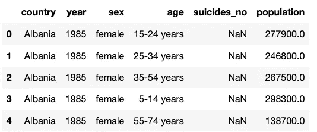

帮助我们了解我们正在处理的数据。

我们的数据集有 5 个**特征**(国家、年份、性别、年龄、人口)。我们将详细探讨所有这些。而自杀 _ 不正是我们想**预测的**吗。

```
**data.info()**
```

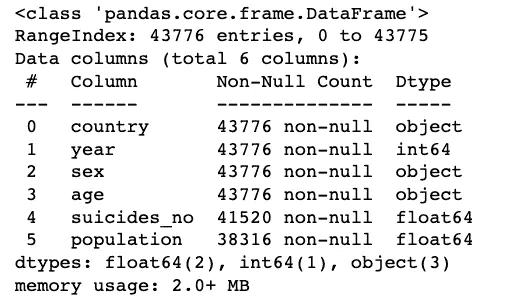

打印数据集的简明摘要

```
**print("(Rows, columns): " + str(data.shape))
data.columns**
```

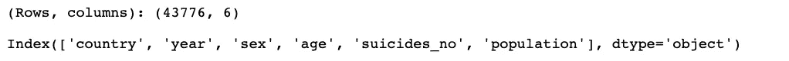

显示行数和列数。以及列名

```
**data.isna().sum()**
```

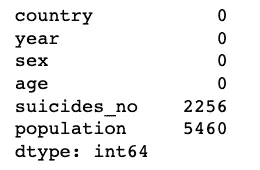

计算具有空值的每列中的总行数
#注意:所有 NA 列都是 Object 类型

我们有 2256 个**失踪**数据来自**自杀 _ no**5460 个**失踪**数据来自**人口**。

```
 **data= data.fillna(0)
data.isna().sum()**
```

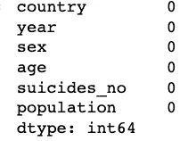

从上面我们可以看到，自杀 _ 人数&人口，有**空值**。
让我们使用“ **fillna** ”用零填充空值。现在，我们没有空列了！

```
**data['age'].unique()**
```


不同的年龄组

```
**data['country'].unique()**
```

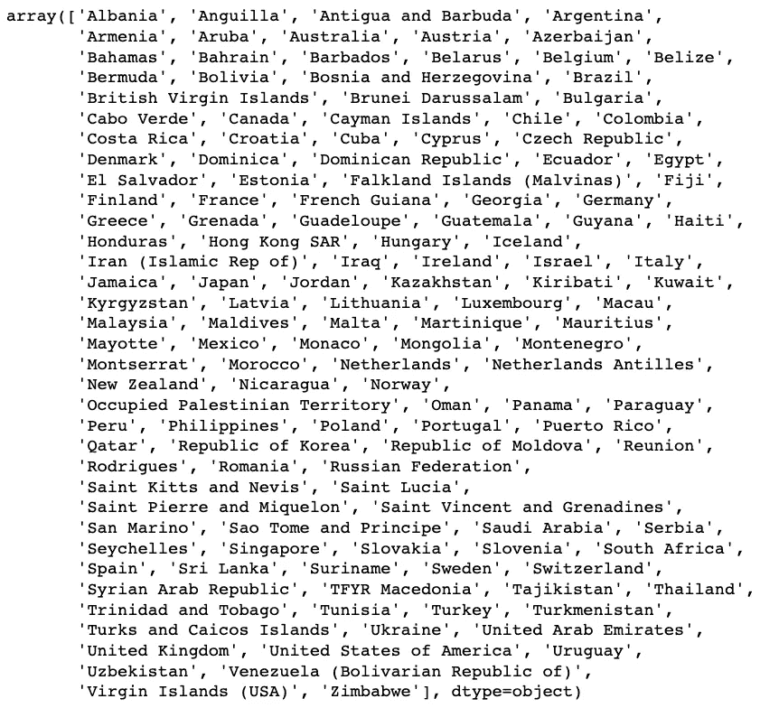

列出了不同的国家

**注意**:我们**无法**执行 **1 热编码**，因为“*国家*”的唯一值太多。

```
**data['country'].nunique()**
```

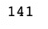

返回数据来自的不同国家的数量

```
**data['year'].unique()**
```

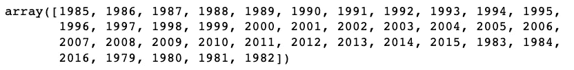

返回我们的数据所来自的所有独特年份的数组

这里我们用**填充**中的**表示**缺失**数据的**值！

现在我们对人口做同样的事情& **用他们的**平均值**值替换** NA 值！

# **3。探索性数据分析**

# **研究问题 1:哪一年自杀人数最多？哪一年自杀人数最少？**

```
data['suicides_no'] = data['suicides_no'].replace(0,np.NAN)

mean_value=data['suicides_no'].mean()
data['suicides_no']=data['suicides_no'].fillna(mean_value)

**def** find_minmax(x):
     *#use the function 'idmin' to find the index of lowest suicide*
    min_index = data[x].idxmin()
    *#use the function 'idmax' to find the index of Highest suicide*
    high_index = data[x].idxmax()

    high = pd.DataFrame(data.loc[high_index,:])
    low = pd.DataFrame(data.loc[min_index,:])

    *#print the Year with high and low suicide*
    print("Year Which Has Highest "+ x + " : ",data['year'][high_index])
    print("Year Which Has Lowest "+ x + "  : ",data['year'][min_index])
    **return** pd.concat([high,low],axis = 1)

find_minmax('suicides_no')
```

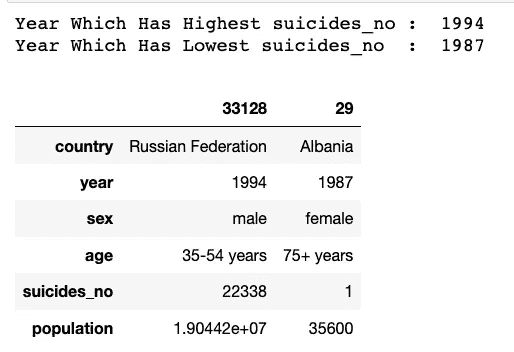

这里我们创建了一个 **Min Max 函数**，它允许我们定位一个列分组的 Min Max。

```
*# year-wise analysis of mean number sucidies of each year*             **data.groupby('year')['suicides_no'].mean().plot()**  *#setup the title and labels of the figure.* **plt.title("Year vs. Suicide Count",fontsize = 14)** 
**plt.xlabel('Year',fontsize = 13) plt.ylabel('Suicide Count',fontsize = 13) ** *#setup the figure size.* sns.set(rc={'figure.figsize':(10,5)}) **sns.set_style("whitegrid")**
```

# **年度分析**

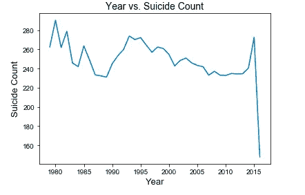

通过观察我们的**时间序列线图**，我们可以看到 1985 年自杀人数的急剧下降。这种**下降**可能是由于**对 80 年代自杀& **心理健康**的认识**以及对那些处于危险中的人的认识**的提高。这的确是**准确的**，正如《老年人自杀》**的研究所支持的**这种说法，**

[*“女性自杀率显示出类似的总体下降趋势，在 1983-1995 年间，45-84 岁年龄组的女性自杀率下降了 45-60%。
自杀率的这些趋势可能是由于:对高危人群的检测提高，对老年人精神疾病的积极治疗。*](https://gpnotebook.com/simplepage.cfm?ID=1711669253)

# 研究问题 2:哪个国家自杀人数最多？哪个国家自杀人数最少？

```
**def** find_minmax(x):
     *#use the function 'idmin' to find the index of lowest suicide*
    min_index = data[x].idxmin()
    *#use the function 'idmax' to find the index of Highest suicide*
    high_index = data[x].idxmax()

    high = pd.DataFrame(data.loc[high_index,:])
    low = pd.DataFrame(data.loc[min_index,:])

    *#print the country with high and low suicide*
    print("Country Which Has Highest "+ x + " : ",data['country'][high_index])
    print("Country Which Has Lowest "+ x + "  : ",data['country'][min_index])
    **return** pd.concat([low,high],axis = 1)

find_minmax('suicides_no')
```

再次利用我们的**最小最大**功能，但是通过**国家**分组

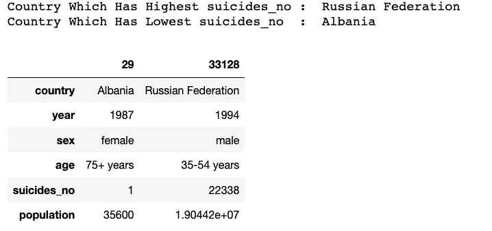

# **特征工程**

为了更好地理解我们的数据，让我们制作一个新的栏目来计算每人口自杀的比例

```
# perform operation
data['suicide_per_pop'] = data['suicides_no']/data['population']data.tail(3)
```

注意:以下是**替代**的操作方法

```
data[‘suicide_per_pop’] = data.apply(lambda row: row.suicides_no / row.population, axis = 1)data.tail(3)
```

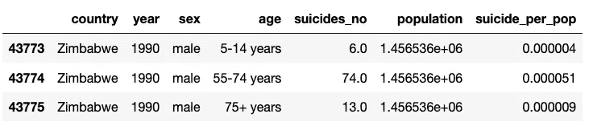

现在，你可以看到我们的新专栏了！这是**特征工程**的一个例子，在这里我们获得新的见解&使用给定的内容创建新的栏目！

```
find_minmax('suicide_per_pop')
```

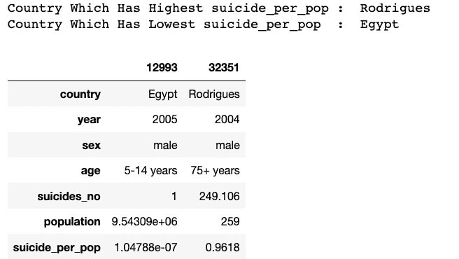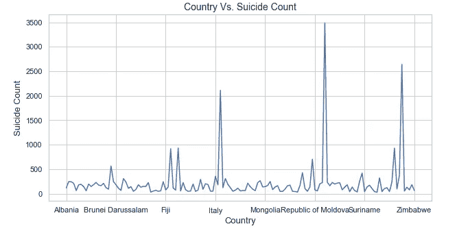

上面的图表& find_minmax 函数**证实了**阿尔巴尼亚的**自杀率最低**，而津巴布韦&俄罗斯联邦的自杀率最高。一个**原因**俄罗斯联邦可能有一个**大的**自杀计数可能是因为他们有非常大的人口(1.445 亿，而阿尔巴尼亚只有大约 300 万)。据报道，俄罗斯的酒精消费水平在很大程度上影响了自杀率，但是由于苏联的保密，缺乏数据来支持这一说法。

# 研究问题 3:某些年龄段是否更倾向于自杀？

```
**sample = data.sample(3)
sample**
```


现在我们的“年龄”栏是由**分隔成**和**连字符**组。我们要将这些组作为**数值**数据进行分析。我们必须将**去掉**连字符&创建一个**函数**，它将每个类别分类到一个**特定的**数字中。我们首先必须**移除**一个破折号的所有实例&将对象改为 int 类型以进一步分析它。

注意:我们首先必须删除破折号的所有实例-

```
*# grabs first 2 chars from Age Column*
**data['AgeNum'] = data['age'].str[:2]** 
*# remove all instances of dash -*
**data['AgeNum'] = data['AgeNum'].map(lambda x: x.replace('-',''))** 
*# now, convert it to type int (not Object)*
**data['AgeNum'] = data['AgeNum'].astype(int)

data['AgeNum'].tail(3)**
```

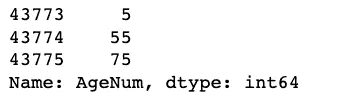

```
*# creates Age Categories*
**def** AgeGroup(x):
    **if**(x >= 60):
        **return** "Elderly"
    **elif**(x >= 30):
        **return** "Middle_Aged_Adults"
    **elif**(x >= 18):
        **return** "Adults"
    **else**:
        **return** "Adolescent"
*# Map each row in the Col to the AgeGroup Method*
**data['AgeCategory'] = data['AgeNum'].map(lambda x: AgeGroup(x))** *# convert it back to type String*
**data['AgeCategory'] = data['AgeCategory'].astype(str)****data['AgeCategory'].tail(3)**
```

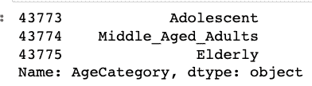

抓取“年龄”列的最后 3 行

我们现在创建了一个名为' **AgeNum** '的新列。现在让我们检查该列，看看它是否更新了

```
**data['AgeNum'] .tail(3)**
```

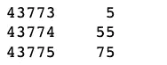

如你所见，我们现在已经成功地将**中的每一行放入**对应的**数字年龄中。为了在**全动作**中看到它，让我们看看下面的输出。**

```
**data.head(3)**
```

**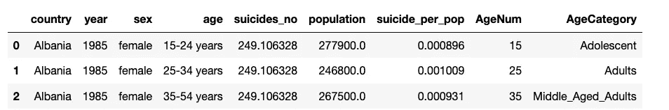**

```
**sns.catplot(x="AgeCategory", y="suicides_no",palette="ch:.25", kind="bar",data=data);

plt.title('Age vs. Suicide Count',size=25)
plt.xlabel('Age Category',size=20)
plt.ylabel('Suicide Count',size=20)**
```

**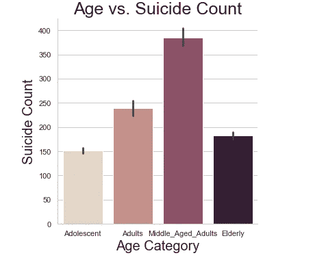**

**数据显示，30 至 60 岁的中年人自杀率最高。而老年人和青少年大约是中年人的一半。**

# ****研究问题 4:性别和自杀人数之间有什么关系？****

```
# there is an equal number of Males & Females in our data
**data['sex'].value_counts()**
```

**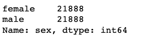**

****注意** : **色调**，允许我们**添加**另一个**维度**到我们的分析中！**

```
**sns.catplot(x="sex", y="suicides_no", hue="AgeCategory", kind="bar", data=data);**
```

**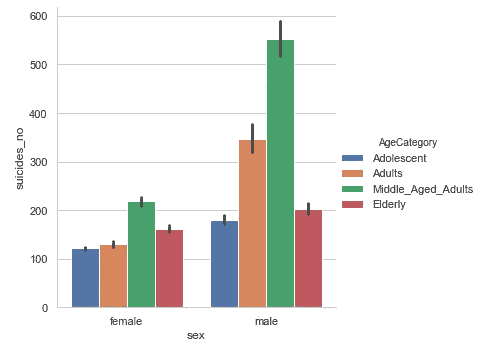**

**以性别和年龄类别表示的自杀人数**

**自杀是所有美国成年人死亡的主要原因之一。数据显示不同性别的自杀率有很大差异。很明显，男性比 T21 更倾向于自杀。对于女性来说，4 个年龄层似乎在 150 岁时趋于平稳。我们不能说男性也是如此。男性成年人&男性中年人自杀的风险非常高。两种性别都显示中年人是自杀的主要年龄组。**

> **[***“2017 年，男性自杀死亡是女性的 3.54 倍。中年白人男性尤其容易受到影响”(SMM 健康)。***](https://www.ssmhealth.com/blogs/ssm-health-matters/october-2019/middle-aged-men-more-likely-to-die-by-suicide)**

# **4.机器学习+预测分析**

**本节中我们的**目标**是构建一个**多元线性回归**模型，该模型将被**训练**以理解我们的**特征**和我们的**预测器**之间的**相关性**。我们想**预测** Y(自杀人数)，给定一个特定的年份，属于一个特定的年龄组&性别。**

# **为建模准备数据**

**要为建模准备数据，只需记住 **AES(赋值、编码、拆分)。****

**一个一个**把 4 个特征赋值给 X，&最后一列给我们的预测值 Y****

```
**newData= data.loc[:,['year','sex','AgeNum','suicides_no']]**
**newData.head(3)****X = newData.iloc[:, :-1].values** # grab the every col except last
**y = newData.iloc[:, -1].values** # grab last col
```

**E **编码**分类数据。**性别**特征，现在是使用 0 的& 1 的**编码的**二进制输出。**

```
**from sklearn.compose import ColumnTransformer
from sklearn.preprocessing import OneHotEncoder
ct = ColumnTransformer(transformers=[('encoder', OneHotEncoder(), [1])], remainder='passthrough')
X = np.array(ct.fit_transform(X))**
```

**将数据集拆分为训练集和测试集**

```
**from sklearn.model_selection import train_test_split
x_train, x_test, y_train, y_test = train_test_split(X,y,test_size = 0.2, random_state = 1)**
```

# **在训练集上训练多元线性回归模型**

```
**from sklearn.linear_model import LinearRegression
regressor = LinearRegression()
regressor.fit(x_train, y_train)**
```

# **预言**

**假设我们希望预测自杀人数，给定一定的人口统计数据。**

**一个 **55** 岁**男**，从 **2001 年开始，****

```
**print(regressor.predict([[1,0,2001,55]]))**
```

**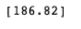**

****会产生**大约 187 的**自杀数**吗？**

# **5.结论**

1.  **到了 80 年代，自杀率有所下降。这可能是由于 80 年代人们对自杀心理健康的认识，以及对那些处于危险中的人认识的提高。但是在那之后不久，我们看到自杀率上升。**
2.  **俄罗斯的酒精消费水平在很高的自杀率中起了很大的作用，但是由于苏联的保密，他们缺乏数据来支持这一点。**
3.  **数据显示，30 至 60 岁的中年人自杀率最高。而老年人和青少年的摄入量是中年人的一半。**
4.  **自杀是所有美国成年人死亡的主要原因之一。数据显示不同性别的自杀率存在惊人的差异。很明显，男性比女性更倾向于自杀。此外，心理健康是自杀的主要预测因素。**

****使用机器学习算法的进一步预测分析**是**所需要的**。**

**以下是从我的 GitHub 页面获得的数据集和代码:**

**[https://github.com/jzaidi143/The-Suicide-Crisis-in-Data](https://github.com/jzaidi143/The-Suicide-Crisis-in-Data)**

**欢迎推荐和评论！**

# **6.参考**

**SSM 健康 2019 年 10 月 14 日。"为什么中年白人男性更有可能自杀？"SSM 健康，[www . SSM Health . com/blogs/SSM-Health-matters/October-2019/中年男性-更有可能死于自杀](http://www.ssmhealth.com/blogs/ssm-health-matters/october-2019/middle-aged-men-more-likely-to-die-by-suicide)。**

**[“老年人自杀。”老年人自杀——gpnotebook.com/simplepage.cfm?ID=1711669253.全科医学笔记本](https://gpnotebook.com/simplepage.cfm?ID=1711669253)**

# **从哪里获得帮助**

**加拿大或美国:如果你遇到紧急情况，请拨打 911**

**你可以拨打 1-800-273-8255 联系美国国家自杀预防生命线，或者发短信到 741741 联系危机测试热线**

**需要帮助的年轻人可以拨打儿童求助电话 1-800-668-6868**