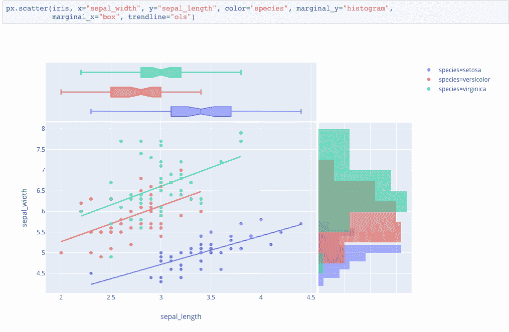

# 普洛特利的甜蜜点

> 原文：<https://towardsdatascience.com/the-sweet-spot-of-plotly-c6e1342e3544?source=collection_archive---------17----------------------->

## 为什么 Plotly 是数据科学家的伟大探索工具

演职员表:plot.ly

在过去两年作为一名数据科学家在科技行业工作的过程中，我使用了各种探索性工具来为技术和非技术利益相关者构建 web 应用程序。除了其他许多工具之外，Plotly 是一个专门为数据科学家、工程师和程序员设计的图形库，可以使用 Python、R、Matlab 或 Javascript 轻松地可视化他们的数据趋势。

肯定还有其他工具可以帮助您绘制数据，如 Matplotlib、Seaborn、Bokeh，如果您想构建一个像纽约时报网页那样流行的可视化仪表板，甚至可以使用 D3。

然而，开发奇特的网络应用程序伴随着构建时间的机会成本和陡峭的学习曲线。这是 Plotly 优于其他工具的地方，这使得数据科学家可以更容易地可视化任何规模的数据。如果你认为自己符合以下许多标准，这个工具可能是最适合你的。

## 为什么它对数据科学家和工程师非常有用

大多数数据科学家和工程师用 Python 编写。他们的角色经常要求他们能够流畅地聚合大小数据集，高效地操作任何类型的数据，并与像 Pandas 这样的库一起工作。Plotly 允许我们直接从熊猫数据框架中构建网络图表。

此外，对于非前端工程师来说，用 Javascript (HTML/SVG)构建交互式图表可能是一个陡峭的学习曲线。Plotly 允许从 Python/R 等常用脚本语言进行交互式绘图。它确实是建立在 [d3.js](https://d3js.org/) 和 [stack.gl](http://stack.gl/) 之上的。

## 拥有用户交互式可视化

如果您或您的客户希望与您的图形进行一些交互，Plotly 可能是一个很好的尝试。构建于 Plotly JavaScript 库之上(Plotly。plotly.py 使用户能够创建漂亮的交互式基于 web 的可视化效果，可以在 Jupyter 笔记本上显示，保存到独立的 HTML 文件中，或者作为使用 Dash 的纯 Python 构建的 web 应用程序的一部分。

虽然 Seaborn 和 Matplotlib 图形是静态的，但 Plotly 图表允许您悬停在值上并放大/缩小图形，就像在大量数据点中识别异常值或检测时间序列图中的异常。

## 自由使用任意多的数据源

使用 Plotly，您不会受到数据源中指定的布局的约束——这是我在 Tableau 等工具中经常遇到的情况。你可以很容易地纠缠，转换，或者随意分配代码变量。

Tableau、Kibana 和 Superset 等平台提供了 dropdown 等特性，这些特性只接受一个数据表作为每个图形的输入。这使得很难对多个来源进行复杂的可视化。另一方面，Plotly 允许开发涉及数据库中两个或更多表格的操作和计算的图表。

## 价值观转变的灵活性

我注意到，在可视化数据列之前，我们还可以对其执行任何种类的算术运算。一个简单的例子是单位转换。这是 Plotly 优于其他工具的一个优势，因为使用数学运算来调整列的值通常比较困难或者不被支持。

## 用 Dash 讲述你的故事的创意

灵活性带来创造力。使用 Plotly 的一个主要优点是，它鼓励我们尽可能创造性地进行可视化，因为任何复杂的绘图只使用三个主要概念:数据、布局和图形对象。作为一名工程师，这可能是最好的事情之一，因为我们可以以任何我们想要的方式构建和重建图形。

我们还可以用 [Plotly Dash](https://dash.plot.ly/) 创建一个仪表板，这是一个显示一组 Plotly 图表的工具。在我的工作中，我建立了许多仪表板，允许团队了解不同用户输入的数据趋势。

仪表板上的交叉过滤功能也可以使用 Plotly Dash 轻松管理。而在 Metabase 这样的工具中，您必须调整 SQL 查询来一次修改多个图表。

## 实时更新的内置功能

我记得在 Jenkins 或 Airflow 中设置了一个自动化作业，只是为了更新我在 Tableau 或 Superset 中的图形。在 Plotly 中，我可以简单地编写一大块代码来添加[间隔功能](https://dash.plot.ly/live-updates)，它可以在后台自动激活实时更新，而无需任何外部作业。

## 处理庞大的数据集

数据科学家处理庞大的数据集和数百万行并不罕见。Plotly Dash 集成了 [datashader](https://dash-gallery.plotly.host/dash-datashader/) 来处理大数据可视化。

我希望以上任何一个理由能够帮助那些对 Plotly 感兴趣或者刚刚开始构建有洞察力的 web 应用的人。这篇文章绝不是由 Plotly 赞助的——所以如果您对下一篇文章涉及的其他工具有任何反馈或建议，或者如果您只是想要更多这样的文章，请随时在下面发表评论！