# Tableau 桌面认证:为什么你应该关心和你如何通过

> 原文：<https://towardsdatascience.com/the-tableau-desktop-certification-why-you-should-care-and-how-you-can-pass-f43966a94b10?source=collection_archive---------14----------------------->

## 通过 Tableau 桌面认证助理考试的介绍和综合指南

图片由 [siscadraws](https://www.instagram.com/siscadraws/) 提供

哇，画面！

到目前为止，几乎每个人都听说过将可视化分析带给公众的数据可视化软件。其直观的拖放界面使连接数据、创建图表和共享仪表板比以往任何时候都更容易。

但是你为什么要关心它呢？

> 根据 Tableau 的网站，2017 年有超过 30 万人使用 Tableau Public(每个人都可以使用的 Tableau 免费版本)来创建可视化并在线分享数据。

您可以使用 Tableau 创建“标准”的业务可视化，如下面的电子商务仪表板示例。

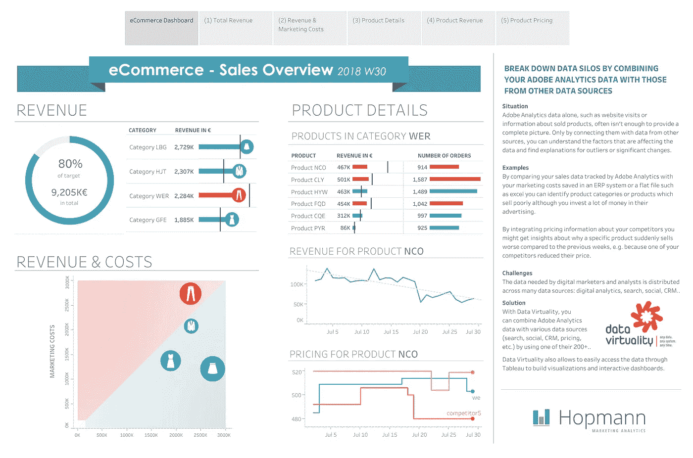

[电子商务平台公共仪表板](https://public.tableau.com/views/eCommerce-SalesOverview/eCommerce-SalesOverview?:language=en&:display_count=y&mobile=&:origin=viz_share_link)作者[西蒙·斯图萨克](https://public.tableau.com/profile/simon.stusak#!/)

你也可以充分发挥你的创造力，用 Tableau 来讲故事。Tableau 允许您在一个视图中将上下文解释、易于理解的图表和视觉效果结合在一起。一位 Tableau 公众用户用它来回答一个古老的问题“菠萝属于披萨吗？”问题，你可以在下面看到。

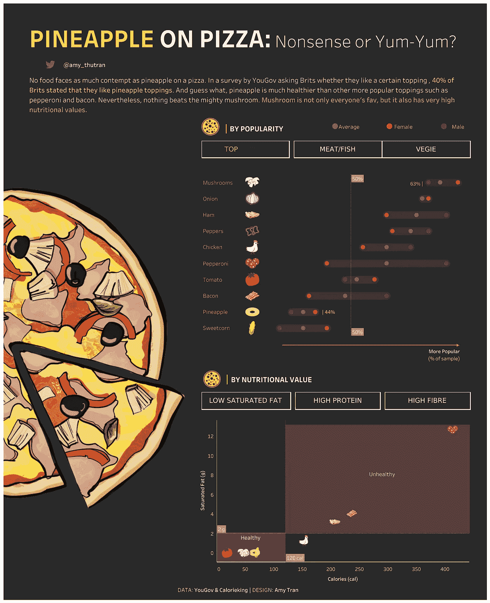

[Pizza Tableau 公共仪表盘](https://public.tableau.com/views/PizzaTopping-MakeoverMondayWeek13/PizzaTopping?:language=en&:display_count=y&mobile=&:origin=viz_share_link)作者 [Amy Tran](https://public.tableau.com/profile/amy.tran3167#!/)

除了在 Tableau Public 上创建可视化的个人之外，像 [Chipotle](https://www.tableau.com/solutions/customer/chipotle-creates-unified-view-operations-across-2400-restaurants-saving-10000) 、[摩根大通](https://www.tableau.com/solutions/customer/jpmorgan-chase-chooses-tableau-enable-self-service-analytics-keeping-rapid)和[汉莎航空](https://www.tableau.com/solutions/customer/lufthansa-saves-30-time-gains-decision-flexibility-and-departmental-autonomy)这样的公司只是使用 Tableau 来促进数据驱动决策的少数组织。Tableau 帮助公司将数据带到所有员工的手中，允许从运营管理到财务的团队跟踪和分析数据。你的公司可能在你不知情的情况下使用了 Tableau！

# Tableau 认证的快速概述(以及为什么你应该得到一个)

Tableau 提供了两个主要的认证分支:桌面和服务器。服务器认证更适用于与系统管理员相关的角色，您的重点是安装、部署和维护 Tableau 服务器。桌面认证途径，这是本文的重点，是作为分析师工作的人会发现有用的。

有三种台式机认证:

1.  **Tableau 桌面专家**(建议 3 个月以上经验)
2.  **Tableau 桌面认证助理**(建议 5 个月以上经验)
3.  **Tableau 桌面认证专家**(建议 12 个月以上经验)

我建议从桌面认证助理开始。专家认证衡量基本技能，如创建基本图表并将其格式化。虽然掌握这些知识很重要，但 Tableau 足够直观，因此您可以通过使用 Tableau 简单地学习专业考试中的大多数材料。

此外，认证助理考试不要求您将专家认证作为先决条件，这意味着您可以跳过支付 100 美元的专家认证费用，直接进入认证助理。注册助理考试的每次考试费用为**250 美元**，所以在参加考试之前一定要做好充分的准备。

根据 Tableau 的认证目录，截至 2020 年 8 月，共有 4，101 人获得了活动桌面认证助理认证。这个数字可能会更高，因为有些人可能会选择不出现在名单上。获得这个证书是证明你知道的不仅仅是 Tableau 的基础知识的一种方式。

当你为了一份需要数据技能的工作与上百人竞争时，这份证书可能足以让你至少获得一次面试机会。

如果我们快速浏览一下谷歌趋势，“tableau 工作”和“tableau 认证”是过去十年中持续增长的搜索词。

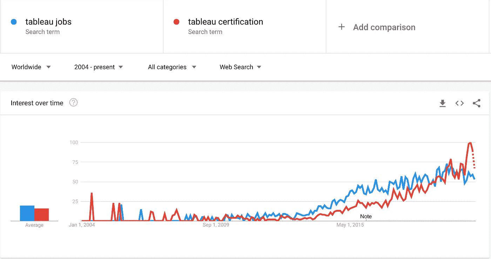

谷歌“tableau 工作”和“tableau 认证”趋势

每个业务职能部门的工作都以某种形式处理数据，Tableau 可以帮助将这些数据转化为可操作的商业智能。这一点以及“商业分析师”和“数据分析师”类型的工作越来越受欢迎，可能是 Tableau 和 Tableau 认证相关搜索趋势受欢迎的原因。因此，如果你想在每一个空缺职位的申请人中脱颖而出，学习 Tableau 可能是一种方法。

因为我最近通过了 Tableau 桌面认证助理考试，所以我想花点时间解释一下我是如何准备的，以及考试体验是怎样的。如果你也有兴趣参加考试，我希望在这篇文章结束时我能帮上忙！

考试分为及格或不及格，及格分数为 75%。为了充分披露，这是我的证明:

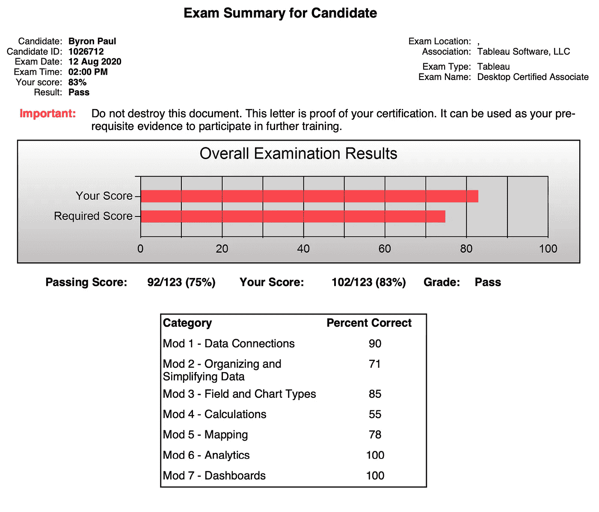

认证证明

如你所见，我没有成功通过。我只是用普通颜色通过了。我有点震惊地看到，我只有 55%的“计算”问题是正确的，但我看不到我错了哪些问题，因为 Tableau 不提供对你的考试的每个问题的反馈。从好的方面来看，这种高水平的反馈确实有所帮助，因为在考试后，你知道下一次尝试(如果你需要重新参加考试)或认证专家考试需要复习和关注哪些方面。

# 测试技能部分总结和细分

如果你已经浏览了介绍，并来到这里，这是真正的开始。

官方桌面认证助理考试指南(本文末尾的链接)会告诉您考试将测试哪些技能，以及考试中每个部分的权重。考试包括 36 个问题，因此我们可以估算出下面每个部分的问题数量:

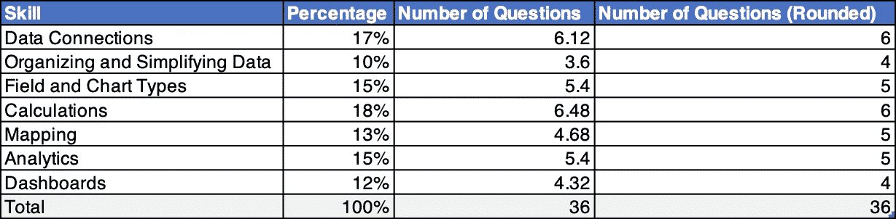

考试的估计问题数量

每个部分的问题数量只是一个指导原则。考试的实际百分比分配可能与上表所示略有不同。一个问题可能意味着通过和失败的区别，所以不要因为你乍一看觉得简单就跳过任何部分。

所有问题都是**选择题**，你要么选择一个正确选项，要么选择多个(如果适用)正确选项，要么选择对/错。然而，在“动手”和“理论”问题之间还有一个区别，你应该做好准备。

在**动手问题**中，您将根据提供的数据源回答一个问题。所有数据源都是在虚拟机上的一个文件夹中提供的文件(稍后将详细介绍)，因此您很可能不需要连接到任何云数据库或 web 数据。一个简单的动手问题结构可能是这样的:“根据 WoahMarket 全球销售数据集，2019 年欧洲的销售额总和是多少？”要回答这个问题，您必须找到“WoahMarket Global Sales”文件，确定它是 Excel 还是 CSV，连接并打开 Tableau 中的表，然后处理数据以获得答案。

对于**理论问题**，从技术上讲，你不需要连接到任何数据源来回答。这些问题测试你对每个不同技能部分的 Tableau 功能的理解。例如，一个简单的理论问题是:“仪表板集操作如何影响视图？”之后，您会有几个选项可供选择。

现在，让我们快速回顾一下每项技能，并讨论一下您应该在考试前复习的每个领域。

## 数据连接(17%)

如果不首先连接到数据，任何数据分析或可视化都无法开始。这可能就是为什么考试大量使用这一部分的原因，17%的选择题可能会使用数据连接。除了如何将 Tableau 连接到 Excel 文件之外，您还需要了解更多。

要知道 Tableau 可以连接各种数据库，包括微软 SQL Server 和 MySQL。Tableau 还内置了与几个亚马逊服务的连接，包括 Athena 和 Redshift。你不一定会被要求连接到这些，但它们可能会出现在选择题中。

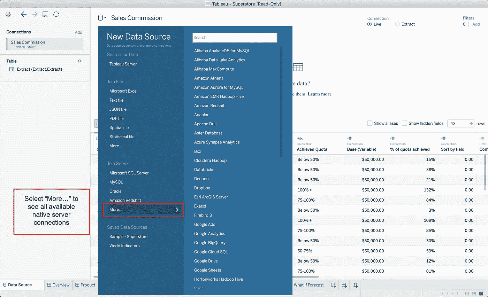

数据连接选项

还有许多不同的方式来组合表格，为可视化做准备。您需要知道如何区分**连接**、**混合**和**联合**，以及使用每个连接的场景。

考试中可能需要用到的另一个重要特性是“**数据解释器**”，这是一个内置的 Tableau 特性，可以帮助在加载前清理数据。如果你得到一个有很多空白单元格、标题和其他奇怪格式的文件，只要勾选“使用数据解释器”框，Tableau 就会尝试从文件中检测表格。

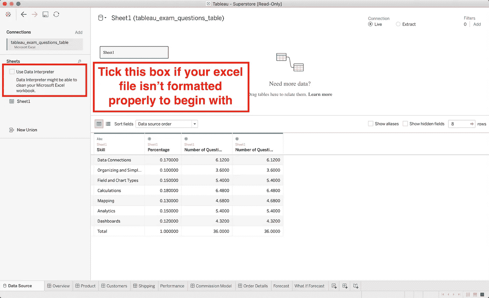

数据解释功能

Tableau 还允许您创建“**提取**”或保存的数据子集，以减少您分析的数据大小，并有可能提高工作簿的响应速度。10.5 版中更新了摘录，您可能会遇到一些关于新旧摘录格式功能差异的理论问题。

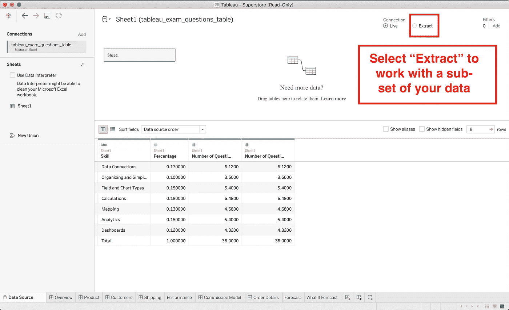

提取特征

## 组织和简化数据(10%)

这一部分相对简单，这可能是 Tableau 对它的权重低于其他部分的原因。为了过滤数据，通常需要将一个维度拖到过滤器面板上，并根据需要进行定制。要构建**组**、**层次结构**和**集合**，您需要做的就是右键单击相关的维度并选择您想要创建的内容。

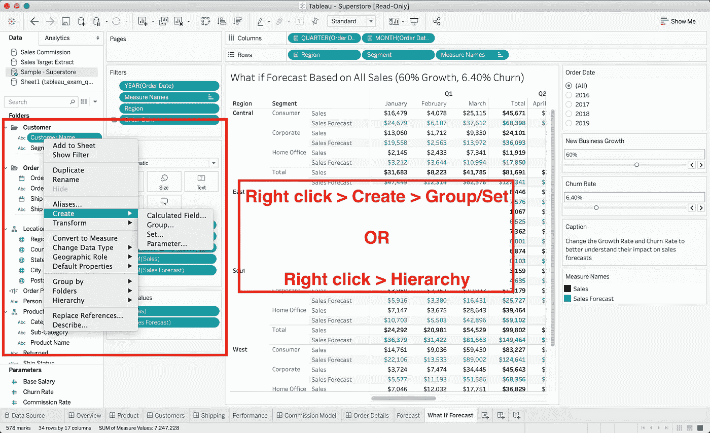

创建组、集合和层次结构。

虽然执行这些任务很容易，但是你仍然需要理解*为什么*和*什么时候*去执行它们中的每一个。

> 对于动手题来说，你选择怎样得到正确的答案并不重要，只要你得到正确的答案。

如果您遇到的问题使您看起来需要一个计算字段，那么首先尝试一下本节中的技术可能是值得的。

在 Tableau 中创建一个**集合**可以回答许多不同类型的问题。当您自定义一个集合时，您会将适合某个类别的数据分配为“在”集合中，而将不适合的其余数据分配为“在”集合之外。例如，如果您必须根据总销售额确定前 10 名客户，您可以通过创建一个集合并选择“top”选项卡以及自定义“By field”选项来回答这个问题。

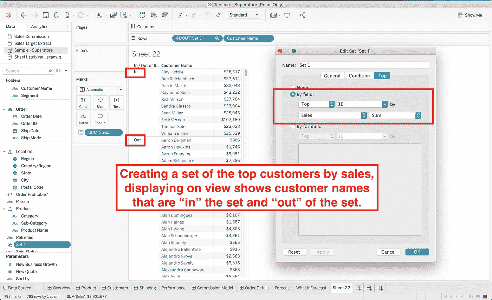

创建集合

如果您需要比较两种类型的客户，您还可以更进一步，创建一个**组合集**。例如，如果您只想查看总销售额前 10 名的客户*和总利润后 10 名的客户*，您可以右键单击其中一个集合，然后单击“创建组合集合”，之后您可以选择只获取符合这两个集合的成员。

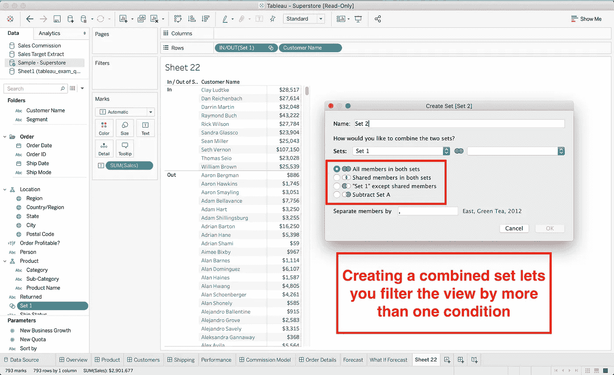

创建组合集

这是回顾 Tableau 的"**操作顺序**"的一个很好的部分，Tableau 以什么样的顺序实现你放在视图中的过滤器和计算。例如，当您希望您的一个维度过滤器在其他过滤器之前实现时，您需要将它设置为“**上下文过滤器**”，因为它们在常规维度过滤器之前实现。

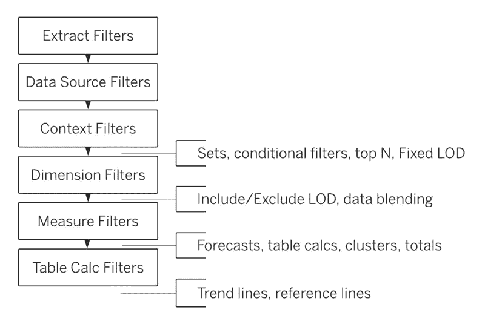

Tableau 官方操作顺序图片- [来源](https://help.tableau.com/current/pro/desktop/en-us/order_of_operations.htm#about-the-order-of-operations-aka-query-pipeline)

## 字段和图表类型(15%)

本节涉及*Tableau 如何通过理解用于创建可视化效果的组件来创建可视化效果。*

第一步是理解度量和维度之间的区别。Tableau 中的**度量**表示数据源中的数值，而**维度**是用于分类和聚合数据的定性值。当您将一个维度拖到视图上时，Tableau 将根据该类别自动聚合视图。

假设你刚开始有一张图表，上面记录了每笔销售额随时间的变化。如果您随后将“Region”拖到视图中，您仍然会得到一段时间内的销售额，但是图表上的单个点可能会减少，因为每个相同区域中的所有单个点会被加在一起(即 Tableau 会将[Sales]更改为 SUM([Sales])。

你还需要知道离散字段和连续字段的区别。乍一看，您可能会认为所有度量都必须是连续的，所有维度都必须是离散的。然而，事实并非如此。一些度量可能是离散的(很少)，而一些维度可能是连续的(很少)。

在大多数情况下，度量往往是连续的，因为**连续的**值形成一个完整的整体，并趋于无穷大。例如，“销售额”度量是连续的，因为从技术上讲，公司的销售额没有上限，销售额可以是任何数字。相反，**离散的**值是那些彼此不同的值。例如，“产品类别”维度中的不同值是离散的，因为该维度可以采用固定数量的值。

此外，您最初可能认为所有度量都是绿色的，所有维度都是蓝色的。事实并非如此，如果您右键单击一个度量并选择“转换为维度”，就可以看到这一点。您将看到**所有离散字段为蓝色，所有连续字段为绿色。**

**Tableau 还自动生成了一些你可以使用的字段**。它们出现在维度和度量列表的底部，并以斜体显示，以便您可以快速识别它们。最好只是将它们拖到视图中，这样您就可以了解它们的作用。您还会看到，当您选择某些图表类型时，其中一些字段会自动添加到视图中。记录数量度量也是 Tableau 中自动生成的字段。您可以将它看作是表中的一个额外的列，每行中的值都是“1”，因为它是数据源中所有行的计数。

您可以在 Tableau 上构建各种各样的图表，从直方图到热图。如果您点击右上方有用的“**示范**”选项卡，Tableau 将向您显示创建每种类型的图表所需的维度和/或度量的组合。

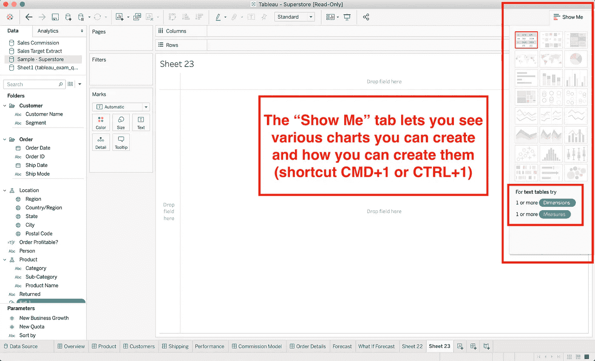

向我展示功能

同样重要的是，不仅要知道如何创建每种类型的图表，还要知道何时可能需要使用它们。例如，直方图看起来类似于条形图，但用途完全不同。

## 计算(18%)

哦，天啊，计算。

这是考试中权重最高的部分，理由很充分。将度量和维度拖放到视图中可以很容易地创建信息可视化。但是一旦你习惯了使用计算，你将为你的分析增加一个全新的深度层，并释放 Tableau 的全部潜力。

**在这里，区分有聚合值的计算和没有聚合值的计算非常重要。**例如，如果您要计算某个特定地区的利润/销售额比率，您可能会认为可以创建一个带有[利润]/[销售额]的计算字段。但是，如果将此计算添加到视图中，将不会得到正确的结果，因为 Tableau 将在对每一行执行计算，然后将所有单个利润与销售额的比率相加。您真正想要的是 SUM([利润])/SUM([销售额])，因为这个计算将考虑您的视图上的粒度。

Tableau 解释了在创建计算字段时每个计算需要哪些值，因此没有必要记住哪些值应该放在哪里。然而，Tableau 提供的不同的字符串、日期、算术和逻辑计算是值得的，因此至少在考试期间您会知道计算的名称。要创建计算字段，请单击“分析”，然后单击“创建计算字段”。您也可以右键单击维度或度量，然后单击“创建计算字段”。

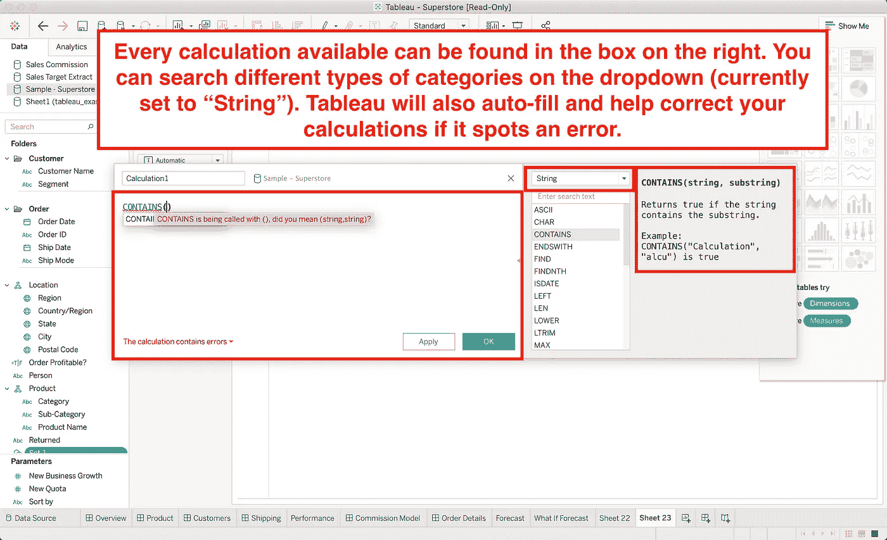

创建计算字段

您还应该了解**表格计算**是如何工作的，并尝试使用最常见的方法，如“**占总额的百分比**”、“**移动平均**”和“**差额**”。您可能会收到一个问题，其中特别包含您需要的表格计算类型，因此您只需从“**快速表格计算**”中选择正确的一个即可。

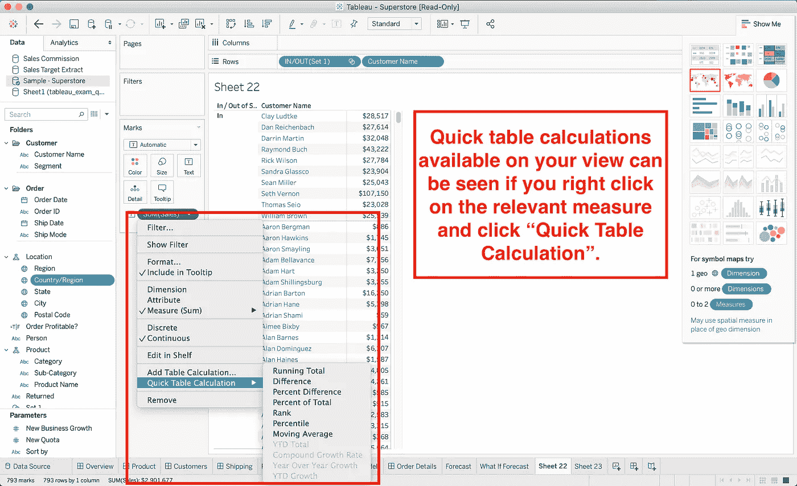

快速表格计算

了解何时以及如何创建“**细节层次**”(LOD)计算也很重要，因为可能有些问题看起来很简单，但实际上需要这种类型的计算。LOD 计算允许您控制要执行计算的粒度级别，并且可以在计算中使用不在视图上显示的值。

详细等级表达式(也称为 LOD 表达式)允许您在数据源级别和可视化级别计算值。有 INCLUDE、EXCLUDE 和 FIXED LOD 表达式，但一般来说，在大多数情况下可以使用 FIXED expression。当您需要相对于视图上的过滤器以不同的顺序计算 LOD 表达式时，可能会出现例外情况(参见第一节中的"**操作顺序**)。

固定 LOD 表达式允许您使用与视图上显示的内容无关的值来执行计算。您可以使用这些表达式执行的一种有用的活动类型是群组分析，它可以让您回答这样的问题:“2011 年、2012 年、2013 年首次订购的客户带来了多少利润？?"这里，您根据客户的第一个订单日期创建客户组，为此，您需要使用一个固定的 LOD 表达式。

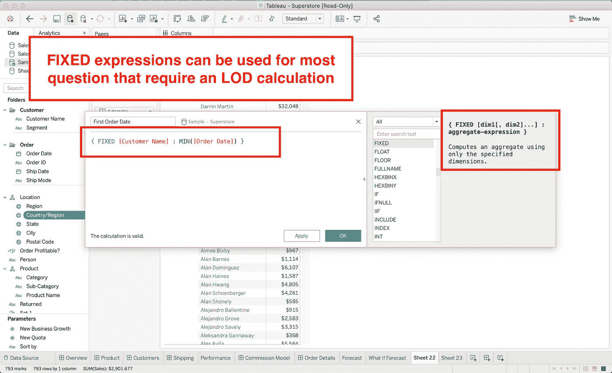

LOD 表达式示例

## 制图(13%)

啊，地图。它们看起来很简单，但是你可以用它们做更多的事情，而不仅仅是给不同的区域标上颜色。

首先有一个重要的提示:查看数据源是否为您提供了“**纬度**和“**经度**度量值。如果是这样的话，您将希望使用这些度量来代替 Tableau 自动生成的“纬度”和“经度”度量，这些度量以斜体显示在数据窗格的底部。这是因为有时 Tableau 无法为数据集中的自定义位置生成坐标。这就是为什么许多具有特殊地理位置的数据集都有自己的“纬度”和“经度”度量。

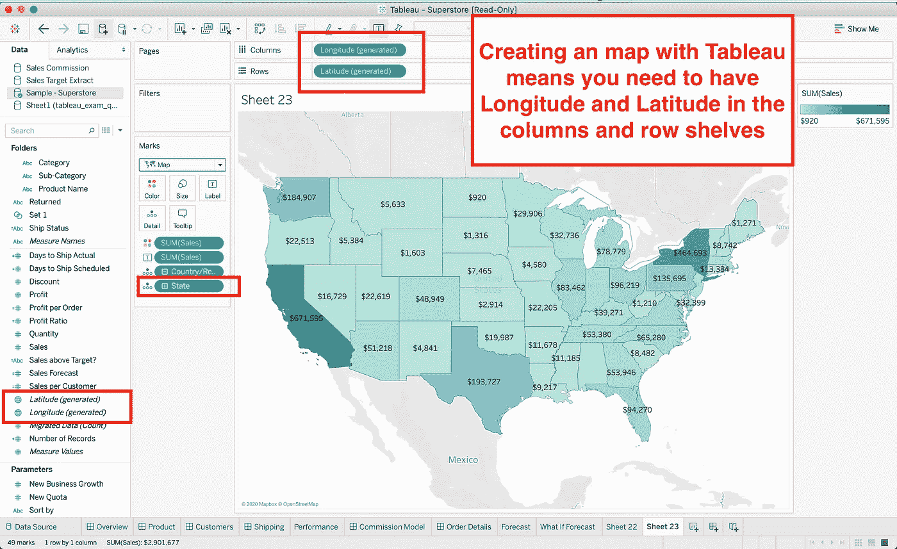

基本地图创建

Tableau 还允许您使用其“**径向选择**工具检查不同位置之间的距离。但是，您需要确保您已经放大到足够近，这样工具才会显示距离。这是因为地球不是平的，所以 Tableau 可以显示两个位置之间到某一点的“直线距离”。

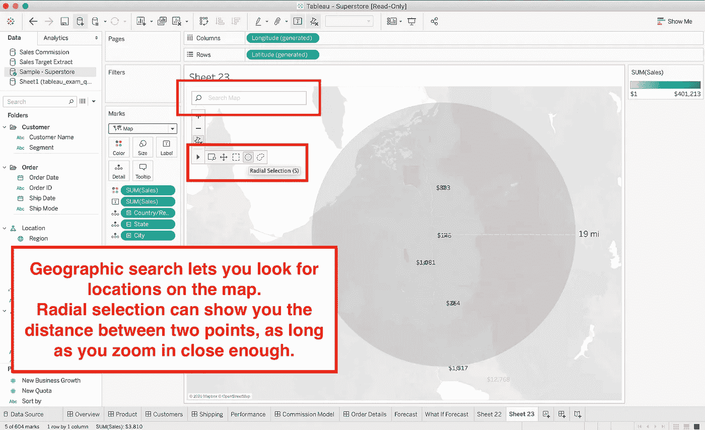

地理搜索和径向选择

您可以通过选择不同的“**地图分层**”选项为地图添加更多细节，这些选项可以添加诸如**城市标签**、**街道/公路/路线**、**州/省边界**等项目。如果您需要搜索特定的地理项目，如城市或州，您可以使用 Tableau 在地图视图左上角的地图搜索栏。

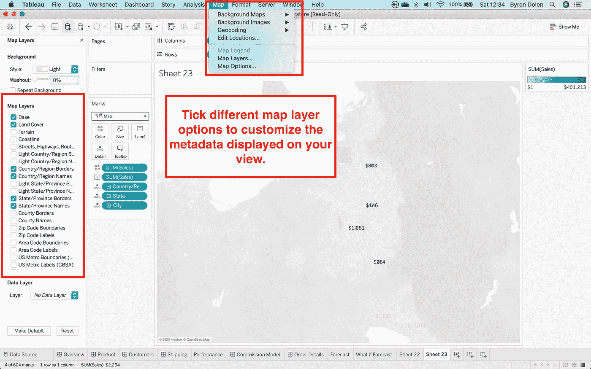

地图图层

## 分析(15%)

“分析”选项卡可能看起来有点吓人，但是和它的其他界面一样，Tableau 使统计数据易于理解并在您的可视化中使用。

通过从默认的“数据”窗格移动到“**分析**”窗格，您可以执行大多数与分析相关的技能。在这里，您将看到“**总结**”、“**模型**”或“**定制**”分析的选项。例如，在“**模型**下，您可以将“**趋势线**拖到视图中，这将为您提供一条**线性**、**对数**、**指数**、**多项式**或**幂**趋势线的选择。这里值得指出的是，虽然理解这些是如何工作的很重要，但简单地知道有哪些选项(或在考试期间检查哪些选项)可以帮助你快速回答基于理论的问题。

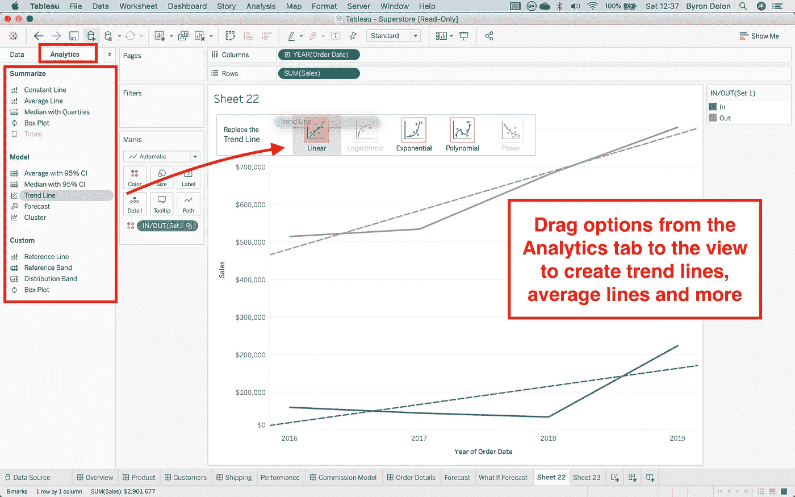

从分析选项卡创建趋势线

对于本节，除了能够创建包含可视化分析项目的视图之外，您还应该查看每个项目的组件。例如，如果你不熟悉盒图，看看上铰链和上须之间的区别。同样，如果您需要向视图中添加预测，请记住您可以单击“**描述预测**”来仔细查看模型。

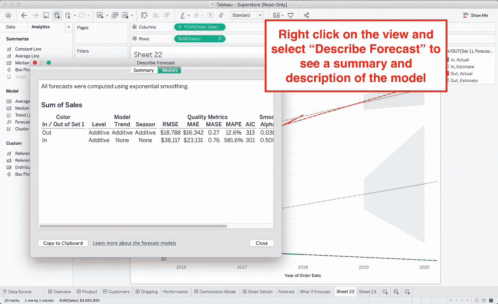

描述预测

## 仪表板(12%)

最后但同样重要的是操纵仪表板！

仪表板是多个表的组合，可用于在一个页面上显示大量信息。与其他部分一样，理解仪表板如何工作的最好方法是自己创建仪表板并与之交互。Tableau 的示例超市工作簿有几个设计良好的仪表板，您可以看一看开始使用。

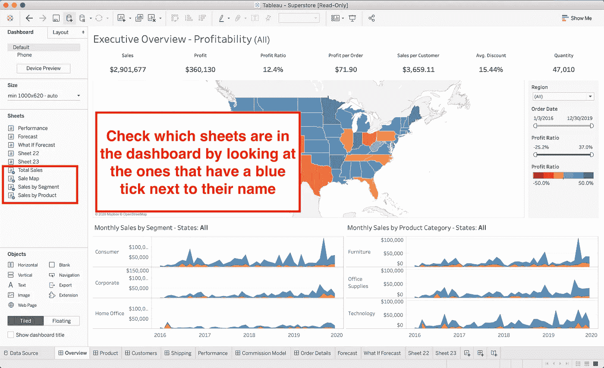

仪表板示例

知道何时以及如何使用不同类型的“**仪表盘操作**”将为您提供很好的服务。**滤镜**和**高亮** **动作**创建和使用起来都相当快捷。当您想要直接与可视化交互并查看基于动态更新时，您可以选择创建**参数动作**和**设置** **动作**。它们允许您分别编辑参数和设置值，这在您想要自定义可视化显示的数据时非常有用。

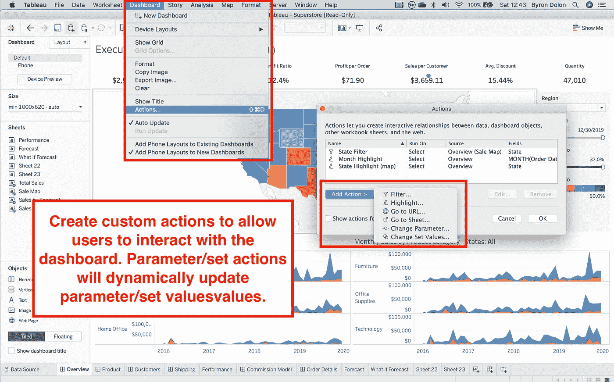

仪表板操作

另一个重要的部分是如何为不同的设备创建**自定义仪表盘布局**。除了默认布局之外，Tableau 还允许您专门为桌面、平板电脑和移动设备创建布局。您还可以选择**为移动设备**自动生成布局。

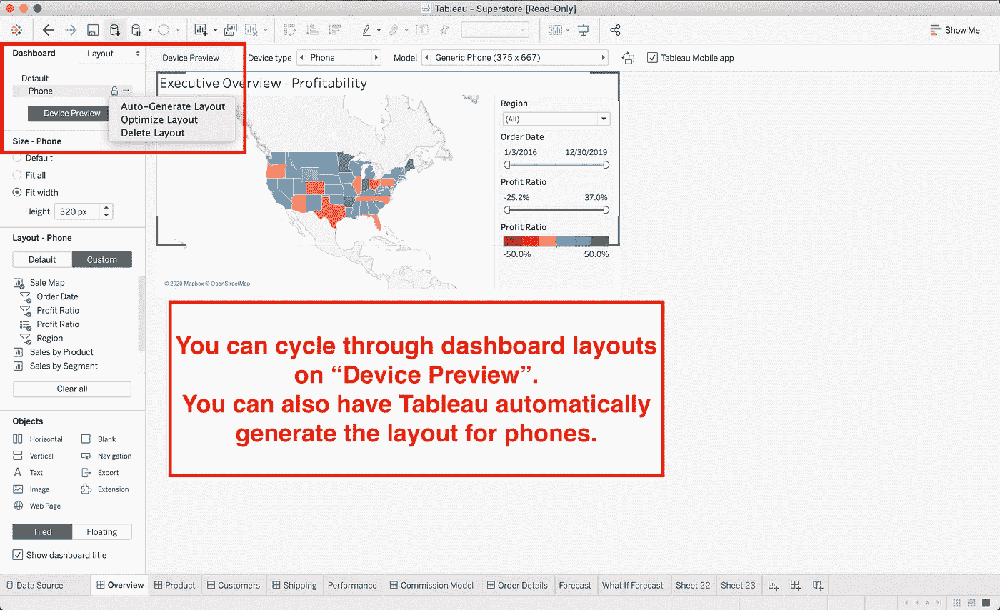

仪表板布局选项

# 为考试做准备

这些都是你考试需要的技能部分。我试着尽可能多地包含，但显然我不能一篇一篇地复习考试指南中的每一点。确保复习每一部分的每一项技能，因为它们都有可能在考试中出现。

现在，让我们来看一下报名参加考试以及考试当天的情况。

访问 Tableau 的桌面认证助理页面，然后单击“立即注册”。您将被重定向到他们的考试门户网站，在那里会提示您创建一个帐户，选择您要参加的考试，并添加您的付款信息。一旦完成，你就可以设置你想参加考试的日期和时间，它必须在你报名日期的六个月之内。

在考试当天，有一些事情需要记住:

*   **参加并通过互联网连接测试。**他们强烈建议您使用有线连接来避免延迟问题，但只要您的连接结果满足最低要求，就应该使用 Wi-Fi。我使用了 Wi-Fi，没有遇到任何问题(在开始考试之前，我还关闭了其他设备上的所有 Wi-Fi)。
*   **准备好政府颁发的身份证以备核查。**考试开始前，你的监考人会要求查看你的身份证。
*   **设置你的测试环境。你必须是一个光线充足的小房间，没有纸张、材料和其他小玩意。你的监考人会要求你移动你的相机，这样他们就可以验证你的房间是干净的。我没有自习室，所以我在我的卧室里参加了考试，但我强烈建议找一个有实际桌椅的好房间(也许去朋友家)。测试持续了两个小时，随着时间的推移，我的房间变得异常闷热，所以请确保你感到舒适。你可以随身携带一个水瓶，但也要确保不要喝太多，因为一旦考试开始，你就不能离开去洗手间。**
*   如果考试前有任何连接问题，请将手机放在手边，以便接到监考人的电话或电子邮件。成功连接后，确保将手机带出房间(你的监考老师可能会提醒你这样做)。
*   **考试前重启电脑，关闭除 Google Chrome** (你用来登录考试门户开始考试的)以外的所有应用。

**考试将在虚拟机**上进行，监考人将在考试设置期间帮助您连接到该虚拟机。这就是为什么您的互联网连接必须稳定的原因，因为如果您在考试中途断开与虚拟机的连接，您将没有任何额外的时间来尝试重新连接。

**考试期间，可以使用互联网！**

这对于理论问题来说是很方便的，但是你通常不能直接在谷歌上输入问题。只要不要求您登录，您就可以访问大多数公共网站。总的来说，我发现“ **Tableau 帮助**”和“ **Tableau 社区论坛**”页面是最有用的。我建议浏览这些页面，熟悉一下关键词和布局。

如果你至少知道每个部分或子主题的标题，你会很快知道考试期间要谷歌什么。例如，如果您对默认仪表板布局有疑问，您应该知道 Tableau 帮助在“创建仪表板”下有一个“为不同设备类型创建仪表板布局”部分。你不一定要记住页面上的所有内容(虽然如果你有时间的话会很好)，但至少你会在考试前知道信息在哪里。

需要记住的重要一点是**测试*是*计时**。你有**两个小时**来完成它，所以不要花太多时间去谷歌搜索答案。如果你真的卡住了，在线搜索的一个替代方法是连接到 Tableau 上的任何数据源，并测试出问题所问的任何内容。例如，如果您被问及度量值是否可用作筛选器，而您不记得答案，只需打开一个新工作表，将度量值拖到筛选器窗格，然后看看会发生什么。

# 一些最后的学习建议

作为这篇文章的结尾，我想我会用一些更通用的技巧来结束这篇文章。

截至 2020 年 8 月，您将使用 Tableau 版本 2020.1 参加考试。知道考试在哪个版本的 Tableau 中进行是很重要的，因为新版本的 Tableau 的功能可能会发生巨大的变化。例如，Tableau 在 2020.2 版本中通过引入“关系”极大地简化了数据连接，但该功能在考试的 Tableau 版本中不可用。请留意官方页面的更新。

Tableau 看起来非常直观，所以当你观看教程视频时，你似乎可以准确地复制正在显示的内容。然而，我经常发现，当我跳过视频而不跟随时，特别是对于更复杂的主题，如混合计算和细节层次表达式，我无法在视频结束后解决问题。它有助于准确复制教程视频中的内容，这样您就可以在自己的屏幕上看到相同的结果。之后，你就有了一个模型来回答未来的问题。

我的最后一个建议是，在第二天开始时，花些时间回顾一下你前一天所学的内容。这看起来很耗时，尤其是当你学到更多技能的时候，但这是值得的。很可能你会在考试前花两周到一个月或更长时间学习，所以如果你不花时间复习，你可能会在考试前 10 天记不住概念。

如需进一步了解，请查看 [Tableau 帮助页面](https://www.tableau.com/support/help?_ga=2.177098853.1518712912.1597758836-122261573.1595170040&_fsi=6lm8vA7X)。我知道这很难懂，但是你需要通过考试的所有信息都在那几页上。不要忘记在[桌面认证助理页面](https://www.tableau.com/learn/certification/desktop-certified-associate)下载完整的考试指南。

祝你考试学习顺利！我迫不及待地想看到你们的名字出现在可认证的 Tableau 人才页面上！

如果您想了解更多关于 Tableau 预测的信息，请查看这篇文章:

 [## 学习用 Tableau 在 6 分钟或更短时间内有效预测

### 谁知道会这么容易？

towardsdatascience.com](/learning-to-forecast-effectively-with-tableau-in-6-minutes-or-less-3d77a55930a0) 

关于一些非考试仪表板优化技巧，请查看这篇文章:

 [## 创建仪表板时不要忘记这三件事！

### 只要问自己几个简单的问题，确保人们不会忽视你的努力工作

towardsdatascience.com](/dont-forget-these-three-things-when-creating-a-dashboard-eaadb1c02582)