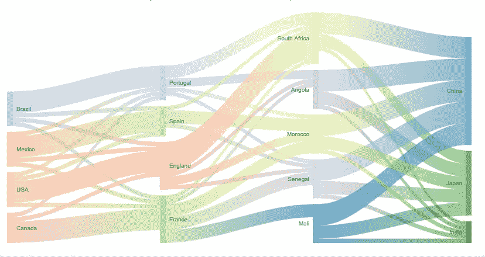

# 超现代可视化的故事-桑基图表

> 原文：<https://towardsdatascience.com/the-tale-of-ultra-modern-visualizations-sankey-chart-5da0885eee1c?source=collection_archive---------46----------------------->

## 在这一系列用于数据科学的高级可视化技术中，让我们深入探索 Sankey 图表的用例。

在过去的几年里，数据科学的发展势头越来越大。这无疑是当今最热门的领域之一。在本文中，我将讨论数据科学的一个重要部分——数据可视化。

马库斯·温克勒在 [Unsplash](https://unsplash.com?utm_source=medium&utm_medium=referral) 上的照片

数据可视化是数据科学过程中不可或缺的一部分，它可以帮助您获得洞察力并更好地理解您的数据，以便您可以在构建机器学习模型时优化数据的使用。

在这个系列中，我将带您浏览一些非常有用但尚未开发的图表。让我们从这个开始:

# 桑基图表

桑基图类似于流程图，其中箭头的宽度代表流量。*节点*是数据流出和流入的值，*链接*的宽度代表数据流量。*源*和*目标*是相对于节点的索引指定的，并且应该提到表示数据流量的*值*。

在这里，我加入了一个非常基本的 Sankey 图表，该图表显示了第一年和第二年来自基础、白银和黄金等级的客户流量。我用 Plotly 制作了它，所以它是交互式的。因此，请随意悬停在它上面以获得更多见解:)

此处，节点为*第一年基数*、*第二年基数*，进出数据的值是流动的，将鼠标悬停在图表上，将显示*来源*、*目标*和*值*。

作者图片

你可以在这里找到我的全部源代码。在鼠标悬停时，你会发现它向我们展示了有多少客户从一个层级迁移到另一个层级。

因此，当我们希望可视化大型数据集时，这个图表非常有用。我使用从 [Plotly](https://plotly.com/python/sankey-diagram/) 引用的内容重新创建了一个图表，这是一个完美的例子，反映了当我们处理具有大量内部连接的大型数据时，桑基图的有用性。下图显示了 2050 年的能源预测。确保您将鼠标悬停在图表上，以获得更好的见解。节点的位置可以根据用户的方便而改变。

附言:您可以在这里点击“编辑图表”选项来摆弄图表并尝试使用您自己的值:)

作者图片

这里的一个附加特性是节点和链接的颜色可以根据喜好定制。这张来自 [Google Charts](https://developers.google.com/chart/interactive/docs/gallery/sankey) 的图表就是一个很好的例子。

桑基图表。来源:谷歌图表

**结论:**

桑基图是最好的图表之一，可以用来表示大数据从*源*节点到*目标*节点的流动。

1.  当我们处理大数据时，并且我们希望可视化大量参数之间的数据流时，这尤其有用。
2.  Sankey 图表中的定向箭头有助于理解生产环境中的数据流，这使得它们非常有用。
3.  桑基图主要用于物质或能量流的可视化。
4.  由于有吸引力和信息丰富的设计，它们有助于非常容易地发现数据中的不一致。

我会强烈推荐大家尝试一次！

**参考文献**:

[谷歌图表](https://developers.google.com/chart/interactive/docs/gallery/sankey)

[阴谋地](https://plotly.com/python/sankey-diagram/)

[第一次可视化的源代码](https://www.kaggle.com/jilkothari/advanced-visualization-sankey-chart)