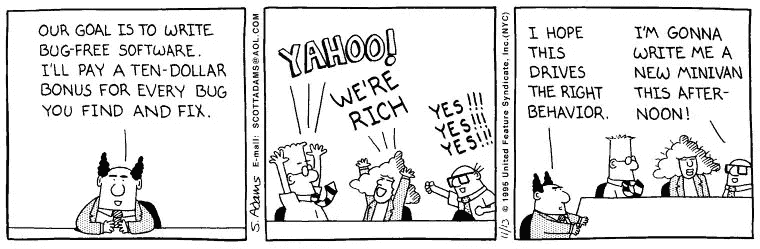

# 度量标准的诱惑

> 原文：<https://towardsdatascience.com/the-temptation-of-metrics-6241ed494488?source=collection_archive---------34----------------------->

## 目标和激励如何伤害你的生意

# 韵律学

在数据科学中，指标非常有趣。来自大数据的结果可以为我们提供诱人的量化见解，我们可以利用这些见解来改进我们的业务。度量让我们更加**了解**——我们对某件事“检查”得越多，我们就越能观察到随时间的变化。指标**激励**我们——它给我们一些“努力”的目标。度量标准提供了**成就**或**失败**的二元组合——如果我们符合既定的目标，那么我们就成功了。否则，我们就会失败。

在商业中，度量标准一直被使用。度量提供关于特定过程的测量，并提供改进或“优化”的基础。一些指标包括:

*   解决一个客户服务问题平均需要多长时间？
*   iPhone 装配线上每天会出现多少缺陷？
*   我们的员工每周工作多少小时？

显然，指标很重要。他们在我们的生活和商业中扮演着重要的角色。它们提供了我们可以用来“跟踪”我们进展的定量测量。但是有时候，度量标准可能是有害的。有时，我们用来指导决策的指标最终对我们的伤害大于帮助。

# 古德哈特定律

英国经济学家查尔斯·古德哈特写下了我们今天熟知的古德哈特定律。该理论指出:

> 一旦出于控制的目的而对任何观察到的统计规律性施加压力，它就会崩溃。

提炼出它的本质:

> "当一个度量成为目标时，它就不再是一个好的度量."

我们来分析一下。该行的第一部分写着，*“当一个度量成为目标时……”*因此，对于某个被跟踪的指标，一个标杆被设定为人们要达到的目标。这一行的后半部分写着，*“…它不再是一个好的衡量标准。”*一旦人们知道目标实现后会有回报，他们就会调整努力来实现目标，即使企业的整体结果很糟糕。

古德哈特定律的一个简单例子是首席执行官试图使他/她的公司利润最大化。一位数据科学家发现了加薪和员工绩效之间的关系。然后，数据科学家将这一见解提供给首席执行官。首席执行官接受了数据科学家的建议，通过只向达到特定指标的人提供奖金来激励更高的员工绩效。所有员工都想要奖金，因此首席执行官设定的指标成为优先事项，每个人都相应地调整自己的工作习惯。但古德哈特定律告诉我们，这个计划可能会对首席执行官产生适得其反的影响，这将对提供洞察力的数据科学家产生不良影响。**在提供见解时，数据科学家必须注意目标指标可能导致的不可预见的后果。**

正如史蒂夫·乔布斯曾经说过的:

> “激励结构起作用……所以你必须非常小心你激励人们做的事情，因为各种各样的激励结构会产生你无法预料的各种后果。”

满足目标指标的激励措施并不总是能带来预期的结果。来源:[呆伯特](https://dilbert.com/strip/1995-11-13)

# 纸杯蛋糕

**假设在一家精品纸杯蛋糕店，店主想要增加利润。这家店的顾客如此之多，以至于他们需要比平时每天多烤一些纸杯蛋糕。所有者知道需求是存在的，并且需要以某种方式提高效率。她没有足够的钱来雇佣更多的面包师，所以她决定通过诱人的金钱激励来提高现有面包师的工作效率——**每周末烘焙最多纸杯蛋糕的面包师将获得额外的 100 美元。自然地，每个面包师都想要钱，并把他们的“纸杯蛋糕计数”放在首位。因此，在激励计划的第一周，顾客络绎不绝，面包师拼命工作，总是有大量的纸杯蛋糕可供购买。一周结束时，老板检查账目，注意到利润增加了。店主很激动——看起来计划成功了！****

然而，当她查看手机时，店主注意到在过去的几天里，这家面包店在 Yelp 上收到了很多非常负面的评论。一些顾客抱怨黏糊糊、没煮熟的纸杯蛋糕——里面有生鸡蛋。一些人抱怨说顶部的糖衣和装饰很乱。其他人抱怨粗鲁的客户服务，以及在点餐和付款时“感觉很匆忙”。此外，当店主检查她的面包师时，她注意到他们看起来很累。她还看到他们的手和前臂上有许多烧伤的痕迹。在给获胜的面包师 100 美元奖金后，一位同事面包师将围裙交给店主，然后辞职。他说他觉得在这里工作不安全，并声称获胜的面包师故意“破坏”他的一个面包，只是为了赢得奖金。随着时间的推移，越来越多的 Yelp 负面评论影响了顾客量，几周后，纸杯蛋糕店就破产了。

曾经是一家高端纸杯蛋糕精品店，快乐、合作的面包师制作高质量的纸杯蛋糕，突然产生了疯狂、背后捅刀子的面包师，他们把纸杯蛋糕的数量作为唯一的指导原则。纸杯蛋糕质量、顾客满意度和员工满意度都直线下降。业务遭受了多种不可预见的后果，并最终由于指标激励而失败。

美味、好看的纸杯蛋糕需要很多爱、关怀和时间来制作！试图最大限度地提高纸杯蛋糕的产量以获得更多利润不会生产出像这些一样甜的纸杯蛋糕！^

# 教训

虽然这个例子有点戏剧性，但是它说明了度量标准非常有用，但是如果我们过分关注它们，也会带来灾难性的后果。当一个企业沉迷于一个度量标准时，那么这个企业的其他可能无法测量但可以感知的质量可能会被无意地牺牲掉。

让我们回到纸杯蛋糕店的例子。店主希望获得更多的利润，并决定以每位面包师生产的纸杯蛋糕数量作为衡量生死的标准。但是，确保她事业成功的其他更微妙但同样重要的品质呢？她的面包师们的快乐呢？她的面包师之间的**合作**水平如何？她的面包师的**安全性**怎么样？这些是面包店工作文化的基础品质，使企业保持强大、稳定和成功，这才是最终的目标。

# 教训是:在提供针对特定指标的建议之前，数据科学家应该注意潜在的后果。

# 无限游戏

因此，在古德哈特定律的背景下，我们可以说，短期业务指标，如每月利润目标、员工工作的总小时数和烘焙的纸杯蛋糕总数，只能服务于有限的思维模式。在最基本的层面上，测量应该提供一种**进度的感觉。通过他们的工作，人们只想感受到他们正在进步，正在推进他们所关心的事业。企业应该认识到这一点。**

在**《无限游戏》**中，西蒙·西内克把商业说成是一场没有开始也没有结束的游戏。当资源耗尽或不愿意继续玩游戏时，企业可以继续玩游戏或停止玩游戏。Sinek 认为，优秀的企业明白没有“赢”或“输”。在无限游戏中，只有游戏中的商家和没有的商家。在这种情况下，作者建议企业应该有一个可持续、灵活和持久的总体心态，以继续“玩游戏”这与专注于短期指标、击败竞争对手、不断追求短期“胜利”的企业截然不同。

> “…为了在无限的商业游戏中取得成功，我们必须停止考虑谁是赢家或谁是最好的，而开始考虑如何建立足够强大和足够健康的组织，以便在未来的许多代人中保持竞争。”**-西蒙·西内克，****无限游戏**

**事实上，指标对于数据科学家和企业来说至关重要。然而，我们必须意识到指标的诱惑。这不全是为了达到利润目标。这不仅仅是优化生产力。这并不意味着成为“第一”并击败所有的竞争对手。对于企业来说，这是关于尽可能长时间地留在游戏中。**

# **来源:**

** [## 西蒙·西内克的《无限游戏》

### 你知道你在玩什么游戏吗？西蒙越是开始理解有限和无限的区别…

simonsinek.com](https://simonsinek.com/the-infinite-game?ref=home)  [## 什么是指标，为什么它们很重要？

### 家庭图书馆运营六适马——定义阶段什么是指标，为什么它们很重要？指标是指…

www.managementstudyguide.com](https://www.managementstudyguide.com/what-are-metrics.htm)**