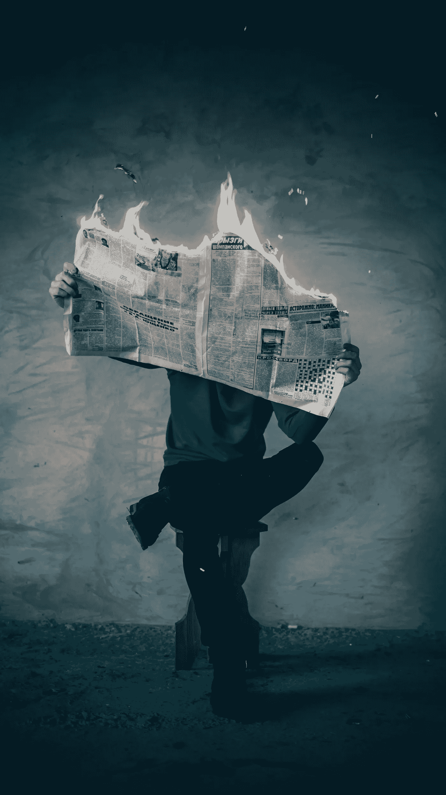

# 算法过滤和技术可能会加剧对审查的担忧

> 原文：<https://towardsdatascience.com/the-threat-of-private-censorship-accelerates-in-the-age-of-covid-19-aec4ed1f6a86?source=collection_archive---------59----------------------->

资料来源:Unsplash /伊莱贾·安东内尔

鉴于外国势力利用社交媒体影响选民的消息被披露，2016 年大选后，他开始了对被称为“假新闻”的错误信息的战争。经过大约四年的事后讨论，我们看到各种机构、政治家、商业领袖和知名人士呼吁监管科技公司，更具体地说是社交媒体平台。论点如下:这些社交媒体平台已经成为事实上的信息来源，类似于过去的公共广场，这些平台上有时出现的错误信息已经成为一种公共威胁。有些人甚至称这个问题是“对我们民主的威胁”。

两件事可能同时是真的。1)现在，社交媒体平台确实对公众意见和信息有重大影响。2)错误信息一直存在，而且随着更多新闻渠道的出现，错误信息只会越来越多。民主的棘手之处在于，通过鼓励进一步参与公共事务或公共对话，我们同时也为谎言或“坏观点”的传播提供了机会。

民主在大多数尝试过的地方都被证明是混乱的。作为一个先进的社会，我们希望鼓励公众参与，同时保留对公共信息的表面控制。创始人明白那些通过言论或媒体隐瞒有价值见解的人所构成的威胁。这就是为什么他们在权利法案第一修正案中保护这一自然权利不受政府侵犯的明确原因。鉴于宪法已经有 200 多年的历史，宪法的创立者们并没有预见到在 21 世纪的经济中，跨国公司会成为自由媒体的最大威胁，因为它们代表着“法官、陪审团和刽子手”。

这些公司拥有的巨大权力不能低估。这绝不意味着我们应该反对这些公司，但它确实意味着我们必须保持警惕，并让这些实体承担责任。不管外部环境如何，这一标准仍然有效，例如当前由[新型冠状病毒](https://www.who.int/emergencies/diseases/novel-coronavirus-2019/technical-guidance/naming-the-coronavirus-disease-(covid-2019)-and-the-virus-that-causes-it)引起的公共卫生危机。

**多事之秋**

从 9 月 11 日袭击后国会的干预开始，我们已经慢慢习惯于接受将重大问题框定为危机或战争。正如我在**Mises Wire*写的，“在危机时期，政府倾向于过度补偿风险。”这适用于那些以“公共利益”为目的传播或托管信息的人。众所周知,“公共利益”是一个模糊的描述，用来描述社会整体的利益。我们被告知，执行《USA PATRIOT 法案》也符合我们的利益，尽管该法案赋予美国情报界广泛的“间谍”或监视工具。从本质上说，我们已经把危机和战争与政府干预的急剧增加和颠覆我们公民自由的意愿联系在一起。*

*自从《USA PATRIOT 法案》实施以来，我们的社会因越来越依赖技术和数据的使用而发生了巨大的变化。正如我在*经济教育基金会*所写的，我们的操作能力在许多方面创造了一个“潜在的监视装置”。当我们利用各种技术工具时，这种监视装置基于被监视和收集的各种数据点运行，包括有意和无意的。将这些数据点与主要技术公司的巨大市场力量结合起来，呈现出一种有点奥威尔式的动态，尤其是当我们考虑到日常行业是如何受到影响的时候。*

* [## 大规模监控随着新冠肺炎一起蔓延

### 由新型冠状病毒疫情引起的社会后果已被日益增长的…

fee.org](https://fee.org/articles/mass-surveillance-is-spreading-along-with-covid-19/) 

为了在以社交媒体为中心的社会中生存，新闻媒体被迫改变其商业模式。与报纸或杂志不同，现代新闻通常是通过滚动看似无穷无尽的脸书或推特信息发现的。这种新闻提要的运作依赖于复杂的算法集，这些算法通过分析大量数据来确定哪些内容可以最大限度地提高参与度。通常，这些算法在我们不知道的情况下被调整。已经有像脸书这样的平台做出改变的例子，这些改变导致不太“权威”的来源的用户流量急剧下降。

**今天的问题破坏了我们与大型科技公司的关系**

今天的公共健康危机给这个系统带来了更大的麻烦。在公共健康的幌子下，自由被剥夺了。由于政府强制关闭“非必要”企业，我们正遭受前所未有的经济衰退。我们每个人都被告知，我们必须尽自己的一份力量来“拉平曲线”并拯救生命。

脸书、谷歌和其他平台已经采取了“异常大胆的措施来阻止关于新冠肺炎的错误信息流传”，*《大西洋月刊》*写道。这种咄咄逼人的行为可能会取悦公共卫生当局，但它严重损害了公众对这些技术公司的信任，因为它们仅仅是真相的仲裁者。

自从这个疫情开始以来，我们一直处于复杂的局势中。处于此次危机中心的病毒是新的，因此关于其真实传播率、致死率、危险程度和潜在治疗方法的信息要么不存在，要么正在进行进一步研究。绝对有一些事实和措施证明了在对抗病毒方面取得了一定程度的成功，但问题是:为什么社交媒体平台要决定什么是事实和虚构？从危机一开始，世界卫生组织等知名公共卫生机构就一直在鹦鹉学舌中国共产党的说法。

不幸的是，由于重大失误，自该病毒出现以来，知名机构和权威人士对其威胁的判断一直是错误的。政治机会主义者一直在寻找一切机会揭露对手准备不足，但现实是大多数主要国家都毫无准备。这种缺乏准备的状态为煽动和极端行为创造了一个成熟的环境。

**采取的行动**

脸书、推特和 YouTube 正在依靠自动化工具来消除错误信息，其中“言论成为疫情周围动员的附带损害，是对当前紧急情况的让步。”例如，Twitter 和脸书[删除了巴西总统雅伊尔·博索纳罗的](https://www.theverge.com/2020/3/30/21199845/twitter-tweets-brazil-venezuela-presidents-covid-19-coronavirus-jair-bolsonaro-maduro)帖子，这些帖子涉嫌违反其发布虚假或误导信息的政策。

 [## 尽管联合国机构的灾难性轨道，YouTube 禁止在新冠肺炎与世卫组织教相矛盾的内容…

### YouTube，做得更好。更加信任你的用户。像对待有学习、成长能力的人一样对待他们

fee.org](https://fee.org/articles/youtube-to-ban-content-that-contradicts-who-on-covid-19-despite-the-un-agency-s-catastrophic-track-record-of-misinformation/) 

YouTube 的首席执行官苏珊·沃西基[表示](https://fee.org/articles/youtube-to-ban-content-that-contradicts-who-on-covid-19-despite-the-un-agency-s-catastrophic-track-record-of-misinformation/)任何违背世卫组织建议的行为都是对他们政策的违反。沃西基还表示，YouTube 将删除“有问题的”信息，包括“任何未经医学证实的信息”。类似地，受欢迎的博客网站 Medium 正在“[积极地删除](https://www.theverge.com/2020/4/14/21219907/medium-coronavirus-covid-19-news-misinformation-conspiracy-theories-best-worst)[新冠肺炎内容](https://help.medium.com/hc/en-us/articles/360045484653-COVID-19-Content-Policy)的新政策下的病毒帖子，尽管该网站的[使命](https://medium.com/@ev/welcome-to-medium-9e53ca408c48)是成为“你想说什么就说什么”的平台另一个流行的内容聚合网站 Reddit 已经在两个子网站上添加了警告信息。流行的活动管理网站 Eventbrite 已经从其平台上取消了鼓励人们违反社交距离准则的聚会；“一些政府官员宣传抗议是一种非必要的活动，因此违反了社会距离准则。

平台通过编写充满法律术语的政策和服务条款来规定使用条款，这规定了平台评估(判断)争议内容并最终决定内容结果(陪审团)和惩罚(刽子手)的能力。通常，这些平台使用某种形式的上诉程序，但就地安置令使这一点变得困难。相反，许多人暂时取消了他们的上诉程序。

个人几乎没有法律追索权，因为根据第一修正案，这些公司没有责任。在*普雷格大学诉谷歌*一案中，美国第九巡回上诉法院[的一个小组认为](https://cdn.arstechnica.net/wp-content/uploads/2020/02/youtube-1st-amendment-ruling.pdf)“尽管 YouTube 无处不在，并且是一个面向公众的平台，但它仍然是一个私人论坛，而不是一个受第一修正案司法审查的公共论坛。”明尼苏达大学的法律教授威廉·麦克吉文[说](https://www.abajournal.com/magazine/article/fake_news_libel_law)很难定义一个清晰的“假新闻和另类观点之间的界限”并且“当你看到它的时候你可能会知道，但是对言论施加限制是一种危险。”

 [## 网络言论永远不会恢复正常

### 在关于自由与控制全球网络的辩论中，中国基本上是正确的，而美国是错误的…

www.theatlantic.com](https://www.theatlantic.com/ideas/archive/2020/04/what-covid-revealed-about-internet/610549/) 

所有这些行动加在一起，为言论自由和新闻自由创造了一个危险的环境。由于国内外的公共卫生专家在多个层面上都失败了，人们担心可能会审查那些对当今问题有替代解决方案的人。权威较低的公共卫生官员和统计学家可能是克服大型公共卫生机构固有偏见的关键。虽然传播错误信息的担忧是非常真实的，但我们冒着审查那些可能是缓解这场危机的关键的人的风险。

**结论**

拉姆·伊曼纽尔的名言“永远不要浪费危机”引起了共鸣，因为它在政府官员和强大机构的头脑中根深蒂固。过去的危机奠定了一个框架，表明短期“解决方案”往往会融入长期行动。中央情报局告密者爱德华·斯诺登(Edward Snowden)因揭露情报界大肆使用根据《USA PATRIOT 法案》启动的各种项目而闻名，该法案被卖给了惊慌失措的美国。同样，尽管这些技术公司的行为对我们的文化有潜在的破坏性影响，但它们的行为还是受到了赞扬。我们的文化维护了言论自由，避开了审查。

这些公司中有许多是公开上市的，因此它们的股东可能会开始意识到，这些临时措施符合各自公司的长期利益。政客们可能同样明白，与政府不同，这些平台不受第一修正案的约束。这就引出了一个问题:有哪些约束让这些平台对言论自由负责？这些公司真的仅仅作为社交媒体平台存在，还是一种需要新约束的新现象？

正如 Evelyn Douek [在大西洋*杂志*上写的](https://www.theatlantic.com/ideas/archive/2020/04/pandemic-facebook-and-twitter-grab-more-power/610213/)，“用户没有办法强迫平台回答这些问题。事实上，紧急状态突显了大多数网络言论监管的[真理](https://www.lawfareblog.com/covid-19-and-social-media-content-moderation):规则制定、执行和审查的权力都集中在同一个人手中。疫情期间发生的事情只是常态的一个强化版本。”我们可能会接受某种程度的平台节制，以确保我们拯救生命并“拉平曲线”，但随着这场公共卫生危机的平息，我们必须解决围绕非政府审查的长期问题。

言论自由的支持者必须继续抵制看似有问题和“武断而多变”的过滤算法的使用，尽管许多平台已经采取措施平息负面反馈。例如，脸书已经建立了一个新的、大部分独立的内容监督委员会来“听取反对删除违反脸书社区准则的个别内容的个人上诉”虽然该委员会的初始范围相当狭窄，但这是朝着正确方向迈出的一步。

乔·罗根体验# 1258——杰克·多西、维贾亚·加德和蒂姆·普尔

Twitter 的高管们通过 YouTube 上的热门节目，如 Joe Rogan 的 [Joe Rogan Experience](https://www.youtube.com/watch?v=DZCBRHOg3PQ) 来回答关于该平台过去的实践和未来状态的问题。脸书的马克·扎克伯格(Mark Zuckerberg)已经做出一致努力，接触各种意识形态团体，以平息他们对潜在审查的担忧。这些高管明白维系公众对我们媒体和技术机构信任的微妙平衡。为了确保这些平台和个人之间持续的公众信任和基本的公平，我们必须继续通过对话和不断的个人抵制来追究这些机构的责任。*