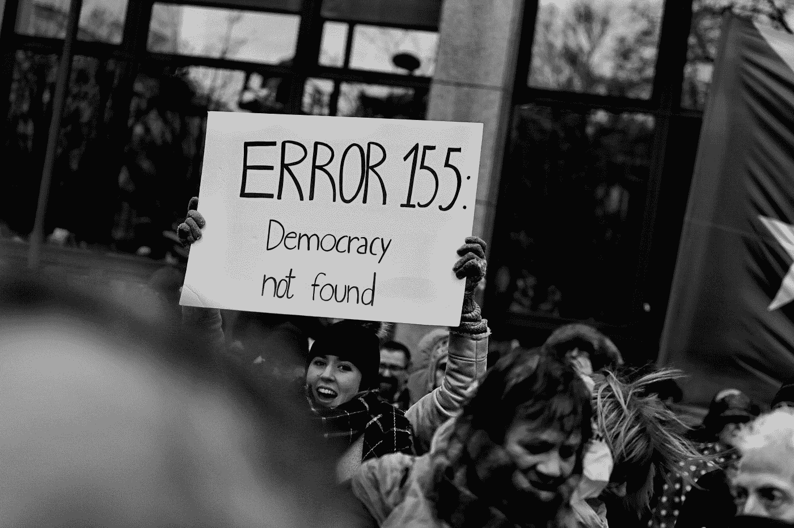

# 摇摆选民的人工智能暴政的威胁

> 原文：<https://towardsdatascience.com/the-threat-of-the-ai-powered-tyranny-of-swing-voters-37e0a09533f3?source=collection_archive---------45----------------------->

兰迪·科拉斯在 [Unsplash](https://unsplash.com?utm_source=medium&utm_medium=referral) 上的照片

## 人工智能将如何赋予少数独立选民前所未有的权力

因斯顿·邱吉尔有一句名言:“民主是最糟糕的政府形式，除了那些不时尝试过的其他形式。”我们可以长期讨论民主的弊端，而且，正如约翰·肯尼思·加尔布雷思[所说](https://www.globalpolicyjournal.com/blog/24/09/2019/advent-ai-powered-tyranny-independent-minority)，如果你想获得一份有利可图的图书合同，你应该写“美国民主的危机”

自古以来，所谓的多数暴政问题一直被广泛视为民主最严重的弱点之一。多数人的暴政指的是多数群体将其政策强加给其他人的能力，从而为了众所周知的 51%的利益而侵犯其权利。

多数问题的暴政源于功利主义哲学的一个缺陷。特别是，在一个民主国家，人们被认为最容易满足他们的需求，从而增加他们的效用，仅仅因为他们会投票给最能代表他们利益的官员。

然而，对这个问题的这种功利主义观点忽略了一个重要因素:在追求其目标时，多数派能够建立一个对自己不利的制度，往往以牺牲少数人的利益为代价。毕竟，根据古典功利主义逻辑，牺牲少数人的利益来促进“最大多数人的最大幸福”在道德上是正确的。例如，全球化(虽然总的来说是有益的)——在一定程度上——是以一些工人阶级为代价的，他们由于自动化和更便宜的进口商品的涌入而失去了工作。

许多伟大的思想家和政治家表达了对多数人暴政问题的担忧，埃德蒙·伯克[写道](https://www.bartleby.com/24/3/9.html)“大多数公民能够对少数人实施最残酷的压迫。”与此同时，詹姆斯·麦迪逊(James Madison)和托马斯·杰斐逊(Thomas Jefferson)等美国国父旨在通过对美国宪法进行相关修改来捍卫少数群体的权利，这些修改实质上赋予了少数群体更多的权力，以防止上述暴政的出现。间接选举产生的参议院以及选举团等机构就是最好的例子。

## 真正的暴政

H 然而，虽然多数人的暴政无疑是一个重要的挑战，但在现代民主国家，有效的制衡防止了权力垄断，而少数人往往能够通过某些程序和制度推进自己的利益。然而，我们现在应该关注的是一个新出现的威胁:由人工智能(AI)进一步推动的“少数人暴政”的风险。

分析人士用少数人暴政一词来描述各种现象，包括游说者、富人、权势集团、“深层国家”、美国参议院和选举团等所谓的非法影响。

虽然这些问题很重要——在一个由人工智能和大数据等新技术的出现所定义的时代——但我们应该更加关注这些技术如何影响民主进程并危及系统的稳定性。AI 还与另一个群体发生作用，我认为这个群体构成了比说客或选举团更大的少数派暴政。这个群体由无党派人士或“摇摆选民”组成，他们对选举结果拥有极大的影响力。

在[美国](https://www.pewresearch.org/fact-tank/2019/05/15/facts-about-us-political-independents/)。“总体而言，只有 7%的美国人没有表达党派倾向，”而在英国，“战术选民”(未决定支持某个特定候选人的公民)，[约占总人口的四分之一。](https://www.bbc.com/news/uk-politics-50249649)

即使在高度两极分化的政治环境中，候选人在赢得初选后，通常会采取更温和的信息，以吸引独立人士，从而赢得选举。(这预示着他的政党中更激进的成员会支持他，因为他至少不是反对党的成员。)

这种趋势实际上可能是一件好事，因为政治家可能会变得更加温和，更少两极分化。但是，事实上，人工智能进入游戏，然而，彻底改变了事情；无党派人士不仅会影响政治家的观点，还会成为政治广告和宣传的主要目标。

## 进入人工智能

一个人工智能将[标志着](https://humanevents.com/2019/10/23/a-i-will-mark-a-turning-point-in-the-history-of-politics/)政治史上的一个转折点。它既提供了以前无法想象的机会，也提出了严重的挑战，有可能破坏当今社会制度的基础。

正如亨利·基辛格[在*世界秩序*中所说](https://books.google.com/books?id=NR50AwAAQBAJ&pg=PT247&lpg=PT247&dq=...the+convictions+expressed+by+the+candidate+%5Bare%5D+the+reflections+of+a+%E2%80%98big+data%E2%80%99+research+effort+into+individuals%E2%80%99+likely+preferences+and+prejudices,+then+what+once+had+been+substantive+debates+about+the+content+of+governance+will+reduce+candidates+to+being+spokesmen+for+a+marketing+effort.&source=bl&ots=nCcUCxguqX&sig=ACfU3U3dLySwe00iF-TRBWOctGvttDVyUg&hl=en&sa=X&ved=2ahUKEwiU7LqsgqfnAhUqx1kKHWroBZwQ6AEwAHoECAoQAQ)，如果:

> …候选人表达的信念[是]对个人可能偏好和偏见的“大数据”研究努力的反映，那么曾经关于治理内容的实质性辩论将使候选人沦为营销努力的代言人。

因此，考虑到普通公民对宣传的敏感性以及他们对复杂的政治和经济问题的相对不熟悉，理性的审议过程可能会让位于危险的大众诉求。正如我在别处所说，“如果选举所需的素质和执政所需的技能之间的差距变得太大，民主可能会退化为蛊惑人心。”

将人工智能与政治营销结合起来使用，不仅为政治家提供了研究选民意愿的工具，还提供了利用他们的恐惧、渴望、仇恨和欲望的工具。有了设计巧妙的算法，政治家们可以检查个人意见，并通过个性化广告促使犹豫不决的选民支持他们。

如果一个候选人知道某些公民是他们的忠实支持者，他或她的人工智能团队将不会努力吸引他们的支持；相反，该团队可以只瞄准那些有助于取得胜利的摇摆选民。

这意味着一个国家的命运可以由几十万摇摆不定的选民决定，这些选民将受到政治光谱各方宣传的恶性影响，因此不太可能做出明智的决定，最终导致独立少数人的人工智能暴政。

> 然而，随着人工智能在政治营销中的使用，政治家可以为每个人提供一个对他或她有吸引力的个性化广告——除了这个人以外，其他人都不可能看到。

如果是这样的话，那么在美国选举中，决定选举结果的整个人口可能生活在科罗拉多、佛罗里达、爱荷华、密歇根、宾夕法尼亚和其他几个摇摆州的几个县。(当然，目前相对固定的政治极化水平在很大程度上是假设的。)

候选人个性的多样性在政治中并不新鲜:政客们在针对不同的选民群体时，经常表现出不同版本的自己。然而，随着人工智能在政治营销中的使用，政治家可以为每个人提供一个对他或她有吸引力的个性化广告——除了这个人以外，其他人都不可能看到。那么，问题仍然是，在就职典礼之后，哪一个版本的政治家会出现。

## 如何防止暴政

如果我们想要确保自由民主的可行性(及其作为一种制度的成功)，我们必须采取措施防止这种形式的少数派暴政的出现。

通过对选民进行经济和政治基础教育、限制选举开支以及控制政治营销，我们可以开始采取措施保护民主免受人工智能引发的威胁——甚至从长远来看加强民主。

最后，保护民主还需要人工智能时代社会三大基本支柱之间更广泛的合作和协调:公民、企业和政府。此外，国际社会应该采取措施确定人工智能的道德标准，以避免潜在的毁灭性人工智能军备竞赛。简而言之，解决自由民主问题的最佳方式是更加自由的民主。只有到那时，我们才能防止民主退化为人工智能和全能少数群体的混合体。

*原载于* [*梅里恩西*](https://merionwest.com/2020/01/28/john-kenneth-galbraiths-newest-crisis-of-american-democracy/)