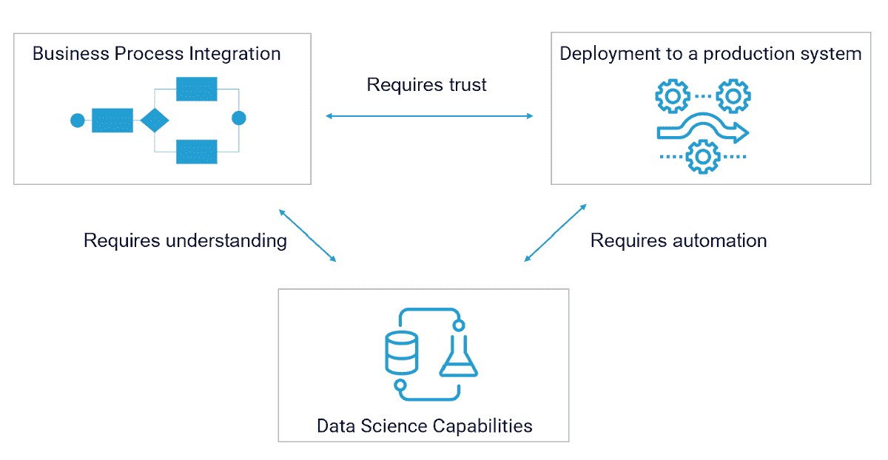

# 成功人工智能的三个关键要素

> 原文：<https://towardsdatascience.com/the-three-key-ingredients-of-successful-ai-752efe9ae706?source=collection_archive---------34----------------------->

## 你的组织需要什么来从机器学习和人工智能中获得商业价值

2020 年，许多组织都相信数据科学的附加值。已经投入了大量资源来建立新的现代化数据部门。在他们构思之后，将这些团队的成果转化为具体的商业价值似乎比预期的要困难得多。发生了什么事？

为了解释这一现象，我们将研究在业务流程中成功实施机器学习所需的关键因素。在这三个重要支柱中，有两个经常被忽视，导致令人失望的结果。这些成分是:

1.  强大的机器学习能力
2.  快速可靠地部署机器学习解决方案
3.  业务流程中机器学习解决方案的无缝集成

需要一个强大的数据团队来获得结果是显而易见的，并得到了大量的关注。快速可靠地部署解决方案所需的努力经常被低估，业务流程集成通常只是事后才想到。我们将首先深入研究最后一个要素，因为在我们看来，这是项目应该开始的地方。

图由 [Cubonacci](http://www.cubonacci.com) 绘制

# 业务整合

大多数机器学习项目只有在正确集成到业务流程中后才会增加价值。虽然这看起来很明显，但您会惊讶地发现所需的努力经常被低估。对新解决方案的输出缺乏信任是机器学习项目失败的主要原因之一。另一个常见问题是数据科学家和他们的业务合作伙伴之间缺乏理解，这可能导致一群有能力的人解决错误的业务问题。对业务集成给予足够的重视对于成功的机器学习项目至关重要。

# 影响和连续性

机器学习通常可以通过两种方式改善业务流程:提高复杂决策的质量，以及大规模自动化决策流程。算法交易和预测性维护是复杂决策的例子，可以通过在海量数据上训练机器学习模型来改善这些决策。自动决策提供了规模优势:虽然专家员工可能会做出更好的决策，但机器学习模型可以在亚秒级的处理时间内做出数十亿个这样的决策。这种商业案例的常见例子是个性化网站的推荐系统和分析客户实时反馈的自然语言处理。

衡量解决方案的性能及其给业务流程带来的改进非常重要。正因为如此，机器学习解决方案通常以概念验证的形式进行测试。根据定义，集成是临时的，性能测量是临时的和随机的。这在一开始是可以接受的，但从长期来看是不够的。

通过预测首选的最终情况，并在解决方案中投入时间、金钱和资源以尽快达到所需的水平，可以缩小这一差距。长期影响需要结构质量和连续性。

# 技能

机器学习解决方案的业务集成是人类的劳动。它需要商业领域的专业知识、软件开发、商业领导力和强大的机器学习知识。使用机器学习产生影响需要聚集一个拥有正确技能组合的团队。

# 部署:机器学习的持续交付

只有当机器学习模型在生产系统上可用时，业务流程中的集成才是真正可能的。使这些模型可用也被称为部署这些模型。成功的部署流程快速、可靠且可预测。在完美的世界中，您的组织能够不断改进和部署机器学习模型。没有什么比无休止地等待一个有前途的应用程序可供使用更令人沮丧的了。

# 信任

缓慢的部署过程阻碍了用户的接受，并降低了对应用程序的信任。这对数据应用程序来说可能是灾难性的，因为信任是成功的业务集成的关键成功因素之一。

# 衰退

大多数机器学习应用还有一个额外的风险:它们会随着时间的推移而衰减。世界在不断变化，包括模型的输入和输出之间的关系。这意味着模型的价值会随着时间的推移而降低。一个领域的变化越不稳定，这种影响就越强。这个概念通常被称为漂移。

当出现偏差时，缓慢的部署过程会直接损害解决方案的商业价值。补救措施似乎显而易见:经常用新数据重新训练模型。不幸的是，在实践中这是困难的。为机器学习构建一个持续的集成和交付过程需要组织的高度成熟度以及高度的标准化和自动化。

# 标准化和自动化

机器学习领域中连续交付所需的自动化程度经常达不到。这经常成为参与构建机器学习模型的人的责任。虽然那里并不缺乏智慧或创造力，但实现这种高度自动化的大部分工作涉及软件工程和 IT 运营，这远远不是数据科学家的核心能力。结果往往是代码库中充满了难以维护和移交的拼凑脚本。甚至像 LinkedIn 这样相对年轻、专注于技术的公司也遭受了这种困扰。

# 库博纳奇

我们一直致力于以用户友好的方式帮助标准化和自动化的解决方案。 [Cubonacci](http://www.cubonacci.com) 是一个代码优先的平台，帮助组织大规模管理和部署机器学习。通过授权数据科学家和机器学习工程师定制他们需要的东西，但负责扩展基础设施，跟踪他们的实验和部署，并调度作业以保持模型最新，我们讨论的部分问题得到了解决。你可以在 LinkedIn [这里](https://www.linkedin.com/company/cubonacci)关注我们。

# 大规模数据科学:人类劳动

不管你的工具有多强大，没有一个有效的数据团队，就没有成功的机器学习。该领域发展迅速，团队迫不及待地尝试创新和学习新技能。你如何恰当地管理它？这是一个难题。关于这一主题的一本名为《数据科学家的关怀和喂养——如何建立、管理和留住数据科学团队》的密集而优秀的实践手册可以在[这里](https://oreilly-ds-report.s3.amazonaws.com/Care_and_Feeding_of_Data_Scientists.pdf)以免费 pdf 的形式找到。

由 [Kelly Sikkema](https://unsplash.com/@kellysikkema?utm_source=unsplash&utm_medium=referral&utm_content=creditCopyText) 在 [Unsplash](https://unsplash.com/s/photos/skills?utm_source=unsplash&utm_medium=referral&utm_content=creditCopyText) 上拍摄的照片

# 在实践中

根据我们在该领域的经验，我们发现以下几个方面是成功的数据团队发展的基础:

*   合适的人员组合
*   正确支持工具的方法
*   与商业伙伴有良好的理解和关系
*   与更高层次的业务目标相联系的明确目标
*   定期与团队外的专家交流
*   机器学习方法的自主性
*   作为一等公民的部署
*   管理层必须是一个成熟的合作伙伴

一个好的数据团队的关键是接触正确的人。寻找和留住专家需要一个允许他们发挥创造力和影响力的环境。给予你的团队关注、空间和合适的工具。他们为您的组织提供创新解决方案的速度会让您大吃一惊。

与 Marnix van den Broek 共同撰写