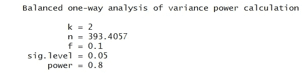

# 实验设计的三个关键

> 原文：<https://towardsdatascience.com/the-three-keys-to-experimental-design-every-data-scientist-should-know-b0d812d86865?source=collection_archive---------17----------------------->


图片来自 [Pixabay](https://pixabay.com/?utm_source=link-attribution&utm_medium=referral&utm_campaign=image&utm_content=217041)

# 规划、设计和分析是所有数据科学工作的核心

这个快速博客旨在帮助你快速进入数据科学的世界；具体来说，就是实验设计。尽情享受吧！

说到实验设计，可以分为三个主要步骤:

*   规划
*   设计
*   分析

# 开始规划和设计

规划应该总是从一个良好的假设开始。

在此过程中，您需要考虑的一些主要事项如下:

*   你想回答的问题是什么？
*   有问题的人口是多少？
*   你的因变量和自变量是什么？

# 分析

进行实验时，需要考虑 3 个关键因素。实验的这三个方面允许我们评估我们人口的可变性。

*   随机选择
*   分身术
*   阻塞

# 随机选择

随机化的目的是确保如果存在与外部因素相关的结果差异，那么它会分布在各个治疗组中。

# 分身术

在进行实验时，我们试图理解结果的可变性。比如说；如果我只做一次给定的实验，并且我依赖于一个可能随机发生的结果。这里的要点是理解各种可能性或结果，因此我们相应地重复实验是很重要的。

**统计能力**

统计能力的概念意味着，如果你的实验得出的结论是你拒绝零假设并接受另一个假设，这可能不是随机的。最佳实践是 80%的统计功效。

为了进一步简化这个问题。如果你的假设看起来是正确的，你没有得到那个结果只是因为随机的机会的可能性有多大。

# 阻塞

通过使治疗组更加相似，阻断被用来帮助控制可变性。在一个给定的群体中，你可能会看到差异很小，但是在其他群体中，差异可能会大得多。这方面的一个例子可能是通过性别来阻止实验。

*   通过变量阻塞—为了阻塞而使用 aov
*   随机完全区组设计(RCBD)实验

# t 检验

从你的实验中积累数据后；你可能会做的一个快速且有统计学意义的测试叫做 t 测试。

1.  考虑你的假设或中心研究问题:
2.  零假设——让我们保持简单，当你错了的时候，零假设就差不多了。对于 mtcars 数据集，零假设可能类似于车辆马力对每加仑英里数没有影响。
3.  替代假设——相反，替代假设意味着存在差异。如果你能够用统计显著性确定自变量对因变量的影响，你会说你拒绝零假设并接受替代假设。
4.  这是单边测试还是双边测试？
5.  单边测试——当你测试一个给定的变量是否大于另一个变量时，这是一个单边测试；如果你在测试它是否小于另一个…仍然是片面的。
6.  双边测试——当你测试一个给定的变量不等于另一个变量时，那么它就是双边的。大于或小于单个测试中的值。
7.  你的结果有统计学意义吗？
8.  人们使用统计上显著的左和右这个术语，很少考虑它的实际含义。也就是说，如果你运行你的测试，你的数据表明你的假设是正确的，统计显著性实际上是知道这不太可能是随机的。
9.  这里的标准是 95%的置信度，或者小于或等于 5%的可能性。
10.  什么是统计能力？
11.  类似于统计学意义；假设替代假设为真，功效表示零假设被拒绝的可能性。
12.  功率的标准是 80%。

# 样本量

对于给定的实验，要考虑的一件事是样本量。为了得出所需的数字，需要一些其他变量，包括目标统计功效和显著性。

另一个衡量标准是效果大小。效应大小代表两组的平均值除以两组总和的标准差的差值。

群体之间的距离越大，验证它的样本就越少。差异越小，观察到的距离只是偶然的可能性就越大。

以便计算这些值中的任何一个，包括效应大小、统计功效、p 值等。除了其中一个，你都需要。

加载 pwr 包并使用 pwr.anova.test 来识别这里的奇数变量。

k —组数
n —每组样本量
f =效应大小
sig.level =显著性水平
功效=统计功效

```
library(pwr)
 pwr.anova.test(k = 2,
                n = NULL,
                f = .1,
                sig.level = 0.05,
                power = .8)
```



正如您在上面看到的，给定我们传递给 pwr.anova.test 函数的要求，我们可以看到，要使这些事情成立，我们每组至少有 394 个样本。

# 结论

我希望这有助于你开始实验设计！来看看我在 datasciencelessons.com 的其他帖子吧&祝数据科学快乐！