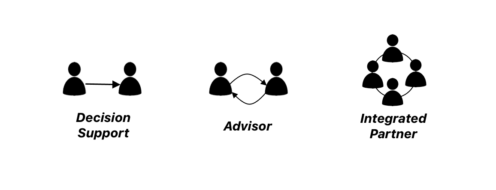
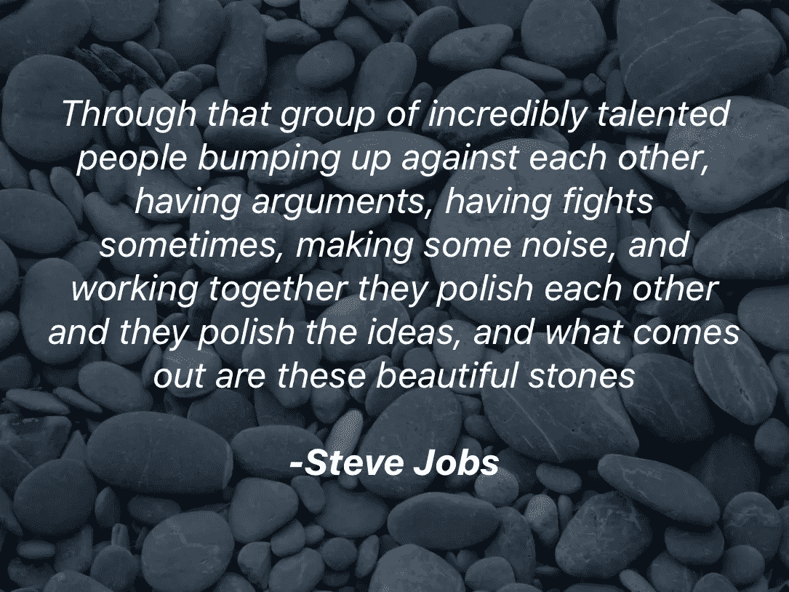
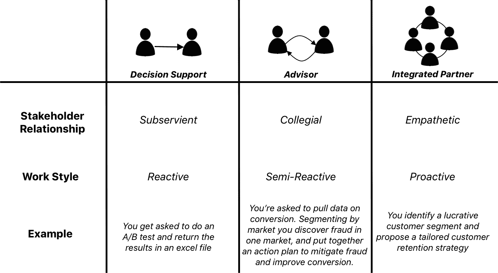

# 数据科学家的三个阶段

> 原文：<https://towardsdatascience.com/the-three-stages-of-a-data-scientist-89b2d8c693ea?source=collection_archive---------69----------------------->

## *在本文中，我们将探讨数据科学家作为决策支持、顾问和集成合作伙伴的区别*

作为一名数据科学家，最好也是最糟糕的一点是这个角色经常需要的模糊性。由于数据科学是一个相对较新的职能，其任务和目标并不总是很明确。这通常意味着公司数据科学的命运掌握在数据科学家手中，他们经常发现自己跨越技术和非技术领域。因此，如果你想成为一名有成就感的数据科学家，塑造和定义这个角色是关键。

在本文中，我们将探索数据科学家在其整个职业生涯中的发展历程，从决策支持、顾问到集成合作伙伴。我们将讨论它们的特点、一些例子，以及如何在每个阶段取得进展。

## **决策支持**

您在决策支持阶段的动态类似于票务系统，您通过简单的数据提取来满足请求，并将见解留给利益相关者。在这个阶段，你与利益相关者的关系是从属的。你不太可能在你应该做什么或者整个公司应该关注什么的问题上进行反驳或者提供意见。这项工作是反应性的，你的路线图包含了你的涉众在那一周的任何要求。

## **顾问**

另一方面，顾问扮演着思想伙伴的角色。顾问不是接受和满足请求，而是花时间去理解问题，并在必要时重新构建请求。有时，这意味着接受简单的数据请求，并通过推荐的行动计划将它们转化为更实质性的项目。这种类型的工作是半反应性的，在这种情况下，您仍然主要由利益相关者设定路线图，但是，它开始呈现出一种合作的氛围，您可以在其中协商约定的条款。你不再是毫无疑问地满足要求，而是与你的利益相关者建立一个对话，在那里你可以互相学习，找出应该优先考虑的事情。

## **综合合伙人**

作为集成合作伙伴，数据科学家帮助制定组织的战略愿景，并积极参与创建数据科学路线图。要达到这一阶段，需要深厚的专业知识，不仅仅是技术技巧和数据，还包括公司的商业和政治。这也意味着要学会发现机会，并与利益相关者合作，积极参与推动行动和结果的项目。这需要高度的同理心，能够设身处地为利益相关者着想，并理解驱动他们的动机。

在这个阶段，你实际上可以设定一个路线图，并朝着它努力。你能够平衡利益相关者的需求，根据你们达成的共识确定什么是最重要的。对于整合型合作伙伴来说，拒绝请求很容易，因为他们已经建立了信任，并从利益相关者那里获得了优先事项的认可。

整合型合伙人也更有可能挑战利益相关者所持的观点，而不是假设他们总是正确的。史蒂夫·乔布斯以培养辩论文化而闻名，认为这是产生伟大想法的先决条件。作为数据的看门人，你有责任提供你独特的观点，而不是保持沉默。

认识到这些阶段的流动性很重要。与所有利益相关方始终保持合作伙伴的动态是一项艰巨的任务。有时候，简单地提供一个数据摘要比试图揭示请求背后的原因更容易。然而，不要养成这样做的习惯，否则你可能会发现自己陷入这种模式，在组织内的影响力微乎其微。

要在每个阶段建立影响力和过渡，你需要超越理解数据。这需要与精通数据的利益相关方建立联盟，并帮助转换那些不倾向于数据的利益相关方。

这也意味着偶尔选择一个非优雅的解决方案，以确保快速获胜并建立信誉，而不是一个数月的研究项目，不太可能产生实质性的结果。花些时间构建一个聚合表，并在 Tableau 中可视化它，可以赢得利益相关者的好感和信任。这可以直接转化为未来的项目，如果没有利益相关者的支持，这些项目是不会成功的。

总之，能够产生最大影响的数据科学家是那些拥有深厚专业知识并融入更广泛公司的人。无论他们采用何种技术方法，他们都能够跨垂直行业施加影响，并建立联盟来实现广泛的战略目标。