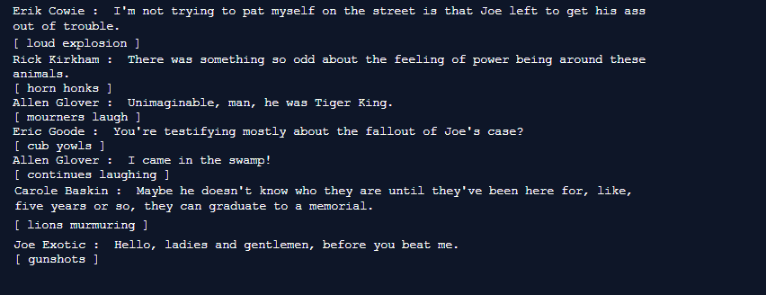
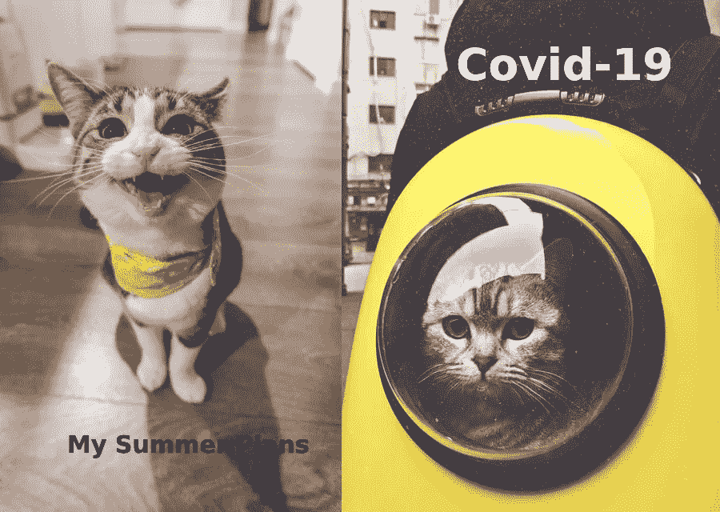

# 虎王报价发电机为所有你酷猫和小猫

> 原文：<https://towardsdatascience.com/the-tiger-king-quote-generator-for-all-you-cool-cats-and-kittens-5fed2989aa72?source=collection_archive---------55----------------------->

## 一个有趣的 python 项目，自动生成网飞虎王的引语和动作。



(作者输出的示例)

在这些疯狂的世界末日般的日子里，像许多其他人一样，我独自在芝加哥的小公寓里度过了最初的几周，生活就像一个不断收紧的橡皮筋球，充满了压力、焦虑和痛苦。我担心许多悲观的可能性，我认为现在就在我的门外盘旋。自然地，我很快就抓住了一些我认为可能有帮助的物质享受，比如吃足够让当地一家餐馆营业一个月的垃圾食品，玩动物穿越游戏直到我的眼睛在跳舞，假装与朋友和家人的持续视频通话填补了空虚。

我的另一个应对机制是迅速在网飞播放一个节目，我相信你现在已经听说过了:《虎王》。在这个节目之后，我还发布了一个迷因，这个迷因来自我欣赏的作家基顿·帕蒂的一系列迷因。我指的是他著名的“我让一个机器人看了 1000 小时的(流行节目/电影)”系列，我将其归类为顶级喜剧。如果你没有听说过他们，一定要去他的推特上大笑一场。不管怎样，为了把自己从隔离区的岩石洞里挖出来(暗示 Alice in Chains)，我决定尝试用一些 Python 代码来模仿它，看看我能多好地制作出主要人物的句子和动作。



保护好雅的脖子(左图[朴宰](https://unsplash.com/@jaehunpark?utm_source=unsplash&utm_medium=referral&utm_content=creditCopyText)在[上](https://unsplash.com/@garaya/likes?utm_source=unsplash&utm_medium=referral&utm_content=creditCopyText)，右图[赵](https://unsplash.com/@kivenzhao?utm_source=unsplash&utm_medium=referral&utm_content=creditCopyText)在[上](https://unsplash.com/@garaya/likes?utm_source=unsplash&utm_medium=referral&utm_content=creditCopyText)，作者编辑)

老实说，结果比我预期的要好，所以我决定与世界分享我的代码，这样也许，只是也许，我可以帮助其他人摆脱他们的常规，即使只是一会儿。下面你会看到我的有趣的小功能，它使用马尔可夫链(非常感谢 Markovify 的创造者)和来自虎王的带标签的字幕数据来产生听起来像该剧主要角色的句子，以及中间的一些动作。关于我如何做的更多细节，请继续向下滚动，但是对于没有耐心的人，请点击下面的播放按钮。(**注:**你第一次运行它的时候会有点慢，但是一旦所有东西都加载完毕，它就会运行得很快。它在桌面上工作/看起来比在移动设备上更好。)

# **我的方法**


隔离后我的约会生活(照片由 [mana5280](https://unsplash.com/@mana5280?utm_source=unsplash&utm_medium=referral&utm_content=creditCopyText) 在 [Unsplash](https://unsplash.com/@garaya/likes?utm_source=unsplash&utm_medium=referral&utm_content=creditCopyText) 上拍摄)

在进行任何分析之前，我需要获得数据。通过几分钟的谷歌搜索，我发现你可以在看节目的时候得到网飞的字幕，所以我就从那里开始了。不幸的是，当你收到字幕文件时，它是 XML 格式的，所以我必须把它转换成 JSON。我很高兴地发现，在字幕中，引号有自己的时间戳，但它们是以“滴答”计量的，而不是像分钟和秒钟这样的东西，所以在转换为 JSON 时，我也转换了它们。我用一段简短的 Ruby 代码做到了这一点，我将在下面展示这段代码。

我可能不会用太多的代码来拖累这篇文章，因为清理过程相当长，但是一旦从网飞获得 XML 文件，下面的步骤应该会让您有一个良好的开端。我也将把代码上传到我的 GitHub 上，所以请随意查看([https://github.com/TheGregArayaSet](https://github.com/TheGregArayaSet))。

```
require 'json'require 'active_support/all'xmlFile = "C:\\filepath\\file.xml"tigerHash = Hash.from_xml(File.open(xmlFile).read)tick_to_second_constant = tigerHash["tt"]["ttp:tickRate"].to_freformattedTigerHash = tigerHash["tt"]["body"]["div"]["p"].map do | element|element["begin"] = element["begin"].to_f/tick_to_second_constantelement["end"] = element["end"].to_f/tick_to_second_constantelementend;0pp reformattedTigerHash;0File.open("C:\\filepath\\converted_subs.json","w") do |f|f.write(JSON.pretty_generate(reformattedTigerHash))end
```

接下来，我开始用 Python 将 JSON 文件转换成 Pandas 数据帧。通过一些探索性的数据分析，我意识到字幕并不总是有标记的字符。当我继续将熊猫数据框转换成可用的形式时，我思考了如何处理这个问题，最终在与我的一个朋友讨论时，我想到了另一个主意。亚马逊有一项名为“AWS 转录”的服务，旨在倾听医疗专业人员之间和/或患者之间的谈话，逐字记录下他们认为他们在说什么，并自动标记潜在的发言者。

我回到网飞，用 Audacity 抓取每集的音频，创建一个 AWS 配置文件，并通过亚马逊转录运行音频，试图获得角色的标签，然后我可以合并回网飞的字幕文件。在你自己尝试之前，我应该让你知道亚马逊转录只能处理每集 10 个扬声器，所以像字幕文件一样，这些也不是完美的。他们的标签确实有信心估计，所以这是有帮助的。不管怎样，经过一波又一波的清洗、洗手、诅咒和咬牙切齿之后，我通过比较网飞字幕中优雅标注的发言者和亚马逊转录的自信猜测，找到了大多数发言者。

由于亚马逊的低信心和网飞标签的缺乏，只剩下几个空位，我很高兴仔细阅读这些孤独的几个，并手动填充它们。毕竟，这是一个再一次狂欢整个节目的完美借口。像所有好的数据科学项目一样，清理和合并花费了我大部分的时间。然而，我没有在上面的代码中包含任何内容，因为它需要一段时间来运行，而且我知道大多数人只是想要点击运行按钮的即时满足感，以获得即时的迷因潜力。然而，现在我已经整理好了数据，真正有趣的数学可以开始了。

# **马尔可夫链未被覆盖**


他尖叫，因为他不知道(照片由[七日游](https://unsplash.com/@seven_roadtrips_com?utm_source=unsplash&utm_medium=referral&utm_content=creditCopyText)在 [Unsplash](https://unsplash.com/@garaya/likes?utm_source=unsplash&utm_medium=referral&utm_content=creditCopyText) 上拍摄)

为了创造出真正有意义的句子，而不仅仅是推出每个角色使用的最常见的单词，我利用了一个被称为马尔可夫链的数学系统。如果你不知道什么是马尔可夫链，它们基本上是一个描述从一个状态到另一个状态的系统。作为一名人寿/健康保险精算师，我们通常会使用马尔可夫链来确定某人在当前状态下生病、受伤、从生病或受伤中康复或死亡的可能性(可能是上述任何一种情况)。如果我们正在寻找一个目前健康的人，我们假设在下个月(或我们正在寻找的任何一段时间)他们有一定的概率转变为这些状态中的任何一种(仍然健康、受伤、生病、死亡等)。

然而，马氏链真正有趣的是它们是无记忆的。正如我和我的保险精算朋友所说的，“重要的不是你从哪里来，而是你在哪里。”换句话说，从一个状态转移到另一个状态的概率不依赖于你过去的状态。也就是说，如果你现在生病了，那么在决定下个月你可能处于什么状态时，上个月你是否健康并不重要。如果有人现在已经死了，一个月前受伤也没关系，他们改变到另一个状态的机会仍然是零，因为他们现在已经死了。如果你仍然迷茫，或者更多的是视觉学习者，我喜欢 patrickJMT 关于这个主题的视频([https://youtu.be/uvYTGEZQTEs](https://youtu.be/uvYTGEZQTEs))。那么这如何应用于造句呢？嗯，我们可以把“当前状态”想象成正在被考虑选择下一个单词的当前单词(或多个单词)。如果我告诉你，我们正在看 Joe introductive 的文本，并且句子以单词“that”开头，我想下一个单词会有无数种选择。

然后，我们可以通过计算每个单词在节目中跟在单词“that”后面(无论是否在句子的开头)出现的次数，来确定每个单词出现的概率。我们假设下一个词有很大概率是低俗的，你觉得会是什么？我的大脑会直接想到“b**ch ”,然后一旦我们有了这个词，我的大脑会预测下一个词，他通常会在“b**ch”后说什么？嗯，我想很有可能是“卡罗尔”，原因很明显。当处于“b**ch”状态时，你可以选择忽略句子开头的“that ”,或者你可以选择包含它，但无论哪种方式，你当前的“状态”决定下一个单词，而不是它前面的单词。这里要注意的是，你不希望你的当前状态包含太多的单词，因为这样你就开始从你的语料库中打印精确的句子，这一点也不好玩。

# **最终数据抚摸**


(照片由[卢卡斯·卡瓦略](https://unsplash.com/@lukedbcarvalho?utm_source=unsplash&utm_medium=referral&utm_content=creditCopyText)在 [Unsplash](https://unsplash.com/@garaya/likes?utm_source=unsplash&utm_medium=referral&utm_content=creditCopyText) 上拍摄)

当我在研究如何使我的过程更好的时候，我偶然发现了一个叫做 Markovify([https://github.com/jsvine/markovify](https://github.com/jsvine/markovify))的 python 包，它已经在执行我的任务了，但是方式更简洁。安装它并在我的数据上运行它，我对他们合作得如此之好感到高兴，并立即给一些朋友发送了一些我的第一次测试运行。在此之后，我将最终清理后的数据导出为 CSV 文件，这样想运行代码的人就不必等待整个清理过程并写出上面看到的代码。这就是我从零隔离到数学迷因英雄的全部追求！


(老虎照片由 [mana5280](https://unsplash.com/@mana5280?utm_source=unsplash&utm_medium=referral&utm_content=creditCopyText) 在 [Unsplash](https://unsplash.com/@garaya/likes?utm_source=unsplash&utm_medium=referral&utm_content=creditCopyText) 拍摄，水上摩托照片由 [Roger Starnes Sr](https://unsplash.com/@rstar50?utm_source=unsplash&utm_medium=referral&utm_content=creditCopyText) 在 [Unsplash](https://unsplash.com/@garaya/likes?utm_source=unsplash&utm_medium=referral&utm_content=creditCopyText) 拍摄，由作者编辑)

我希望你已经喜欢了我做的这个项目，请和你的任何一个可能会从中得到乐趣的朋友一起分享吧！如果你有兴趣看我的其他项目，请随意查看我的 GitHub([https://github.com/TheGregArayaSet](https://github.com/TheGregArayaSet))。我也乐于接受一些关于如何使这个项目变得更好的建设性批评，因为我仍然在提高我的 Python 能力。

**沃尔玛卡车上的热牛排小贴士**，对于那些走到这一步的人:

*   如果您对限制输出中显示的扬声器感兴趣，可以从第 15 行的“random_speakers”列表中删除一些。
*   如果你还想选择输出多少个句子，你可以在第 21 行编辑变量“num_sentences”。
*   如果您想查看更长或更短的句子，您可以将“set_length”字符串变量设置为“Long”或“Short”
*   请随意使用它，因为 repl.it(托管代码的人)会给每个人代码，因为每次他们加载这篇博客帖子时，我都有代码。
*   再一次，正如我上面所说的，第一次运行有点慢，但之后的每次运行都会相当快。