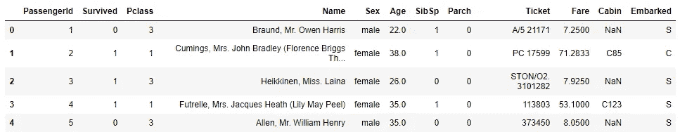
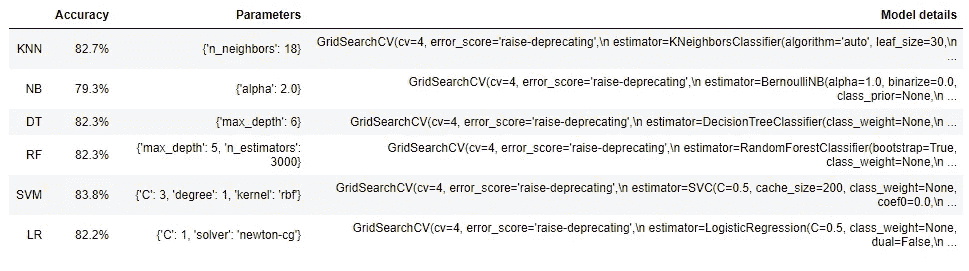
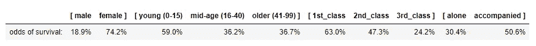
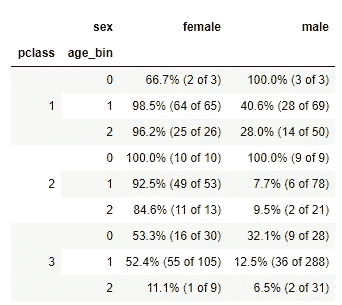
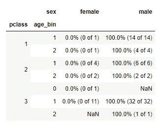
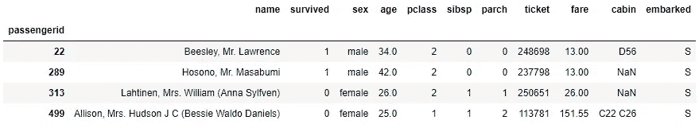
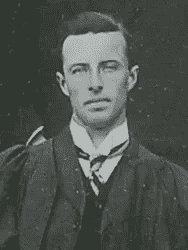
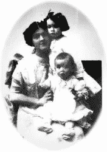
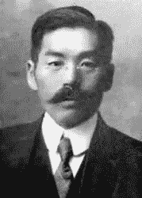
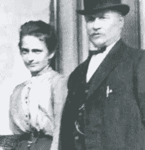

# 泰坦尼克号:有人走运吗？

> 原文：<https://towardsdatascience.com/the-titanic-did-anyone-get-lucky-6acd89788f15?source=collection_archive---------32----------------------->

**简介**

Kaggle 的著名(还是声名狼藉？)[介绍性数据科学项目](https://www.kaggle.com/c/titanic/overview)是一个繁重的项目——根据一些个人特征和一些关于他们住宿的细节来预测泰坦尼克号上每个乘客的生存。在这篇文章中，我将从一个不同寻常的角度来看待这个项目——看看泰坦尼克号上谁是幸运儿。

在进入这个问题之前，读者应该知道这个事件的一些关键细节。1912 年 4 月 15 日早上，[号皇家邮轮泰坦尼克号](https://en.wikipedia.org/wiki/RMS_Titanic)是一艘英国客轮，在其处女航中沉没。在大约 2224 名乘客中，超过 1500 人死亡。当你考虑到救生艇只够容纳 1178 人时，这个数字就不足为奇了——这可能是因为安全标准低，以及认为这艘船“不会沉没”的傲慢态度因此，当时的文化规范，如“妇女和儿童优先”，对谁上救生艇和谁不上救生艇有着巨大的影响。也就是说，假设是这样的事情不应该有关系，因为 Kaggle 比赛的目标不是让我们人类假设或猜测结果，而是让客观的机器学习算法试图预测每个乘客的命运，以努力学习数据科学的基础。

**数据和分析**

当正确完成时，机器学习模型应该尝试对每个乘客进行分类，看他们是否幸存。鉴于这是一个分类问题，一个崭露头角的数据科学家可以从机器学习技术中进行选择，如朴素贝叶斯、随机森林、支持向量机等。此外，他们可以选择将哪些特征输入到模型中，包括他们的年龄和性别，他们为机票支付的费用，有多少家庭成员与他们一起登机，甚至他们的姓名和头衔。

Kaggle 为 Titanic 项目提供的训练数据集的五个示例行。虽然大多数列是不言自明的，但 SibSp 和 Parch 可能不是——它们代表了乘客在船上有多少家庭成员。

有许多关于如何分离数据并编写 Python 代码以获得良好的预测准确性(80-90%)然后将结果上传到 Kaggle 竞赛页面以加入官方排行榜的精彩文章(例如，[这个](https://www.codementor.io/@innat_2k14/titanic-kaggle-machine-learning-from-disaster-part-1-10gbvqzguc)和[这个](/predicting-the-survival-of-titanic-passengers-30870ccc7e8))。也有许多[讨论](https://www.kaggle.com/c/titanic/discussion/10099)关于一些人如何通过使用乘客的名字(包括在数据集中)与互联网上可用的[官方幸存者/受害者名册](https://www.encyclopedia-titanica.org/titanic-survivors/)相比较来“欺骗”挑战，然后在没有使用任何机器学习或任何其他数据的情况下获得完美的预测分数(100%)。我觉得在就业决定中应该考虑在学习练习中作弊，但我跑题了。这里的关键点是:

**所有这些对准确性的关注是有意义的，因为比赛结果关注的是这个分数。**

但是，作为这种关注的结果，我们是否遗漏了什么？

注意:本文包含的代码很少。如果你想继续下去，看看我的 [Titanic Github 合集](https://github.com/autonopy/PlayingWithTitanic)，选择标题与本文匹配的 Jupyter 笔记本文件。

**部分乘客幸运；其他人，倒霉**

在我的学习旅程中，我建立了 6 个模型，并尽力优化每个模型。当我通过挑战并且不能突破 84%的准确率时，我开始考虑使用算法的[集合](https://scikit-learn.org/stable/modules/ensemble.html)来提高我的分数。我的工程大脑告诉我，在运行集合之前，我应该首先获得一个我可以达到的理论上的最大精确度，通过假设我可以“完美地”组合所有 6 种算法，来看看是否值得付出努力。

我在预测中使用的 6 个分类器模型:K-最近邻(KNN)、朴素贝叶斯(NB)、决策树(DT)、随机森林(RF)、支持向量机(SVM)和逻辑回归(LR)。准确度列结果基于 4 次迭代交叉验证的平均准确度值。Parameters 列显示了 GridSearchCV 中调优的超参数。“模型详细信息”列显示了对象的详细信息，例如使用了哪种特定算法以及超参数的基本值。

我想知道我是否可以识别每个模型都预测错误的乘客，然后找到这些乘客列表与各种模型组合的交集(例如，KNN 和逻辑回归模型都弄错了哪些乘客？).假设，如果 6 个模特中没有一个能做对，那么一个组合也不会，所以这可以决定我能做的最好的。我拼凑了一些代码，分析了所有可能的模型组合。结果非常有趣，甚至显示出少于 6 种算法的一些组合做得很好。从最好的结果来看，在训练数据集中，没有一个模型能让 891 名乘客中的 79 名正确。所以，我把我的合奏理论最高分定为 100%–79/891 = 100%—8.9% = 91.1%。

现在，如果你曾经管理过一个合奏，你知道这不是它如何工作，所以我永远不会得到那个数字。为了得到这个数字，每个模型都必须查看哪些预测是错误的，并要求下一个模型尝试纠正这些预测。在监督学习情况下的训练数据集，我认为这是可能的，因为你有正确的标签。然而，当运行测试数据来预测类时，这不起作用，所以这个理论上的最大值仅仅是一个学术练习。我认为对于那些认为我不懂机器学习或者可能正在学习数据科学并且相信这实际上是一个实用的解决方案的读者来说，注意这一点是很重要的。

尽管如此，当我看着没有一个模型答对的乘客数量时，我突然明白了一些事情:

这些是泰坦尼克号灾难中幸运和不幸的乘客。

我们从[事件的故事中得知](https://www.encyclopedia-titanica.org/)社会等级制度和规范在整个灾难中持续存在，即使面对死亡。泰坦尼克号上的富人(一等舱)、妇女和儿童，以及随行的(即他们并不孤单)乘客生还的可能性很大。另一方面，男性、不太富裕的人(二等和三等)以及那些独自一人的人活着出去的可能性要低得多。请参见下表中的分类百分比，了解更多信息。如果你不知道为什么会发生这种情况，读一些像这样的[故事](https://en.wikipedia.org/wiki/Lifeboats_of_the_RMS_Titanic)，讲述救生艇在沉入水中之前如何不幸地没有正确装载，除了救生艇数量不足之外，还让许多人不必要地搁浅。

每个类别的幸存者百分比。例如:船上 74.2%的女性幸存，而船上 18.9%的男性幸存。请注意，表中的值相加不会达到 100%。

每个跨类别组合的幸存者百分比和计数的数据透视表。例如，一班 66.7%(3 人中有 2 人)的年轻女性幸存，而一班 28.0%(49 人中有 14 人)的年长男性幸存。注:年龄层对应于上表，其中 0 =年轻，1 =中年，2 =老年。

看上面的表格，我们可以简单地通过了解一名乘客的三个基本特征来做出一些早期的猜测。然而，我们需要机器学习模型来进行全面预测，因为它们能够更好地处理整个数据集。同样，对大多数人来说，这些模型对 80-90%的乘客的命运预测是正确的。

但是在我的模型中，79 名乘客的命运是不可预测的。也就是说，在很大程度上，尽管给了 6 种不同的算法一个正确的机会，但他们的生存是无法根据他们的性别、年龄、社会地位、在船上的位置等来预测的。

相反，他们的命运由运气决定。

根据统计数据，我们可能会猜测，幸运的是那些那天设法安全到达的男性、不太富裕、独自一人以及中老年乘客。我们可能会猜测，那些不幸的人可能是妇女和儿童，富有的人，以及本应幸存但在错误的时间出现在错误的地方的乘客。

真的有这么简单吗？我们来问数据:

模型无法准确预测的乘客的数据透视表。百分比是存活率，所以在模型无法预测的情况下，一等舱的中年女性存活率为 0%。

*等等，上面写了什么？！*看起来模型无法正确预测的女性中，无一人(0%)幸存！所有模型都弄错的人，全部(100%)都活了下来！

这可以有几种解释，但主要是说，尽管我们给了模型所有的数据，但没有一个模型能够克服与性别相关的异常。正如社会规范所确立的那样，既然是“女人和孩子优先”，女人就被期望生存，男人就有可能灭亡。当情况不是这样时，机器学习模型就会遇到问题，预测不正确，即使有关于他们的财富、年龄、船上的家人和旅程细节的所有其他信息来帮助做出决定。

这显示了文化和社会规范的巨大力量。也就是说，对于一个人来说，陷入这些规范并错误地猜测乘客的命运并不奇怪，但对于一个计算机算法来说，同样的问题表明，在泰坦尼克号上，这个问题如此普遍，以至于连数学都无法绕过它。

也许 79 名乘客名单中的一些故事可以帮助我们了解我们所看到的情况。

**幸运与不幸的故事**

我拿着模型无法准确预测的 79 名乘客的名单，在网上搜索他们的故事。许多人没有信息，或者记录不够详细，无法学习。我选择了下面的 4 个人——2 男 2 女——因为他们的故事很好地揭示了他们是如何逃脱机器学习的预测能力的。

选择突出显示的 4 名乘客及其来自 Kaggle 数据集的数据。

劳伦斯·比斯利先生来源:[https://www.encyclopedia-titanica.org/](https://www.encyclopedia-titanica.org/)

劳伦斯·比斯利先生在教授科学的间隙，用一张二等舱船票登上了泰坦尼克号。当这艘船第一次撞上冰山时，劳伦斯注意到了，并去调查，但被告知一切正常。带着疑问，他走向泰坦尼克号的甲板，震惊而幸运地发现救生艇正在装载。劳伦斯走近一艘救生艇，里面的空间只够一个人，船员们大声喊着让任何妇女或儿童上船。找不到，他们邀请劳伦斯，通过这一连串的幸运机会救了他的命。

贝丝·艾莉森夫人和她的孩子
来源:[https://www.encyclopedia-titanica.org/](https://www.encyclopedia-titanica.org/)

贝丝·艾莉森夫人和她的丈夫以及他们年幼的儿子和女儿登上了泰坦尼克号。当碰撞发生时，她的丈夫带着他们的儿子登上一艘救生艇到了安全的地方。贝丝和她的女儿登上了另一艘救生艇，但不知道她的丈夫和儿子已经安全到达。她不能离开他们，带着女儿，离开救生艇，回到甲板上寻找。在未能找到她死去的丈夫和儿子后，这对母女在最后一刻乘坐了一艘可折叠的救生艇，但不幸翻入冰冷的水中，导致了他们的死亡。

资料来源:[https://www.encyclopedia-titanica.org/](https://www.encyclopedia-titanica.org/)

细野正文先生是泰坦尼克号上唯一的日本人。有人敲他的门，把他从二等舱吵醒，他进入了一个混乱的场景。他不顾一切地想再次见到他的妻子和孩子，请求加入一艘有两个空位的救生艇，但是因为他既是男性又是外国人而被拒绝。当那名船员转过身去的时候，Masabumi 趁机占了最后一个座位，因为另一个人刚刚占了另一个座位。尽管困难重重，他还是从悲剧中幸存了下来，只是因为没有随船沉没而被他的同胞嘲笑，随后失去了他的政府工作，甚至在他多年后去世后也成为家庭耻辱的来源。

安娜·拉蒂宁夫人和她的丈夫威廉
来源:[https://www.findagrave.com](https://www.findagrave.com)

安娜·阿米莉亚·拉蒂宁夫人和她的丈夫威廉在结束了一次家庭访问和威廉的一系列演讲后，正从芬兰返回。碰撞后，他们来到甲板上，找到了他们的家人和朋友，他们登上了一艘救生艇，并敦促安娜加入他们。然而，威廉没有登上救生艇，安娜以她最后的爱和忠诚紧紧抓住他，和他一起乘着船走向死亡。

在那个灾难性的早晨，这些故事和其他故事中的模式很明显——文化中的人性因素。虽然计算机算法不能直接理解它，但它们肯定能检测出它的症状。在泰坦尼克号的例子中，那些幸运和不幸的人都深受其影响。

**结论**

本文探索了数据科学中我们偶尔会忘记的一些东西。我们过于关注建模的准确性，以至于忽略了考虑模型的异常值。在某种程度上，这很好。通过关注最可预测的结果，我们的努力变得非常高效。但是，如果这是，例如，我们正在谈论的营销，我们已经错过了没有人向其做广告的人群。

那也恰好是我。很少有广告——不管是网络上的，电视上的，还是广播上的——能真正打动我。我是一个没有人试图说服的局外人。当然，这对我来说没问题——我很感谢你在省钱方面的帮助！但是对于广告商来说，这意味着收入的损失。然而，如果他们试图向我们推销离群值，他们的投资回报率可能会很糟糕，因为他们将不得不制作专门的广告来接触我，并且仍然冒着我不买的风险。所以，他们倾向于不这样做。

另一方面，在医学领域，成千上万的人应该感谢医生密切关注他们的罕见“异常”疾病，如非霍奇金淋巴瘤和肌萎缩性脊髓侧索硬化症(ALS)，以找到可以改善生活的治疗方法，也许有一天甚至可以治愈。当那些患有这些罕见疾病的人出现令人困惑和不可预测的症状，导致无法轻松诊断时，有人会花时间看看他们的病例，看看有什么遗漏。由于这些努力，这些罕见的人群现在对他们的疾病有了答案——有时是解决方案。

**反思与应用题**

所以问问你自己:我的模型异常值是什么？对它们进行分析有价值吗？在我的环境中，是否值得研究它们，或者我应该继续关注可预测的数据点？