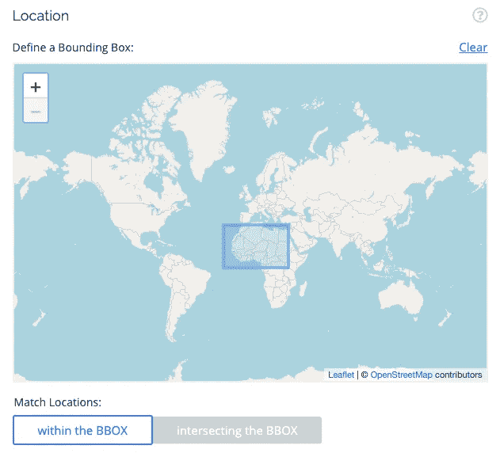

# 查找数据集的前 17 个地方📊

> 原文：<https://towardsdatascience.com/the-top-10-best-places-to-find-datasets-8d3b4e31c442?source=collection_archive---------14----------------------->

## 经常有人问我找数据的好地方。以下是 t̶e̶n̶的十七大资源。


罂粟数据？资料来源:pixabay.com

事不宜迟，这里是查找数据的最佳位置，并提供了一些有用的信息。人们不断给我指出新的来源，所以名单正在扩大！如果你有喜欢的，请发给我！😀

# 令人惊叹的数据😎

[Awesome Data](https://github.com/awesomedata/awesome-public-datasets) 是一个 GitHub 存储库，有一个令人印象深刻的按类别分类的数据集列表。它会定期更新。

# 数据是复数🔢

Jeremy Singer-Vine 的数据是复数的[每周简讯](https://tinyletter.com/data-is-plural)有很棒的新鲜数据来源。我总是对质量印象深刻。档案可在[这里](https://docs.google.com/spreadsheets/d/1wZhPLMCHKJvwOkP4juclhjFgqIY8fQFMemwKL2c64vk/edit#gid=0)获得。

# Kaggle 数据集


除了比赛，Kaggle 还有大量的数据集。 [Kaggle 数据集](https://www.kaggle.com/datasets)为大多数数据集提供了丰富的摘要信息和预览。你可以下载数据或使用他们的平台在 Jupyter 笔记本上进行分析。您也可以贡献您自己的数据集，并将其设为公共或私有。

# 数据世界🌍


像 Kaggle 一样， [Data.world](https://data.world/) 提供了大量用户贡献的数据集。它还为公司提供了一个存储和组织数据的平台。

# 谷歌数据集搜索工具

我认为可以肯定地说，谷歌对搜索略知一二。它最近通过其[谷歌数据集搜索工具](https://toolbox.google.com/datasetsearch)增加了一个单独的数据集搜索功能。如果你正在寻找某个特定主题的数据或者从某个特定来源寻找数据，这是值得一试的。

# 拥抱脸🤗

[拥抱脸](https://huggingface.co/datasets)拥有近 2000 个数据集，其中包括很多 NLP 数据集。我喜欢他们的模型卡，其中包含描述、预期用途和限制、操作说明、偏见、培训数据和培训程序信息，以及许多常见指标的评估结果。*增加于 2021 年 11 月 16 日。*

# Reddit 数据集

subreddit [r/datasets](https://www.reddit.com/r/datasets/) 有许多用户定期发布的优秀数据集。*新增 2021 年 1 月 25 日。*

# OpenDaL🕐

OpenDaL 是一个数据聚合器，允许你使用各种元数据进行搜索。例如，您可以基于时间或位置进行搜索。



截图来自 OpenDaL。

# 熊猫数据阅读器🐼


[Pandas DataReader](https://pandas-datareader.readthedocs.io/en/latest/remote_data.html) 将帮助你从网上资源中提取数据到 Python pandas 数据框架中。大部分数据来源都是金融。以下是截至 2020 年末的可用数据源列表:

*   [廷戈](https://pandas-datareader.readthedocs.io/en/latest/remote_data.html#remote-data-tiingo)
*   [IEX](https://pandas-datareader.readthedocs.io/en/latest/remote_data.html#remote-data-iex)
*   [阿尔法优势](https://pandas-datareader.readthedocs.io/en/latest/remote_data.html#remote-data-alphavantage)
*   [谜](https://pandas-datareader.readthedocs.io/en/latest/remote_data.html#remote-data-enigma)
*   [Quandl](https://pandas-datareader.readthedocs.io/en/latest/remote_data.html#remote-data-quandl)
*   圣路易斯联邦储备银行(弗雷德)
*   肯尼斯·弗伦奇的数据库
*   [世界银行](https://pandas-datareader.readthedocs.io/en/latest/remote_data.html#remote-data-wb)
*   [经合组织](https://pandas-datareader.readthedocs.io/en/latest/remote_data.html#remote-data-oecd)
*   [欧盟统计局](https://pandas-datareader.readthedocs.io/en/latest/remote_data.html#remote-data-eurostat)
*   [节俭储蓄计划](https://pandas-datareader.readthedocs.io/en/latest/remote_data.html#remote-data-tsp)
*   [纳斯达克交易商符号定义](https://pandas-datareader.readthedocs.io/en/latest/remote_data.html#remote-data-nasdaq-symbols)
*   斯图克
*   [MOEX](https://pandas-datareader.readthedocs.io/en/latest/remote_data.html#remote-data-moex)
*   [Naver 金融](https://pandas-datareader.readthedocs.io/en/latest/remote_data.html#remote-data-naver)

下面是用`pip install pandas-datareader`将它安装到 Python 环境后的使用方法。

```
**import** **pandas_datareader** **as** **pdr**
pdr.get_data_fred('GS10')
```

# VisualData👓


如果你正在寻找计算机视觉数据集， [VisualData](https://www.visualdata.io/discovery) 是一个不错的新来源。它有一些方便的过滤选项。感谢[杰锋](https://medium.com/u/21a085976175?source=post_page-----8d3b4e31c442--------------------------------)提醒我！*增加于 2020 年 11 月 2 日。*

# Data.gov🏛

如果你想使用美国政府的数据集，[Data.gov](https://data.gov)有超过 217，000 个这样的数据集！感谢[迈克尔华莱士](https://www.linkedin.com/in/michael-wallace-mph-informatics-bsn-rn-a53b76123/)推荐。*增加于 2020 年 11 月 4 日。*

# data.europa.eu 🇪🇺

欧洲数据的官方门户有超过一百万个数据集。 [data.europa.eu](https://data.europa.eu/en) 由欧盟主办。*增加于 2021 年 10 月 28 日。*

# 令人惊叹的卫星影像数据集🛰

Christoph Rieke 有一个 [GitHub 回购](https://github.com/chrieke/awesome-satellite-imagery-datasets)听起来就是这样。雅各布·克勒带我去的；2021 年 5 月 26 日补充。

# 免费 GIS 数据🗺

免费 GIS 数据网站链接到 500 多个免费地理数据集网站。这些网站分类也很好！*；2022 年 5 月 5 日补充。*

# 带代码的文件📑


截至 2021 年年中，代码为的论文拥有超过 4000 个数据集。这些数据集根据它们出现的论文数量进行排序。“带代码的论文(Papers with Code)的使命是用机器学习论文、代码和评估表创建一个免费开放的资源。”——显然还有数据集！🎉

# Python API 包装器🐍

我最近更新了我的 Python API 包装器列表,以帮助用户了解每个包有多流行，以及它是否得到了积极的维护。我的 repo 现在使用 [shields.io](https://shields.io/) 自动显示 GitHub 星星和最近一次提交的日期。这个列表最初是通过 [johnwmillr](https://github.com/johnwmillr/list-of-python-api-wrappers) 从[真实 Python](https://realpython.com/) 的 [GitHub repo](https://github.com/realpython/list-of-python-api-wrappers) 中叉出来的。我的 repo 包含了我认为最大的 Python API 包装器更新列表——其中许多可以帮助您找到项目可能需要的数据。

# 蜜蜂

如果您以前没有做过，使用 Python 从文档化的 API 获取数据可能听起来令人生畏，但这确实不错。点击这里查看我的从 API[获取数据的指南。🚀](/how-to-get-data-from-apis-with-python-dfb83fdc5b5b)

# 自己做

当所有其他方法都失败时，收集您自己的数据可能是根据您的需要创建数据集的一种极好的方法。😉

# 概述

*   [牛逼数据](https://github.com/awesomedata/awesome-public-datasets)
*   [Kaggle 数据集](https://www.kaggle.com/datasets)
*   [数据世界](https://data.world/)
*   [谷歌数据集搜索工具](https://toolbox.google.com/datasetsearch)
*   [抱紧脸](https://huggingface.co/datasets)
*   [r/数据集](https://www.reddit.com/r/datasets/)
*   [OpenDaL](https://opendatalibrary.com/)
*   [熊猫数据阅读器](https://pandas-datareader.readthedocs.io/en/latest/remote_data.html)
*   [数据是复数](https://docs.google.com/spreadsheets/d/1wZhPLMCHKJvwOkP4juclhjFgqIY8fQFMemwKL2c64vk/edit#gid=0)
*   [可视化数据](https://www.visualdata.io/discovery)
*   [Data.gov](https://data.gov)
*   [data.europa.eu](http://data.europa.eu/en)
*   [令人惊叹的卫星图像数据集](https://github.com/chrieke/awesome-satellite-imagery-datasets)
*   [免费的 GIS 数据](https://freegisdata.rtwilson.com/)
*   [证件代码](https://paperswithcode.com/datasets)
*   [API 包装器](https://github.com/discdiver/list-of-python-api-wrappers)
*   [API](/how-to-get-data-from-apis-with-python-dfb83fdc5b5b)
*   自己做！

你有最喜欢的查找数据的地方吗？厉害！在 [Twitter](https://twitter.com/discdiver) 上分享或者在评论里留言吧！🎉

我希望当您搜索数据源时，这个工具对您有所帮助。如果有，请分享到你最喜欢的社交媒体上。🚀

我写关于 Python、数据科学和其他技术主题的文章。如果你对这类东西感兴趣，在这里阅读更多并订阅我的 [Data Awesome 时事通讯](https://dataawesome.com)以获得每月一次的数据资源。


资料来源:pixabay.com

快乐的数据搜寻！😀