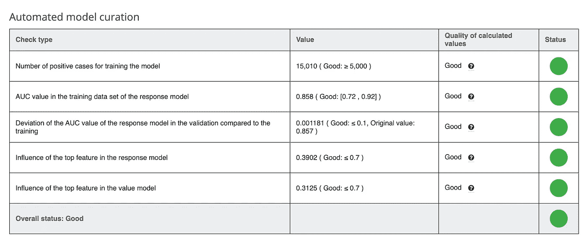

# 预测模型的 4 大稳健性检查

> 原文：<https://towardsdatascience.com/the-top-4-robustness-checks-for-predictive-models-163716640af3?source=collection_archive---------23----------------------->

## 如何快速评估你的机器学习模型的质量

斯蒂芬·道森在 [Unsplash](https://unsplash.com/s/photos/data-quality?utm_source=unsplash&utm_medium=referral&utm_content=creditCopyText) 上拍摄的照片

D 决定你精心制作的预测模型是否最终可以投入商业使用可能是一项艰巨的任务。许多预测模型未能产生任何积极的影响，在部署之前很难知道它们是否会产生积极的影响。然而，有一些迹象表明前方可能会有麻烦。如果您知道要寻找什么，这些迹象是很容易发现的，因此应该在部署任何预测模型之前寻找。

但是你为什么要听我的？在我的日常工作中，我是 AutoML 公司的首席数据科学家。在[g 预测](http://www.gpredictive.de)，我们协助客户检查自动生成的模型，帮助他们决定这些模型是否对他们的业务有用。因此，我们的团队在过去五年多的时间里检查了数千个模型。最近，我们决定更进一步，构建一个特性，在生成的模型上自动创建第一个健全性检查。我们称之为自动化模型管理。

作者图片

在开发这个特性的过程中，我们重新回顾了我们在模型度量上的共同经历，并且仔细查看了数百个案例，在这些案例中，我们知道了模型部署的业务结果。根据对数据科学的研究，我们发现在您的预测模型中有两件事是您真正希望避免的，因为存在这些问题的模型在野外使用时往往会崩溃。

*   “假朋友”(又称目标泄露。当有数据被标记为在预测事件之前，但实际上属于该事件时，就会发生这种情况。)
*   过度拟合(拟合训练数据，而不是基础过程)

因此，我们想把注意力集中在能够表明“虚假朋友”或过度匹配的指标上。对于一个好的模型，我们提出的标准是必要的，但不是充分的标准。因此，这些监管指标意味着一盏警示灯:如果这些指标中的一个处于不良状态，这是一个强烈的信号，表明有问题，在没有非常彻底的审查过程之前，该模型不应投入生产。

这些是健壮性检查。请记住，这些检查指的是分类监督模型，该模型试图预测某个事件(如购买)是否会发生。

## 培训的阳性案例数

为了获得准确的预测，模型中的事件数量需要足够大，以便进行合理的推断。你不希望你的模型被轶事数据塑造，这将不可避免地导致过度拟合。在我们的用例中，基于一个人的客户旅程预测未来的购买行为，我们发现一个模型至少需要 1000 个正面案例(购买)才有效。事实上，只有当至少有 5000 个阳性病例时，我们才称这个指标为“好”。我们还发现，超过 15，000 个案例的模型质量通常不会有实质性的提高。

## 训练数据集中的 AUC 值

我们选择了非常通用的“曲线下面积”指标来捕捉模型中的预测准确性。对我们来说，一个致命的特点是，这个指标独立于阳性/阴性病例的潜在分布，因为它没有假定一个固定的临界值。为了更好的解释，请看这里的。

我们观察到，所有大于 0.55 的 AUC 值，虽然不是很大，但在实践中至少能提供一些价值。然而，对于一个真正好的模型，我们发现 AUC 最好大于 0.70。我们还观察到，当一个模型具有非常高的 AUC 值时，这可能不是一个好迹象:我们的数据科学团队有一句话:“如果一个模型看起来好得不真实，那么它通常不是”。

因此，我们严格审视 AUC 值大于 0.92 的所有模型，并且不使用 AUC 值大于 0.99 的模型，因为这几乎总是意味着存在目标泄漏。

## 训练和验证数据集中 AUC 值之间的差异

不仅绝对 AUC 值令人感兴趣。我们观察到，在训练 AUC 和验证 AUC 之间具有高离差的模型(你有一个验证集，对吗？请一定要。)通常表示过度拟合问题。过度拟合意味着构建模型的算法没有捕捉到数据中的潜在过程，而是“学习”了你的训练数据。这不是一件好事，因为在现实生活中，这意味着你无法对新数据做出有意义的预测。在天气预测方面:你的模型可能是昨天天气的优秀预测者，但是根本不能预测明天的天气。

我们通过将训练 AUC 值与验证 AUC 值进行比较来对此进行监控。如果验证 AUC 非常小，那么我们开始对模型非常怀疑。

## 模型中顶部特征的影响

这个指标是你的数据中有假朋友的首要指标。如果您的模型中最有影响力的预测器在整体预测中具有非常高的权重，这通常是目标泄漏的迹象。请注意，情况一定不是这样，因为数据集中可能有一个非常好的解释变量。

我们从分析中得出的结论是，如果顶部预测值的权重大于 0.70，那么您应该非常仔细地观察该预测值，并检查它是否可能是一个“虚假的朋友”。通常，这可以通过查看该特征的数据生成过程来完成，并确定该特征的数据是否可能被意外地打上了错误的(较早的)日期/时间的时间戳。

## 结论

我们非常清楚，这 4 个指标只是煤矿中的金丝雀；它们是检查流程中是否出现严重问题的基本指标。他们没有为将模型付诸实践开绿灯。

在这样做之前，你需要问自己:“这个模型的结果对我的具体商业案例有帮助吗”？这个问题的答案通常比评估模型的统计可靠性更难找到。

[1]尼斯贝特和埃尔德(尼斯贝特，r .，埃尔德，j .和迈纳，G. 2009 年。*统计分析和数据挖掘应用手册*。学术出版社。)在他们的“10 大机器学习错误”下引用这些问题