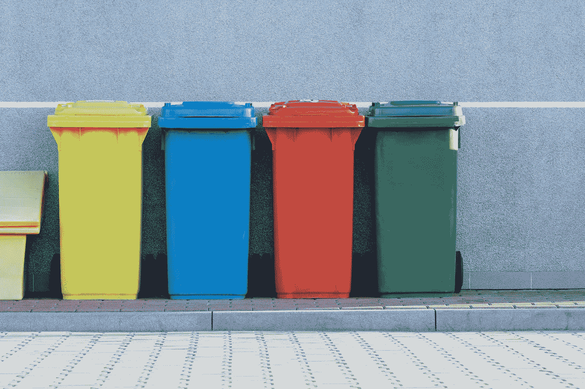

# 五大机器学习算法

> 原文：<https://towardsdatascience.com/the-top-5-machine-learning-algorithms-53bc471a2e92?source=collection_archive---------18----------------------->

## 意见

## …每个数据科学家都应该知道的，以及使用案例。


照片由[照片爱好](https://unsplash.com/@photoshobby?utm_source=unsplash&utm_medium=referral&utm_content=creditCopyText)在[Unsplash](https://unsplash.com/s/photos/robot?utm_source=unsplash&utm_medium=referral&utm_content=creditCopyText)【1】上拍摄。

# 目录

1.  介绍
2.  逻辑回归
3.  k 均值
4.  决策树
5.  随机森林
6.  XGBoost
7.  摘要
8.  参考

# 介绍

有几种机器学习算法对数据科学家和机器学习工程师都有好处。我在几家执行各种算法的公司工作过。除了我自己，我还见过其他人在教育和专业环境中使用类似的算法。我将列出我认为的顶级机器学习算法以及用例，以便您可以了解或重申您对这些算法的了解。我还想强调业务理解，而不是技术方面，因为我相信这一点在其他文章中往往没有得到强调。

# 逻辑回归


照片由[刘](https://unsplash.com/@fansi_sifan?utm_source=unsplash&utm_medium=referral&utm_content=creditCopyText)在[Unsplash](https://unsplash.com/s/photos/half-and-half?utm_source=unsplash&utm_medium=referral&utm_content=creditCopyText)【2】拍摄。

我将要讨论的这些机器学习算法在一定程度上遵循了难度顺序。因此，最简单但仍然强大的机器学习算法是逻辑回归。虽然名字暗含回归，但实际上是一种(*监督*)分类算法。大多数时候，它用于从 *logit* 函数预测二进制类。也有不同形式的逻辑回归，包括多项和顺序目标变量。这里有一些流行的例子，你可能会在*现实世界*中遇到，而不仅仅是在学术环境中。(*我只对二进制类使用过逻辑回归，所以我不会详细阐述多类或序数——对于那些情况，我使用不同的算法，就像我将在下一个*中描述的算法一样)。

*逻辑回归的业务用例:*

> 客户流失或没有流失

这个例子预测了一个产品的用户是否会流失，也就是说，他们会退订并退出这个产品。可能的特征可以包括，如果他们在平台上的活跃度低，未能支付费用，以及特定的较低活跃度的比率。

> 垃圾邮件还是非垃圾邮件

您可以发挥创造力，将许多情况想象为 0 或 1，但这最终取决于您的整个数据集、业务用例以及将决定该算法是否适合您和您的项目的影响。你可以尝试预测像房子或没有房子这样随机的东西——使用描述性特征来帮助对目标变量进行分类，但根据你的业务，你将学会为逻辑回归(*即财务批准或未批准，医疗保健疾病或无疾病*)找到更有用和适用的情况。

您可能会在逻辑回归中遇到这些评估指标:

*1。准确度*

*2。精度*

*3。召回*

同样重要的是 ROC ( *受试者操作特征*)曲线和 AUC ( *曲线下面积*)以及灵敏度和特异性。

*易于遵循且详细的文档[3]:*

[](https://scikit-learn.org/stable/modules/generated/sklearn.linear_model.LogisticRegression.html) [## sklearn.linear_model。逻辑回归-sci kit-学习 0.23.2 文档

### 逻辑回归(又名 logit，MaxEnt)分类器。在多类的情况下，训练算法使用一对其余…

scikit-learn.org](https://scikit-learn.org/stable/modules/generated/sklearn.linear_model.LogisticRegression.html) 

# k 均值



由[paweczerwiński](https://unsplash.com/@pawel_czerwinski?utm_source=unsplash&utm_medium=referral&utm_content=creditCopyText)在[Unsplash](https://unsplash.com/s/photos/bins?utm_source=unsplash&utm_medium=referral&utm_content=creditCopyText)【4】上拍摄的照片。

逻辑回归是一种监督的机器学习算法，而 k-means 则相反，是一种无监督的算法。我特别指的是 k-means 聚类算法。在逻辑回归中，我们有是或否，或 0 或 1，垃圾邮件或不是垃圾邮件，等等。我们也可以称这些目标变量为标签，因为我们知道我们试图预测什么。无监督聚类是相反的——我们不知道标签，但我们仍然希望以组的形式将不同的数据观察结果相互关联——或者只是还没有名字的新类。这种算法的工作方式是通过形成 k 个簇和它们各自的 k 个中心。直觉上，我喜欢把它看作一个分组问题。假设我们有一些数据，我们想创建一些组或集群。首先，我们识别我们的特征，然后我们运行算法，该算法将基本上基于每个组中彼此非常相似的特征形成组，并且组之间尽可能不同。

*下面是一些 k 均值聚类的例子:*

> 针对目标广告的客户特征分析

您会注意到现在有三个明显可识别的组。第一类人熬夜到午夜，年龄在 25 岁以下，通常居住在大城市。第二组是晚上 11 点左右睡觉的人，25 岁以上但不到 50 岁，居住在小城市。最后一组晚上 9 点睡觉，年龄倾向于 50+，生活在农村。正如你所看到的，每个群体与其他群体相比都是独一无二的，但每个群体的人口都与同一群体中的其他人相似。这种情况是理想的，因为营销活动的影响可以促成他们的独特性。现在让我们与产品经理合作，告诉他们这些组还没有名称，但这并不重要，因为我们希望找到与这些组相关的特性。然而，在运行模型之后，我们仍然可以提出标签，因为我们已经有了自己的组。让我们给我们的小组贴上标签，看看向他们推销的最佳方式。

```
**Group 1:**  young, and entranced in technology
```

*   用 Instagram 广告在手机上营销更便宜的产品

```
**Group 2:** older but still utilizing technology frequently, but not as much on social media
```

*   通过电子邮件向他们推销你大学毕业后的产品(新家或公寓)

```
**Group 3:** oldest and not on phone or computers nearly as much
```

*   让我们给他们寄实体邮件，就像家具杂志一样

希望这个例子比只说分组，从数学上解释 k-means 更有用。

> 当你在一家公司工作时，你可能会惊讶地发现，领导层并不强调开发和应用的代码或功能的重要性，而是强调你的机器学习算法的影响，即你现在保存和应用的模型。

*易于遵循且详细的文档[5]:*

[](https://scikit-learn.org/stable/modules/generated/sklearn.cluster.KMeans.html) [## sk learn . cluster . k means-sci kit-learn 0 . 23 . 2 文档

### k-均值聚类。了解更多信息。参数 n_clustersint，default=8 要形成的簇的数量以及…

scikit-learn.org](https://scikit-learn.org/stable/modules/generated/sklearn.cluster.KMeans.html) 

# 决策树


[简·侯伯](https://unsplash.com/@jan_huber?utm_source=unsplash&utm_medium=referral&utm_content=creditCopyText)在[Unsplash](https://unsplash.com/s/photos/trees?utm_source=unsplash&utm_medium=referral&utm_content=creditCopyText)【6】上拍照。

一个稍微复杂一点的算法(*取决于人*)是决策树算法。使用这种算法的一个独特的好处是，它不仅可以处理分类问题，还可以处理回归问题。同样需要注意的是，它是受监督的，也是非参数的(*意味着对数据的概率分布没有任何假设*)。它们比大多数模型更容易解释，也更容易在视觉上描述它们如何在幕后工作(*想到一棵树，它的树枝如何分裂*)。我喜欢使用决策树的另一个原因是，它们可以处理分类数据和数字数据，这通常是机器学习算法的现实应用所需要的。

决策树的逻辑，顾名思义，可以通过做一个决策，然后更多的决策来想象。

决策树的一个缺点是，它们可能容易过度拟合或不能很好地概括(*我们可以使用随机森林来更快地避免过度拟合，或者调整相同的决策树模型来避免过度拟合*)。

*这里有一个分类决策树的业务用例:*

> 为房地产经纪人分类住房市场

在这个例子中，一个房地产经纪人想要知道他们的组织和他们的房地产经纪人网站上的分组的房屋类型。分类标签将是

*   *时尚家居*
*   *家庭住宅*
*   *单人垫*

决策树将决定房屋的各种特征和倾向于购买这些房屋的人的类型的信息增益。例如，决策和结果列表可能是:

*   这栋房子有两层吗？(是)
*   这栋房子有两间或更多的卧室吗？(是)
*   这栋房子有一个大后院吗？(是)
*   那么这个房子是一个家庭住宅

*易于理解且详细的文档[7]:*

[](https://scikit-learn.org/stable/modules/tree.html) [## 1.10.决策树-scikit-了解 0.23.2 文档

### 决策树(DTs)是一种用于分类和回归的非参数监督学习方法。目标是…

scikit-learn.org](https://scikit-learn.org/stable/modules/tree.html) 

# 随机森林


马克·佩尔在[Unsplash](https://unsplash.com/s/photos/forest?utm_source=unsplash&utm_medium=referral&utm_content=creditCopyText)【8】上拍摄的照片。

现在我们进入前两个机器学习算法。这些是我在专业上以及从其他人那里遇到的一些最流行和最有用的算法。决策树的类似关键概念可以应用于随机森林——监督、分类和回归。随机森林也是它所暗示的，一个随机的森林，但是它的随机是什么呢？它是组成随机森林的决策树的随机数据样本。决策树结果的集合最终形成随机森林结果或预测，获得最多投票的类获胜。这种类型的集成有助于防止仅使用决策树算法会遇到的过拟合。

*以下是随机森林的一些业务用例:*

> 对电子商务网站的几种产品进行分类

现在我们有了一个分类算法，使用一个强大的监督算法，可以很好地处理多个类别，我们可以准确地对产品类别进行分类。比方说，你可以有 20 个类别或 20 种产品，但是手动分类它们需要几个小时，而且你可能会犯一些简单的错误。对于这个用例来说，一个随机的森林可以变得非常精确(当然是*，这取决于数据集*)。它也比手动方法快得多。

*   杯子、裤子、玩具、家具等。

想象上面的决策树例子，但是把它应用到这个随机森林问题中的每一个类。希望你的训练数据和产品是定义好的，分开的。

> 如果你的产品太相似或者太宽泛，这个模型可能会有一些问题，也许把它们分成一个类或者多个类是一个简单的解决方法。

*   这个问题的一个例子是靴子和登山靴
*   **修复:**创建不同的类别，分别是建筑靴(*如果功能允许的话*)、徒步靴和雪地靴。现在，我们有三种独特类型的靴子，而不是肯定会重叠的靴子和登山靴。

同样有用的是使用 ***predict_proba*** 函数为每个分类建议分配分数。例如，我们有 90%的可能是我们模型中的建筑靴。

*易于遵循且详细的文档[9]:*

[](https://scikit-learn.org/stable/modules/generated/sklearn.ensemble.RandomForestClassifier.html) [## 3.2.4.3.1.sk learn . ensemble . randomforestclassifier-sci kit-learn 0 . 23 . 2 文档

### class sk learn . ensemble . RandomForestClassifier(n _ estimators = 100，*，criterion='gini '，max_depth=None…

scikit-learn.org](https://scikit-learn.org/stable/modules/generated/sklearn.ensemble.RandomForestClassifier.html) 

# XGBoost


由 [SpaceX](https://unsplash.com/@spacex?utm_source=unsplash&utm_medium=referral&utm_content=creditCopyText) 在[Unsplash](https://unsplash.com/s/photos/booster?utm_source=unsplash&utm_medium=referral&utm_content=creditCopyText)【10】上拍摄的照片。

有些人会认为这种机器学习算法是最好的，或者比随机森林更好。我同意这一点，但也要注意，这确实取决于手头的问题，有时 XGBoost 可能很难解释。接收数据、转换和预测新数据也很困难。然而，正是 ***极其*** 的强大，才导致了准确的结果。您可以想到 XGBoost，它利用并行处理(*是极端的*)，同时避免正则化的过度拟合。

【XGBoost 的商业案例:

> 用几个特征快速分类不同类型的电子邮件(用于实时预测)

你会注意到，在*真实世界*的机器学习算法应用中，一些结果需要每天输出一次，或者一些，几乎是即时或实时的。对于这类问题，XGBoost 是一种有益的算法。因为电子邮件发送和接收的速度很快，所以你需要快速地对它们进行分类。这种分类可能是垃圾邮件，也可能不是垃圾邮件，也可能是不同类型的电子邮件，如促销、订阅等。

*   垃圾邮件还是非垃圾邮件
*   电子邮件类型(*促销，社交*)

*易于遵循且详细的文档[11]:*

 [## Python API 参考-xgboost 1 . 3 . 0-快照文档

### 本页给出了 xgboost 的 Python API 参考，更多内容请参考 Python 包介绍…

xgboost.readthedocs.io](https://xgboost.readthedocs.io/en/latest/python/python_api.html) 

# 摘要

根据您的数据集、业务问题和目标变量，将决定您将采用这五种顶级机器学习算法中的哪一种。想想你需要多快得到结果，或者这是一次性任务。有连续的目标变量或者类标签吗？你有标签吗？当你选择这些算法时，这些是你需要问自己的问题。您还可以执行类似的算法，最终降低您的误差指标或提高您的准确性指标。

*我们讨论的五大机器学习算法是:*

```
Logistic RegressionK-Means (clustering)Decision TreesRandom ForestXGBoost
```

*欢迎在下面发表评论，讨论你喜欢和使用的算法，或者你是否有其他更有用的算法。*

我希望你喜欢阅读我的文章，并学到一些新东西。感谢您的阅读！

# 参考

[1]照片由[照片爱好](https://unsplash.com/@photoshobby?utm_source=unsplash&utm_medium=referral&utm_content=creditCopyText)在 [Unsplash](https://unsplash.com/s/photos/robot?utm_source=unsplash&utm_medium=referral&utm_content=creditCopyText) 上拍摄，(2018)

[2][刘](https://unsplash.com/@fansi_sifan?utm_source=unsplash&utm_medium=referral&utm_content=creditCopyText)在 [Unsplash](https://unsplash.com/s/photos/half-and-half?utm_source=unsplash&utm_medium=referral&utm_content=creditCopyText) 上的照片，(2018)

[3] scikit-learn developers，，(2007-2020)

[4]paweczerwi324ski 在 [Unsplash](https://unsplash.com/s/photos/bins?utm_source=unsplash&utm_medium=referral&utm_content=creditCopyText) 上拍摄的照片，(2018)

[5]sci kit-学习开发者， [k-means](https://scikit-learn.org/stable/modules/generated/sklearn.cluster.KMeans.html) ，(2007–2020)

[6]照片由[简·侯伯](https://unsplash.com/@jan_huber?utm_source=unsplash&utm_medium=referral&utm_content=creditCopyText)在 [Unsplash](https://unsplash.com/s/photos/trees?utm_source=unsplash&utm_medium=referral&utm_content=creditCopyText) 上拍摄，(2018)

[7]sci kit-学习开发者，[决策树](https://scikit-learn.org/stable/modules/tree.html)，(2007–2020)

[8]马克·佩尔在 [Unsplash](https://unsplash.com/s/photos/forest?utm_source=unsplash&utm_medium=referral&utm_content=creditCopyText) 拍摄的照片，(2019)

[9] scikit-learn 开发者，[随机森林](https://scikit-learn.org/stable/modules/generated/sklearn.ensemble.RandomForestClassifier.html)，(2007–2020)

[10]照片由 [SpaceX](https://unsplash.com/@spacex?utm_source=unsplash&utm_medium=referral&utm_content=creditCopyText) 在 [Unsplash](https://unsplash.com/s/photos/booster?utm_source=unsplash&utm_medium=referral&utm_content=creditCopyText) 上拍摄，(2018)

[11] xgboost 开发人员， [XGBoost](https://xgboost.readthedocs.io/en/latest/python/python_api.html) ，(2020)