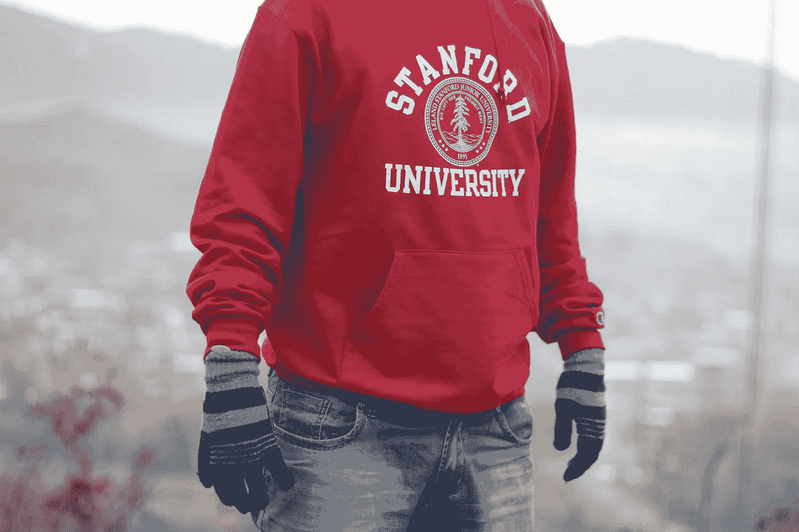

# 前 5 名机器学习认证

> 原文：<https://towardsdatascience.com/the-top-5-machine-learning-certifications-cc0857b9a340?source=collection_archive---------10----------------------->

## 意见

## 深入了解 2020 年的顶级认证。


Domenico Loia 在[Unsplash](https://unsplash.com/s/photos/coding?utm_source=unsplash&utm_medium=referral&utm_content=creditCopyText)【1】上拍摄的照片。

# 目录

1.  介绍
2.  斯坦福大学的机器学习
3.  深度学习。AI TensorFlow 开发者专业证书
4.  AWS 机器学习入门
5.  使用机器学习的增强数据可视化
6.  用机器学习和人工智能构建推荐系统
7.  摘要
8.  参考

# 介绍

网上有大量的机器学习资源，不仅课程种类繁多，还有证书。我想强调一下我认为的 2020 年五大机器学习证书。有些你需要付费，有些是免费的。您也可以选择只完成学习，并以证书的形式向任何人证明您的完成情况。最终取决于你想要哪种认证，以及你想如何展示它。下面，我将讨论通过几个网站和平台提供的各种机器学习认证(*，我不隶属于*)。这些课程可以让你在完成后获得证书。我希望你发现这些有用，并成为一名合格的机器学习工程师、数据科学家和数据分析师。

以下是 2020 年排名前五的机器学习证书:

# 斯坦福大学的机器学习



[叶林围](https://unsplash.com/@yelinnwai?utm_source=unsplash&utm_medium=referral&utm_content=creditCopyText)在[Unsplash](https://unsplash.com/s/photos/stanford-university?utm_source=unsplash&utm_medium=referral&utm_content=creditCopyText)【2】上拍照。

我们排名第一的证书相当受欢迎。对于这个证书，以及下面的证书，我会给出一些统计数据，一个概述，你会学到什么，以及是什么使这个证书不同于其他证书。首先，该证书由斯坦福大学通过 Coursera 提供，由广受欢迎且评价极高的[吴恩达](https://medium.com/u/592ce2a67248?source=post_page-----cc0857b9a340--------------------------------)教授。

*   *统计数据*

```
**Rating:** 4.9 out of 5 stars **Rating Amount:** ~ 150,000 ratings**Duration of Course:** ~ 60 hours to complete**Career Impact:** 40% started a new career**Career Improvement:** 38% received a tangible benefit
```

*   *概述*

如你所见，这些数据令人印象深刻。那么，这门课的总体概述是什么？这门课程提供了机器学习主题的理论和实践知识——作为一名机器学习工程师，学习这两者对于在您的行业中取得成功是有益的。本课程还强调，你所学到的将是通过实践在现实世界中会遇到的问题来学习解决问题的能力。

*   你会学到什么？

```
Linear RegressionLinear Algebra ReviewOctave/Matlab TutorialsLogistic RegressionRegularizationNeural NetworksAdvice for Applying Machine LearningMachine Learning System DesignSupport Vector MachinesUnsupervised LearningDimensionality ReductionAnomaly DetectionRecommender SystemsLarge Scale Machine LearningApplication Example: Photo OCR
```

在 11 周的课程中，你会学到机器学习的主要课题，但是是什么让这门课与众不同呢？

*   *这个课程有什么不同？*

在最后一周，你将有五个视频，一个阅读，和一个关于照片 OCR 应用的测验。这不仅是一个独特的产品，而且非常有趣。你将检查问题、管道、滑动窗口、人工数据和天花板分析。Octave/Matlab 教程也很独特。你也可以在 LinkedIn 上分享你的证书。

这是本课程的直接链接[3]。

[](https://www.coursera.org/learn/machine-learning?=) [## 机器学习

### 机器学习是让计算机在没有明确编程的情况下行动的科学。在过去的十年里…

www.coursera.org](https://www.coursera.org/learn/machine-learning?=) 

# 深度学习。AI TensorFlow 开发者专业证书


照片由[乌列尔 SC](https://unsplash.com/@urielsc26?utm_source=unsplash&utm_medium=referral&utm_content=creditCopyText) 在[Unsplash](https://unsplash.com/s/photos/neural-nets?utm_source=unsplash&utm_medium=referral&utm_content=creditCopyText)【4】上拍摄。

第二门课程也通过 Coursera 和 deeplearning.ai 提供，重点是 TensorFlow。

*   *统计数据*

```
**Rating:** 4.7, 4.7, 4.6, and 4.6 (for 4 courses)**Rating Amount:** ~ 12k, 5k, 4k, 3k ratings**Duration of Course:** ~ 4 months**Career Impact:** 40% started a new career**Career Improvement:** 12% received a pay increase
```

*   *概述*

当然，您将了解 TensorFlow 及其神经网络和计算机视觉应用。您还将学习自然语言处理(NLP)。还有一个重点是解决现实世界的问题，重点是图像数据以及如何防止过度拟合。讨论和实践的关键算法是 RNNs、GRUs 和 LSTMs。

*   *你会学到什么？*

```
**This certificate is broken into 4 courses:**TensorFlow for Artificial Intellginac, Machine Learning, and Deep LearningConvolutional Neural Networks in TensorFlowNatural Language Processing in TensorFlowSequences, Time Series and Prediction
```

*   *本课程有何不同之处？*

高度专业化的 TensorFlow，这个证书将让你受益于成为一个机器学习领域的大师。本课程在 TensorFlow 方面也不同于其对自然语言处理的关注，并从中受益。您可以学习处理文本，以及在输入到神经网络之前进行标记。你也可以在 LinkedIn 上分享你的证书。

这是本课程的直接链接[5]。

[](https://www.coursera.org/professional-certificates/tensorflow-in-practice#about) [## 深度学习。AI TensorFlow 开发者

### 由 DeepLearning.AI 提供。TensorFlow 是最受欢迎和最受欢迎的开源深度学习框架之一…

www.coursera.org](https://www.coursera.org/professional-certificates/tensorflow-in-practice#about) 

# AWS 机器学习入门


在[Unsplash](https://unsplash.com/s/photos/amazon?utm_source=unsplash&utm_medium=referral&utm_content=creditCopyText)【6】上由 [Daniel Eledut](https://unsplash.com/@pixtolero2?utm_source=unsplash&utm_medium=referral&utm_content=creditCopyText) 拍摄的照片。

如果您是 AWS 新手，本课程及其相应的证书是专注于学习 AWS 及其应用的机器学习的绝佳方式。AWS 也通过 Coursera 提供该课程和证书。

*   *统计数据*

```
**Rating:** 4.5**Rating Amount:** ~ 5k**Duration of Course:** ~ 8 hours!
```

*   *概述*

正如你所看到的，这个课程相当短，如果你想跳进去看看学习这些课程并获得证书是什么感觉，这是非常好的——但规模较小。这门课程涵盖了机器学习、计算机视觉，当然还有亚马逊 SageMaker。如果你目前正在寻找新的工作，你可以找到工作描述，看看是否推荐或要求 AWS 来申请和从事该工作。

> 因此，你将非常有资格获得像这样的认证，并继续进入更高级别的 AWS。

*   *你会学到什么？*

```
Machine LearningMachine Learning PipelineAmazon AI Services: Computer VisionAmazon AI Services: NLPAmazon SageMaker
```

*   *本课程有何不同之处？*

你当然会关注 AWS 的机器学习。获得机器学习主题的广泛概述并获得这些主题的认证是有益的，但获得专门的认证也很重要(*当然是你感兴趣的东西——特别是如果你想在工作中每天都进行这些认证*)。本课程和证书的一些具体区别是使用 Glue 和 SageMaker 对图像和文本分类模型进行对象检测。也可以在 LinkedIn 上分享这个证书。

这是本课程的直接链接[7]。

[](https://www.coursera.org/learn/aws-machine-learning) [## AWS 机器学习入门

### 由亚马逊网络服务提供。机器学习(ML)是技术中发展最快的领域之一，也是一个高度…

www.coursera.org](https://www.coursera.org/learn/aws-machine-learning) 

# 使用机器学习的增强数据可视化


[Adeolu Eletu](https://unsplash.com/@adeolueletu?utm_source=unsplash&utm_medium=referral&utm_content=creditCopyText) 在[Unsplash](https://unsplash.com/s/photos/business?utm_source=unsplash&utm_medium=referral&utm_content=creditCopyText)【8】上拍摄的照片。

本课程和认证通过 Udemy 提供。该证书的重点是通过 Oracle Analytics Cloud 实现自动化分析，不仅包括机器学习，还包括数据可视化，并重点关注业务分析。

*   *统计数据*

```
**Rating:** 4.4**Rating Amount:** ~ 243**Duration of Course:** ~ 3 hours
```

*   *概述*

要求你对商业分析、站有基本的了解，想学习可视化。还有就是注重动手训练。你还将更多地关注如何将机器学习与企业的问题联系起来。您还将从事商业智能和数据流方面的工作。

*   你会学到什么？

```
Datasets from Different Data SourcesData Flow Deep-Dive with Oracle AnalyticsAdvanced Analytics with Oracle AnalyticsMachine Learning with Data VisualizationFeatures with Oracle Analytics Cloud and Machine Learning-Driven Augmented Analytics
```

*   *这个课程有什么不同？*

就像其他一些证书侧重于一个主要工具一样，本课程和证书也是如此——Oracle Analytics。通过此证书，您将了解更多关于机器学习的商业设置。本课程分析部分的讲故事部分就是一个例子。此外，还有针对商业用户的机器学习，这是独一无二的。这门课程更适合那些希望熟悉机器学习并尝试一些复杂算法的数据科学家或商业分析师——最终成为劳动力中高度跨职能的人。

这是本课程的直接链接[9]。

[](https://www.udemy.com/course/machinelearning-analytics/) [## 免费数据可视化教程-用机器学习增强数据可视化

### 二十多年的咨询和财务绩效管理经验。经历了…的所有阶段

www.udemy.com](https://www.udemy.com/course/machinelearning-analytics/) 

# 用机器学习和人工智能构建推荐系统


照片由[莫丽·西瓦拉姆](https://unsplash.com/@molliesivaram?utm_source=unsplash&utm_medium=referral&utm_content=creditCopyText)在[Unsplash](https://unsplash.com/s/photos/netflix?utm_source=unsplash&utm_medium=referral&utm_content=creditCopyText)【10】拍摄。

这最后一个证书是 LinkedIn 自己提供的，所以你可以确定你可以在那里分享你的证书。我喜欢这个课程和证书提供了对机器学习和人工智能推荐系统的关注。

*   *统计数据*

```
**Rating Amount:** ~ 900 like this course**Duration of Course:** ~ 9 hours**Access:** tablet and phone too!
```

*   *概述*

这个证书可以让你精通自动推荐系统。你将能够建立自己的，包括但不限于基于邻居的协同过滤。

*   *你会学到什么？*

```
Top-N Recommender ArchitecturesPython Basics for Working with RecommendersEvaluating Recommender SystemsReviewing a Recommender Engine FrameworkContent-Based FilteringNeighborhood-Based Collaborative FilteringMatrix Factorization MethodsApplying Deep Learning to RecommendationsScaling with Apache Spark, Amazon DSSTNE, and AWS SageMakerReal-World Challenges and Solutions with Recommender systemsCase Studies from YouTube and Netflix
```

*   *本课程有何不同之处？*

这门课程及其在 Linkedin 上的相应证书是不同的，因为它不仅包括机器学习的现实应用，还提供了案例研究。包括的两个流行案例是 YouTube 和网飞——网飞科技博客[。](https://medium.com/u/c3aeaf49d8a4?source=post_page-----cc0857b9a340--------------------------------)

这是本课程的直接链接[11]。

[](https://www.linkedin.com/learning/building-recommender-systems-with-machine-learning-and-ai) [## 用机器学习和人工智能构建推荐系统| LinkedIn Learning，原名 Lynda.com

### 概述抄本练习文件查看离线自动推荐无处不在:网飞，亚马逊，YouTube…

www.linkedin.com](https://www.linkedin.com/learning/building-recommender-systems-with-machine-learning-and-ai) 

# 摘要


Benjamin Kafer 在[Unsplash](https://unsplash.com/s/photos/graduation?utm_source=unsplash&utm_medium=referral&utm_content=creditCopyText)【12】上拍摄的照片。

有几门课程和各自的证书。许多都非常有用。我已经列出了我认为 2020 年机器学习(*工程师*)要获得的前五个证书。其中一些证书不仅适用于机器学习工程师，还适用于数据科学家、软件工程师、数据工程师、数据分析师和业务分析师。机器学习是一个在几个领域重叠的广阔领域，因此从不同来源获得不同的学习是有用和有益的，以便您可以多样化您的知识，并成为更好的机器学习工程师。

*总结一下，以下是一个地方的顶级证书:*

```
Machine Learning by Stanford UniversityDeepLearning.AI TensorFlow Developer Professional CertificateGetting Started with AWS Machine LearningAugmented Data Visualization with Machine LearningBuilding Recommender Systems with Machine Learning and AI
```

我希望你觉得这篇文章有趣并且有用。请随意在下面评论您对这些课程和认证的体验，以及您推荐的任何新课程和认证。感谢您的阅读！

*我与这些网站、课程或证书无关。*

# 参考

[1]照片由 [Domenico Loia](https://unsplash.com/@domenicoloia?utm_source=unsplash&utm_medium=referral&utm_content=creditCopyText) 在[Unsplash](https://unsplash.com/s/photos/coding?utm_source=unsplash&utm_medium=referral&utm_content=creditCopyText)(2017)上拍摄

[2]图片由[叶林伟](https://unsplash.com/@yelinnwai?utm_source=unsplash&utm_medium=referral&utm_content=creditCopyText)在[Unsplash](https://unsplash.com/s/photos/stanford-university?utm_source=unsplash&utm_medium=referral&utm_content=creditCopyText)(2018)上拍摄

[3]Coursera Inc .[吴恩达](https://medium.com/u/592ce2a67248?source=post_page-----cc0857b9a340--------------------------------)，[斯坦福大学的机器学习](https://www.coursera.org/learn/machine-learning?=)，(2020)

[4]照片由[乌列尔 SC](https://unsplash.com/@urielsc26?utm_source=unsplash&utm_medium=referral&utm_content=creditCopyText) 在[Unsplash](https://unsplash.com/s/photos/neural-nets?utm_source=unsplash&utm_medium=referral&utm_content=creditCopyText)(2020)上拍摄

[5] Coursera Inc .和 Laurence Moroney， [DeepLearning。AI TensorFlow 开发者职业证书](https://www.coursera.org/professional-certificates/tensorflow-in-practice#about)，(2020)

[6]Daniel eled ut 在 [Unsplash](https://unsplash.com/s/photos/amazon?utm_source=unsplash&utm_medium=referral&utm_content=creditCopyText) 上拍摄的照片，(2019)

[7] Coursera Inc .和 Blaine Sundrud，[AWS 机器学习入门](https://www.coursera.org/learn/aws-machine-learning)，(2020)

[8]2015 年 [Adeolu Eletu](https://unsplash.com/@adeolueletu?utm_source=unsplash&utm_medium=referral&utm_content=creditCopyText) 在 [Unsplash](https://unsplash.com/s/photos/business?utm_source=unsplash&utm_medium=referral&utm_content=creditCopyText) 上拍摄的照片

[9] Udemy，Inc .、Subrata Dutta、Oracle Corporation、Peter Sprague、Jignesh Mehta、Farzin Barazandeh，[利用机器学习增强数据可视化](https://www.udemy.com/course/machinelearning-analytics/)，(2020)

[10]照片由[莫利·西瓦拉姆](https://unsplash.com/@molliesivaram?utm_source=unsplash&utm_medium=referral&utm_content=creditCopyText)在[Unsplash](https://unsplash.com/s/photos/netflix?utm_source=unsplash&utm_medium=referral&utm_content=creditCopyText)(2020)拍摄

[11] LinkedIn Corporation 和 Frank Kane，[用机器学习和人工智能构建推荐系统](https://www.linkedin.com/learning/building-recommender-systems-with-machine-learning-and-ai/install-anaconda-review-course-materials-and-create-movie-recommendations)，(2020)

[12]Benjamin Kafer 在[Unsplash](https://unsplash.com/s/photos/graduation?utm_source=unsplash&utm_medium=referral&utm_content=creditCopyText)上拍摄的照片，(2020)