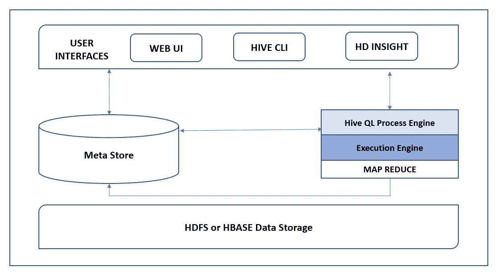
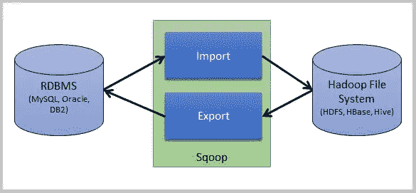

# Hadoop 上的关系数据库

> 原文：<https://towardsdatascience.com/the-touch-of-relational-databases-on-hadoop-1a968cc16b61?source=collection_archive---------39----------------------->

## 在分布式设置中处理关系数据的工具集


[图像来源](https://www.cbronline.com/what-is/what-is-a-database-4917209/)

Hadoop 生态系统由构成大数据处理生命周期不同部分的不同部分组成。另一方面，当我们谈论大数据处理或任何类型的数据处理时，也不能忘记关系数据库的作用。原因是关系数据库仍然是一种非常流行的数据存储机制，适合不同的 OLTP 和 OLAP 操作。如果有人愿意将 Hadoop 技术集成到特定领域的大数据处理任务中，但他们的数据驻留在关系数据库中，那么 Hadoop 和 RDBMS 之间应该有一个链接。而且，有许多熟练的专业开发人员能够胜任 SQL 和关系数据库。因此，如果不提供对关系数据库和相关技术的支持，Hadoop 生态系统将是不完整的。本文的目的是讲 Hadoop 生态系统是如何与 RDBMS 相关技术连接的。

## Apache Hive —类似 SQL 的接口，用于处理分布式数据

Hive 是 Hadoop 允许 SQL 专家处理海量数据的方式。它提供了一个类似 SQL 的接口来处理驻留在 HDFS 或其他数据存储中的数据。用户和 Hive 之间的交互可以通过不同的流进行，如 Hive Web UI、CLI 和 Hive HD Insight。底层查询语言被称为 HiveQL，它非常类似于 SQL，这使得 SQL 专家很容易使用它。尽管语法类似于 SQL，但用 HiveQL 编写的查询被转换成 MapReduce 或 Tez 作业，因此它们可以在分布式数据集上高效运行。MapReduce/Tez 作业运行在 HDFS 或类似的分布式数据存储之上，并向用户返回隐藏底层复杂性的结果。由于 Hive 以非规范化的方式存储数据，并引入了延迟，因此不建议使用 Hive 进行 OLTP 操作，但对于在 Hadoop eco 系统上完成的 OLAP 和仓储操作，这是一个非常好的选择。



蜂巢建筑

Hive 的以下特性增加了它在 Hadoop 生态系统中的重要性。

*   ***Hive MetaStore***:Hive 维护一个存储元数据的集中式存储库。拥有一个中央元存储可以在分布式环境中快速访问数据。metastore 由一个服务和一个用于元数据的磁盘存储器组成，该服务可被其他配置单元服务用来访问元数据，该磁盘存储器独立于 HDFS。这个 metastore 在 Hive 的架构及其处理分布式数据的策略中起着重要作用。
*   ***读取时的模式:*** 传统的 RDBMS 支持“写入时的模式”，这意味着当数据被写入数据库时，模式被检查。相反，Hive 支持“读取时的模式”，这意味着当对数据发出读取查询时，会检查模式。使用上述 metastore，Hive 对存储在 HDFS 或另一个存储器中的数据赋予一个结构/模式。基本上，它是关于将您的数据写入存储，而不用担心模式和以后弄清楚什么是数据。这非常有帮助，尤其是在非结构化大数据的环境中。此外，人们可以将数据加载到系统中，而无需首先弄清楚如何处理这些数据。
*   ***物化视图:*** Hive 允许将中间表预先计算并缓存到物化视图中。这是因为一系列查询通常依赖于中间结果或连接。这是一种用于加速查询处理时间的机制。
*   ***托管表 vs 外部表:*** Hive 支持两种类型的表，基本区别是托管表归 Hive 所有，外部表不归 Hive 所有。在托管表中，数据、其属性和数据布局将只能通过 Hive 命令来更改。仅当 Hive 管理表的整个生命周期或生成的表是临时的时，才建议使用托管表。相比之下，外部表文件可以由 Hive 之外的进程访问和管理。例如，外部表可以访问存储在 Azure 存储和远程 HDFS 位置等位置的数据。
*   ***分区:*** Hive 将表数据组织到分区中，作为优化可以在巨大数据负载上执行的查询的一种方式。Hive 维护了部分子目录来实现这一点。这种划分策略极大地优化了在特定分区上运行的查询。

上述特性使 Hive 成为 Hadoop 生态系统中非常易于使用的技术，尤其是对于具有 SQL 知识的人来说。以下是 HiveQL 查询示例，显示了它与 SQL 的相似性。

这个命令创建一个名为 employee 的表。

```
CREATE TABLE IF NOT EXISTS employee ( eid int, name String,salary String, destination String)COMMENT ‘Employee details’ROW FORMAT DELIMITEDFIELDS TERMINATED BY ‘\t’LINES TERMINATED BY ‘\n’STORED AS TEXTFILE;
```

数据可以加载到创建的表中，如下所示。这将从本地文本文件中加载数据。但是数据可以从不同的来源加载，例如 HDFS。

```
LOAD DATA LOCAL INPATH '/home/user/sample.txt'OVERWRITE INTO TABLE employee;
```

下面是一个样本选择查询。

```
SELECT * FROM employee WHERE salary>30000;
```

我们可以执行普通的 SQL 操作，比如 order by、group by、joins 等等。

```
SELECT Dept,count(*) FROM employee GROUP BY DEPT;SELECT Id, Name, Dept FROM employee ORDER BY DEPT;
```

现在您应该清楚了，Hive 为熟悉 SQL 的开发人员和分析人员提供了一种强大的机制，可以在类似于 RDBMS 的环境中利用 HDFS 或其他分布式数据源中的数据。

## Apache Sqoop——在 Hadoop 和 RDBMS 之间传输数据的框架

在上一节中，我们讨论了 Hive，它提供了一种机制来处理已经驻留在分布式数据系统中的数据。但有时我们可能希望将数据保存在类似 MySQL 的关系数据库中，但以分布式方式处理它们。为了实现这一点，我们的关系数据库和 Hadoop 之间必须有一个链接，以便将数据传入和传出。这是通过 Apache Sqoop 获得的。



Sqoop 架构:[图像来源](https://www.hdfstutorial.com/sqoop-architecture/)

Sqoop 使用仅映射作业(映射器)来导入和导出数据。

***数据导入:*** 将数据导入到 HDFS 时，Sqoop 从关系数据库中消耗元数据，而仅地图作业从数据库中传输实际数据并存储在 HDFS 目录中。默认文件包含逗号分隔的字段，记录由新行分隔。这可以通过指定记录终止符和字段分隔符来覆盖。Sqoop 也可以通过发出 create table 和 load data 命令直接将数据导入到 Hive 中。重要的是，Sqoop 支持增量导入，只有那些新的行将被添加到现有的数据库中，从而可以轻松地同步数据。

***数据导出:*** Sqoop 可以将数据从 HDFS 转移到关系数据库。Sqoop 文件的输入将是表中被视为行的记录。这也是通过纯地图作业实现的。

本文的目的是解释如何将 Hadoop 生态系统的不同技术连接起来，以在分布式数据处理环境中创建基于 RDBMS 的子系统。为了将事情可视化，使用 Sqoop，我们可以将数据从 HDFS 抽取到我们选择的 RDBMS(例如 MySQL ),然后在 OLAP 环境中使用 Hive 以分布式方式处理加载到 Hadoop 的数据。这些功能使得将 Hadoop 集成到真实世界的大数据系统变得非常容易。很有趣，不是吗？