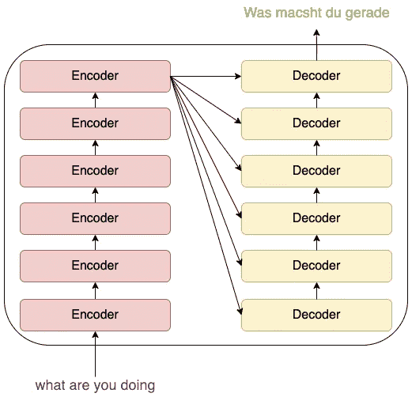
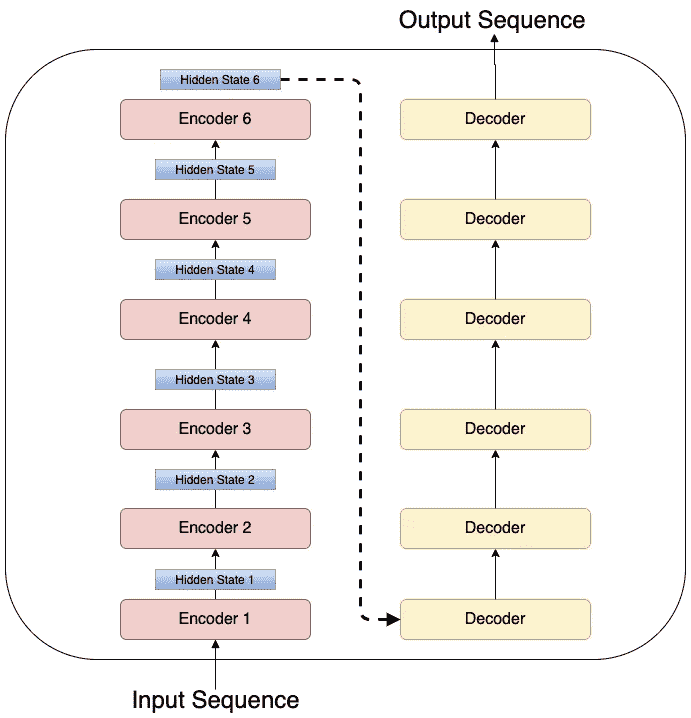
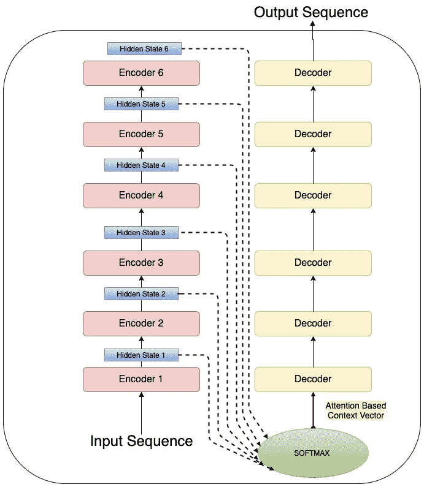
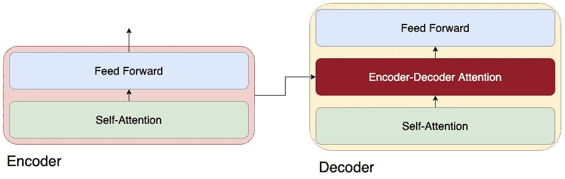
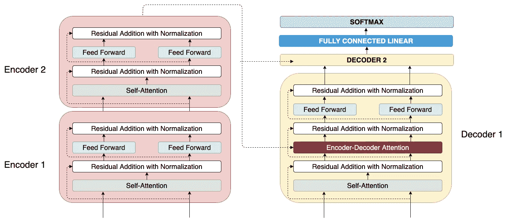

# 变形金刚:快速浏览

> 原文：<https://towardsdatascience.com/the-transformer-a-quick-run-through-ce9b21b4f3ed?source=collection_archive---------38----------------------->

## 探索由 Transformer 支持的最佳自然语言建模。了解其架构和内部工作。

> 这是关于语言建模的第 5 部分系列的第 3 部分。

使用类变压器架构(BERT)解决机器翻译的任务(【translate.google.com】T2

# 介绍

在[的上一篇](https://medium.com/p/d66e96ed754f)文章中，我们看到了 ELMo 和 ULMFiT 如何在社区中提升语言模型预培训的重要性。这篇博客假设你已经通读了本系列文章的前两部分，并以此为基础。

使用转换器模型 [(Mandar Deshpande)](https://www.linkedin.com/in/mandardeshpande1995/) 将英语输入翻译成德语输出

[变换器](https://arxiv.org/pdf/1706.03762.pdf)已经被视为通过递归神经网络最终消除序列模型训练的限制的模型。在语言建模和机器翻译中，围绕编码器-解码器堆栈的使用的想法被证明是在构建这种架构的过程中有价值的学习。Transformer 是一个简单的网络架构，完全基于注意力机制，完全放弃任何类型的递归和卷积。它已被证明可以很好地推广到其他语言理解和建模任务，具有大量和有限的训练数据。它还在英语到德语的翻译任务上取得了最先进的成果，并将其定位为 NLP 中模型预训练未来发展的首选架构。

## 编码器-解码器架构

变压器中使用的 6 个编码器-解码器架构 [(Mandar Deshpande)](https://www.linkedin.com/in/mandardeshpande1995/)

在这个模型中，多个编码器堆叠在一起，类似地，解码器也堆叠在一起。通常，每个编码器/解码器包括循环连接和卷积，并且来自每个编码器级的隐藏表示被向前传递以供下一层使用。大多数 seq2seq 任务可以很容易地使用这样一个编码器-解码器堆栈来解决，它按顺序处理输入序列中的每个单词。

## 注意机制

由于注意机制已经成为序列建模和各种任务中的转导模型的组成部分，允许建模依赖性，而不考虑它们在输入或输出序列中的距离。简单地说:注意机制帮助我们在不使用递归神经网络(RNN)的情况下解决神经网络中的长期依赖性问题。通过使用基于编码器-解码器的架构，这解决了 RNN 中所有时间步长上共享的隐藏状态所解决的确切目的。注意力模型根据正在解决的任务关注输入文本序列或图像的相关部分。

在常规 RNN 中，上下文是根据编码器产生的最终隐藏状态传递的，并使用它来产生翻译或文本的下一个标记。

没有注意机制的常规 seq2seq 模型只使用最后一个隐藏状态作为上下文向量 [(Mandar Deshpande)](https://www.linkedin.com/in/mandardeshpande1995/)

**生成上下文向量的步骤:**

1.  根据任务初始化随机值和大小的上下文向量(例如 128，256，512)
2.  通过编码器处理输入序列中的一个令牌
3.  使用编码器中的隐藏状态表示来更新上下文向量
4.  继续重复步骤 2 和 3，直到处理完整个输入序列

一旦上下文向量被完全更新，它就被传递给解码器，作为正在被翻译的单词/令牌的附加输入。**上下文向量是一个有用的抽象，除了它充当输入序列的整个含义的表示**的瓶颈。

**注意机制将编码器堆栈中的所有中间隐藏状态传递给解码器**，而不是将单个上下文向量传递给解码器。这使得解码器能够根据正被处理的当前单词/令牌的相关性来关注输入序列的不同部分。

与之前的 seq2seq 模型不同，注意力模型执行两个额外的步骤:

1.  **更多数据从编码器传递到解码器**
2.  **注意力模型中的解码器使用该附加数据**来聚焦来自输入序列的特定单词，并且**使用具有最高 softmax 分数的隐藏状态作为上下文向量**

用于创建传递给解码器的上下文向量的注意机制 [(Mandar Deshpande)](https://www.linkedin.com/in/mandardeshpande1995/)

## 窥视变压器内部

变换器由 6 个堆叠的编码器和 6 个堆叠的解码器组成，形成模型的主要架构。这个数字可以根据用例而变化，但是在[原始文件](https://arxiv.org/pdf/1706.03762.pdf)中已经使用了 6。

让我们考虑一个编码器和解码器堆栈，以简化我们对工作的理解。

变压器 [(Mandar Deshpande)](https://www.linkedin.com/in/mandardeshpande1995/) 中编码器和解码器内部的组件

## 体系结构

每个编码器包括一个自我关注层，其后是前馈网络。通常在注意力机制中，来自先前状态的隐藏状态被用于计算注意力。相反，自我关注使用来自同一层的训练嵌入来计算关注向量。为了说明，自我注意可以被认为是一种在句子中解决共指的机制:

“男人在吃饭，而他在想他的家人”

在上面的句子中，模型需要建立对`he` 所指内容的理解，并且它是对`man.`的共指，这是由转换器中的自我关注机制实现的。关于自我关注(使用多个头部)的详细讨论超出了本博客的范围，可以在原始论文中找到。

解码器也具有与编码器相同的两层，只是在这两层之间引入了额外的编码器-解码器注意力，以帮助模型从来自编码器的注意力向量中提取相关特征。

简化的 2 个编码器与 2 个解码器堆叠在一起，探索内部架构 [(Mandar Deshpande)](https://www.linkedin.com/in/mandardeshpande1995/)

**点式前馈网络** 需要注意的是，输入序列中的每个单词都在自我关注层共享计算，但每个单词都流经一个单独的前馈网络。前馈网络的输出被传递到堆栈中的下一个编码器，该编码器利用从先前编码器学习到的上下文。

**位置编码
这个增强的输入字嵌入作为输入被传递给编码器 1。由于该模型不使用任何递归或卷积，位置编码对输入句子中的相对位置信息进行编码。**

**具有归一化的剩余连接** 使用剩余连接和层归一化将来自自我关注层的输出与原始单词嵌入相加。前馈层遵循类似的方案。

**与 Softmax
全连接线性**一旦堆栈中的最后一个解码器给出一个点向量，就需要将其转换成翻译后的单词。既然我们已经将所有需要的信息作为浮点数嵌入到这个输出向量中，我们只需要将它转换成翻译中可能的下一个单词的概率。

全连接线性网络将浮点向量转换为分数，分数使用 softmax 函数转换为概率值。具有最高 softmax 值的索引被选择并从从训练集学习的输出词汇中检索。

# 变压器培训说明

训练是受监督的，即使用带标签的训练数据集，该数据集可用作输出单词概率的比较和校正的基准。

本质上，翻译后的输出词汇表中的每个单词都被转换成一个独热向量，该向量只有在单词出现的索引处为 1，其他地方为 0。现在，一旦我们接收到由归一化概率值组成的 softmax 输出向量，我们就可以将其与独热向量进行比较，以改进模型参数/权重。

这两个向量可以通过使用一些相似性度量进行比较，如**余弦相似性、交叉熵和/或 Kullback-Leibler 散度**。在训练过程的开始，输出概率分布比地面真实一号热向量偏离得更远。随着训练的进行和权重的优化，输出单词概率紧密地跟踪地面真实向量。

我希望这篇博客能帮助您理解 Transformer 是如何工作的，我计划在下一篇文章中探索 BERT 模型。

[链接到第一部分](/language-modeling-c1cf7b983685):语言建模 I [链接到第二部分](/language-modelingii-ulmfit-and-elmo-d66e96ed754f):语言建模 II: ELMo 和 ULMFiT
[链接到第三部分](/the-transformer-a-quick-run-through-ce9b21b4f3ed):变压器:快速浏览

继续学习和成长，直到那时！

在推特上和我联系:[https://twitter.com/mandroid_6](https://twitter.com/mandroid_6)

> 以上所有图片均由我创作，我有权使用它们。我从杰伊·阿拉姆马的博客 *中获得了可视化的灵感*