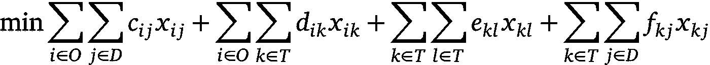
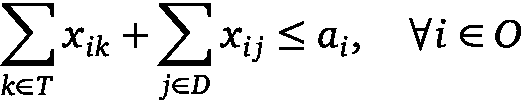
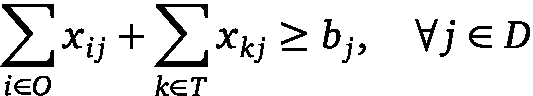
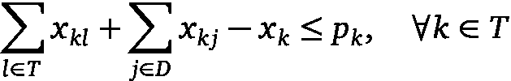
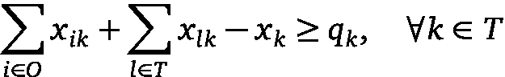
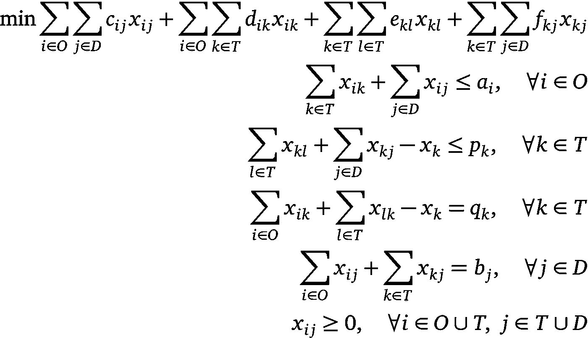
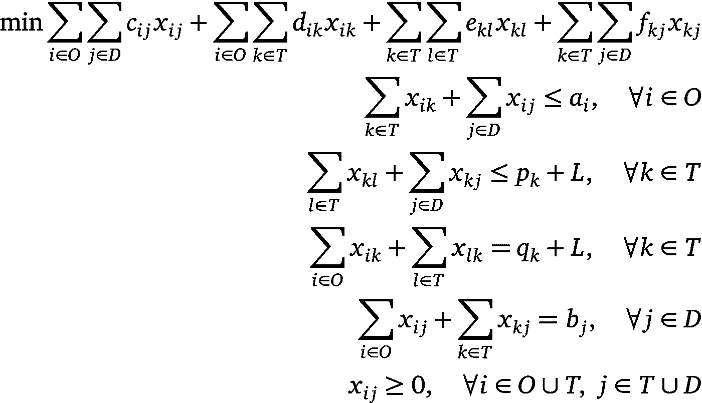

# 转运问题

> 原文：<https://towardsdatascience.com/the-transshipment-problem-4ce934e4561f?source=collection_archive---------17----------------------->

## 有中间转运点的货物运输优化

# 起点

你是 Acomp 公司供应链的新负责人，该公司生产并向海外交付产品。供应政策是凭经验制定的(随机？所以你认为它还可以改进。

该公司的结构如下。有一些工厂分布在全球各地，需要供应您的产品。除此之外，还有一些为生产做出贡献的中间场所，它们也有需要满足的需求。

考虑到生产数量不是无限的，工厂只能发送产品，需求点只能接收产品，而中间点可以接收或发送产品，目标是找到最小化操作成本并满足每个生产和需求约束的策略。

# 数学公式

现在，我们可以在数学上把问题表述为所谓的*转运问题*。问题的节点分为三组。

*   原产地:原产地 *i* 将在那里生产的货物发送到转运地或目的地。换句话说，边从起点到转运点或目的地。一个产地 *i* 有一个关联的生产 *aᵢ* 。
*   目的地:目的地 *j* ∈ *D* 可以接收来自原产地和转运地的货物。也就是说，对于目的地，只有来自始发地和转运地的输入边。目的地 *j* 具有相关的需求 *bⱼ* 。
*   转运:转运站可以接收和发送货物，包括他们之间。因此，它们具有来自始发地和其他转运地的输入边和到达目的地和其他转运地的输出边。一个转运 *k* ∈ *T* 有一个关联的生产 *p* ' *ₖ* 和需求 *q* ' *ₖ* 。此外，最终产量和需求由*pₖ*=*p*'*ₖ—*min {*p*'*ₖ，q* ' *ₖ* 和*qₖ*=*q*'*ₖ*—min {*p*'*ₖ*给出请注意，这使得其中一个为零，因为转运将使用自己的生产，最终，它会有盈余(无需求)或短缺(无生产)。

货物运输有相关的成本，这取决于节点

*   *cᵢⱼ* :从出发地 *i* 到目的地 *j* 的单一运输成本。
*   *dᵢₖ* :从原产地 *i* 到转运地 *k* 的单位运输成本。
*   *eₖₗ* :从转运 *k* 到转运 *l* 的单位运输成本。
*   *fₖⱼ* :转运 *k* 到目的地 *j* 的单位运输成本。

现在让我们考虑产量和需求量:

*   *aᵢ* :原产地生产*一*。
*   *pₖ* :转运生产 *k* 。
*   qₖ:转运需求。
*   *bⱼ* :目的地需求 *j* 。

最后，必须优化模型的决策变量是

*   *xᵢⱼ* ，*I*≦*j*:表示从点 *i* 发送到点 *j* 的货物的决策变量。
*   *xₖ* ， *k* ∈ *T* :决策变量，代表 *k* 接收发送到另一个点的货物。

现在每个变量都已定义，所以让我们建立线性模型。

目标函数是

\ min \ sum _ { I \ in O } \ sum _ { j \ in D } c _ { ij } x _ { ij }+\ sum _ { I \ in O } \ sum _ { k \ in T } D _ { ik } x _ { ik }+\ sum _ { k \ in T } e _ { KL } x _ { KL }+\ sum _ { k \ in T } \ sum _ { j \ in D } f _ { kj } x _ { kj }

该公式表明，成本是每条边发送的货物的总和乘以发送一个单位的成本。目标函数由四个成本组成:从始发地到目的地，从始发地到转运地，从转运地到转运地和从转运地到目的地。

现在是必须满足与每个节点的生产和需求相关的约束的时候了。我们说过 *i* ∈ *O* 每个产地都有限量生产，从 *i* 发往每个可能的节点(转运或目的地)的货物不能超过 *aᵢ* 。因此，第一个制约因素是

\ sum _ { k \ in T } x _ { ik }+\ sum _ { j \ in D } x _ { ij } \阿乐 _i，\quad \forall i \in O

类似地，对于目的地，由必须满足的需求产生的约束是

\ sum _ { I \ in O } x _ { ij }+\ sum _ { k \ in T } x _ { kj } \ ge b _ j，\quad \forall j \in D

请注意，在这种情况下，不等式可以写成等式，因为在满足约束条件的情况下，超出的运输成本会更高。

最棘手的部分是与转运有关的部分。转运的生产或出货数量限制为

\ sum _ { l \ in T } x _ { KL }+\ sum _ { j \ in D } x _ { kj }—x _ k \ le p _ k，\quad \forall k \in T

该约束的含义如下。一次转运 *k* ∈ *T* 能够生产 *pₖ* 单位的货物。出库货物为∑{*l*∑*t*}*xₖₗ*+∑{*j*∑*d*}*xₖⱼ*。因为 *k* 是转运，所以有一个可以接收重新发送的进货数量，定义为 *xₖ* 。因此，不能超过的发送数量不仅仅是生产的数量 *pₖ* ，而是生产的数量加上要重新发送的接收数量 *pₖ* + *xₖ* ，从那里产生了先前的约束。

同样，转运的需求或进货数量约束可以写成

\ sum _ { I \ in O } x _ { ik }+\ sum _ { l \ in T } x _ { lk }-x _ k \ ge q _ k，\quad \forall k \in T

因为对于任何一个 *k* ∈ *T* 来说，进货应该足以满足其需求 *qₖ* 加上转运收到的进货数量再发送 *xₖ* 。注意，正如前面所解释的，不等式变成了等式。

很明显，运输的货物数量必须是正数。同样直观的是，单位运输成本 *cᵢⱼ* 、 *dᵢⱼ* 、 *eᵢⱼ* 、 *fᵢⱼ* 一定是正的，生产应该大于需求，即*∑ᵢaᵢ*+*∑ₖpₖ*≥*∑ⱼbⱼ*+*∑ₖqₖ*，所以假设这些都满足。

综上所述，作为转运问题的优化问题是

\ min \ sum _ { I \ in O } \ sum _ { j \ in D } c _ { ij } x _ { ij }+\ sum _ { I \ in O } \ sum _ { k \ in T } D _ { ik } x _ { ik }+\ sum _ { k \ in T } \ sum _ { l \ in T } e _ { KL } x _ { KL }+\ sum _ { k \ in T } \ sum _ { j \ in D } f _ { kj } x _ { kj } & \ \ \ n \ quad \ for all k \ in T & \ \ \ sum _ { I \ in O } x _ { ij }+\ sum _ { k \ in T } x _ { kj } = b _ j，\quad \forall j \in D & \\ x_{ij} \ge 0，\quad \forall i \in O \cup T，\ j \in T \cup D &

# 解决转运问题

一旦我们有了模型，就可以用不同的解算器和软件来求解，如 COIN-OR solvers、CPLEX、GAMS……它可以用单纯形法这样的线性规划算法来求解。

但是现在，如果好的数量必须是一个整数呢？例如，当产品是从 *i* 发送到 *j、* *xᵢⱼ* = 350.87 件没有意义时，就会发生这种情况。生产和需求值也必须是整数。同样，您也可以将自己喜欢的求解器与像分支定界这样的整数规划算法结合使用。

由于转运问题和运输问题之间存在等价性，我们将从一个问题转移到另一个问题，而不是那样做。运输问题是转运问题的一个特例，这里不存在转运点。换句话说，从起点到终点只有直接的边。从理论上讲，在整数生产和需求假设下，运输问题的最优解是整数解。这句话告诉我们，线性规划算法可以用来达到整数最优解，而不需要更复杂的整数规划的必要性。

要进行转换，让我们首先定义

*l*=∑*ᵢaᵢ*+∑*ₖpₖ*

然后，在一个最优解中满足 *xₖ* ≤ *L* ，∀ *k* ∈ *T* 。如果不是这样，一些货物将不止一次地经过一个点，使得该解决方案不是最佳。如果我们现在定义新的变量

*xₖₖ* = *L — xₖ* ≥ 0

先前定义的转运问题的等价运输问题是

\ min \ sum _ { I \ in O } \ sum _ { j \ in D } c _ { ij } x _ { ij }+\ sum _ { I \ in O } \ sum _ { k \ in T } D _ { ik } x _ { ik }+\ sum _ { k \ in T } \ sum _ { L \ in T } e _ { KL } x _ { KL }+\ sum _ { k \ in T } \ sum _ { j \ in D } f _ { kj } x _ { kj } & \ \ \ n \ quad \ for all k \ in T & \ \ \ sum _ { I \ in O } x _ { ij }+\ sum _ { k \ in T } x _ { kj } = b _ j，\quad \forall j \in D & \\ x_{ij} \ge 0，\quad \forall i \in O \cup T，\ j \in T \cup D &

前两个约束是生产约束，后两个是需求约束。这个性质的关键是所谓的幺模性质，它具有问题的约束矩阵。

如前所述，要解决整数问题版本，没有必要应用整数规划算法。此外，这些问题的特定算法比单纯形算法具有更好的速度性能，如网络的单纯形法。

# 结论

我们已经解决了在有中间转运点的情况下将货物从原产地运输到目的地的问题。

我们已经模拟了一个转运问题，然后我们解决了这个问题，得出的结论是，整数版的问题可以解决，就好像它不是。

**注:**参考文献可以在[http://hdl.handle.net/10810/18077](http://hdl.handle.net/10810/18077)的参考文献部分找到，这部分是可以检查理论的不同来源的总结(西班牙语)。