# 数据标记

> 原文：<https://towardsdatascience.com/the-triple-barrier-method-251268419dcd?source=collection_archive---------5----------------------->

## [📈Python for finance 系列](/feature-engineering-feature-selection-8c1d57af18d2)

## 三重屏障法


由[戴夫·甘迪](http://skuawk.com/)根据[公共领域专用许可](https://creativecommons.org/licenses/publicdomain/)拍摄的照片

***来自《走向数据科学》编辑的提示:*** *虽然我们允许独立作者根据我们的* [*规则和指南*](/questions-96667b06af5) *发表文章，但我们并不认可每个作者的贡献。你不应该在没有寻求专业建议的情况下依赖一个作者的作品。详见我们的* [*读者术语*](/readers-terms-b5d780a700a4) *。*

警告:这里没有神奇的公式或圣杯，尽管一个新的世界可能会为你打开大门。

**注 1:** 如何安装 [mlfinlab](https://github.com/hudson-and-thames/mlfinlab) 包没有错误信息可以在[这里找到](https://medium.com/@kegui/how-to-install-mlfinlab-without-error-messages-896e2fb43c2f)。

**注 2:** 如果你正在读马科斯·普拉多的[金融机器学习进展](https://www.amazon.com/Advances-Financial-Machine-Learning-Marcos/dp/1119482089)。**第七期*。*** [***细分特征***](https://medium.com/swlh/fractionally-differentiated-features-9c1947ed2b55)*是第五章关于[细分特征](https://medium.com/swlh/fractionally-differentiated-features-9c1947ed2b55)。 ***8。*** [***数据标注***](/the-triple-barrier-method-251268419dcd) 是第三章关于三重障法。*和* ***9。*** [***元标注***](/meta-labeling-and-stacking-f17a7f9804ec)**是第 50 页第 3.6 章。我计划一步一步地看完每一章，因为我还没有找到每一章中那些概念的详细解释。敬请关注！***

## **📈Python For Finance 系列**

1.  **[识别异常值](https://medium.com/python-in-plain-english/identifying-outliers-part-one-c0a31d9faefa)**
2.  **[识别异常值—第二部分](https://medium.com/better-programming/identifying-outliers-part-two-4c00b2523362)**
3.  **[识别异常值—第三部分](https://medium.com/swlh/identifying-outliers-part-three-257b09f5940b)**
4.  **[程式化的事实](/data-whispering-eebb77a422da)**
5.  **[特征工程&特征选择](https://medium.com/@kegui/feature-engineering-feature-selection-8c1d57af18d2)**
6.  **[数据转换](/data-transformation-e7b3b4268151)**
7.  **[微小差异特征](https://medium.com/swlh/fractionally-differentiated-features-9c1947ed2b55)**
8.  **[数据标签](/the-triple-barrier-method-251268419dcd)**
9.  **[元标签和堆叠](/meta-labeling-and-stacking-f17a7f9804ec)**

**三重障碍法根据马科斯·普拉多在[金融机器学习进展](https://www.amazon.com/Advances-Financial-Machine-Learning-Marcos/dp/1119482089)第三章中介绍的三个障碍中的第一个障碍来标记观察结果。标记数据的传统方法是使用第二天(滞后)回报和固定时间范围方法。这种方法可以描述如下。**

**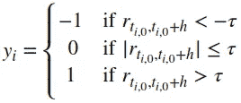**

**和**

**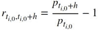**

**这种流行的传统标签方法有几个缺点。首先，时间条没有表现出良好的统计特性。第二，不管观察到的波动性如何，都应用相同的阈值𝜏。基本上，标签不能反映投资的当前状态。**

**此外，在真实情况下，第二天你可能不想卖出。因此，三重屏障方法在实践中更有意义，因为它是路径相关的。你可以根据你计划持有股票的天数以及在此期间股票的变化做出合理的决定。**

**来自[金融机器学习进展](https://www.amazon.com/Advances-Financial-Machine-Learning-Marcos/dp/1119482089)第三章的原代码是为高频交易而创建的，使用高频数据，而且大部分是日内数据。如果您使用每日数据，我们需要稍微调整一下代码。我还从书中摘录了大部分代码，通过大量使用`padas` `DataFrame`结构将所有信息存储在一个地方，使其对初学者友好。通过这种方式，当你开始分析或绘制数据时，以后的生活会变得容易得多。与此同时，我采用了更复杂的方法，如[平均真实范围](https://en.wikipedia.org/wiki/Average_true_range)作为每日波动率。你可以在本文末尾看到所有的代码。**

# **直觉**

**这种直觉就像我以前的文章中描述的发现异常值一样。异常值就像股票交易中的突破，它定义了所有的障碍，为你做出买入或卖出的决定提供了一个窗口。如果你没看过，你可以随时回到[这里](https://medium.com/python-in-plain-english/identifying-outliers-part-one-c0a31d9faefa)，这里[这里](https://medium.com/@kegui/identifying-outliers-part-two-4c00b2523362)，这里[这里](https://medium.com/swlh/identifying-outliers-part-three-257b09f5940b)。**

**根据马科斯·普拉多的[金融机器学习进展](https://www.amazon.com/Advances-Financial-Machine-Learning-Marcos/dp/1119482089)，三重障碍法是:**

**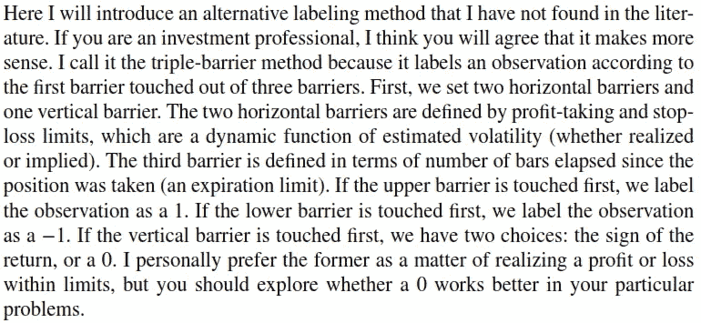**

**基本上，我们现在做的是:**

**我们会买入一只股票(比如苹果)，并持有 10 天。如果价格下跌并触发止损警报，我们在止损点退出，或者如果价格上涨，我们在某一点获利。在一个极端的例子中，股价横向波动，我们持有一段时间后在某一天退出。**

**假设我们有一个简单的股权管理规则:**

*   **在一次交易中，不要冒险超过你总资本的 2%。**
*   **永远只看那些你会有 3:1 收益比的交易机会。**

**基于这些简单的规则，我们在投资股票之前会制定一个交易计划。要把这个交易计划融入股价运动，我们需要三个障碍。这三个障碍是什么？四条线形成一个框架，定义一个窗口，如下所示。**

**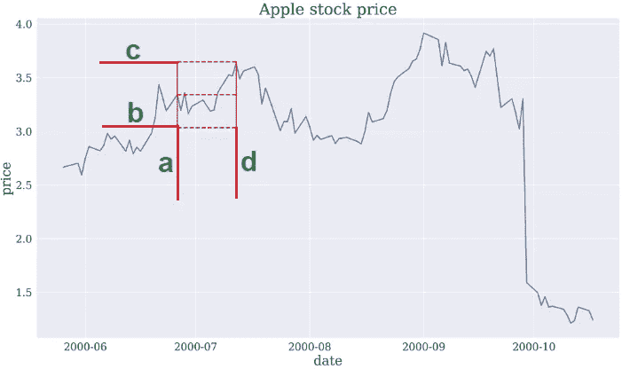**

**x 轴是日期时间，y 轴是股票价格。a、d 线属于 x 轴，即 datatime 指数，b、c 线属于 y 轴，即股价。**

**甲:开始日期**

**b:止损出场价格**

**c:获利退出价格**

**d:开始日期+您计划持有的天数。**

**b 和 c 不必相同。请记住，我们要设置获利了结和止损限额，它们是押注风险的函数。我们总是希望只交易那些盈利率为 3:1 的机会。这里设置 *c = 3 * b* 就行了。**

**关于这个话题的视频很少，我刚在 YouTube 上找到一个。**

**好了，事不宜迟，让我们深入代码。**

# **1.数据准备**

**为了保持一致，在所有的[📈Python for finance 系列](https://medium.com/swlh/identifying-outliers-part-three-257b09f5940b)，我会尽量重用相同的数据。关于数据准备的更多细节可以在[这里](https://medium.com/python-in-plain-english/identifying-outliers-part-one-c0a31d9faefa)，这里[这里](https://medium.com/@kegui/identifying-outliers-part-two-4c00b2523362)和[这里](https://medium.com/swlh/identifying-outliers-part-three-257b09f5940b)找到，或者你可以参考我之前的[文章](https://medium.com/@kegui/feature-engineering-feature-selection-8c1d57af18d2)。或者，如果你愿意，你可以忽略下面的所有代码，使用你手头上任何干净的数据，这不会影响我们将要一起做的事情。**

```
**import pandas as pd
import numpy as np
import matplotlib.pyplot as plt
plt.style.use('seaborn')plt.rcParams['figure.figsize'] = [16, 9]
plt.rcParams['figure.dpi'] = 300
plt.rcParams['font.size'] = 20
plt.rcParams['axes.labelsize'] = 20
plt.rcParams['axes.titlesize'] = 24
plt.rcParams['xtick.labelsize'] = 16
plt.rcParams['ytick.labelsize'] = 16
plt.rcParams['font.family'] = 'serif'import yfinance as yfdef get_data(symbols, begin_date=None,end_date=None):
    df = yf.download('AAPL', start = begin_date,
                     auto_adjust=True,#only download adjusted data
                     end= end_date) 
    #my convention: always lowercase
    df.columns = ['open','high','low',
                  'close','volume'] 

    return dfApple_stock = get_data('AAPL', '2000-01-01', '2010-12-31')   
price = Apple_stock['close']**
```

# **2.每日波动**

**获取日波动率的原始代码(如下)是针对日内数据的，日内数据是没有周末、非工作日等的连续数据*。*。**

```
**def getDailyVol(close,span0=100):
    # daily vol, reindexed to close
    df0=close.index.searchsorted(close.index-pd.Timedelta(days=1))
    df0=df0[df0>0]
    df0=pd.Series(close.index[df0 – 1], 
                  index=close.index[close.shape[0]-df0.shape[0]:])
    df0=close.loc[df0.index]/close.loc[df0.values].values-1 
    # daily returns
    df0=df0.ewm(span=span0).std()
    return df0**
```

**如果你运行这个函数，你会得到一个错误信息:`**SyntaxError:** invalid character in identifier`，那是因为`close.index[df0–1]`。可以这样解决:**

```
**def getDailyVol(close,span0=100):
    # daily vol, reindexed to close
    df0=close.index.searchsorted(close.index-pd.Timedelta(days=1))
    df0=df0[df0>0]
    a = df0 -1 #using a variable to avoid the error message.
    df0=pd.Series(close.index[a], 
                  index=close.index[close.shape[0]-df0.shape[0]:])
    df0=close.loc[df0.index]/close.loc[df0.values].values-1 
    # daily returns
    df0=df0.ewm(span=span0).std()
    return df0**
```

**如果你使用每日数据而不是日内数据，你将会得到很多重复的数据，因为日期向后移动了一天，并且会导致很多非工作日的数据。**

```
**df0=close.index.searchsorted(close.index-pd.Timedelta(days=1))
pd.Series(df0).value_counts()**
```

**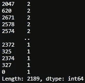**

**2766–2189 = 577 个副本。**

**对于每日数据，我们可以使用简单的百分比回报率的指数加权移动平均线(EWM)作为波动率。**

```
**def get_Daily_Volatility(close,span0=20):
    # simple percentage returns
    df0=close.pct_change()
    # 20 days, a month EWM's std as boundary
    df0=df0.ewm(span=span0).std()
    df0.dropna(inplace=True)
    return df0df0 = get_Daily_Volatility(price)
df0**
```

**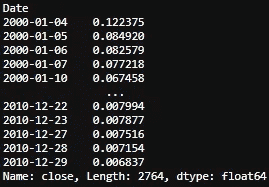**

**根据问题的类型，我们可以选择更复杂的方法，如[平均真实范围](https://www.investopedia.com/terms/a/atr.asp#:~:text=Average%20true%20range%20(ATR)%20is%20a%20technical%20indicator%20measuring%20market,to%20all%20types%20of%20securities.)(技术分析指标[衡量市场波动](https://www.investopedia.com/articles/trading/08/average-true-range.asp))。**

**ATR 的公式是:**

**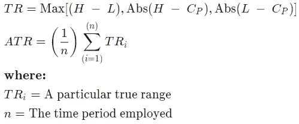**

**计算 ATR 的第一步是找到一系列股票价格的真实范围值。给定交易日的资产价格范围就是其最高价减去最低价，而真实范围是当前最高价减去当前最低价；当前高点的[绝对值](https://www.investopedia.com/terms/a/absolute-value.asp)减去前一次收盘；和当前低点减去前一个收盘点的绝对值。平均真实范围是真实范围的[移动平均](https://www.investopedia.com/terms/m/movingaverage.asp)，通常使用 14 天。**

```
**def get_atr(stock, win=14):

    atr_df = pd.Series(index=stock.index)
    high = pd.Series(Apple_stock.high.rolling( \
                     win, min_periods=win))
    low = pd.Series(Apple_stock.low.rolling( \
                    win, min_periods=win))
    close = pd.Series(Apple_stock.close.rolling( \
                      win, min_periods=win))    

    for i in range(len(stock.index)):
        tr=np.max([(high[i] - low[i]), \
                  np.abs(high[i] - close[i]), \
                  np.abs(low[i] - close[i])], \
                  axis=0) atr_df[i] = tr.sum() / win

    return  atr_dfget_atr(Apple_stock, 14)
atr_df**
```

**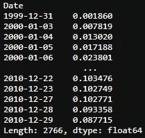**

# **3.三重屏障**

**在我们开始研究护栏之前，需要确定几个参数。**

```
**#set the boundary of barriers, based on 20 days EWM
daily_volatility = get_Daily_Volatility(price)
# how many days we hold the stock which set the vertical barrier
t_final = 10 
#the up and low boundary multipliers
upper_lower_multipliers = [2, 2]#allign the index
prices = price[daily_volatility.index]**
```

**这里，我将使用`pd.DataFrame`作为容器，将所有信息添加到一个地方。**

```
**def get_3_barriers():
    #create a container
    barriers = pd.DataFrame(columns=['days_passed', 
              'price', 'vert_barrier', \
              'top_barrier', 'bottom_barrier'], \
               index = daily_volatility.index) for day, vol in daily_volatility.iteritems():
        days_passed = len(daily_volatility.loc \
                      [daily_volatility.index[0] : day]) #set the vertical barrier 
        if (days_passed + t_final < len(daily_volatility.index) \
            and t_final != 0):
            vert_barrier = daily_volatility.index[
                                days_passed + t_final]
        else:
            vert_barrier = np.nan #set the top barrier
        if upper_lower_multipliers[0] > 0:
            top_barrier = prices.loc[day] + prices.loc[day] * \
                          upper_lower_multipliers[0] * vol
        else:
            #set it to NaNs
            top_barrier = pd.Series(index=prices.index) #set the bottom barrier
        if upper_lower_multipliers[1] > 0:
            bottom_barrier = prices.loc[day] - prices.loc[day] * \
                          upper_lower_multipliers[1] * vol
        else: 
            #set it to NaNs
            bottom_barrier = pd.Series(index=prices.index) barriers.loc[day, ['days_passed', 'price', 
        'vert_barrier','top_barrier', 'bottom_barrier']] = \
         days_passed, prices.loc[day], vert_barrier, 
         top_barrier, bottom_barrier return barriers**
```

**让我们看看所有的障碍。**

```
**barriers = get_barriers()
barriers**
```

**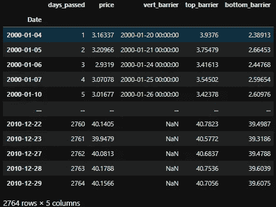**

**并仔细查看所有数据信息。**

```
**barriers.info()**
```

**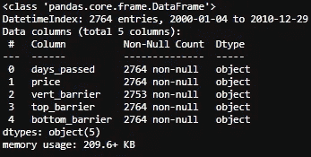**

**只有`vert_barrier`最后有 11 个`NaN`值，因为`t_final`被设置为 10 天。**

**下一步是根据哪个障碍首先被触及来标记每个条目。我在`barriers`的末尾添加了一个新列`‘out’`。**

```
**barriers['out'] = None
barriers.head()**
```

**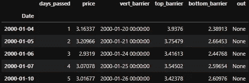**

**现在，我们可以在标签上工作。**

```
**def get_labels():
'''
start: first day of the window
end:last day of the window
price_initial: first day stock price
price_final:last day stock price
top_barrier: profit taking limit
bottom_barrier:stop loss limt
condition_pt:top_barrier touching conditon
condition_sl:bottom_barrier touching conditon''' for i in range(len(barriers.index)): start = barriers.index[i]
        end = barriers.vert_barrier[i] if pd.notna(end):
            # assign the initial and final price
            price_initial = barriers.price[start]
            price_final = barriers.price[end] # assign the top and bottom barriers
            top_barrier = barriers.top_barrier[i]
            bottom_barrier = barriers.bottom_barrier[i] #set the profit taking and stop loss conditons
            condition_pt = (barriers.price[start: end] >= \
             top_barrier).any()
            condition_sl = (barriers.price[start: end] <= \
             bottom_barrier).any() #assign the labels
            if condition_pt: 
                barriers['out'][i] = 1
            elif condition_sl: 
                barriers['out'][i] = -1    
            else: 
                barriers['out'][i] = max(
                          [(price_final - price_initial)/ 
                           (top_barrier - price_initial), \
                           (price_final - price_initial)/ \
                           (price_initial - bottom_barrier)],\
                            key=abs)
 returnget_labels()
barriers**
```

**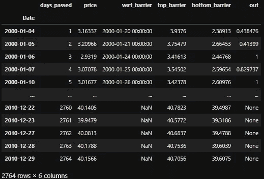**

**我们可以画出‘out’来看它的分布。**

```
**plt.plot(barriers.out,'bo')**
```

**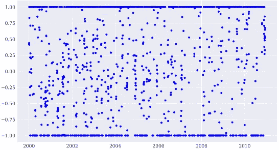**

**并计算触发了多少获利回吐和止损限制。**

```
**barriers.out.value_counts()**
```

**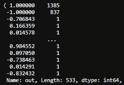**

**2764 个数据点中有 1385 个获利了结，837 个止损。542 个案例退出是因为时间到了。**

**我们也可以选择一个随机的日期，并在图表上显示出来。**

```
**fig,ax = plt.subplots()
ax.set(title='Apple stock price',
       xlabel='date', ylabel='price')
ax.plot(barriers.price[100: 200])start = barriers.index[120]
end = barriers.vert_barrier[120]
upper_barrier = barriers.top_barrier[120]
lower_barrier = barriers.bottom_barrier[120]
ax.plot([start, end], [upper_barrier, upper_barrier], 'r--');
ax.plot([start, end], [lower_barrier, lower_barrier], 'r--');
ax.plot([start, end], [(lower_barrier + upper_barrier)*0.5, \
                       (lower_barrier + upper_barrier)*0.5], 'r--');
ax.plot([start, start], [lower_barrier, upper_barrier], 'r-');
ax.plot([end, end], [lower_barrier, upper_barrier], 'r-');**
```

**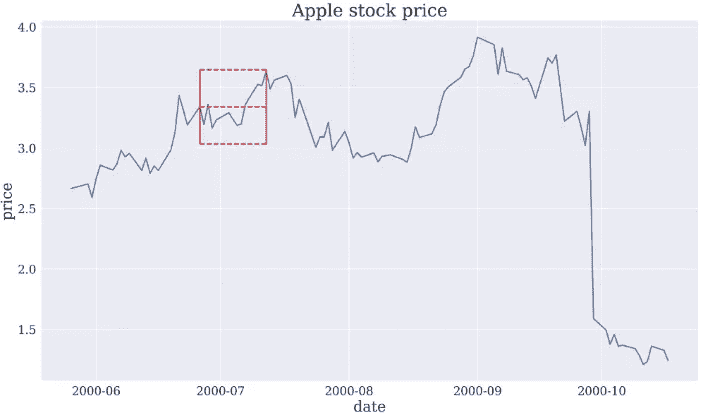**

**我们还可以用 easy 绘制一个动态图。**

```
**fig,ax = plt.subplots()
ax.set(title='Apple stock price',
       xlabel='date', ylabel='price')
ax.plot(barriers.price[100: 200])start = barriers.index[120]
end = barriers.index[120+t_final]
upper_barrier = barriers.top_barrier[120]
lower_barrier = barriers.bottom_barrier[120]
ax.plot(barriers.index[120:120+t_final+1], barriers.top_barrier[start:end], 'r--');
ax.plot(barriers.index[120:120+t_final+1], barriers.bottom_barrier[start:end], 'r--');
ax.plot([start, end], [(lower_barrier + upper_barrier)*0.5, \
                       (lower_barrier + upper_barrier)*0.5], 'r--');
ax.plot([start, start], [lower_barrier, upper_barrier], 'r-');
ax.plot([end, end], [barriers.bottom_barrier[end], barriers.top_barrier[end]], 'r-');**
```

**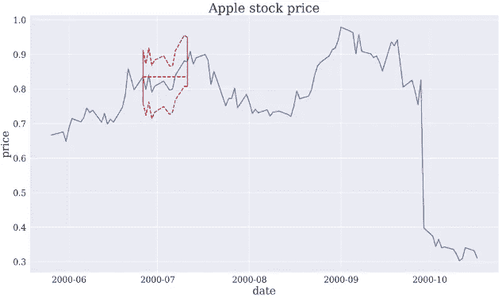**

****回顾我们拥有的参数:****

*   **数据:苹果 10 年股价**
*   **保持时间:不超过 10 天**
*   **获利回吐界限:20 天返回 EWM 标准的 2 倍**
*   **止损边界:20 天返回 EWM 标准的 2 倍**

****我们在真实案例中期待的规则:****

*   **永远只关注那些你将会有 3:1 盈利率的交易机会。**
*   **在一次交易中，不要冒险超过你总资本的 2%。**

**第一条规则可以通过设置`upper_lower_multipliers = [3, 1]`轻松实现。第二个是关于交易规模，边乘以规模将使我们能够计算风险(保证金/优势)。这将是下一篇文章中的元标签。所以，敬请期待！**

**以下是所有代码:**

```
**import pandas as pd
import numpy as np
import matplotlib.pyplot as plt
plt.style.use('seaborn')plt.rcParams['figure.figsize'] = [16, 9]
plt.rcParams['figure.dpi'] = 300
plt.rcParams['font.size'] = 20
plt.rcParams['axes.labelsize'] = 20
plt.rcParams['axes.titlesize'] = 24
plt.rcParams['xtick.labelsize'] = 16
plt.rcParams['ytick.labelsize'] = 16
plt.rcParams['font.family'] = 'serif'import yfinance as yfdef get_data(symbols, begin_date=None,end_date=None):
    df = yf.download('AAPL', start = begin_date,
                     auto_adjust=True,#only download adjusted data
                     end= end_date) 
    #my convention: always lowercase
    df.columns = ['open','high','low',
                  'close','volume'] 

    return dfApple_stock = get_data('AAPL', '2000-01-01', '2010-12-31')   
price = Apple_stock['close']def get_Daily_Volatility(close,span0=20):
    # simple percentage returns
    df0=close.pct_change()
    # 20 days, a month EWM's std as boundary
    df0=df0.ewm(span=span0).std()
    df0.dropna(inplace=True)
    return df0df0 = get_Daily_Volatility(price)def get_atr(stock, win=14):

    atr_df = pd.Series(index=stock.index)
    high = pd.Series(Apple_stock.high.rolling( \
                     win, min_periods=win))
    low = pd.Series(Apple_stock.low.rolling( \
                    win, min_periods=win))
    close = pd.Series(Apple_stock.close.rolling( \
                      win, min_periods=win))    

    for i in range(len(stock.index)):
        tr=np.max([(high[i] - low[i]), \
                  np.abs(high[i] - close[i]), \
                  np.abs(low[i] - close[i])], \
                  axis=0) atr_df[i] = tr.sum() / win

    return  atr_df#set the boundary of barriers, based on 20 days EWM
daily_volatility = get_Daily_Volatility(price)
# how many days we hold the stock which set the vertical barrier
t_final = 10 
#the up and low boundary multipliers
upper_lower_multipliers = [2, 2]#allign the index
prices = price[daily_volatility.index]def get_3_barriers():
    #create a container
    barriers = pd.DataFrame(columns=['days_passed', 
              'price', 'vert_barrier', \
              'top_barrier', 'bottom_barrier'], \
               index = daily_volatility.index) for day, vol in daily_volatility.iteritems():
        days_passed = len(daily_volatility.loc \
                      [daily_volatility.index[0] : day]) #set the vertical barrier 
        if (days_passed + t_final < len(daily_volatility.index) \
            and t_final != 0):
            vert_barrier = daily_volatility.index[
                                days_passed + t_final]
        else:
            vert_barrier = np.nan #set the top barrier
        if upper_lower_multipliers[0] > 0:
            top_barrier = prices.loc[day] + prices.loc[day] * \
                          upper_lower_multipliers[0] * vol
        else:
            #set it to NaNs
            top_barrier = pd.Series(index=prices.index) #set the bottom barrier
        if upper_lower_multipliers[1] > 0:
            bottom_barrier = prices.loc[day] - prices.loc[day] * \
                          upper_lower_multipliers[1] * vol
        else: 
            #set it to NaNs
            bottom_barrier = pd.Series(index=prices.index) barriers.loc[day, ['days_passed', 'price', \
        'vert_barrier','top_barrier', 'bottom_barrier']] = \
         days_passed, prices.loc[day], vert_barrier, \
         top_barrier, bottom_barrierreturn barriersdef get_labels():
'''
start: first day of the window
end:last day of the window
price_initial: first day stock price
price_final:last day stock price
top_barrier: profit taking limit
bottom_barrier:stop loss limt
condition_pt:top_barrier touching conditon
condition_sl:bottom_barrier touching conditon'''for i in range(len(barriers.index)):start = barriers.index[i]
        end = barriers.vert_barrier[i]if pd.notna(end):
            # assign the initial and final price
            price_initial = barriers.price[start]
            price_final = barriers.price[end]# assign the top and bottom barriers
            top_barrier = barriers.top_barrier[i]
            bottom_barrier = barriers.bottom_barrier[i]#set the profit taking and stop loss conditons
            condition_pt = (barriers.price[start: end] >= \
             top_barrier).any()
            condition_sl = (barriers.price[start: end] <= \
             bottom_barrier).any()#assign the labels
            if condition_pt: 
                barriers['out'][i] = 1
            elif condition_sl: 
                barriers['out'][i] = -1    
            else: 
                barriers['out'][i] = max(
                          [(price_final - price_initial)/ 
                           (top_barrier - price_initial), \
                           (price_final - price_initial)/ \
                           (price_initial - bottom_barrier)],\
                            key=abs)
 returnget_labels()
barriersfig,ax = plt.subplots()
ax.set(title='Apple stock price',
       xlabel='date', ylabel='price')
ax.plot(barriers.price[100: 200])start = barriers.index[120]
end = barriers.vert_barrier[120]
upper_barrier = barriers.top_barrier[120]
lower_barrier = barriers.bottom_barrier[120]
ax.plot([start, end], [upper_barrier, upper_barrier], 'r--');
ax.plot([start, end], [lower_barrier, lower_barrier], 'r--');
ax.plot([start, end], [(lower_barrier + upper_barrier)*0.5, \
                       (lower_barrier + upper_barrier)*0.5], 'r--');
ax.plot([start, start], [lower_barrier, upper_barrier], 'r-');
ax.plot([end, end], [lower_barrier, upper_barrier], 'r-');#dynamic graph
fig,ax = plt.subplots()
ax.set(title='Apple stock price',
       xlabel='date', ylabel='price')
ax.plot(barriers.price[100: 200])start = barriers.index[120]
end = barriers.index[120+t_final]
upper_barrier = barriers.top_barrier[120]
lower_barrier = barriers.bottom_barrier[120]
ax.plot(barriers.index[120:120+t_final+1], barriers.top_barrier[start:end], 'r--');
ax.plot(barriers.index[120:120+t_final+1], barriers.bottom_barrier[start:end], 'r--');
ax.plot([start, end], [(lower_barrier + upper_barrier)*0.5, \
                       (lower_barrier + upper_barrier)*0.5], 'r--');
ax.plot([start, start], [lower_barrier, upper_barrier], 'r-');
ax.plot([end, end], [barriers.bottom_barrier[end], barriers.top_barrier[end]], 'r-');**
```

# **参考**

1.  **[洛佩兹·德·普拉多的《金融机器学习的进展》简介](https://www.quantopian.com/posts/introduction-to-advances-in-financial-machine-learning-by-lopez-de-prado)**