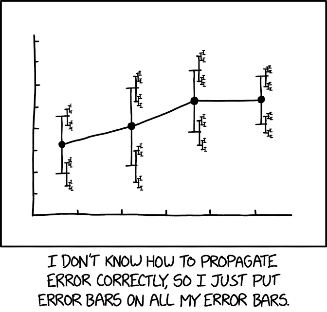
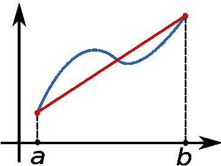

# 预测的麻烦在于

> 原文：<https://towardsdatascience.com/the-trouble-with-predictions-66e215c995bc?source=collection_archive---------41----------------------->

## 我们甚至能决定哪个预测模型是最好的吗？

> 所有的模型都是错的，但有些是有用的
> 
> —乔治·博克斯

各种流行病模型的预测正在推动至关重要的全球政策。但是他们的估计到处都是——那么我们该相信哪一个呢？

为此，我们需要了解导致差异或*误差*的各种来源。

为了预测，我们创建了问题的近似版本——模型，随之而来的是*建模误差*。例如，我们经常使用一个恒定的速度来估计旅行时间。

模型取决于参数，这些参数报告为一个范围，而不是一个确切的数字。新冠肺炎的再生数(R0)就是一个例子，根据最初的[世卫组织](https://www.who.int/news-room/detail/23-01-2020-statement-on-the-meeting-of-the-international-health-regulations-(2005)-emergency-committee-regarding-the-outbreak-of-novel-coronavirus-(2019-ncov))估计，其范围为 1.4-2.5。

现在，根据您的模型的非线性程度，这些参数中即使很小的差异也会导致感兴趣的结果发生很大的变化。对于某些问题，可以使用[不确定性量化](https://en.wikipedia.org/wiki/Uncertainty_quantification#Forward_uncertainty_propagation)将输出中的这个范围*传播*。

来源: [xkcd —“误差线”](https://xkcd.com/2110/)

我们的模型可以基于方程式(*确定性的*)或使用数据(*统计性的*)。给定输入参数计算输出涉及某些近似。

例如，在确定性方法中，如果我们使用方程将事物建模为时间的函数，我们将问题分解为区间并获得每个区间的解。

在统计方法中，例如，使用神经网络，我们为要评估的原始函数创建一个近似值。

有时，计算本身可以是近似的，比如说，通过减少因变量的数量和求解一个更小的输出系统。

以上三个误差来源都是在产量计算过程中累积的，称为*数值误差。*请注意，这只能在对用于评估的函数和算法进行严格假设的情况下进行估计。

“梯形法则”是数值误差的一个简单例子(来源:[维基百科](https://en.wikipedia.org/wiki/Trapezoidal_rule#/media/File:Trapezoidal_rule_illustration.svg))

因此，误差可能来自几个来源，并且最多只能对涉及的一些步骤进行量化。然而，大多数建模工作都遵循“有总比没有好”的原则。

接下来的问题是

"[未知的未知](https://en.wikipedia.org/wiki/There_are_known_knowns) " —一旦因变量被列出，总有可能出现新的变量，这些变量尚未被考虑甚至定义，但对结果至关重要。

当所有的模型都是“错误”的，而有些是有用的，我们如何确定使用哪个模型呢？

公司受到金钱激励的驱动，对“有用”有明确的定义。选择随时间最大化效用度量(金钱)的模型。

在“有用”没有明确定义的研究环境中，一种方法如何比另一种方法更有价值？引用，资金，肌肉？

建模的圣杯应该是**“健壮+精确”**模型——那些对参数和底层方法不太敏感的模型。

它的几种实现可能在底层细节上有所不同，但该模型将因可再现性、一致性以及最重要的可靠性而受到青睐，因为准确性在重复时也得到了保证。

总的来说，预测应该更倾向于使用很少或没有可调参数的模型，并在广泛的输入范围内用测量值进行匹配验证。