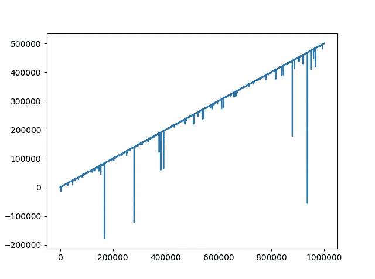
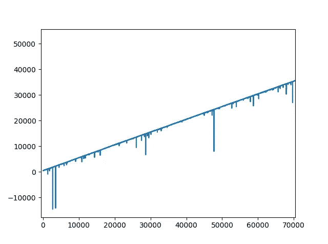

# 轮盘赌中的鞅打赌系统

> 原文：<https://towardsdatascience.com/the-truth-about-the-martingale-betting-system-499c30467af1?source=collection_archive---------7----------------------->


罗伯特·阿纳奇在 [Unsplash](https://unsplash.com?utm_source=medium&utm_medium=referral) 上的照片

## 关于...的真相

## 应该拥抱还是避免，为什么？

最近，我偶然发现了一则脸书的广告，上面写着:“在家轻松赚钱|月薪 7000€”。因为我目前的工资远远低于这个数字，所以我很好奇。只有傻瓜才会拒绝，对吧？

他们不仅提供了更高的薪水，而且灵活的工作时间也摆在桌面上:基本上每个小时的预期收入是 50 欧元。许多方面使我认为这是一件合法的事情，例如:

*   我应该得到**免费培训**来了解他们的软件。
*   他们有一个简短的演示视频，重点是“赚钱”、“在家工作”和“提供通向成功的培训”，但它从来没有说这整个事情是怎么回事。
*   为了透明起见，他们在合作伙伴计划中列出了前 5 名每日和每月会员。

没有先谷歌一下，我就注册并开始了我的训练。大概花了 3-5 分钟，直到**我意识到这都是关于轮盘赌的系统下注**。几年前，我看过一些脸书的广告，每次我都试图看穿这个策略本身。主要是关于一个简单的赌场游戏(如轮盘赌)和一个鞅赌博系统。

## 什么是鞅策略？


[澳门图片社](https://unsplash.com/@macauphotoagency?utm_source=medium&utm_medium=referral)在 [Unsplash](https://unsplash.com?utm_source=medium&utm_medium=referral) 拍摄的照片

在轮盘赌中，总是有可能对有 50%可能性发生的事情下注:偶数/奇数，红/黑牌，1–18/19–36。鞅系统如下:

你应该从一个小数目开始，比如说 1€，然后一直下同样的注，直到你输了。当这种情况发生时，在下一次旋转中将赌注加倍(2€)。如果您赢了，那么您将**收回您在上一轮**中输掉的钱，并且**赢得一点额外的**。如果你坚持输的路线，就继续加倍你的赌注，逻辑保持不变——例如，如果你连续输了 7 次(相当于输了 127€)，那么**你下一次赢 128€应该意味着你根本没输什么**。请记住，一旦你赢了，你应该重新开始，并为下一次旋转再次下注 1€，并重复整个过程。

## 关于该战略的流行观点

对此可能有两种不同的流行观点:

> 你永远不会失去你所有的钱，只要你有无限的钱。

和

> 在轮盘赌中，下同样的赌注不可能连续输 10 次。

在我看来，**你不可能有无限多的钱**，而且在下同样的赌注时连续输 10 次以上也是有可能的(事实上它的概率应该低于 0.1%)。为了证明这一点，我用 Python 做了一些模拟，结果如下。

> 我以科学的名义发誓，我提供的证据将是事实，全部的事实，除了事实没有别的。

## 关于模拟

```
from random import *def roll():
    result = randint(1,36)
    results.append(result)results = []
for i in range(1000000):
    roll()
```

该脚本在一秒钟内模拟 1000000 个轮盘赌结果。在每次模拟中，会随机选取一个介于 1 和 36 之间的整数。我已经故意掉 0 输了 [**屋沿**](https://knowyourodds.net.au/house-edge/) 。因此，我们有 50%的机会“赢”，而不是 48.6%或 47.4%，这取决于你玩的轮盘赌。

每个结果都存储在一个名为`results`的列表中，这是我们接下来要分析的。让我们添加另一层代码:

```
def oddeven():
    global results
    resultscopy = results
    for i in range(len(resultscopy)):
        if resultscopy[i] % 2 == 0:
            resultscopy[i] = "even"
        else:
            resultscopy[i] = "odd"
    print(resultscopy)
```

这将获取我们之前创建的结果列表，并创建另一个列表，其中的数字根据其值被替换为“奇数”和“偶数”。`resultscopy`的内容应该是这样的`[“odd”, “even”, “even”, “even”, “odd”, “odd”]`。

因此，当我们玩这个虚构的轮盘赌 100 万次时，我们应该得到一个包含 100 万个元素的列表，这些元素要么是“奇数”，要么是“偶数”。很酷，对吧？

现在我们应该研究这个列表，同时计算我们可以连续得到的“奇数”和“偶数”的数量。

```
def streakcounter(results):
    streak = []
    prevelem = results[0]
    counter = 1
    for i in range(1, len(results)):
        if results[i] == prevelem:
            counter += 1
        else:
            streak.append(counter)
            counter = 1
        prevelem = results[i]
```

该函数遍历包含赔率和事件的列表，并对连续结果进行计数。这样，一个列表:

```
results = ["odd", "odd", "even", "odd", "odd", "odd", "odd", "even", "even", "even", "odd", "even", "odd", "even", "odd", "odd", "even", "odd", "odd"]
```

会转变成:

```
streak = [2, 1, 4, 3, 1, 1, 1, 1, 2, 1, 2]
```

由于开始时有两个奇数，然后是一个偶数，然后是四个奇数，依此类推…让我们在代码中再增加一点来获得可读的统计数据:

```
d = defaultdict(int)
for elem in streak:
    d[elem] += 1
keys = list(d.keys())
keys.sort()                 #results should be ordered
for key in keys:
    print(str(key)+": "+str(d[key]))
```

这将创建一个字典，并计算在 1，000，000 次模拟中出现的奇数条纹或偶数条纹的数量。结果令人着迷:

```
1: 250255
2: 124910
3: 62309
4: 31430
5: 15523
6: 7731
7: 3989
8: 1965
9: 989
10: 495
11: 230
12: 132
13: 60
14: 26
15: 16
16: 8
17: 7
18: 1
19: 1
```

当连续玩 1，000，000 次轮盘赌时，可能连续出现相同的 **19** 结果。想象一下，使用上面描述的鞅系统，连续输了 19 次。你的第 20 次下注必须是你最小下注的 524，288 倍。你能负担得起吗？

*注意:在这种极端情况下，牌桌限制会阻止玩家下天文数字般高的赌注，因此在连续输了一定次数后，鞅策略就会失败。*

# 玩弄金钱

我们再增加几个步骤，假设我们在这个模拟中有钱。最小的赌注是 1€，普通的乔开始玩 500€。在 python 中，我们应该添加一些全局变量并重新定义我们的`oddeven()`函数。

```
money = 500
moneylst = []   #for keeping track of our money after each gameminbet = 1      #our smallest bet
bet = 1         #our first bet (this variable will change its value                            #                over time)def oddeven():
    global results, money, bet, minbet
    resultscopy = results
    for i in range(len(resultscopy)):
        if resultscopy[i] % 2 == 0:
            resultscopy[i] = "even"
            money += bet
            bet = minbet
        else:
            resultscopy[i] = "odd"
            money -= bet
            bet *= 2
        moneylst.append(money)
```

在一个理想的世界里，你永远不会期望你的钱低于 0。让我们进行 1，000，000 次模拟，并画出每场比赛后我们会得到的钱数。



轮盘赌模拟:手头的钱与游戏的数量



哦不！似乎有三个极端的峰值表明我们的钱降到了零以下。

> “但这发生在第 18 万场比赛之后。不会对我有任何影响。”

1.  这些极端的峰值可能随时随地发生。一个人可以带着如此糟糕的“运气”开始他们的赌博之旅，然后旅程结束。
2.  目光敏锐的人可能会注意到，钱数三次以上都低于零。没错，在第二张图中，我放大了模拟的开始部分。在 1，000，000 次模拟中，钱的数量正好六次低于零，第一次是在第 1300 个游戏中。

之前提到过，如果你有很多钱(或者无限多的钱)，鞅系统会完美地工作。如果可以定义这样一个量，这是真的。在写这篇文章之前，我的一个模拟显示了 25 次的连败——你需要 3350 万才能在第 26 次下注时恢复过来。我相信大多数读者甚至没有勇气下这个赌注。

如果你想知道我是不是在展示几次尝试后得到的结果，那么是的。我试图在几次尝试中得到我能得到的最好的数字，但是我可以向你保证，每次脚本被执行时，普通的乔就破产了。我添加了一些额外的代码来说明这个模拟是如何进行的:如果金额低于 0，则为“错误”，如果从未发生，则为“成功”:

```
moneylst.sort()
if moneylst[0] < 0:
    print("Fault!")
else:
    print("Success!")
```

为了多次运行这个脚本(在本例中是 100 次)，创建了一个批处理文件:

```
[@echo](http://twitter.com/echo) OFF
FOR /L %%y IN (1, 1, 100) DO python roulette.py
PAUSE
```

100 次执行 1，000，000 次轮盘赌模拟只花了我电脑不到两分钟的时间。在这 100 人中，没有一个是成功的。

# 修改参数

如果我们稍微修改一下这些参数会怎么样？假设我们的普通乔在开始时有 5000 欧元，并决心在一周内每天玩 1000 场游戏(总共 7000 场游戏)。为了确保万无一失，让我们执行 10 次，并以表格形式显示结果:

```
+------------+-------------+-------------+---------------------+
| Simulation | Success (%) | Failure (%) | Highest revenue (€) |
+------------+-------------+-------------+---------------------+
|          1 |          68 |          32 |                3579 |
|          2 |          72 |          28 |                3588 |
|          3 |          64 |          36 |                3640 |
|          4 |          62 |          38 |                3605 |
|          5 |          67 |          33 |                3581 |
|          6 |          64 |          36 |                3597 |
|          7 |          67 |          33 |                3595 |
|          8 |          64 |          36 |                3584 |
|          9 |          65 |          35 |                3594 |
|         10 |          66 |          34 |                3585 |
+------------+-------------+-------------+---------------------+
```

正如你已经看到的，有了这些设置，一个普通的乔在周末会有 66%的机会剩余一些钱，最高可能的收入大约是 3600€。

# 结论

在轮盘赌中使用鞅赌博系统会毁掉你的钱包，因此首先避免它是明智的。最初的钱数、成功率和一个人愿意玩的游戏数量之间确实存在关联。然而，如果某件事发生的几率是 1:1000，那么它可能会在第一次、第 1000 次、第 2000 次尝试中发生。你只是不知道，什么时候。

请记住，房屋边缘被有意忽略。在现实生活中，它会对你不利。