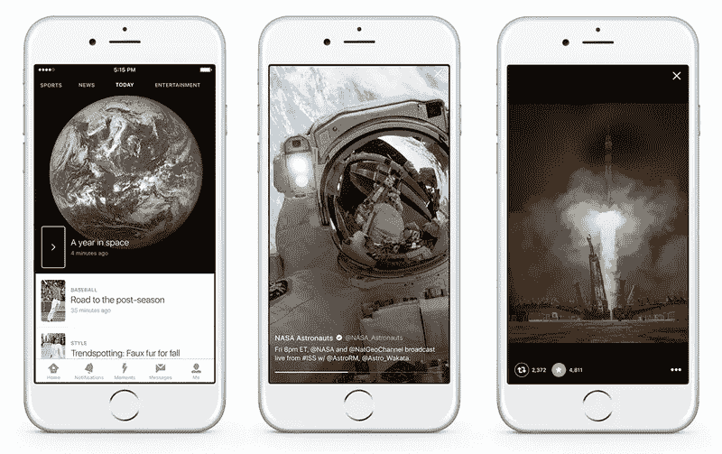
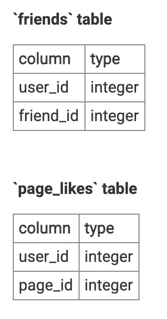

# Twitter 数据科学家访谈

> 原文：<https://towardsdatascience.com/the-twitter-data-scientist-interview-62a4443b65a6?source=collection_archive---------12----------------------->

## T 维特数据科学面试问题

推特采访

Twitter 因其新闻和辩论而闻名，并拥有世界短信之王的称号。它由杰克·多西、诺亚·格拉斯、伊万·威廉姆斯和比兹·斯通于 2006 年创建，现已发展到每月拥有超过 3.21 亿活跃用户，每天有 16 亿次搜索查询。

除了是最大的科技公司之一，Twitter 还拥有世界上最大的实时数据集之一**。为了管理如此大量的数据，Twitter 有一个专门的数据科学和分析团队，他们采用先进的分析和机器学习工具来改进他们的产品和功能，以便在他们的订阅源上提供更相关的内容。**

# ****数据科学的作用是什么？****

**Twitter 的数据科学家职位分为数据科学家和研究科学家两个角色。Twitter 的数据科学角色是量身定制的——特定于他们被分配到的团队。每个 Twitter 的数据科学角色也各不相同。Twitter 的数据科学家工作角色在很大程度上取决于他们在特定功能或服务中被分配到的团队，该角色可能从基于分析的角色到模型设计和构建重型机器学习系统。**

## ****所需技能****

**像大多数大型科技公司一样，Twitter 更喜欢只雇佣至少有 2 年以上经验(高级数据科学家有 5 年以上经验)的技术人员，他们在数据基础设施或后端系统方面有一些经验。这意味着**拥有工程背景或了解数据系统是有帮助的**，除非该职位是特定于分析的。**

**其他基本资格包括:**

*   **计算机科学、统计学、数学、工程或其他定量学科的学士、硕士或博士学位。**
*   **具有处理/分析大型数据集和 Map Reduce 架构(如 Hadoop 和其他开源数据挖掘和机器学习项目)的经验。**
*   **在使用 Python、SQL、R、Sparks 或 using 等数字编程语言编写复杂数据流方面有丰富的经验。**
*   **对一种或多种面向对象的编程语言 Scala、C++或 Java 有深刻的理解。**
*   **熟练使用 Tableau 或 Zeppelin 进行分析、建模和数据可视化。**
*   **应用先进的统计技术来模拟用户行为，确定因果影响和归因，建立和基准度量的经验。**

## ****Twitter 的数据科学家有哪些类型？****

**Twitter 有一个数据科学和分析部门，研究科学家和数据科学家在各种团队中工作。无论是在**规模执法启发式团队、消费产品团队，还是家庭和探索团队，**这些团队中的数据科学家都使用最新、最先进的分析工具和机器学习模型来提供业务影响建议和改进产品。根据团队的不同，工作角色可能包括以下内容:**

*   **创建复杂的统计模型，用于学习和扩展流数据。**
*   **为标准和即兴数据挖掘功能创建和解释复杂的 SQL 查询。**
*   **解释和影响数据标签的众包和人工计算程序。**
*   **与产品和工程团队紧密合作，创建和评估数据驱动的产品路线图**

# ****面试流程****

****

**推特时刻。尝试在每次面试前使用该应用程序。**

**Twitter 数据科学面试是非常标准化的。一般来说，面试过程从基于简历的招聘电话筛选开始。之后是与招聘经理的简短技术面试，然后是与 Twitter 数据科学家的技术筛选。最后，最后一次面试将由 5 至 6 名面试官现场面试组成。**

## ****电话筛选****

**最初的电话屏幕应该持续 10 到 30 分钟。你会被问到很多问题，从技术技能到过去的经验以及你对 Twitter 的了解。招聘人员还将回答问题，解释 Twitter 的数据科学团队是如何运作的，同时评估你目前的经历是否适合 Twitter 的团队。**

## ****技术筛选****

**在最初的电话面试后，下一轮是由数据科学家进行的技术筛选。面试中的问题可能涉及机器学习理论、**注重实验的产品直觉**，以及基于 SQL 或 Python 的编码。确保研究 Twitter 产品如何工作，并思考与如何**从基于实验的测试中得出结果**相关的问题。**

**技术屏幕问题示例:**

*   ***你会使用哪些特性来为 Twitter 用户构建推荐算法？***
*   ***假设我们想推出一个新的推送通知系统，看看能否留住更多用户。我们将如何着手做这件事？***

## ****现场面试****

**现场采访流程包括**与 5 到 6 个人(通常是来自 Twitter 的数据科学家和数据工程师)进行一对一采访**，每次持续 45 分钟。这次面试将需要白板编码以及算法问题，范围可能从机器学习到统计/概率和基于产品的问题。**

*   **统计和概率面试(主要是案例分析)**
*   **机器学习和实验建模系统面试**
*   **产品直觉(案例研究)**
*   **数据结构和/或系统设计面试**
*   **午餐时采访一位数据科学家**
*   **主要围绕以往经验和文化契合度的行为面试**

**现场面试结合了广泛的技术概念。学习实验和 A/B 测试设计问题、SQL、机器学习问题和产品类型问题。**

> **[*面试查询上试试下面的数据科学题*](https://www.interviewquery.com/questions/liked-pages) *:***

****

> **假设我们想要构建一个简单的推荐器。我们有两个表，一个表叫做“friends ”,其中 user_id 和 friend_id 列代表每个用户的朋友，另一个表叫做“page_likes ”,其中 user_id 和 page_id 代表每个用户喜欢的页面。**
> 
> ***编写一个 SQL 查询来创建一个指标，根据每个用户朋友喜欢的页面为他们推荐页面。***
> 
> **注意:它不应该推荐用户已经喜欢的页面。**

# ****Twitter 数据科学面试问题示例****

*   ***你会在 Twitter 应用程序中改变什么？你如何测试提议的改变是否有效？***
*   ***设计一个系统，找出最近 1 分钟、10 分钟、1 小时内的前十个 twitter 标签***
*   ***鉴于 Twitter 的所有分析和跟踪数据，您将如何衡量用户参与度？***
*   ***用 SQL 编写一个查询，以测量广告在 moments 和 news feed 中的浏览量。***
*   ***给定一个带有用户代码和计数的两列文件，根据一个分数检索前 k 个用户，该分数是这些用户在文件中出现的次数和这些计数的函数。***
*   **给定格式为 123，345 的所有关注者列表；234, 678;345, 123;…其中第一列包含关注者的 ID，第二列是被关注者的 ID，查找所有共同关注者(上例中的 123，345 对)。当这个列表不适合存储时，执行相同的操作。**
*   **如果你在 Twitter 得到了这份工作，并且可以访问它的所有数据，你想进行哪种数据分析？**
*   **如何用 SQL 查询说明一个基于树的系统？**

# **感谢阅读**

*   **对更多 Twitter 面试问题及其解决方案感兴趣吗？查看[上的问题**面试查询**。](https://www.interviewquery.com/)**
*   **查看我的 [**Youtube 频道**](https://www.youtube.com/channel/UCcQx1UnmorvmSEZef4X7-6g) 了解更多数据科学面试技巧、提示和模拟面试示例！**
*   **如果你对更多数据科学指南感兴趣，请查看 [**谷歌**数据科学面试](https://www.interviewquery.com/blog-the-google-data-scientist-interview/)、 [**脸书**数据科学面试](/the-facebook-data-scientist-interview-38556739e872)和 [**Snapchat** 数据科学面试问题](https://www.interviewquery.com/blog-snapchat-data-science-interview-questions-and-tips/)。**