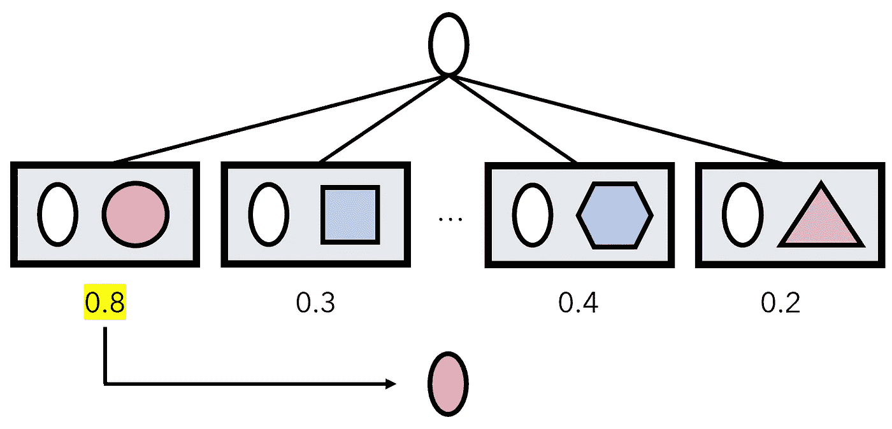
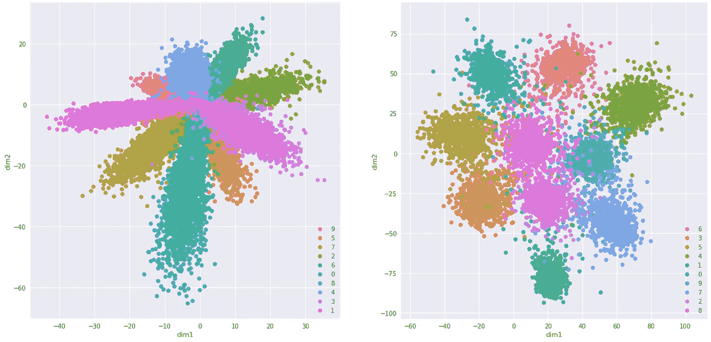

# 双头神经网络抖动图像识别

> 原文：<https://towardsdatascience.com/the-two-headed-neural-network-shaking-up-image-recognition-8c3c7093d61b?source=collection_archive---------25----------------------->

来源: [Unsplash](https://unsplash.com/photos/4Mu2bXIsn5Y)

## 暹罗网络的魔力

深度神经网络有一个大问题——它们不断渴求数据。当数据太少时——这对于其他算法来说是可以接受的数量——深度神经网络很难推广。这种现象凸显了人类和机器认知之间的差距；人类可以通过很少的训练样本来学习复杂的模式(尽管速度较慢)。

## 对像我们一样思考的机器的需求

虽然[的自我监督学习](/the-fascinating-blueprint-for-efficient-ai-self-supervised-learning-954f919f0d5d?source=---------12----------------------------)研究正在发展完全不需要标签的结构(标签巧妙地在训练数据本身中找到)，但它的用例是有限的。

[半监督学习](/supervised-learning-but-a-lot-better-semi-supervised-learning-a42dff534781)，另一个快速发展的领域，[利用通过无监督训练](/the-intuition-and-applications-behind-autoencoders-variants-4afcd45559d4?source=your_stories_page-------------------------------------)学习的潜在变量来提高监督学习的性能。这是一个重要的概念，但它的范围仅限于无监督与有监督数据比率相对较大的情况，以及未标记数据与标记数据兼容的情况。

也许一个想法概括了所有的想法——开发方法和架构，充分利用有限的标记数据；让机器更像人类一样思考。一个正式的名称是*元学习*，通常被称为‘学会学习’。

元学习和自然语言处理中使用的一个常用术语是“少击学习”或“零击学习”。这些指的是能够识别*新的*概念，而很少或没有(分别)数据事先教导模型该概念。零起点学习的一个例子是在接受英语到法语和法语到德语的翻译任务培训后，将从英语翻译成德语。

## 暹罗网络

让我们看看一个需要少量学习的机器学习任务，以及暹罗网络的独特架构如何实现它。我们的训练数据由十个形状组成，属于四种形状类型之一。我们每个类的数据量很少，但我们希望能够归纳和识别新的形状。

这就是了。我们的数据集有 10 个形状。| *作者创建的图像*

连体神经网络测量*两个*输入属于同一类别的概率。在这个意义上，它不直接输出任何一个输入的类；相反，它把对一个输入的理解建立在与另一个输入的明确关系上。将产生以下数据来训练模型:

*作者创建的图像*

因此，对于数据集中的 *n* 个样本，可以在`(*n*² − *n*)/2`个唯一的输入对上训练连体网络(每个输入之间的`*n*²`个可能的配对，两个相同样本之间的`*n*`个配对，`/2`说明`a&b`和`b&a`被计为单独的组合)。

然后，在对某个输入 *a* 进行预测的过程中，暹罗网络对数据集中的每个样本 *x* 对( *a* ， *x* )进行预测。 *a* 的类别是产生最大网络输出的数据点 *x* 的类别。

方框表示通过算法的预测，数字表示输出。| *作者创建的图像*

暹罗网络采用两个输入，并通过嵌入函数将它们(分别)编码成特征向量，嵌入函数由几个卷积层组成。这两个特征向量通过“距离层”合并，该距离层简单地计算 [L1 差](/exploring-the-simple-satisfying-math-behind-regularization-2c947755d19f?source=your_stories_page-------------------------------------) `|f1-f2|`。或者，也可以通过 [L2](/exploring-the-simple-satisfying-math-behind-regularization-2c947755d19f?source=your_stories_page-------------------------------------) 和余弦等计算距离。输出是距离向量的 s 形压缩线性组合。

来源:[暹罗网论文](http://www.cs.toronto.edu/~rsalakhu/papers/oneshot1.pdf)。图片免费分享。

值得一提的是，在这种情况下，“嵌入”实际上只是原始输入层的编码表示，具有卷积神经网络的传统元素，如卷积层和池层。使其成为嵌入的是，获取嵌入点之间的距离，并对其进行处理以形成输出

*注:嵌入被定义为映射点之间的距离有意义的空间；例如，在 NLP 嵌入中，单词“man”和“boy”在空间中应该在物理上比例如“man”和“purple”更接近，这两个词几乎没有关系。

暹罗网络得名于连体双胞胎，或出生时身体相连并看起来有两个头的双胞胎。鉴于暹罗网络的出现，这是有道理的。

暹罗网络的一个关键部分是，虽然有两个“头”来编码两个输入，但它们共享相同的权重。这有道理； *f* ( *a* 、 *b* )应该运行与 *f* ( *b* 、 *a* )相同的内部动力学。无论输入的顺序如何，编码过程都需要相同。

可以说，暹罗网络将更多的结构放入图像识别过程中。卷积神经网络更加无忧无虑:“这是一个庞大的架构，你想做什么就做什么”；暹罗网络将图像映射到嵌入(确定图像中的关键特征)，通过嵌入计算距离(直接比较两者)并解释以产生结果。

## 暹罗网络背后的直觉

从根本上说，暹罗网络代表了我们如何看待图像识别的转变。当机器将它们对概念的理解建立在彼此相关的基础上时——而不是像传统的图像识别那样从零开始构建表示——它们可以用更少的数据进行学习。

这很可能解释了为什么人类能够在很少训练的情况下识别和学习概念。我们通过复杂的层级和相互交织的关系来存储信息:一个橙子类似于一个苹果，但与一辆汽车有着天壤之别。当一个新概念与已有概念联系起来描述时，学习效率更高。

作为另一个类比，考虑以下一系列数字:2101、2102、2099、2101、2097、2100、2095。继续——在继续向下滚动之前，试着记住它。很难！

幸运的是，有一种更有效的方法来记忆这组数字:把每个数字和前一个数字联系起来。如果我们记住第一个数字是 2101，我们只需要记住 1，-3，2，-4，3，-5。与其处理复杂而庞大的概念，不如建立一个概念与另一个概念之间的关系更有效。

## 实际应用和讨论

通过数据增强，暹罗网络可以用于一次性学习——学习仅给定一个训练示例的概念。例如，人们可以对图像进行小的旋转、移动和缩放；由于数据集大小以 *n* 的速率增长，这提供了大量信息。

来源:[暹罗网论文](http://www.cs.toronto.edu/~rsalakhu/papers/oneshot1.pdf)。

此外，它们可以用于验证问题(将两张脸识别为同一个人、两个指纹、两个手写签名等)。)—事实上，许多最先进的实时人脸识别系统都采用了连体神经网络。在这项任务中，这些网络优于标准的图像识别架构，后者在处理大量类别(我们谈论的是数万人)时有巨大的困难。

一般来说，连体网络可以很好地处理阶层失衡。这使得它对像图像识别这样的任务很有吸引力。这部分可以归因于嵌入的结构化性质；另一方面，在巨大的卷积网络中，无关紧要的学习往往会被过滤掉。

通常，答案是简单地使[卷积神经网络](/how-to-systematically-fool-an-image-recognition-neural-network-7b2ac157375d)更大，但是网络的持续超大型化正接近实际极限。

重要的是要认识到，尽管预测过程可能看起来很长-循环通过数据中的每个样本-除了暹罗网络是在小数据集上训练的这一事实之外，通常暹罗网络需要较小的架构，同时发展强大的理解能力。此外，在实践中，项目的嵌入通常是预先计算和缓存的，因为它们的值经常被使用。

它们还可以用于排序问题，其中网络输出的不是两个输入是否在同一类中，而是第一个输入的排序是否高于第二个输入，以及相似性问题(如测量两个摘录的内容)。

此外，暹罗网络可以适用于任何数据类型，包括图像以外的数据类型，如文本和结构化数据。

有趣的是，暹罗网络产生了非常非常好的嵌入。它们比其他[成熟的流形学习方法](/manifold-learning-t-sne-lle-isomap-made-easy-42cfd61f5183?source=your_stories_page-------------------------------------) [如 t-SNE 和 IsoMap](/manifold-learning-t-sne-lle-isomap-made-easy-42cfd61f5183) 更昂贵，但却是一个很好的辅助结果。这可能是其独特架构的结果。

[左](https://qph.fs.quoracdn.net/main-qimg-d1fd949737da3ecf2e2e9013f5c005ff)，[右](https://qph.fs.quoracdn.net/main-qimg-9b637f7f554ff5c8adb4e9345dfb5813)。来源:桑德拉·库马尔。图片免费分享。

## 摘要

*   目前的深度学习解决方案需要太多的数据。有像自我监督和半监督学习这样的努力可以作为创可贴，但更深层次的问题是机器不会像人类一样思考。元学习寻求让人工智能学会学习。
*   暹罗网络接收两个输入，使用与嵌入相同的权重对它们进行编码，解释嵌入中的差异，并输出两个输入属于同一类的概率。
*   连体网络能够更有效地学习，因为它们在以前的学习中建立了新的概念，而不是盲目地从头开始学习每个新的想法。这就是为什么常规规模的神经网络在处理大量类别的任务时会失败。
*   暹罗网络的一些优点包括每个类只有一个数据点的良好泛化能力，以及对类不平衡令人印象深刻的鲁棒性。

感谢阅读！在这里阅读暹罗网论文原文[。](http://www.cs.toronto.edu/~rsalakhu/papers/oneshot1.pdf)