# 混淆矩阵的两种变体

> 原文：<https://towardsdatascience.com/the-two-variations-of-confusion-matrix-get-confused-never-again-8d4fb00df308?source=collection_archive---------36----------------------->

## 记忆黑客记住它的两个变化和相关的公式


图片由 [HOerwin56](https://pixabay.com/users/HOerwin56-2108907/?utm_source=link-attribution&amp;utm_medium=referral&amp;utm_campaign=image&amp;utm_content=2667890) 来自 [Pixabay](https://pixabay.com/?utm_source=link-attribution&amp;utm_medium=referral&amp;utm_campaign=image&amp;utm_content=2667890)

你可能已经知道，关于如何显示混淆矩阵，有两种观点( [wiki](https://en.wikipedia.org/wiki/Confusion_matrix) vs [python](https://scikit-learn.org/stable/auto_examples/model_selection/plot_confusion_matrix.html?highlight=confusion) )。

对于每一个初学者来说，总有一个时候会看到“另一个”的变化，并歪着头去理解它。文献支持一种布局，而代码似乎支持另一种布局。

> 要了解混淆矩阵的基础知识，可以在这里看一下。

以下是各种变化:

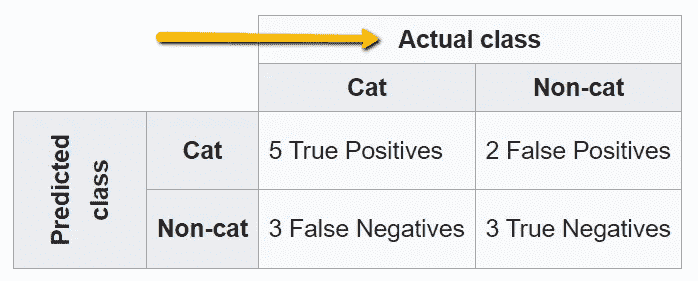

**透视图 1** : [实际(真)类为列](https://en.wikipedia.org/wiki/Confusion_matrix)

相比于:

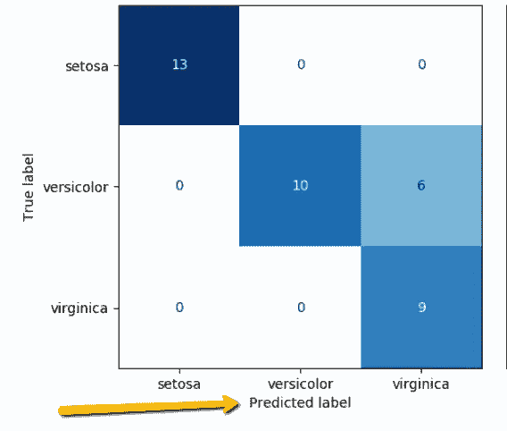

**视角 2** : [预测类为列](https://scikit-learn.org/stable/auto_examples/model_selection/plot_confusion_matrix.html?highlight=confusion)

这不是简单地交换行和列的情况，而是左上角的**真阳性**现在被**真阴性**取代的事实。

> 如果您使用内置的 scikit-learn 函数，如 [confusion_matrix](https://scikit-learn.org/stable/modules/generated/sklearn.metrics.confusion_matrix.html) ，您需要了解输入和输出布局，否则您对灵敏度(回忆)、特异性、精确度和 F1 分数的所有计算都将是错误的。

# 给我看看证据！

好的，让我们用一个实际的例子来说明这个问题，通过代码。

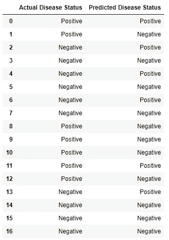

我们的数据集

这是我们 17 个人的医疗结果数据集。他们要么身体不适(测试结果为阳性)，要么身体健康(测试结果为阴性)。第一列显示它们的实际状态，而第二列是我们的算法预测的状态。用于生成以下内容的代码:

# 视角 1:


如果你像我一样，通过书籍和出版物学习了大部分统计数据，这些书籍和出版物中有大量医学领域的例子，那么实际值(或 [*黄金标准*](https://commons.wikimedia.org/wiki/File:Preventive_Medicine_Statistics_Sensitivity_TPR,_Specificity_TNR,_PPV,_NPV,_FDR,_FOR,_ACCuracy,_Likelihood_Ratio,_Diagnostic_Odds_Ratio_2_Final.png) )将作为列显示在顶部，而**真阳性**显示在左上角的单元格中。我们的数据集将如下所示:

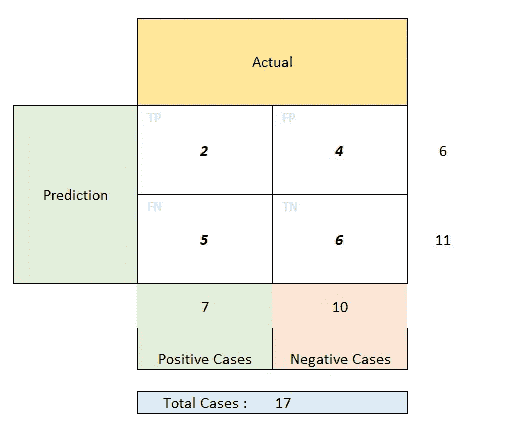

视角 1:实际值在顶部

下面是生成该代码的 python 代码:

```
cm = confusion_matrix(data.Predicted, data.Actual, labels=[‘**Positive**’, ‘Negative’])print(cm)
```

注意我们是如何先通过`data.Predicted`再通过`data.Actual`的。另外`labels`的顺序是先`Positive`。

输出:

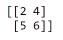

我的记忆黑客记住论点的顺序:

> 我只是按照一个人读英语的方式来读——从左到右*。而且我 ***肯定*** 这是一个人应该使用的布局。*

*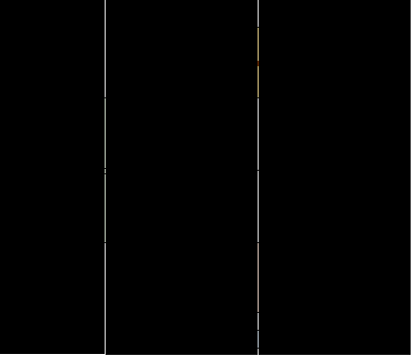*

*从左到右*

*要计算所有指标，可以使用 sklearn 的 [*分类 _ 报告*](https://scikit-learn.org/stable/modules/generated/sklearn.metrics.classification_report.html) 函数。*

> *我喜欢这个函数，因为不管你的观点是什么，实际的和预测的论点的顺序保持不变。您只需要指定不同的标签顺序。*

```
*report = classification_report(data.Actual, data.Predicted, labels=[‘**Positive**’, ‘Negative’])print(report)*
```

*总是先有*实际*，后有*预测*——按字母顺序排列，很优雅。它生成的输出是:*

*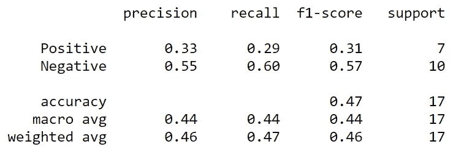*

*分类报告*

# *视角二:*

**

*那些通过编程文档和教程学习过的人讨厌上面的表示。总是反过来！*

*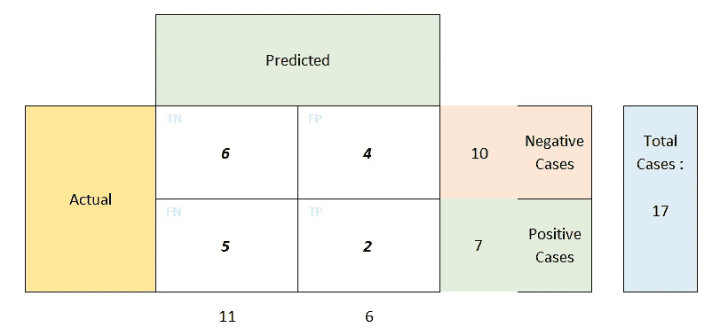*

*预测在最上面*

> *在 2x2 混淆矩阵中，无论您选择哪个视角，误报**和误报**和误报**的位置都保持不变。***

*记忆技巧保持不变，从左到右阅读，但这一次通过在`labels`论证中首先提到否定*和*来给予它们更多的重视。*

```
*cm2 = confusion_matrix(data.Actual, data.Predicted, labels=[‘**Negative**’, ‘Positive’])print(cm2)*
```

*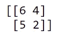*

*传统的*分类 _ 报告*保持不变，唯一的变化是标签的顺序:*

```
*report2 = classification_report(data.Actual, data.Predicted, labels=[‘**Negative**’, ‘Positive’])print(report2)*
```

*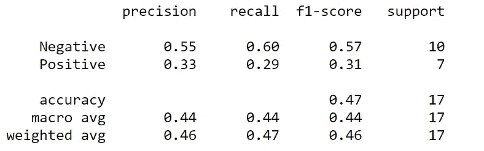*

*分类报告— 2*

*现在，两个结果完全同步了！*

# *附加提示—永远不要忘记公式:*

*我经常不得不查阅笔记来记住*精度*是什么意思，或者*灵敏度*(也称为*回忆*)的公式是什么。所以，这是我用来记住它们的记忆技巧。*

*首先，他们的实际公式，这样你可以很容易地联系起来。我在这里基于**视角 1** 来解释，但是如果你愿意，你可以很容易地为视角 2 改变它。*

*我喜欢先把它们按字母顺序排列，这样就不会把它们搞混了——1。 **P** 精度 2。 **R** ecall 3。特定性*

*精度= TP/(TP+FP)*

*召回= TP/(TP+FN)*

*特异性= TN/(TN+FP)*

*我的记忆黑客记住他们:*

*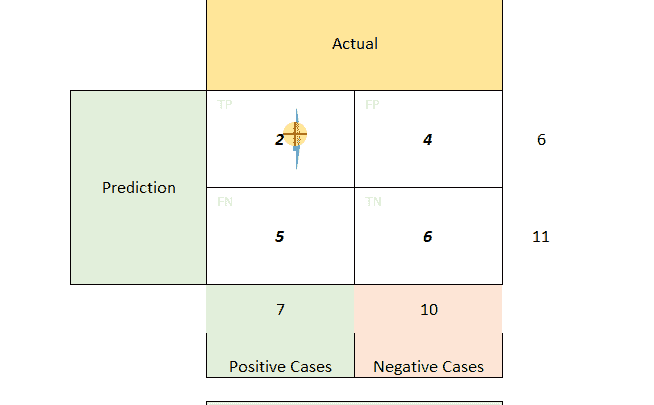*

*Precision 是第一个单元格除以行和:2/6 = 0.33*

*Recall 是第一个单元格除以列 sum: 2/7 = 0.29*

*特异性是最后一个单元格除以列和:6/10 = 0.60*

*就是这样！让我的生活变得简单了一点，希望对你也有帮助。你有什么对你有用的技巧和诀窍吗？请在评论区告诉我，或者单独给我留言。*

*对分享想法、提问或简单讨论想法感兴趣？在 [LinkedIn](https://www.linkedin.com/in/himanshu-chandra-33512811/) 、 [YouTube](https://www.youtube.com/channel/UChNybQwpqrX9SOc1D4K_x5Q) 、 [GitHub](https://github.com/HCGrit/MachineLearning-iamJustAStudent) 上或通过我的网站与我联系:[我只是一个学生](http://iamjustastudent.com/about)。*

*回头见&学习愉快！*

*[](https://www.linkedin.com/in/himanshu-chandra-33512811/) [## Himanshu Chandra —业务主管—ML AI

www.linkedin.com](https://www.linkedin.com/in/himanshu-chandra-33512811/)*