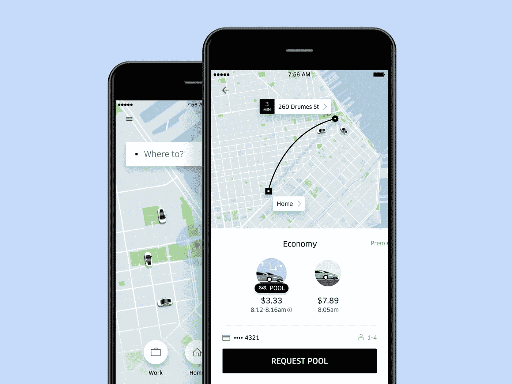
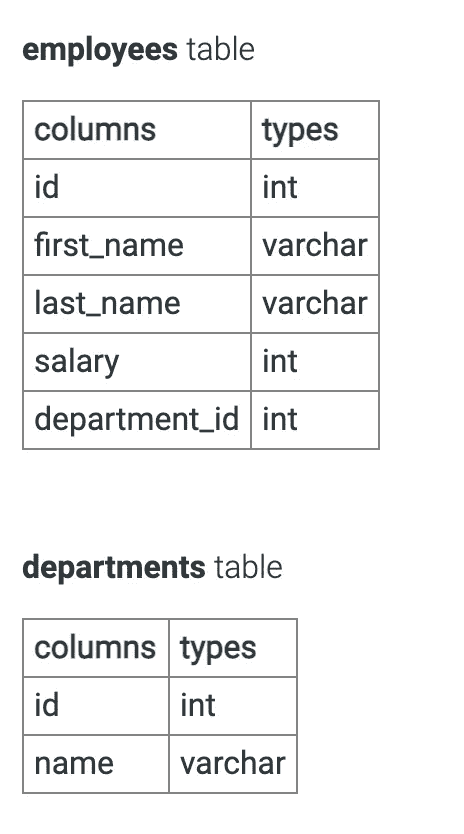
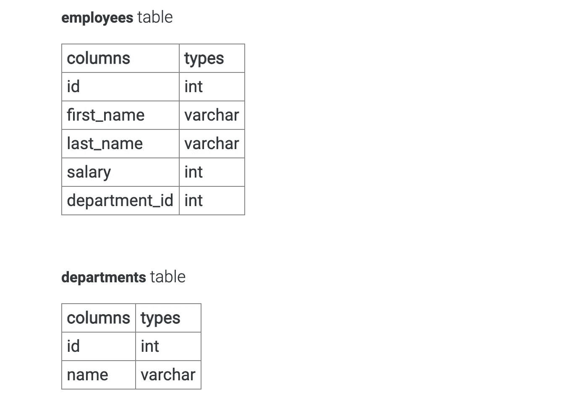

# 优步数据科学家访谈

> 原文：<https://towardsdatascience.com/the-uber-data-scientist-interview-7ba9ca95f4e3?source=collection_archive---------2----------------------->

## 优步数据科学面试问题

Tero Vesalainen/Shutterstock

优步是一家跨国叫车公司，在全球超过 785 个城市开展大规模业务。他们的服务范围从打车和送餐到物流和微型移动。优步的目标是:

> *通过自动驾驶技术和城市航空运输将未来拉近与客户的距离，帮助人们快速、经济地订购食品，消除医疗保健障碍，创建新的货运预订解决方案，并帮助公司提供无缝的员工旅行体验*。

为了实现这一壮举，优步已经慢慢地将数据科学和分析融入到几乎每个部门和服务中，例如风险管理、营销和政策实施。

# **优步的数据科学职位**

在优步，数据科学家的角色因团队而异。你作为数据科学家的角色将在很大程度上取决于你申请的团队。数据科学角色通常涵盖基本的业务分析、建模、机器学习和深度学习实施。优步是一家大公司，其数据科学团队在**安全和保险、乘车、风险、平台、营销科学、政策和优步吃饭**领域工作。

## **所需技能**

每个工作的要求取决于部门。然而，除非是助理职位，优步通常更喜欢雇佣至少有三年工作经验的合格候选人。

招聘的基本要求是:

*   统计学、数学、经济学、运筹学、计算机科学、物理学或任何其他相关定量领域的博士、理学硕士、理学学士或学士学位。(高学历是优势)。
*   在实验设计(A/B 测试优先)、探索性数据分析、统计分析和机器学习模型开发方面具有 3 年或以上的经验(高级数据科学家至少 10 年)。
*   精通至少一种编程语言，如 Python、Java、R 或 SQL。
*   具有构建管道和 ETL 的经验，可将大规模复杂数据集中的结构化和非结构化数据集(Hadoop、Hive、Vertica、Presto)转换为可操作的数据模型。

## **什么样的数据科学角色？**

优步有大量不同的数据科学团队，分布在公司的不同部门。优步大学的“数据科学家”头衔属于这两个团队——**数据科学**和**数据科学&分析**。

根据团队的不同，他们的职能可能包括:

*   **安全与保险**:实施机器学习算法，优化安全政策，帮助客户减少安全相关事故。
*   **核心客户:**预测和自动化优步核心拼车产品的每个方面。
*   **风险:**开发机器学习模型和策略，以遏制和管理市场滥用和支付欺诈。
*   **研究:**进行内部研究，以更好地了解市场环境并改进产品。
*   **营销科学:**应用统计建模、机器学习或数据挖掘技术，为优步的全球营销工作提供有价值的见解。

# **面试流程**

面试过程从招聘人员或招聘经理的初次面试开始，分别持续 15 分钟和 30 分钟。接下来是**优步带回家的挑战。**课后作业包括 **SQL 问题、实验/商业智能问题和数据分析问题**。接下来是 45 分钟的技术电话筛选，然后是带回家的挑战。技术屏之后是五位不同面试官的现场面试小组。

> 寻找更多关于 SQL 面试问题的帮助？看看我们的终极指南[这里](https://blog.interviewquery.com/blog-sql-interview-questions/)。

## **初始屏幕**

这是在你提交申请后与招聘经理或招聘人员的电话面试。这个面试是关于评估工作角色、团队和你的一般背景，可能是简单的技术面试。期待关于你过去经历的问题，以及它如何适用于优步。招聘经理也可能会问一些更高层次的技术问题，例如:

*   什么是营销归因？
*   你会用什么标准来衡量一个模型的有效性？
*   你会如何向一个非技术人员解释 p 值？

招聘经理通常会寻找危险信号。确保回顾一般建模和分析概念，并练习交流技术概念和项目。

## **带回家的挑战**

想要预览优步带回家挑战吗？在 [***上找到面试查询***](https://www.interviewquery.com/) *。*

*来源:* [*连线*](https://www.wired.com/2016/11/radical-redesign-makes-uber-feed-center-ride/)

完成最初的电话筛选后，您将收到一个带回家的挑战，您将有一周的时间来完成。带回家的作业包括三个部分:

*   Sql 和分析:你会看到一个带有模式的优步问题的例子。该问题将要求编写 SQL 来解决各种分析问题。
*   **定性部分:**关于度量评估和实验设计的一般问题。
*   **建模:**一个应用预测建模练习。

> [阅读我们的机器学习和建模面试问题指南](https://www.interviewquery.com/blog-machine-learning-interview-questions/)。

注意，这个带回家的挑战已经被优步标准化了。然而，根据团队的不同，他们可能会对团队特有的原始带回家挑战进行修改。

[**练习一道 SQL 面试题:**](https://www.interviewquery.com/questions/employee-salaries)

> 根据上面的表格，选择工资超过 100，000 的员工百分比最高的前 3 个部门，并且至少有 10 名员工。

## **技术屏幕**

流程的下一步是与数据科学家进行技术面试电话面试。大多数时候，这个采访中问的问题都是优步相关的案例研究，寻找一个开放式的回答。这里的目标是测试你的批判性思维和解决问题的能力。期待收到类似**特征选择和模型构建**的机器学习问题，重点是现实生活中的优步问题。如果这个角色更侧重于分析，你也可以期待一个基于产品的问题。

**技术屏幕中提问的 SQL 面试问题示例:**

[员工薪资面试查询问题](https://www.interviewquery.com/questions/employee-salaries)

> 根据给定的表格，选择工资超过 10 万美元且至少有 10 名员工的员工比例最高的前 3 个部门。

给你一个提示

在做任何事情之前，我们要做的第一步是理解问题问的是什么。让我们解码这个问题。

*根据年薪超过 100K 的员工的最高百分比选择前 3 个部门，并且至少有 10 名员工。*

把它分解开来，我们可以把它分成单独的条件子句

*   *排名前三的部门*
*   *%年薪超过 10 万的员工*
*   *部门必须至少有 10 名员工*

> [在此使用 SQL 编辑器尝试完整的 SQL 面试问题](https://www.interviewquery.com/questions/employee-salaries)

**例题优步面试试题:**

*   评估各种优步服务的绩效指标是什么？
*   如何调查分布中的某个趋势是由异常引起的？
*   你在有监督的机器学习中遇到过哪些问题，你是如何克服的？
*   你如何预测乘车需求？你如何评价优步的预计到达时间算法？

> 查看我们的指南[参加产品指标面试](https://www.interviewquery.com/blog-product-data-science-interview/)。

## **现场面试**

通过技术筛选后接下来就是现场面试了。现场面试包括 5 或 6 轮，每轮 45 分钟。这是一整天的面试，包括白板编码、与团队经理和数据科学家的项目讨论、业务案例研究和统计概念讨论。

面板通常看起来像:

*   对数据科学家的一对一采访。你会得到一些开放式的商业情报和分析问题，以及统计和概率问题。
*   对产品经理的行为面试。
*   一次招聘经理面试，深入了解优步，讨论团队。请务必在此提出深思熟虑的问题。
*   对数据科学家的技术机器学习采访。这次采访讨论了建模概念和机器学习设计问题。
*   与一位数据科学家长达 45 分钟的访谈，内容涉及 SQL 或算法编码。如果该角色在分析部门，则为 SQL 如果该角色在机器学习部门，则为算法。

请记住，最终目标是评估如何将**数据科学概念应用于优步相关的具体业务问题**。温习统计和概率、A/B 测试和实验设计以及建模概念的知识。

技术知识方面，记得练习编码和 SQL 练习题以及[面试查询](https://www.interviewquery.com/)上可以找到的问题。多练习这些问题有助于通过技术技能的基线水平。

> [查看我们的**SQL 面试问题终极指南**](https://www.interviewquery.com/blog-sql-interview-questions/)

# **优步数据科学面试问题**

*   向孩子、大学一年级学生和经验丰富的数学家描述线性回归。
*   假设我们推出了一个新的 Uber Eats 功能。你会选择什么作为关键指标？
*   你将如何为司机设计一个激励方案，使他们更有可能进入需求高的城市地区？
*   给定一个随机伯努利试验生成器，写一个函数返回一个从正态分布抽样的值。
*   你会用什么指标来跟踪优步利用付费广告获取客户作品的策略？你如何计算出一个可接受的获取客户的成本？
*   让一队车辆每天拍摄美国每个主要城市的谷歌街景照片的成本是多少？
*   构建文本包装器。例如，只在空格处用字符限制来分割一个长句子。
*   编写一个产品代码，在一个列表中查找所有总和为 8 的数字组合。
*   MLE 和 MAP 有什么区别？
*   线性回归的假设有哪些？
*   SQL 中嵌套的 SELECT 和 WITH 做什么？
*   你会用什么算法来预测司机是否会接受搭车请求？你会使用哪些功能？

# 感谢阅读！

*   注册 [**面试查询**](https://www.interviewquery.com/) ，每周在你的收件箱里获得几个数据科学面试问题。
*   **订阅 Youtube 上的** [**我的频道**](https://www.youtube.com/channel/UCcQx1UnmorvmSEZef4X7-6g/) 获取数据科学[模拟面试](https://www.youtube.com/watch?v=e2LJ-6NagpE)，指南，以及技巧和窍门。
*   在面试查询博客上找到更多数据科学面试指南，如 [**Python 数据科学面试**](https://www.interviewquery.com/blog-python-data-science-interview-questions/) 和[**DoorDash 数据科学家面试**](https://www.interviewquery.com/blog-doordash-data-science-interview-questions/) 。