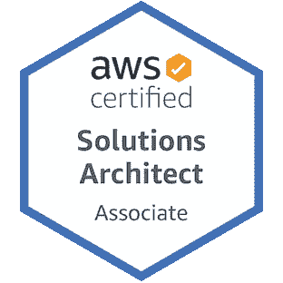

# 终极 AWS 解决方案架构师认证指南

> 原文：<https://towardsdatascience.com/the-ultimate-aws-solutions-architect-certification-guide-56c21d4078ed?source=collection_archive---------5----------------------->

## 柠檬榨汁机

照片由 [Pexels](https://www.pexels.com/photo/close-up-photo-of-sliced-yellow-lemon-on-white-surface-1414110/?utm_content=attributionCopyText&utm_medium=referral&utm_source=pexels) 的 [Lukas](https://www.pexels.com/@goumbik?utm_content=attributionCopyText&utm_medium=referral&utm_source=pexels) 拍摄

因此，您决定参加 AWS 解决方案架构师考试。绝妙的选择！你已经准备好提升你的职业水平，并深入 AWS 的迷人世界。

唯一的问题是你不知道从哪里开始，因为你从来没有准备这样的认证和/或没有 AWS 的经验。

**不要担心。不久前，我也遇到了同样的情况。**

在开始准备这次考试之前，我很少接触 AWS。我做过的最多的事情就是使用 S3 桶托管一个静态站点。

此外，我从未戴过解决方案架构师的帽子——至少在专业环境中是这样。

不到两个月后，我获得了认证。

那么，是什么让认证变得如此简单呢？在线学习资料。

当学习这些认证时，在线学习材料是一个游戏规则的改变者。它们会让你的生活变得更加轻松。

为了准备这次考试，我查阅了大量的资料，我挑选了一些能帮助你取得最好成绩的资料。

有些资源是免费的，有些则需要付费。我通常是免费资源的忠实拥护者，但是在这个领域，你需要为你得到的东西付费。每一分钱都是值得的。如果没有付费资源，该认证可能需要几个月才能获得。

你很幸运找到了这篇文章，因为它将改变你的生活！

注意:如果您正在寻找如何通过 AWS 云开发人员认证的提示，[请单击此处](https://medium.com/better-programming/how-to-become-aws-cloud-developer-certified-7318a67f7085)。

# 目标

帮助您通过 AWS 云解决方案架构师助理认证考试(SAA-C02)。

照片来自 [AWS](https://aws.amazon.com/certification/)

# 目录

*   [为什么要获得认证](https://medium.com/better-programming/how-to-become-aws-cloud-developer-certified-7318a67f7085#dd1f)
*   [资源](https://medium.com/better-programming/how-to-become-aws-cloud-developer-certified-7318a67f7085#3dd3)
*   [我的考试小贴士](https://medium.com/better-programming/how-to-become-aws-cloud-developer-certified-7318a67f7085#5de8)
*   [采取行动](https://medium.com/better-programming/how-to-become-aws-cloud-developer-certified-7318a67f7085#5838)

# 你为什么要获得认证

我认为这是一个难以置信的学习机会，事实证明也确实如此。在这两个月里，我能够对作为一名解决方案架构师应该知道的所有事情有一个全面的了解。

到目前为止，在我的职业生涯中，我只戴过“开发人员”的帽子，所以看到我所开发的应用程序是如何在企业范围内构建的是一件很有趣的事情。

它真正让你思考如何设计高性能、弹性、安全和成本最优的应用程序(是的，这是考试中测试的四个目标:)。

此外，所有内容都涉及基础设施、架构、开发、部署、监控、无服务器计算、安全性、最佳实践等。关于你能从这个认证中得到什么，这个清单还在继续。

如果学习的刺激对你来说还不够，AWS 认证助理和专业人员的平均工资远远超过 100，000 美元(cha-ching！).当然，认证不等于能力，但这肯定是一个好的开始。

# 资源

我尝试了很多学习资源。一对夫妇被证明是非常有价值的。我会按照有用的顺序把它们列出来。

## ACloudGuru

你可以在 Udemy 上购买这个[课程，也可以通过 ACloudGuru 学习门户网站购买。我在 Udemy 上花 13 美元买的。等着它打折吧——你不会想花 150 美元的。](https://www.udemy.com/course/aws-certified-solutions-architect-associate/)

对我来说，一个 CloudGuru 是一个完美的起点。他们会进行讲座和动手实验，这些内容丰富，会让你保持兴趣。

他们也尽力保持他们的内容是最新的。由于自动气象站的格局在不断变化，寻找当前的资源可能是一个挑战。

在我学习这门课程的过程中，有一个方法很管用，那就是先看部分摘要，然后再看所有的讲座。这种技巧有助于你专注于每堂课最关键的部分。

ACloudGuru 课程带来了社区。这是最好的资产之一。他们有一个论坛，人们在那里谈论他们的考试经历。如果不是这样，我永远也不会发现教程道场。

这里有一个[论坛帖子的例子](https://acloud.guru/forums/aws-csa-2019/discussion/-M4WKDTWGbqU-5fqB6iy/passed_the_new_aws_certified_s)，很有帮助。请务必阅读最新的帖子！

## 教程道场

[这个资源](https://portal.tutorialsdojo.com/courses/aws-certified-solutions-architect-associate-practice-exams/)，配合 ACloudGuru，会让你走完一半的路程。如果你已经有了 AWS 的经验，TutorialsDojo 本身就足以让你做好准备。

Tutorials Dojo 提供了近 400 道练习题，这些练习题明确地关注了本次考试的相关主题。

包裹大约 15 美元，这是我花过的最值的 15 美元。

Tutorials Dojo 不仅为您提供了大量的问题，还提供了令人难以置信的详细解释，说明为什么每个答案都是这个样子。

此外，它们还提供了相关 AWS 文档和备忘单的链接，有助于进一步解释这些概念。这些小抄对这次考试很有用。

## AWS 认证开发者官方学习指南

[这个学习指南](https://www.amazon.com/Certified-Developer-Official-Study-Associate-ebook/dp/B07WYR9XN5/ref=sr_1_3?dchild=1&keywords=AWS+Certified+Developer+Official+Study+Guide&qid=1588332164&sr=8-3)在我准备的早期阶段特别有帮助。它帮助我从概念上理解了许多核心服务。

是的，我知道这是开发者考试的学习指南。我参加了两个考试，因为两者之间有太多的重叠。这确实是一次从不同角度看同样内容的考试。

这种资源的价值就是内容物的可消化性。它的写作方式提供了极好的技术深度和最小的模糊性。AWS 文档和白皮书有时可能有点难以理解。这份学习指南提供了一个抽象层，没有遗漏任何细节。

然而，我要说的是，本学习指南中的一些复习问题有点过时了。但是没有所谓的浪费知识。知道这些真好。有时，了解历史背景会对当前的思想和方法有更深的理解。

我可以通过我在工作中订阅的 O'Reilly Learning 免费得到这个。如果你没有这个，在亚马逊上是 33 美元。如果你不想花这笔钱，不用担心，没有这笔钱你也能成功。

此外，O'Reilly 学习门户网站通过 Pearson 提供了一个很好的实践考试。我强烈建议去看看。

## AWS 文档和白皮书

如果你曾经对某个特定的主题或概念感到困惑，最好的方法是从源头上消除这种困惑。

AWS 文档和白皮书是您可以找到的最新资源。我之前列出的所有材料都来自这里。

我发现“最佳实践”和 FAQ 部分是最有用的。

[这位](https://aws.amazon.com/fsx/windows/faqs/?nc=sn&loc=8)，为亚马逊 FSx，负责考试上的三四道题。幸运的是，我在考试前通读了这篇文档！

永远警惕你从其他来源读到的任何 API 调用或限制。由于 AWS 千变万化，这些价值观也会随之改变。2016 年推荐的一个 API 调用现在可能被弃用。极限也是如此。AWS Lambda 函数过去的最大执行时间是 5 分钟，现在是 15 分钟。

文档是获得这类内容的最新信息的最佳地方。

## AWS 材料

我支付了模拟考试的费用，这主要是为了确保我学习了正确的内容。20 个问题 20 美元。值得吗？也许不是，但它给了我安排考试所需的信心。

您在练习考试中看到的问题与教程 Dojo 包中的问题非常相似。

同样，他们也不会告诉你哪些问题你做错了。他们只是给你每个部分的百分比(类似于他们如何呈现真实考试的结果)。

这个资源对我也很有帮助:[考试准备:AWS 认证解决方案架构师助理](https://www.aws.training/Details/Curriculum?id=20685)。它从不同的角度介绍了 AWS 核心服务以及类似于您在考试中可能会看到的练习题。

我不会说这些资源中的任何一个是在考试中取得好成绩的“必要条件”，但是看到对内容的不同观点总是好的。这直接来自考试的创造者。

# 我的考试技巧

学习，学习，学习你的核心服务！

我建议学习所有关于 EC2、VPC、IAM、ECS、DynamoDB、SNS & SQS、Lambda、API Gateways、CI/CD 工具、Kinesis、CloudFormation、CloudFront、CloudTrail、FSx、EFS、S3、EBS、负载平衡器等的知识。

从上面的列表中可以看出，我们非常重视计算服务以及每种服务可用的不同存储类型。

安全性在这次考试中也扮演了重要的角色。你不需要成为一个安全大师，但是你至少需要对它是如何工作的有一个坚实的理解。了解 IAM、Cognito、STS、VPCs、子网、安全组、网络 ACL 等。在这次考试中取得好成绩是必不可少的。[这份来自 Tutorials Dojo 的备忘单](https://tutorialsdojo.com/amazon-vpc/)有助于了解 VPC 和安全相关主题。

如果你参加 SAA-C02 考试，确保你所学的是最新的。Tutorials Dojo 帮助你了解这次考试将会出现哪些新服务。

一个合理的警告:情景型问题经常出现。这类问题测试您对特定服务或服务集合以及它们如何协同工作的全面了解。这更多的是一种应用理解，所以死记硬背在这里帮不了你。

如果你打算只记住教程 Dojo 练习题，我祝你好运。这不是正确的方法。花点时间了解每一项服务以及它们的功能。

这就是我敦促你尽可能多地获得实践经验的原因。虽然我自己没有使用过这个资源，但是我听说 Qwiklabs 在这方面非常出色。

了解所有关于 CloudWatch 的知识，以及如何在本地应用程序中使用它(这个特定的主题在考试中绊倒了我)。

# 采取行动

现在怎么办？你[报名](https://aws.amazon.com/certification/)并通过考试！

考试费用是 150 美元，你现在可以选择在自己家里参加考试。确保你去洗手间之前，因为他们不允许你离开你的工作超过两个小时。

你什么时候准备好？

几乎不可能知道你什么时候真正准备好了。对我来说，一旦我完成了 Udemy 课程(花了大约一个月的时间)，我就开始把考试安排在两周后。然后，如果我觉得还需要几天，我会重新安排并推迟考试(你可以在预定考试时间前 24 小时这样做)。

这个技巧给了我一点激情，也给了我追求它的动力。把钱记下来并记在我的日历上迫使我对自己负责。

在课程结束后和考试前的两个星期里，我什么也没做，只是通过参加 Dojo 教程上的实践考试和利用我上面提到的资源来巩固我从 Udemy 课程中获得的知识。

祝你好运！如果您有任何问题、意见或顾虑，请随时留下您的回复，我会尽快回复您。

# 赖安·格里森的更多故事

 [## 如何成为 AWS 云开发者认证

### 我是如何在只有很少 AWS 经验的情况下在短短六周内获得认证的

medium.com](https://medium.com/better-programming/how-to-become-aws-cloud-developer-certified-7318a67f7085)  [## 我如何使用 AWS Lambda 让我的女朋友微笑

### 开始这个有趣的小项目来提升你周围人的精神

towardsdatascience.com](/how-i-used-aws-lambda-to-make-my-girlfriend-smile-61194596f2d)  [## 分解 AWS 的身份访问管理(IAM)

### 开始使用 IAM 需要知道的一切

medium.com](https://medium.com/better-programming/breaking-down-awss-identity-access-management-iam-cb51c9195e4f)