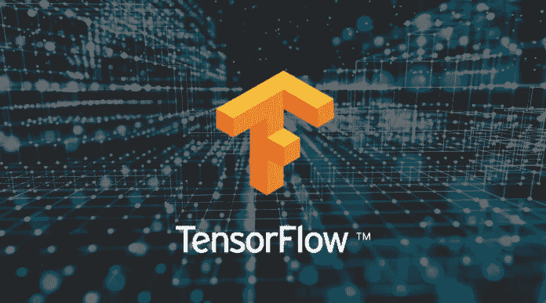
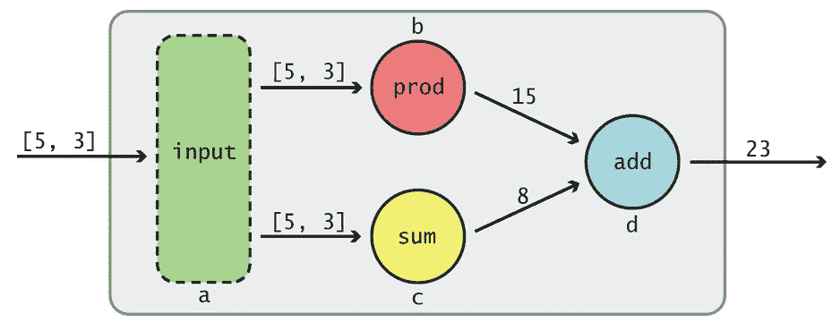
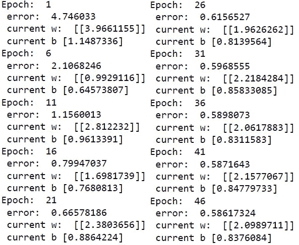
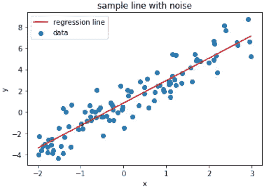
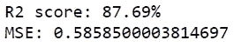

# 张量流初学者终极指南

> 原文：<https://towardsdatascience.com/the-ultimate-beginner-guide-to-tensorflow-af82fd4b8626?source=collection_archive---------11----------------------->

## 如何从零开始实现线性回归和梯度下降！

> 为什么是 TensorFlow？我们已经有 Keras 了！

图片来自[朱莉娅·施密特](https://devclass.com/2020/01/09/tensorflow-2-1-makes-keras-play-nice-with-tpus/)

当我们建立一个机器学习模型时，例如，一个用于分类图像的卷积神经网络，我们通常在高级库如 **Keras** 之上设计我们的网络。

> 最终，Keras 模型被转换成 TensorFlow 程序。

# 什么是张量流？

TensorFlow 于 2015 年由谷歌向公众开放源代码，是多年来从一个困境中吸取教训的结果:我们应该尝试用不灵活的库进行研究，以便我们不必重新实现代码，还是应该用一个库进行研究，用一个完全不同的库进行生产？

> TensorFlow 被做得灵活、高效、可扩展、可移植([来源](https://www.amazon.com/TensorFlow-Machine-Intelligence-Hands-Introduction/dp/1939902452))。任何形状和大小的计算机都可以运行它，从智能手机一直到大型计算集群。TensorFlow 包含了开源社区和大公司的稳定性。

TensorFlow 主要用于指用于构建和训练机器学习模型的 API，而 TensorFlow 实际上是一个软件包:

*   **TensorFlow API** 通过 Python Keras 中的用户友好环境访问，而实际计算是用 C++编写的，以提高效率。
*   **TensorBoard** ，一款可以洞察模特行为的图形可视化软件。这对于分析训练和调试 TensorFlow 代码非常有用。
*   **TensorFlow Serving** ，一个高性能的轻量级服务器，可以获取输入数据，将其传递给训练好的模型，并从模型返回输出。此外，它可以无缝地将旧型号切换为新型号，不会给最终用户带来任何停机时间。

# 为什么是 TensorFlow，而不是 Keras？

现在，我们在问，既然已经有了 Keras，为什么还要直接使用 TensorFlow 呢？以此类推，当你有 Wordpress 来构建网站时，为什么还要开发 HTML 代码呢？

嗯，如果你正在研究新的机器学习架构， **TensorFlow 非常灵活，对你的想象力非常有用**。通常，您从最近的研究文献中获取模型，并在 TensorFlow 中实现它们，而不是在 Keras 中。

此外，如果您处于一个敏捷环境中，这要求您的模型在短时间内快速投入生产， **TensorFlow 可以让您的团队能够在许多设备上扩展您的产品**，包括 Android 设备和 Raspberry Pi 等小型计算机。您可以轻松地部署您的模型，在客户端的 web 浏览器上的 web 页面内运行！

# 计算图表

TensorFlow 中的模型由计算图表示，这就像一系列链接在一起的函数，每个函数都将其输出传递给链中更远的其他函数。

图中的节点是圆形、椭圆形或方框，代表某种**操作**。边缘是传入和传出操作的实际**值**，通常绘制为箭头。下面，您会看到一个简单的图表，其中数据从左到右移动到 compute (5*3) + (5+3)。

> 数据被称为张量，它只是矩阵的 n 维抽象。

下面你可以看到它在 TensorFlow 代码中的样子。

TensorFlow 允许我们创建多个计算图，并在一个会话中运行它们。我们还可以定义占位符，占位符是张量对象，它们的值在运行时指定。

例如，我们可能希望模型接受任意长度的单个向量，而不是两个离散的标量输入。在使用该图时，我们可能还希望累积一段时间内所有输出的总值。这就是占位符非常有用的地方。

我们还可以将图形很好地分割成指定的范围。每次运行后，我们可能还想将图形的输出、所有输出的累计总数以及所有输出的平均值保存到磁盘，以便在 TensorBoard 中使用。

这篇文章并不旨在解释你应该知道的关于 TensorFlow 的一切。相反，我们将在下一节介绍一个实际的例子。

# 张量流线性回归

让我们使用 TensorFlow API 实现并训练一个单神经元网络，用于线性回归。

线性回归任务在训练过程中通过识别使 *y_pred* 和训练数据 *y* 之间的均方误差最小化的直线**y _ pred =𝑤∫𝑥+𝑏**的权重 *w* 和偏差 *b* 来解决。

我们首先需要为回归数据 *X* 和 *Y* 定义占位符。权重和偏差由张量变量表示，张量变量是可变的，并且将在训练循环期间改变。损失函数计算为任意两个值 *y_pred* 和 *y* 的均方误差。

梯度下降通过定义损失函数的导数的占位符以及学习步骤来实现。在训练期间，权重和偏差将相对于梯度和学习率进行更新。

定义占位符后，我们现在可以用之前以字典形式准备的张量数据来填充我们的张量图。通过随机生成噪声线来创建合成训练数据。

在一个会话中，我们循环遍历各个时期。在每个时期，TensorFlow 执行计算图。这更新了变量，即我们需要估计的权重和偏差。我们打印它们的值和误差，如下图所示。

图形运行后，我们可以获取最后的权重和偏差值，并绘制出最终的回归线。

我们在 TensorFlow 中用单个神经元进行的线性回归得到了 87%的 R2 分数！

# 结论

**TensorFlow** 是一个开源软件库，专注于使用数据流图结构。节点表示数学运算，边表示在节点之间流动的多维数据数组(张量)。

**Keras** 是构建在 **TensorFlow** 之上的高级 API。

虽然 Keras 更加用户友好，但 TensorFlow 提供了低级别的灵活性，尤其是当您需要实现自定义功能时。比如 TensorFlow 结合 OpenCV 对于物体检测非常有用。

Keras 也可以在其他生态系统上运行，如 Theano 或 CNTK。虽然您可能会找到一些 Theano 教程，但它已经不再处于开发中。作为 Keras 的替代品，Caffe 缺乏灵活性，而 Torch 使用 Lua。MXNet、Chainer 和 CNTK 目前还没有广泛流行。你可以在这里找到 TensorFlow 和 Torch [之间的一个基准。](https://www.developereconomics.com/tensorflow-vs-pytorch)

在本文中，我们展示了为线性回归建立、训练和评估张量流模型是多么容易。如果你对学习如何用 Keras 做线性回归感兴趣，我下面的文章可能是你下一个令人兴奋的读物。

 [## 深度学习为什么有效——循序渐进教程

### 在开始是神经元:梯度下降，反向传播，回归，自动编码器，细胞神经网络…

towardsdatascience.com](/why-deep-learning-works-289f17cab01a)