# 从头开始实现神经网络的最终初学者指南

> 原文：<https://towardsdatascience.com/the-ultimate-beginners-guide-to-implement-a-neural-network-from-scratch-cf7d52d91e00?source=collection_archive---------26----------------------->

## 学习神经网络背后的微积分和数学，并将方程式转换成代码。


克林特·王茂林在 [Unsplash](https://unsplash.com?utm_source=medium&utm_medium=referral) 上拍摄的照片

# 摘要

神经网络已经伴随我们很长时间了，但是由于计算机器的进步以及生活各个方面对技术需求的增长，神经网络近年来变得越来越重要。

从机器学习初学者的角度来看，神经网络被认为是一个黑匣子，它可以摄取一些数据，并根据手头的问题发出预测或分类类别。神经网络的美妙之处在于它们基于简单的微积分和线性代数或者两者的结合。当提供高数量和高质量的数据时，它们一起工作以得出接近准确的结果。

所以，如果你有动力去学习神经网络实际上是如何工作的基础知识，那么你已经到了正确的地方。跟随我这篇文章，你将能够从头开始建立你自己的神经网络。

# 什么是神经网络？

神经网络的架构源自人脑的结构，而从数学的角度来看，它可以被理解为将一组输入映射到期望输出的函数。这篇文章的主要思想是详细理解这个函数并在 python 中实现它。

神经网络由 7 部分组成:

1.  **输入层(X)** :该层包含与我们数据集中的特征相对应的值。
2.  **一组权重和偏差(W₁,W₂、..等等)；(b₁,b₂，..etc)** :这些权重和偏差以矩阵的形式表示，它们决定了数据集中每个特性/列的重要性。
3.  **隐藏层**:该层作为神经网络的大脑，也作为输入和输出层之间的接口。神经网络中可以有一个或多个隐藏层。
4.  **输出层( *ŷ)*** :输入层传输的值将通过隐藏层到达该层。
5.  **一组激活函数(A)** :这是向线性模型添加非线性味道的组件。这些功能应用于除输入层之外的每个层的输出，并激活/转换它们。
6.  **损失函数(L) :** 该函数计算关于我们的猜测/预测有多好的度量，并且在通过网络反向传播时使用。
7.  **优化器**:这个优化器是一个根据反向传播过程中计算的梯度更新模型参数的函数(你很快就会知道)。

# 学习过程

神经网络从训练数据中学习/训练，然后使用测试数据测试其性能。培训过程分为两个部分:

1.  正向输送
2.  反向传播

前馈基本上是通过预测一个值从输入层到输出层遍历神经网络。另一方面，反向传播通过计算梯度并通过网络将其推回并最终更新模型参数，使网络实际上进行学习。让我们先看看这两个过程是如何在纸上工作的，然后我们将把我们的方程转换成代码。

让我们首先设计我们的神经网络架构。我们将在本文中使用的架构如下所示:

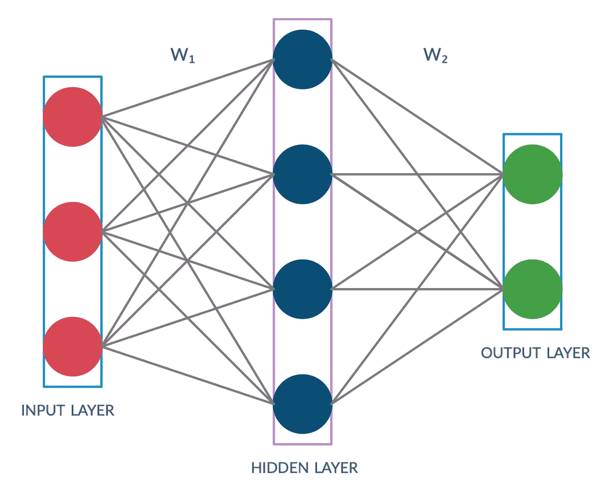

神经网络体系结构

## 正向输送

就我们的架构而言，我们只需要 2 个方程来执行前馈过程，为了将来的目的，您可能还记得:

***神经网络的层数=隐藏层数+ 1(输出层)***

***权重矩阵数=层数***

我们将在本帖中使用 **ReLu** 和**s 形**激活函数，但也可以使用其他激活函数。

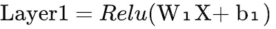

方程式-1

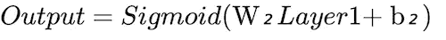

方程式 2

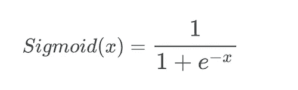

Sigmoid 函数定义

这里，x、W₁、b₁、W₂和 b₂是矩阵，矩阵级计算在上述两个方程中完成。为了更好地理解，我们可以看看这些代表 x、W₁、b₁、W₂和 b₂.的矩阵在这篇文章中，我们忽略了 b₁和 b₂这两个带有偏见的术语，但是它们可以用类似的方式来处理。

让我们先定义几个值:

**n₁** =输入层神经元数量， **n₂** =隐含层神经元数量， **n₃** =输出层神经元数量。

现在，你可能在考虑如何决定输入层、隐藏层和输出层的神经元数量。下面是答案。

**输入层(n₁)中神经元的数量** =数据集中特征/列的数量，即独立变量的数量。

**隐含层中的神经元数量(n₂)** 是灵活的。

**输出层中神经元的数量(n₃)** =

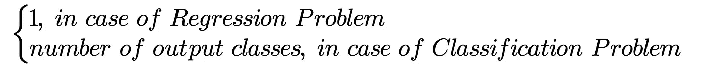

输出神经元的数量

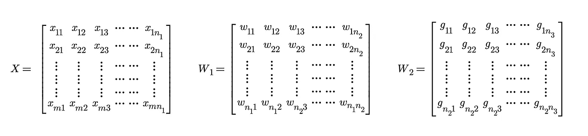

代表 X、W1 和 W2 的矩阵

x 的尺寸:[米，n₁]；W₁: [n₁，n₂]的维度；

W₂: [n₂，n₃]的尺寸


[JESHOOTS.COM](https://unsplash.com/@jeshoots?utm_source=medium&utm_medium=referral)在 [Unsplash](https://unsplash.com?utm_source=medium&utm_medium=referral) 上拍照

## 反向传播

反向传播是训练神经网络的重要部分。这是一种基于梯度的学习方法，梯度是使用微积分中最漂亮的部分，即**链规则计算出来的。**这个链规则被重复应用于计算整个网络的梯度。更清楚地说，梯度是损失函数 w.r.t .对模型参数(权重或偏差)的导数。

如前所述，我们不会使用偏差项，只会将权重作为模型参数。因此，我们有两个模型参数，即 W₁和 W₂.我们将使用的损失函数是 MSE(均方误差)。现在让我们看看反向传播在数学上是如何工作的。


损失函数

其中 m=数据集中训练示例/行的数量

y=数据集中的地面真实值/标注

让我们用链式法则计算 W₂损失梯度:

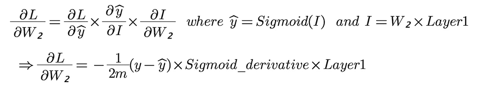

“Sigmoid_derivative”术语的推导不在本文的上下文中，但在这里[已经有了很好的解释](https://beckernick.github.io/sigmoid-derivative-neural-network/)。

因此，我们的第一个梯度项就是:

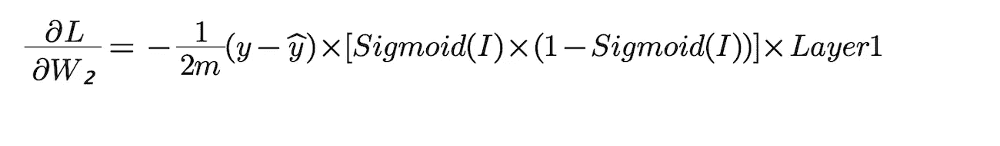

方程式 3

现在，进一步，我们以类似的方式计算第二个梯度项，即损失对 W₁的导数:

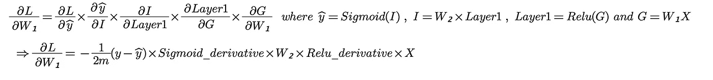

方程式 4

也可以参考本帖，了解更多关于这些激活函数及其衍生函数的知识。

[](/activation-functions-neural-networks-1cbd9f8d91d6) [## 神经网络中的激活函数

### Sigmoid，tanh，Softmax，ReLU，Leaky ReLU 解释！！！

towardsdatascience.com](/activation-functions-neural-networks-1cbd9f8d91d6) 

现在，我们已经计算了 W₁和 W₂的梯度，是时候执行优化步骤了。我们将使用**梯度下降优化器**，也称为**普通梯度下降**来更新 W₁和 W₂.你可能知道梯度下降算法有一个名为**学习率**的超参数，它在训练过程中非常重要。这个超参数的调整是非常必要的，并且通过验证测试来完成，这不在本文的范围之内。

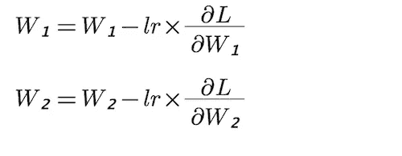

更新神经网络的权重

现在我们已经学习了神经网络背后的数学概念，让我们将这些概念转换为代码，并在现实世界的机器学习问题上训练神经网络。我们将使用著名的 IRIS 数据集来训练我们的网络，然后预测花卉类别。你可以从[这里](https://www.kaggle.com/uciml/iris)下载数据集。

# 用 Python 实现神经网络

## 导入必要的库

```
import numpy as np
import pandas as pd
from sklearn import preprocessing
from sklearn.preprocessing import StandardScaler
from sklearn.preprocessing import LabelEncoder
from sklearn.model_selection import train_test_split
```

## 数据加载和预处理

```
data=pd.read_csv('IRIS.csv')
X=data.iloc[:,:-1].values
Y=data.iloc[:,-1].values
StandardScaler=StandardScaler()
X=StandardScaler.fit_transform(X)
label_encoder=LabelEncoder()
Y=label_encoder.fit_transform(Y)
Y=Y.reshape(-1,1)
enc=preprocessing.OneHotEncoder()
enc.fit(Y)
onehotlabels=enc.transform(Y).toarray()
Y=onehotlabels 
```

在对输入数据进行上述基本预处理后，我们继续创建我们的神经网络类，它包含前馈和反向传播功能。但是首先，让我们将数据分为训练和测试。

```
X_train,X_test,Y_train,Y_test=train_test_split(X,Y,test_size=0.2,random_state=0)
```

我也写代码来定义函数，可以计算函数值和函数导数值。我写了 3 个激活函数的代码，只使用了其中的两个(Relu 和 Sigmoid)。但是，您可以尝试这些激活函数的各种组合，也可以在代码中加入其他激活函数。

```
def ReLU(x):
   return (abs(x.astype(float))+x.astype(float))/2def ReLU_derivative(x):
   y=x
   np.piecewise(y,[ReLU(y)==0,ReLU(y)==y],[0,1])
   return ydef tanh(x):
   return np.tanh(x.astype(float))def tanh_derivative(x):
   return 1-np.square(tanh(x))def sigmoid(x):
   return 1/(1+np.exp(-x.astype(float)))def sigmoid_derivative(x):
   return x*(1-x)
```

定义神经网络类:

```
class Neural_Network:
   def __init__(self,x,y,h):
      self.input=x
      self.weights1=np.random.randn(self.input.shape[1],h)
      self.weights2=np.random.randn(h,3)
      self.y=y
      self.output=np.zeros(y.shape)
```

“神经网络”类接受 3 个参数:X、Y 和 h，它们对应于 X 训练、Y 训练和隐藏层中神经元的数量。如前所述，隐藏层中神经元的数量是灵活的，因此在创建类的实例时，我们将把它的值与 X_train 和 Y_train 一起传递。

“权重 1”和“权重 2”矩阵由随机分布初始化，并传递相应权重矩阵所需的维数。正如前面已经显示的 W₁和 W₂矩阵及其维数，我们将这些维数传递给这个随机函数来生成我们的初始权重。

```
 def FeedForward(self):
      self.layer1=ReLU(np.dot(self.input,self.weights1))
      self.output=sigmoid(np.dot(self.layer1,self.weights2))
```

我们在课堂上的第一个功能是“前馈”,这是神经网络训练过程的第一步。代码遵循前面描述的“等式-1”和“等式-2”。

接下来，我们进入最重要的部分，反向传播。

```
def BackPropogation(self):
      m=len(self.input)
      d_weights2=-(1/m)*np.dot(self.layer1.T,(self.y-self.output)       *sigmoid_derivative(self.output))d_weights1=-(1/m)*np.dot(self.input.T,(np.dot((self.y-    self.output)*sigmoid_derivative(self.output),self.weights2.T)*    ReLU_derivative(self.layer1)))self.weights2=self.weights2 - lr*d_weights2
      self.weights1=self.weights1 - lr*d_weights1
```

反向传播步骤计算模型参数的梯度，同时在网络中从输出层返回到输入层。这是由我们用链式法则得到的“方程 3”和“方程 4”决定的。您会发现术语“d_weights2”和“d_weights1”都包含两种运算，即点积和标准乘法。在 NumPy 中，np.dot(X，Y)表示 X 和 Y 之间的矩阵乘法，而 np.multiply(X，Y)或简称为 X*Y 表示 X 和 Y 之间的元素乘法，为了更深入地了解这段代码是如何工作的，我会给你一个小任务，这是我第一次从头开始实现这段代码时自己做的。


神经网络体系结构

如果你看隐藏层，**对于每个神经元**(蓝色)，有 3 个连接进入神经元。每一个这样的连接都是从输入层中一个不同的神经元出现的。神经网络的基础表明，隐藏层的蓝色神经元和通过连接接收信息的神经元集之间存在线性关系。这种关系可以用方程式的形式来表示。下面提到:

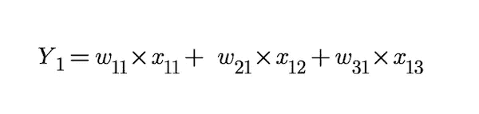

现在，将这个方程扩展到隐藏层的每个神经元(蓝色),我们得到 4 个这样的方程，因为我们在隐藏层中有 4 个神经元。到目前为止所做的工作仅代表 1 个训练示例/行。为了将我们的训练数据一次全部发送到前馈函数中，我们将不得不使用矩阵来执行该操作。但是真正的任务是满怀信心地验证(在纸上)上面这段代码(包括点积和元素乘法)是否与我们讨论的这 4 个线性方程匹配。但这一次，我们将同时对所有训练数据行应用这些等式。

我希望你喜欢亲手解决矩阵和方程，但相信我，这是值得花时间的。

接下来，我们定义一个函数，该函数将在模型被训练后在运行时预测输出类。

```
def predict(self,X):
   self.layert_1=ReLU(np.dot(X,self.weights1))
   return sigmoid(np.dot(self.layert_1,self.weights2))
```

这是“Neural_Network”类中的最后一个函数,“predict”函数只使用最终优化的权重进行正常的前馈。

现在我们已经定义了我们的类，是时候实际使用它了。

```
#----Defining parameters and instantiating Neural_Network class----#epochs=10000 #Number of training iterations
lr=0.5 # learning rate used in Gradient Descent
n=len(X_test)
m=len(X)nn1=Neural_Network(X_train,Y_train)
#creating an object of Neural_Network class#----------------------Training Starts-----------------------------#
for i in range(epochs):
   nn1.FeedForward()
   y_predict_train=enc.inverse_transform(nn1.output.round())
   y_predict_test=enc.inverse_transform(nn1.predict(X_test).round())
   y_train=enc.inverse_transform(Y_train)
   y_test=enc.inverse_transform(Y_test)
   train_accuracy=(m-np.count_nonzero(y_train-y_predict_train))/m
   test_accuracy=(n-np.count_nonzero(y_test-y_predict_test))/n
   nn1.BackPropogation()
   cost=(1/m)*np.sum(np.square(nn1.y-nn1.output))
   print("Epoch {}/{}  ==============================================================:- ".format(i+1,epochs))#----------------Displaying Final Metrics--------------------------#
print("MSE_Cost: {} , Train_Accuracy: {} , Test_Accuracy: {} ".format(cost,train_accuracy,test_accuracy))
```

经过 10000 个纪元的训练，结果如下:

**训练精度:0.97777**

**测试精度:0.9**

当应用于手头的相同问题时，与其他机器学习模型相比，结果看起来令人惊讶。这个网络可以扩展到一个 3 层网络，它将有两个使用相同概念的隐藏层。你也可以尝试不同的优化程序，如 AdaGrad，Adam 等。

您可以访问我在“成人收入预测”数据集上的额外工作，该数据集在我的 GitHub 存储库中使用了类似的神经网络，链接如下:

[](https://github.com/Ravsehajsinghpuri/Neural_Network_from_scratch) [## ravsehajsinghpuri/Neural _ Network _ 从头开始

### 嗨伙计们！这是我第一次尝试用简单的数学和 python 神奇的…

github.com](https://github.com/Ravsehajsinghpuri/Neural_Network_from_scratch) 

# 结论

在这篇文章中，我们开始学习神经网络的基本架构，并进一步研究神经网络架构的组件。我们还见证了其工作背后的数学，并详细解释了链规则和基本微积分在开发反向传播方程中的应用，这是训练过程的主要部分。最后，我们将我们的数学概念和方程转换成代码，并在 IRIS 数据集上实现了一个成熟的神经网络。

非常感谢您通读这篇文章。我希望你理解它的每一个方面。欢迎在回复部分提出任何问题。