# 量子计算入门

> 原文：<https://towardsdatascience.com/the-ultimate-beginners-guide-to-quantum-computing-and-its-applications-5b43c8fbcd8f?source=collection_archive---------4----------------------->

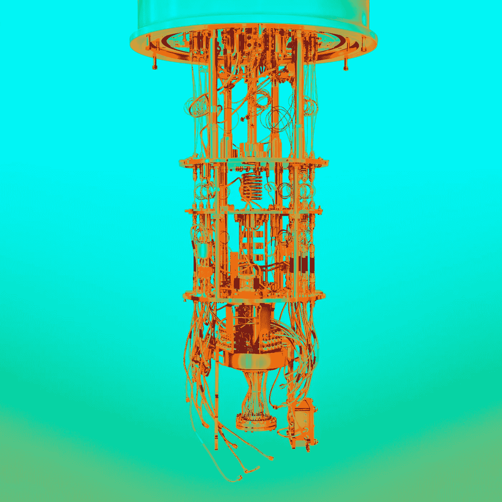

量子计算机[9]

> 自然不是经典的，该死的，如果你想模拟自然，你最好做量子力学的，天哪，这是一个奇妙的问题，因为它看起来不那么容易。

理查德·费曼

# **动机和介绍**

量子计算是一种新的算法研究范式，它将量子力学现象扩展到传统计算领域。1982 年，理查德·费曼提出了一个最初的量子计算机，它将有能力促进量子电路的传统算法[1]。为了理解电子系统和导航基于量子现象的电子位置的多重独立概率，费曼设想了量子计算机的概念；他认为量子计算机可以理想地模拟量子行为，就像它在自然界中发生的一样。费曼希望模拟的量子系统甚至不能用大规模并行经典计算机来模拟。例如，让我们考虑多粒子系统的概率计算。如果我们有两个电子被约束在两点(A 和 B)，那么它们的位置有 4 种可能的概率(都在 A，一个 A-一个 B，一个 B-一个 A，都在 B，等等。).对于 3 个电子，有 8 种概率，对于 10 个电子，有 1，024 种概率，对于 20 个电子，有 1，048，576 种概率。因此，很容易看到，对于拥有数百万个电子的传统物理系统，测量会失控。因此，对量子计算机的研究开始了，并且量子计算领域的长期目标已经出现。

我们将首先讨论量子力学的数学背景和著名的量子计算机。然后我们将讨论量子计算机的功能和它的基本操作。我们将通过指出量子计算的应用和未来方向来结束这篇文章。

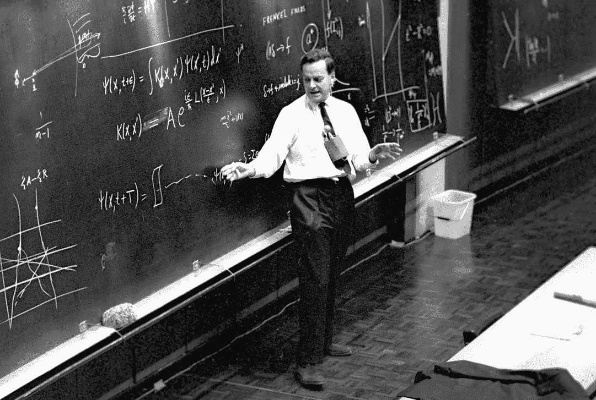

费曼在欧洲粒子物理研究所解释量子力学

# 一个东西“量子化”意味着什么？

*量子*是一个来自量子力学研究的术语。很多时候,“量子”这个术语被用作粒子物理领域的时髦词汇。众所周知，现代意义上的量子来自于量子力学领域。当一个人学习物理时，他们通常从经典或牛顿力学开始他们的旅程。然后他们进展到热力学和统计力学。也许以后，他们还会学习电磁学和光子学。在研究了这些子领域之后，我们进入了一个新的研究领域，俗称现代物理学。这包括相对论和量子力学的主题。什么是量子力学？—这是物理学领域，在原子尺度上处理自然的物理性质。在我们人类的世界里，我们在宏观尺度上体验互动和力量。在无限小的粒子水平上(亚原子尺度)，支配我们日常生活的物理原理不再适用。换句话说，规则被颠倒了，在量子尺度上，经典力学是不够的。在量子系统中，所有的量都被限制在它们的离散值内(作为量子化的一部分)，物体同时具有粒子和波的功能(波粒二象性)。重要的是要注意，在量子环境中，如果给我们一组初始条件(海森堡的测不准原理)，物理量的值可以在测量之前预测。当马克斯·普朗克向黑体辐射问题提出他的情况时，当爱因斯坦提出他关于频率和能量之间联系的革命性理论(后来解释了光电效应和广义相对论)时，量子力学诞生了。

由于这不是一篇以物理学为中心的文章，我们将只讨论量子力学的基本原理和必要的数学符号。总之，量子力学提供了四种新现象:量子化、纠缠、测不准原理和波粒二象性。让我们从描述物体在量子系统中的作用开始。保罗·狄拉克、戴维·希尔伯特、约翰·冯·诺依曼和赫尔曼·魏尔描述了量子力学系统中的状态用“状态向量”来表示的想法每个量子系统都有自己复杂的、可分离的希尔伯特空间。这充当系统的状态空间，并且被给定为范数 1 的复数。可能的状态是希尔伯特空间的射影空间中的点。简单来说，量子粒子可以获得希尔伯特空间的离散本征值，因为可观测的本征态对应于算符的本征向量。

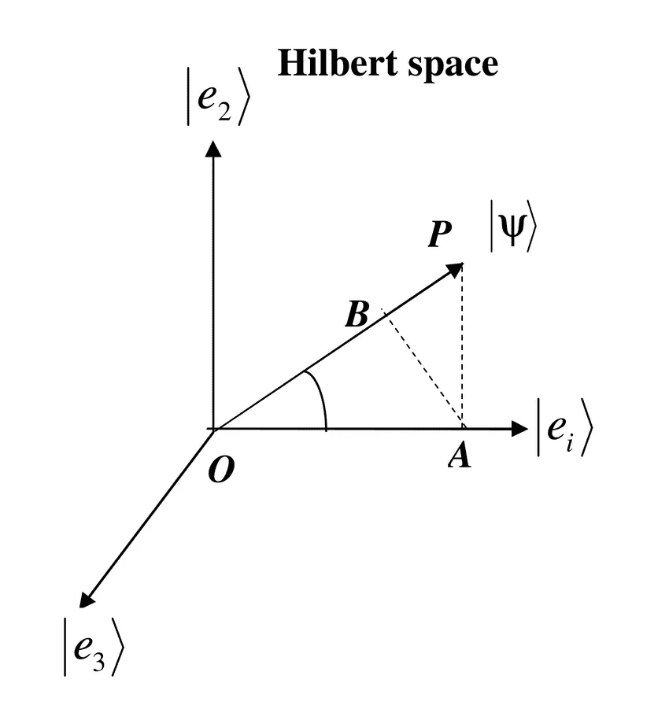

希尔伯特空间[3]

现在我们知道什么是希尔伯特空间，让我们讨论为什么量子力学被认为是一个概率场。量子力学是关于测量的概念。由于波粒二象性，系统在给定时间的状态由复波函数描述。在量子系统中，我们只能测量实验结果的概率。例如，我们可以测量一个电子在电子云 X 区域的概率。当涉及到量子测量时，波塌缩通常是一个问题，因为系统的概率信息可以从初始状态塌缩到特定的本征态。今天，科学家们通过使用量子层析术绕过了这个问题，量子层析术是一种通过现有量子态的系综来重建特定量子态的技术。海森堡的测不准原理更多地增加了量子粒子作为概率函数存在的意义，因为它引用了对应于某些可观测量的算子是不可交换的以及存在与量子粒子运动相关联的误差水平的思想。

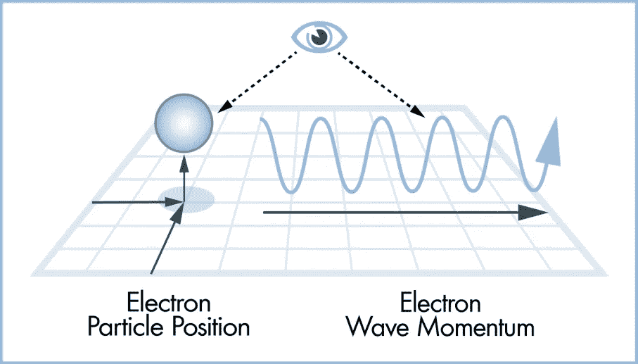

量子粒子如何运作[4]

虽然没有一个统一的理论可以统一宇宙的所有基本力量，但科学家们仍在继续争论某些理论的有效性和合理性。广义相对论、量子电动力学和超对称弦理论仍然相互竞争，今天寻找普适理论是一个持续的探索。现在，我们已经基本上指定了量子力学系统的严格的数学和物理背景，我们可以继续深入了解量子信息和量子计算的世界。没有这些背景知识，就很难从技术角度来讨论量子计算，因为它依赖于上述物理现象。简而言之，量子计算是一种计算形式，它将讨论的属性扩展到一个链接的软件-硬件环境。本质上，我们生活在一个量子世界中(自然默认是量子的)，量子计算机利用各种属性来模拟这样的环境。

# **什么是量子计算机，它们是如何工作的？**

量子计算是将量子力学现象集成到计算设备中的领域。量子计算机使用叠加和纠缠等特性来执行计算。存在不同的量子计算模型——绝热量子计算机、图灵量子计算机、单向量子计算机等。在本文中，我们将主要讨论经典或数字量子计算，而不是前面提到的模拟方法。

**量子比特和叠加**

让我们从基础开始。量子信息是用于计算操作研究的量子态数据。这些量子信息以“量子比特”的形式进行处理。量子位可以被认为是比特的计算模拟，是量子计算的基本信息单位。量子位被描述为二维希尔伯特空间中的一个向量。传统的位有两种状态(0 和 1)。一个量子位的状态也有两个基态——|0⟩和|1⟩.这种使用括号的符号来自前面解释的量子态的数学基础。还记得我们之前讨论过，量子态可以被捕获为概率函数和状态向量。of|0⟩和|1⟩的例子强化了这一观点。量子位的最基本状态建模如下:

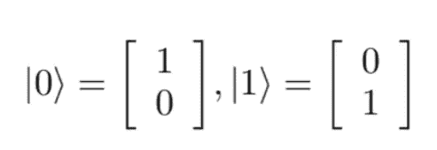

量子比特基态

一个量子位还具有执行量子叠加的能力:它可以同时保持多个状态。这是我们可以讨论的第一个主要的量子特性。叠加有助于量子计算机的运行，因为它为量子计算机的内存和处理速度提供了指数级的加速。量子位的叠加可以被表示为一个概率函数，该概率函数依赖于量子位在其希尔伯特空间中的振幅(𝑎和𝑏).量子位|𝜙⟩的叠加可以表示如下:

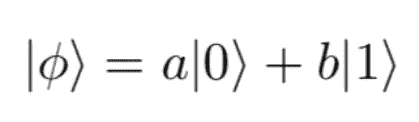

量子比特的叠加

因此，我们可以用|0⟩和|1⟩.的线性组合来表示每个量子位𝑎和𝑏代表振幅概率，通常是复数。当量子比特被测量时，它们将遵循玻恩法则:

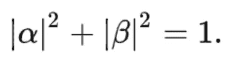

天生法则

为了直观地理解一个量子位，我们可以把它理解为一个布洛赫球。这个球体显示概率(𝑎和𝑏)是量子位的决定性因素，并提供 3 个自由度(最初是 4 个自由度，但 1 个通过玻恩规则被归一化约束消除)。二维布洛赫球可视化和特征图如下所示:

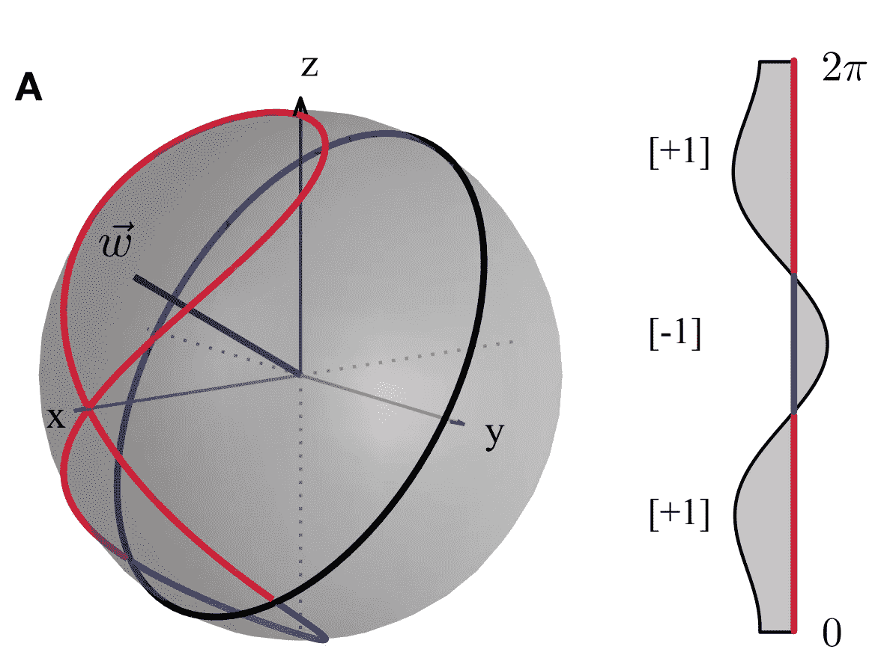

布洛赫球可视化和波函数[5]

**量子寄存器**

我们现在可以讨论量子寄存器的重要性。在量子计算机中，量子寄存器被简单地认为是多个量子位的系统。它是经典计算寄存器的量子模拟。所有的量子计算都是通过操纵寄存器中的量子位来完成的。量子寄存器的大小取决于其系统中量子位的数量。量子寄存器的希尔伯特空间随着量子位数量的增加而扩展。我们可以通过下面的等式在数学上表示一个 2 量子位量子寄存器:

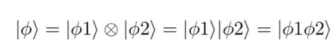

两量子位量子寄存器

上面的数学描述通过张量积抓住了量子位的概念。张量积或克罗内克积结合了一个量子位的两个量子态。经典寄存器和量子寄存器之间的差异体现在各自环境的内容上。经典寄存器将存储𝑁触发器，而量子寄存器将存储𝑁量子位。量子寄存器还具有以叠加态存储数据的能力。量子寄存器可以访问的状态被称为具有 2^n 态的希尔伯特空间。希尔伯特空间赋予了量子计算机在多个量子位上叠加的能力。

**量子门**

我们知道经典计算机通过逻辑门操作比特。逻辑门本质上转换了一个比特所保存的值。它们是任何数字系统的组成部分。逻辑门与真值表一起用于在经典电路中创建状态转换。最基本的逻辑门列表如下:

经典逻辑门[6]

在量子计算的世界里，最基本的量子电路被称为量子门。与经典逻辑门将多个二进制输入转化为单一输出的方式相同，量子门也可以操纵二进制输入，只不过现在涉及到了状态向量。它们处理少量预先设定的量子位。这些量子门类似于经典逻辑门，遵循相似的逻辑模式。复杂的量子电路是通过堆叠和利用这些量子门来构建的，类似于经典逻辑门是传统计算电路的构建模块。然而，与经典逻辑门不同，量子门是可逆的。每个量子门可以在几个比特的集体希尔伯特空间上操作。因此，量子门拥有改变或修改某个系统或量子寄存器的状态的能力。量子门在数学上由酉矩阵表示，其中输入和输出的量子比特数必须相等。量子门(𝑈)的数学定义如下:

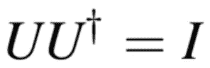

量子门的酉定义(𝑈)

可以被量子门操纵的量子态通常被表示为“kets”或 bra-ket (|0⟩和|1⟩.).我们可以将量子门(𝑈)对状态(𝜓)的转换建模如下:

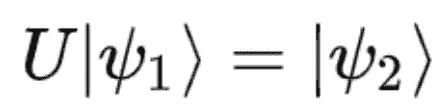

量子门𝑈应用于𝜓态

这种变换将初始量子态矢量(𝜓/)乘以幺正量子门算符(𝑈)以获得新的量子态(𝜓0).下面给出了一些常见的门的例子(泡利-X，泡利-Y，泡利- Z，哈达玛，相位，CNOT，CZ，SWAP，Toffoli):

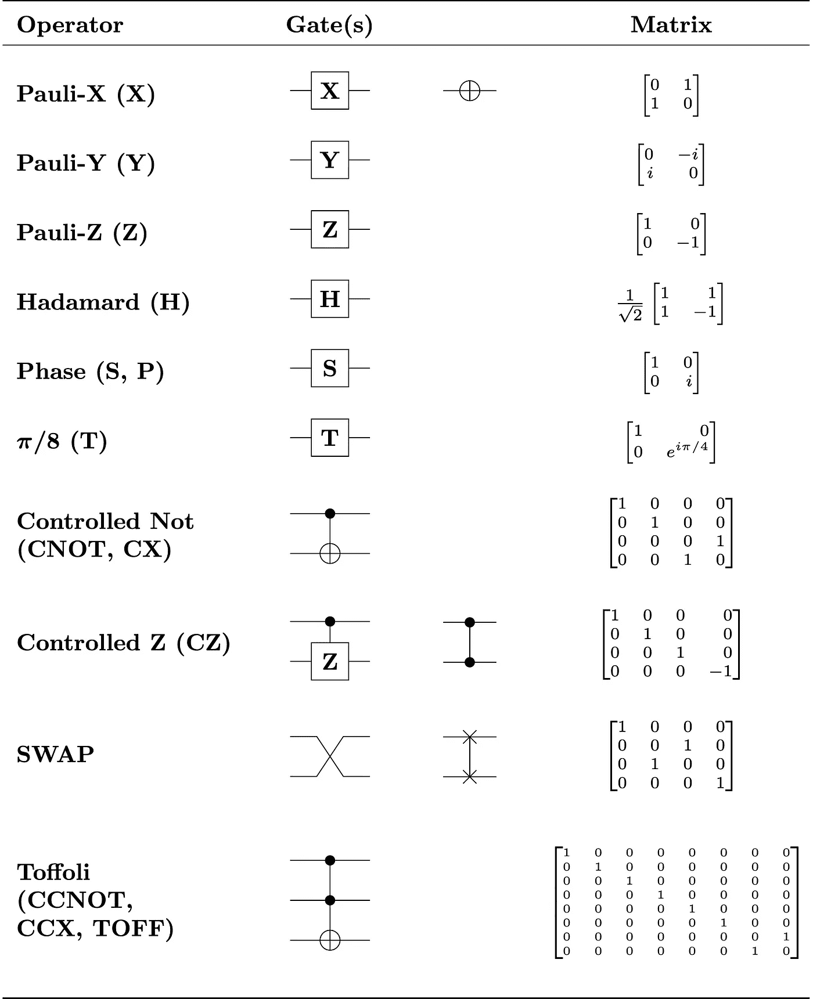

各种量子门(电路和矩阵形式)〔7〕

这些门对初始量子位系统进行变换，将基态映射到一个新值。例如，哈达玛门(𝑯)将基态 of|0⟩ and|1⟩映射到 x 和 z 轴上的新值。类似地，其他量子门如泡利- X (𝑿)、泡利-Y (𝒀)、泡利-Z (𝑹-𝝅)和受控非(𝑪𝑵𝑶𝑻)应用可以表示为酉矩阵的变换。所有这些变换也可以直观地识别为布洛赫球轴上的移动。例如，我们可以看到映射到布洛赫球的泡利-X 门变换:

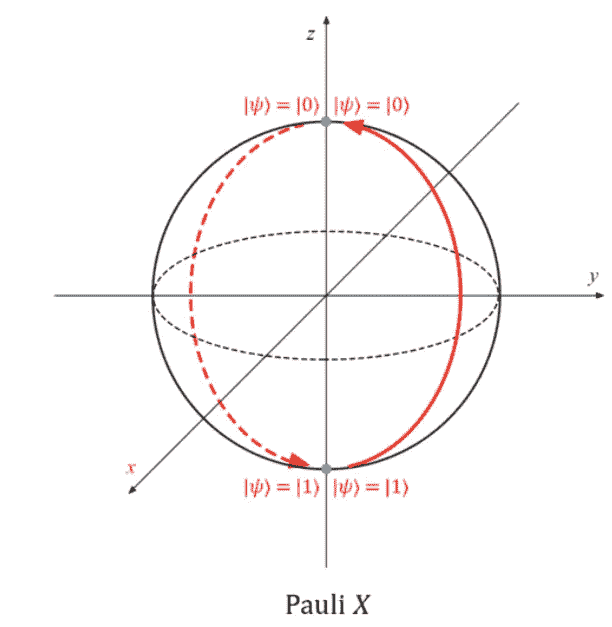

通过布洛赫球可视化的泡利 X 门[8]

**纠缠**

另一个允许我们模拟量子纠缠的重要量子态是贝尔态的概念。两个贝尔态(EPR 对)代表两个最大纠缠 2 量子比特态:

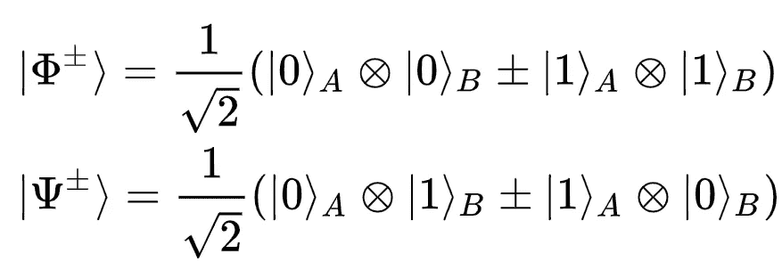

贝尔态(对于 2 个量子比特)

这两个贝尔态一起构成了第二维希尔伯特空间的贝尔基或最大纠缠基。这是量子纠缠最简单的例子。再来说说纠结是什么意思。量子纠缠是指当一对(或一组)粒子以某种方式产生时，系统中一个粒子的状态不能独立于其他粒子的状态来描述，包括当粒子相距很远时。量子纠缠通常是指空间邻近性；有趣的是，两个粒子的纠缠显示出它们的自旋、位置和极化是相关的。著名的是，爱因斯坦将纠缠现象称为“T2”超距幽灵行动。“纠缠对于量子计算非常有用，因为它可以用作量子电路的一部分来操纵真实世界的数据，因为真实世界的对象与量子系统的对象之间存在相关性。

为了总结这一节，我们将量子计算的基础分解为最基本的算子。我们已经分析了量子计算的两个最重要的方面:叠加和纠缠。我们还讨论了量子位、量子门、寄存器等。

# 现代量子计算及其应用

**量子计算机内部**

到目前为止，我们只讨论了量子计算的基本算子及其数学背景和与物理的广泛联系。现在让我们讨论量子计算的现代情况和未来方向。现在让我们来看看量子计算机的内部。这是一张现代 IBM 量子计算机的图片。

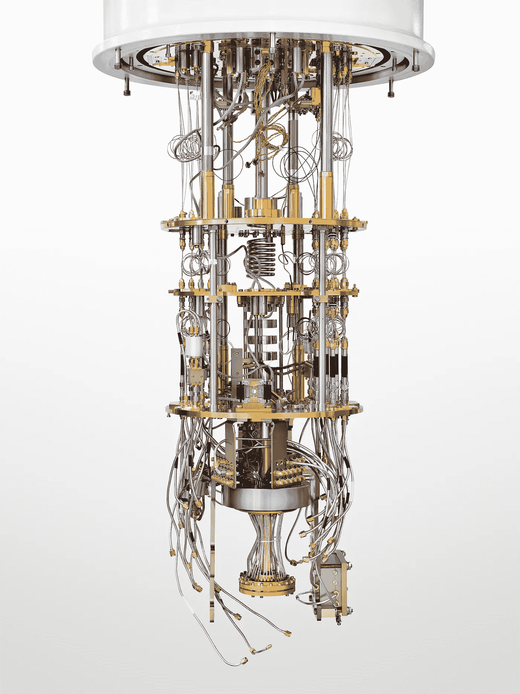

IBM 量子计算机[9]

这显然不像你的日常电脑或台式机！有数百万个连接和超过 2000 个组件聚集在一起，允许研究人员长时间使用量子位。上面的例子具体是一个超导量子处理器。在这样的量子计算机中，任何热量都会给系统带来误差。因此，对其进行调节，使机器始终在零下温度下运行。让我们回顾一下一些具体的组件。第一个组件是稀释冰箱:这种设备利用两种氦同位素的混合特性来促进量子环境。为什么需要低温？—为了创造一个量子位和它们的状态以后不会经历量子退相干的情况，它们是必需的。我们稍后会讨论退相干意味着什么，但是现在，我们可以把它和量子态崩溃联系起来。量子计算机的其他组件包括量子位信号放大器(将载物台冷却到 4 开尔文)、输入微波线(在提取和发送输入/输出时保护量子位免受噪声影响)、超导同轴线(在传输量子态时将能量损失降至最低)、低温隔离器(允许量子位前进而不会因噪声而损失)、量子放大器(捕获处理器读出信号)和混合室(使用化学组件冷却设备)[11]。机器的主要组件——超导处理器——由 transmon 量子位(使用超荷并保持量子位控制而没有噪音)和 Josephon 结(允许超荷流过机器)组成。这些信息很难消化，但请理解量子计算机是需要低温和超导处理器才能运行的密集型机器。

**应用程序**

嗯，我们知道量子计算机之所以伟大，是因为它们的叠加和纠缠等特性。然而，重要的是要认识到我们生活在一个量子世界，量子计算机将允许我们更好地模拟自然的行为，直到分子水平。例如，我们现在可以在药物开发和医学方面取得突破。例如，看看咖啡因分子。对于科学家来说，目前需要太多的处理能力来适当地模拟这种分子并分析其结构。通过量子计算，科学家可能能够在量子因素存在的情况下，在分子水平上更好地模拟咖啡因分子及其真实行为。除了医学和化学分析，量子计算在其他几个领域也有应用。它可以用来加速人工智能和机器学习，以更好地理解数据中的模式。它可以在金融中用于建立更理想的投资组合和评估市场。它可以用于机器人和精确控制理论，以导航复杂的空间。总的来说，量子计算对于优化和建模来说是很棒的。因此，即使我们还没有达到容错(稍后讨论)，随着量子位数量的增加，量子计算机可以将其应用扩展到许多行业。

**今日新闻中的量子计算**

我们很多人都听说过量子计算，有正面的也有负面的。我们已经证明了像叠加和纠缠这样的性质使得量子计算机在执行时间和内存方面都有指数级的加速。我们先来讨论一下量子计算的积极方面。关于量子计算是计算能力的未来，有几个故事情节。最近，谷歌宣布他们已经用一种被称为 Sycamore 的量子处理器实现了“量子霸权”(参考下文)。

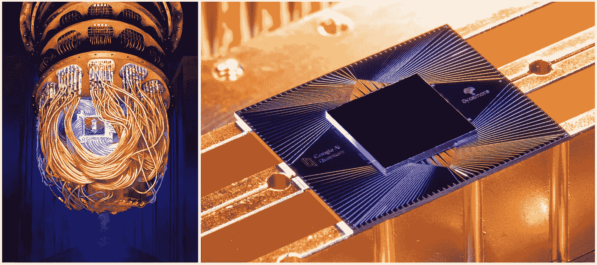

西克莫处理器[10]

根据谷歌的说法，量子优势意味着他们的量子处理器能够快速(在几秒钟内)执行某项任务，而传统计算机需要数万年才能完成这项任务(这是一个不合理的问题)。虽然这个所谓的里程碑的有效性仍有争议，但人们普遍认为量子计算领域正在迅速扩展。如果量子计算很快变得足够先进，它可以彻底改变所有技术领域和任何需要计算建模或数据处理的领域，因为它带来了效率标准。也许几十年后的某一天，空中交通请求和控制由一个智能的、低维护的量子系统来管理。然而，由于目前缺乏容错能力，像这样的突破还需要几十年的时间。我们将在下一小节中详细讨论这一点。

众所周知，由于处理能力的急剧增加，量子计算带来了直接的网络安全威胁。大多数现代加密是 RSA 或公钥加密。对于经典计算机来说，破解这些加密方案是一个不合理的问题，需要几千年的时间。随着量子计算机处理更多量子位并获得更大数量的指数加速，量子计算机最终有可能破解这些加密方法，数百万甚至数十亿用户的私人数据将被泄露。这对社会是有害的，因此量子计算需要一定的监管才能安全进行。查看本指南了解更多关于量子计算如何永远改变网络安全的信息。

**寻求容错**

在实现容错之前，由于性能限制和不断的退相干，量子计算机将基本上成为瓶颈。请记住，退相干是量子信息存在部分崩溃的想法。在这些情况下，任何进一步的测量都会给出相同的结果(状态无法改变)，我们无法测量粒子相对于外界的位置或速度。容错是指量子计算机能够在基本上可以忽略的噪声下运行。容错量子计算机将成功避免由量子比特的相互作用引起的“*不可控的错误级联，因为这些概念可以直接映射到量子信息。*【12】容错是必要的这一观点在量子阈值定理中得到了强化。这个定理指出，如果量子计算机具有海量的量子比特(>10000)，并且如果它能够应用“去极化量子纠错方案”将噪声限制在 1%以下，它就实现了一定程度的容错。简而言之，要实现容错量子计算机，我们必须以比错误发生更快的速度来纠正错误。这是难以置信的困难(事实上是指数级的)，并且只能用最少几千个量子位来完成。在撰写本文时，像谷歌的 Sycamore 这样的量子计算机最大容量只能处理 50 到 60 个量子位。此外，在我们实现容错能力之前，量子计算机及其结果将会受到噪音和扰动的严重限制。这是量子计算领域的最大障碍之一，最有可能需要几十年才能在容错量子计算机方面取得重大进展。然而，我们仍然可以在量子算法的效率和所采用的量子纠错方案方面取得进展。

**如何参与**

虽然量子计算似乎是学生和研究人员能够相对容易入门的最后一个领域，但事实并非如此。你可以学习量子计算的基础知识，并获得使用这些机器的实践经验。IBM Quantum Experience 是一个很好的起点，因为它允许所有背景和专业知识的用户通过量子电路的设计来修补量子计算。它使用简单，感觉就像一个拖放界面，用户可以在初始寄存器中使用不同数量的量子位，并应用各种门来查看它们如何影响量子位的状态向量。另一种开始量子计算的方法是使用 [Qiskit](https://qiskit.org/) 。Qiskit 是一个 python 库，允许用户使用流行的量子算法并设计自己的算法。它可以用在 IBM Q 内部的 jupyter 笔记本中，并可用于实现 Shor 算法、Grover 算法等算法。我在这里链接了 Qiskit 入门指南和教材[，让你可以入门！](https://qiskit.org/textbook/preface.html)

感谢你完成这篇文章。您已经掌握了大量的量子力学、数学和量子计算，我建议您尝试学习更多关于量子计算的知识！请注意，这只是一个介绍性的指南，绝不是全面的，所以请随意探索更多，因为在这个领域有很多很酷的机会和有趣的应用程序可以考虑！

感谢您的时间，这里是一个伟大的最后报价结束…

> 量子计算是一种全新的利用自然的方式。这将是第一项允许在平行宇宙间合作执行有用任务的技术。

—大卫·多伊奇

# 参考

> 这篇文章的一些内容是从我写的一篇简短的研究论文中借用的。

*我引用的中等文章:*

**杰森·罗尔**:[https://towards data science . com/the-need-promise-and-reality of-quantum-computing-4264 ce 15 c6c 0](/the-need-promise-and-reality-of-quantum-computing-4264ce15c6c0)

**Arun C:**[https://towardsdatascience . com/quantum-computing-explained-a 114999299 ca](/quantum-computing-explained-a114999299ca)

杰森·罗尔:[https://towards data science . com/quantum-computing-and-ai-tie-the-knot-d 4440267451 b](/quantum-computing-and-ai-tie-the-knot-d4440267451b)

**叶戈尔德志:**[https://towards data science . com/the-present-and-future-of-quantum-computing-for-ai-FB 600546 BBB 7](/the-present-and-future-of-quantum-computing-for-ai-fb600546bbb7)

**rish abh Anand:**[https://towards data science . com/quantum-computing-with-colorful-diagrams-8f 7861 CFB 6 da](/quantum-computing-with-colorful-diagrams-8f7861cfb6da)

[1]费曼，R.P .:用计算机模拟物理。里面的 J. Theor。《物理》第 21 卷第 6 期，第 467-488 页(1982 年)

[2] Image — *欧洲核子研究中心的费曼:*[https://www . science photo . com/media/898764/view/Richard-Feynman-s-post-nobel-lecture-at-CERN-1965](https://www.sciencephoto.com/media/898764/view/richard-feynman-s-post-nobel-lecture-at-cern-1965)

[3]图片— *希尔伯特空间:*[https://www . research gate . net/publication/312590429 _ A _ simple _ proof _ of _ Born % 27s _ rule _ for _ statistical _ interpretation _ of _ quantum _ mechanics/figures？lo = 1&UTM _ source = Google&UTM _ medium = organic](https://www.researchgate.net/publication/312590429_A_simple_proof_of_Born%27s_rule_for_statistical_interpretation_of_quantum_mechanics/figures?lo=1&utm_source=google&utm_medium=organic)

[4] Image — *粒子-波二象性与海森堡的测不准原理:*[https://science . how stuff works . com/innovation/scientific-experiments/10-scientific-laws-theories 10 . htm](https://science.howstuffworks.com/innovation/scientific-experiments/10-scientific-laws-theories10.htm)

[5]哈夫利切克等人.->图像— *布洛赫球体*:[https://arxiv.org/abs/1804.11326](https://arxiv.org/abs/1804.11326)

[6]图片— *逻辑门*:[http://www . just science . in/articles/how-are-Logic-Gates-related-circuits/2017/06/01](http://www.justscience.in/articles/how-are-logic-gates-related-to-circuits/2017/06/01)

[7]图片— *量子逻辑门:*[https://en . Wikipedia . org/wiki/Quantum _ Logic _ gate #/media/File:Quantum _ Logic _ Gates . png](https://en.wikipedia.org/wiki/Quantum_logic_gate#/media/File:Quantum_Logic_Gates.png)

[8]图片— *保利门*:[https://docs . Microsoft . com/en-us/quantum/libraries/standard/prelude](https://docs.microsoft.com/en-us/quantum/libraries/standard/prelude)

[9]图片— *麻省理工科技评论*:[https://www . Technology Review . com/2020/02/26/916744/quantum-computer-race-IBM-Google/](https://www.technologyreview.com/2020/02/26/916744/quantum-computer-race-ibm-google/)，[https://www . Technology Review . com/2019/01/29/66141/what-is-quantum-computing/](https://www.technologyreview.com/2019/01/29/66141/what-is-quantum-computing/)

[10]图片— *谷歌博客*:[https://ai . Google Blog . com/2019/10/quantum-supremity-using-programmable . html](https://ai.googleblog.com/2019/10/quantum-supremacy-using-programmable.html)

【11】*IBM 量子计算机组件*:*[https://www . IBM . com/Quantum-computing/learn/what-is-Quantum-computing/](https://www.ibm.com/quantum-computing/learn/what-is-quantum-computing/)*

*[12]少量子比特的容错量子计算:[https://www.nature.com/articles/s41534-018-0085-z](https://www.nature.com/articles/s41534-018-0085-z)*